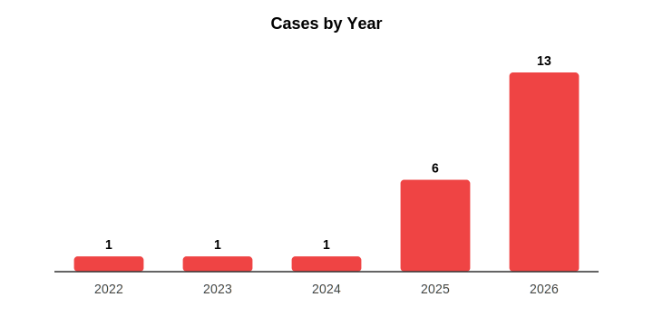
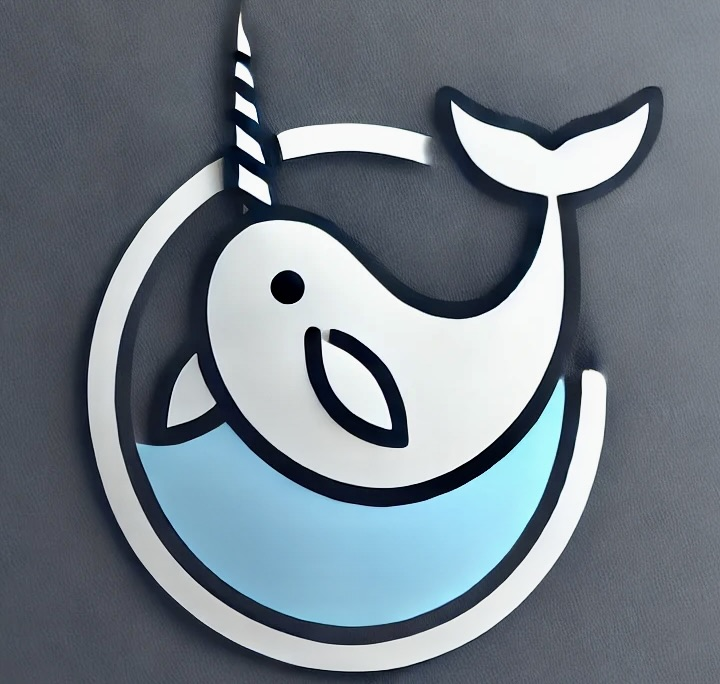

# narwhal-aicode-risks

> *AI 生成代码安全事件实录(In-the-Wild Field Guide)。*

[English](README.md) | [中文](README_CN.md) · [](https://arxiv.org/abs/2512.18567)

本仓库通过分层证据桶记录 AI 生成代码的**安全风险**:

- **技术报告** —— [中文 PDF](docs/report-cn.pdf) · [English PDF](docs/report-en.pdf) · [arXiv](https://arxiv.org/abs/2512.18567)
- **`cases/`** —— **11 起经核实的真实事件**,有一手来源、证据归档、双语分析
- **`inferred/`** —— 部分证据案例:事件看起来真实,但厂商 advisory / CVE / 官方复盘等关键事实尚未坐实(v1.0 暂无,**欢迎您来投第一例!**)
- **`scenarios/`** —— 描述真实风险模式但未对应已确认事件的构造性场景
- **风险分类** —— 7 大类:供应链、代码层漏洞、云 / IaC、智能体、领域特异、知识产权与合规、人因。见 [`docs/taxonomy.md`](docs/taxonomy.md)。

> **配套仓库(防御侧):** `narwhal-aicode-guardrails` *(coming soon)* —— 评测基准、防御方案与最佳实践。

> **核实方针**:每起案例都已对一手信源进行独立核实。每份 `meta.yaml` 记录了 `severity_basis`(`cvss` / `quantifiable-impact` / `editorial`)和 `verification_notes`。详见下方 [核实状态](#核实状态)。

---

## At a Glance / 总览

<table>
<tr>
  <td align="center" width="50%"></td>
  <td align="center" width="50%"></td>
</tr>
</table>

**11 起案例 · 6 个活跃类别 · 2022 → 2026 · 涉及 10+ AI 工具 · 3 起锚定到公开 CVE(CVSS 9.1 / 9.3 / 9.3) · [欢迎投稿](../../issues/new?template=submit-case.yml)**

---

## Hall of Shame —— 经核实的真实影响 Top 5

<table>
<tr>
<td colspan="2" valign="top">

### #1 &nbsp;Lovable AI 应用平台数据暴露 &nbsp;<sub>(2026)</sub>

<p>
  
  
  <a href="https://nvd.nist.gov/vuln/detail/CVE-2025-48757"></a>
  
  
</p>

<h2>18,697 条用户记录被泄露 &nbsp;·&nbsp; 5,000+ vibe-coded 应用裸奔</h2>

Lovable 平台一款 EdTech 应用因 Supabase RLS 缺失 + RPC 鉴权逻辑反转,18,697 条用户记录被未认证访问;**平台层面回归**让公共项目聊天记录与源代码在 77 天里(2026-02-03 → 04-20)对任意登录用户可读。RedAccess 对 vibe-coding 生态(Lovable/Replit/Base44/Netlify)再扫一遍 —— 38 万个公开资产中约 5,000 个含敏感数据。

<a href="cases/2026-ai-platform-data-exposure/"><b>查看案例 →</b></a>

</td>
</tr>

<tr>
<td width="50%" valign="top">

### #2 &nbsp;Moonwell cbETH 预言机错配 &nbsp;<sub>(2026)</sub>

<p>
  
  
  
  
</p>

<h2>1,779,044.83 美元 &nbsp;<sub>已确认坏账</sub></h2>

PR #578(Claude 共同署名 + Copilot AI review + **28 项检查全过**)上线了一份漏掉 cbETH→USD 换算的预言机配置,cbETH 报价 ≈ $1.12 而非 ~$2,200。清算机器人几分钟内夺走 1,096.317 枚 cbETH。Moonwell 官方复盘 + BlockSec + Cointelegraph + rekt.news 全部交叉印证。

<a href="cases/2026-smart-contract-price-vuln/"><b>查看案例 →</b></a>

</td>
<td width="50%" valign="top">

### #3 &nbsp;n8n 路径遍历 &nbsp;<sub>(2025)</sub>

<p>
  
  
  <a href="https://nvd.nist.gov/vuln/detail/CVE-2025-55526"></a>
  
</p>

<h2>公开 PoC &nbsp;·&nbsp; CWE-22</h2>

引入 commit `ff958e4` 自带 `Co-Authored-By: Claude <noreply@anthropic.com>`,把 `os.path.join("workflows", filename)` 直接挂到下载接口 —— `..%5c` 一步走出工作目录。NVD 已收录;后续被 Georgia Tech Vibe Security Radar 与 The Register 报道。

<a href="cases/2025-n8n-path-traversal-cve/"><b>查看案例 →</b></a>

</td>
</tr>

<tr>
<td width="50%" valign="top">

### #4 &nbsp;EchoLeak —— M365 Copilot &nbsp;<sub>(2025)</sub>

<p>
  
  
  <a href="https://msrc.microsoft.com/update-guide/vulnerability/CVE-2025-32711"></a>
  
</p>

<h2>首个零点击 AI Agent 漏洞</h2>

一封精心构造的邮件 —— 用户无需点击 —— 即可让 M365 Copilot 的 RAG 输出一条携带最敏感上下文的图片 URL,实现自动外发。Aim Labs(已被 Cato Networks 收购)将其命名为 "LLM Scope Violation"。微软已修复,MSRC 评分 9.3 (Critical)。

<a href="cases/2025-agent-prompt-injection-leak/"><b>查看案例 →</b></a>

</td>
<td width="50%" valign="top">

### #5 &nbsp;Moltbook 数据库暴露 &nbsp;<sub>(2026)</sub>

<p>
  
  
  
  
</p>

<h2>1.5M API tokens · 35K 邮箱 · 4,060 条 DM</h2>

创始人公开宣称"自己不写代码"的 vibe-coded AI Agent 社交网络。智能体与人类用户的比例 88:1 + Supabase RLS 关闭 + OpenClaw 默认乐观信任 = 整个数据库可由公开 anon key 任意访问。Karpathy 几天内从"最接近科幻片中智能爆发"到"dumpster fire"。

<a href="cases/2026-security-culture-erosion/"><b>查看案例 →</b></a>

</td>
</tr>
</table>

---

## Case Atlas / 案例图鉴

<table>
<tr>
<td width="33%" valign="top">

### 供应链 / 幻觉 &nbsp;<sub>(3)</sub>

<sub>AI 推荐不存在的依赖、被恶意抢注的包,或污染安装链路。</sub>

- <a href="cases/2024-hallucinated-package-poisoning/"><b>huggingface-cli</b></a> · 2024 · 
- <a href="cases/2026-agent-hallucination-self-spread/"><b>react-codeshift 智能体自传播</b></a> · 2026 · 
- <a href="cases/2026-ai-tool-install-chain-abuse/"><b>InstallFix + Bing OpenClaw 仿冒</b></a> · 2026 · 

</td>
<td width="33%" valign="top">

### 代码层漏洞 &nbsp;<sub>(2)</sub>

<sub>AI 生成代码片段层面的缺陷:不安全 API、输入校验缺失、CVE 模式重引入。</sub>

- <a href="cases/2025-n8n-path-traversal-cve/"><b>n8n CVE-2025-55526</b></a> · 2025 ·  
- <a href="cases/2026-mass-cve-reintroduction/"><b>批量 CVE 重引入</b></a> · 2026 · 

</td>
<td width="33%" valign="top">

### 智能体风险 &nbsp;<sub>(1)</sub>

<sub>提示注入、工具调用劫持、智能体架构层面的安全缺陷。</sub>

- <a href="cases/2025-agent-prompt-injection-leak/"><b>EchoLeak (M365 Copilot)</b></a> · 2025 ·  

</td>
</tr>

<tr>
<td width="33%" valign="top">

### 领域特异 &nbsp;<sub>(2)</sub>

<sub>特定领域(智能合约、AI 应用平台、no-code)的特有风险。</sub>

- <a href="cases/2026-ai-platform-data-exposure/"><b>Lovable 应用平台数据暴露</b></a> · 2026 ·  
- <a href="cases/2026-smart-contract-price-vuln/"><b>Moonwell cbETH 预言机 ($1.78M)</b></a> · 2026 · 

</td>
<td width="33%" valign="top">

### 知识产权 & 合规 &nbsp;<sub>(2)</sub>

<sub>版权诉讼、许可证污染、训练数据 IP 争议。</sub>

- <a href="cases/2022-license-pollution-lawsuit/"><b>Doe 1 v. GitHub —— 立案</b></a> · 2022 · 
- <a href="cases/2026-ip-and-license-compliance/"><b>Doe 1 v. GitHub —— 2026 跟进</b></a> · 2026 · 

</td>
<td width="33%" valign="top">

### 人因 &nbsp;<sub>(1)</sub>

<sub>开发者能力退化、对 AI 过度依赖、协作团队安全文化退化。</sub>

- <a href="cases/2026-security-culture-erosion/"><b>Moltbook RLS 暴露</b></a> · 2026 · 

</td>
</tr>

<tr>
<td width="33%" valign="top">

### 云 & IaC 误配 &nbsp;<sub>(0)</sub>

<sub>暂无已核实案例 —— scenarios/ 下有一例示例性场景。</sub>

- <a href="scenarios/2025-iac-s3-bucket-leak/"><b>[Scenario] AI Terraform → S3 公网可读</b></a> · 

</td>
<td width="33%" valign="top">

### 投稿案例 &nbsp;<sub>(+)</sub>

<sub>发现了应当被记录的事件?</sub>

参见 <a href="CONTRIBUTING.md"><b>CONTRIBUTING.md</b></a> 的双语案例模板、`meta.yaml` 字段说明与核实方针。我们接受真实事件 + 标注清楚的示例性场景。

</td>
<td width="33%" valign="top">

### 自动生成的索引

<sub>按类别分组的完整表格由 <code>meta.yaml</code> 自动渲染。</sub>

→ <a href="cases/README.md"><b>cases/README.md</b></a>

新增案例后运行 <code>python3 scripts/render_index.py</code> 重新生成。

</td>
</tr>
</table>

---

## 核实状态

2026-05 一轮针对一手信源的核实重塑了案例库:

| 结论 | 数量 | 说明 |
|---|---|---|
| ✅ 真实且来源充分 | 11 | `cases/*` 全部 |
| 📘 改写为示例性场景(从"案例"降级) | 1 | `scenarios/2025-iac-s3-bucket-leak/` —— 现象真实,但具体事件未获证实;原引用的一手报告均 404 |
| 🔁 合并的重复案例 | -1 | 原 `2026-agent-architecture-bias-db` 与 `2026-security-culture-erosion` 是同一起 Moltbook 事件的不同视角,已合并到后者 |

每份 `meta.yaml` 都附带 `severity_basis` 字段,取以下三种值:

- **cvss** —— 锚定到公开 CVE / NVD / 厂商 advisory(3 起:n8n、Lovable、EchoLeak)
- **quantifiable-impact** —— 锚定到公开披露的损失/规模数字(5 起:Moonwell 178 万美元、huggingface-cli 3 万次下载、react-codeshift 237 仓库、安装链路恶意软件实际投递、Moltbook 1.5M tokens、Mass-CVE 35/74 数据)
- **editorial** —— 在没有 CVSS 量表的风险类别下做编辑判断(2 起:GitHub Copilot 诉讼 —— IP/法律风险无 CVSS 量表;合并后的 Moltbook 也部分采用了"agent 架构默认值"的编辑性论述)

每份 `meta.yaml` 的 `verification_notes` 字段记录了核实环节查了什么、改了什么。

---

## Reproduce / 复现

`meta.yaml` 中标记 `reproducible: true` 的案例附带 `code/` 目录与 PoC。当前共 4 例(n8n 路径遍历、幻觉包、react-codeshift 智能体自传播、Moltbook RLS 暴露)。

```bash
git clone https://github.com/Narwhal-Lab/narwhal-aicode-risks.git
cd narwhal-aicode-risks/cases/2025-n8n-path-traversal-cve/code
# 按案例 README 指引运行
```

---

## Contributing / 投稿

欢迎投稿。两条路径任选其一:

- **简单路径** —— 打开 [📝 **提交案例** Issue Form](../../issues/new?template=submit-case.yml)。不需要会 git 或 markdown,维护者会代为核实并转成 PR,投稿者署名上墙。**SLA:14 天内首次回应**。
- **PR 路径** —— 拷贝 `cases/_template/`(或 `inferred/_template/` / `scenarios/_template/`)、填好 `meta.yaml` 与双语 `README.md`、提 PR。字段说明、核实方针、PR 自查清单见 [`CONTRIBUTING.md`](CONTRIBUTING.md)。

PR 之前本地自检:

```bash
pip install pyyaml
python3 scripts/validate_cases.py             # schema 校验
python3 scripts/validate_cases.py --check-links   # 额外 HEAD 检查所有 reference URL
python3 scripts/render_index.py               # 重新生成索引与 SVG
```

每个 PR 都会跑同样的 GitHub Actions 自动验证 —— 见 [`.github/workflows/validate.yml`](.github/workflows/validate.yml)。

---

## 核心发现(技术报告摘要)

- **分阶段渗透** —— AI 生成代码经历"爆发式探索 → 理性回调 → 稳定协作",最终集中在测试、文档、样板代码等高重复、易验证任务。
- **语言栈差异** —— Python / JavaScript / TypeScript 渗透率高;Rust / C++ 等系统级语言中开发者明显更谨慎。
- **漏洞生命周期双重身份** —— AI 既是漏洞来源(部分修复中被人工实现替换),也是修复加速器。
- **风险模式化** —— AI 引入的缺陷集中在输入校验缺失、不安全 API 调用、过时密码学;严重度分布与人工代码相近,但 API/Web 等网络暴露面更突出。
- **三维一体缓解框架** —— 多维评测基准 + 模型本体安全 + 人机协同治理,开发者对 AI 生成代码安全负最终责任。

完整报告见 [`docs/report-cn.pdf`](docs/report-cn.pdf)(中文)/ [`docs/report-en.pdf`](docs/report-en.pdf)(英文)。

---

## 引用方式

引用本案例库与技术报告:

```bibtex
@techreport{narwhal2025_aicode_risks,
  title        = {AI-Generated Code in the Wild: Security Risk Study},
  author       = {Tencent Security Platform Department and Narwhal-Lab},
  year         = {2025},
  institution  = {Tencent Security Platform Department, Narwhal-Lab},
  type         = {Technical Report},
  url          = {https://github.com/Narwhal-Lab/narwhal-aicode-risks}
}
```

引用 arXiv 论文:

```bibtex
@misc{wang2025aicodewildmeasuring,
  title={AI Code in the Wild: Measuring Security Risks and Ecosystem Shifts of AI-Generated Code in Modern Software},
  author={Bin Wang and Wenjie Yu and Yilu Zhong and Hao Yu and Keke Lian and Chaohua Lu and Hongfang Zheng and Dong Zhang and Hui Li},
  year={2025},
  eprint={2512.18567},
  archivePrefix={arXiv},
  primaryClass={cs.SE},
  url={https://arxiv.org/abs/2512.18567}
}
```

仓库根目录还提供 `CITATION.cff`,GitHub "Cite this repository" 按钮可直接使用。

---

## 贡献者 / Contributors

感谢所有贡献者。我们使用 [all-contributors](https://allcontributors.org) 自动维护贡献者头像墙 —— 投稿被合并后,运行 `@all-contributors please add @用户名 for content` 即可上墙。详见 [CONTRIBUTING.md](CONTRIBUTING.md#recognition)。

<!-- ALL-CONTRIBUTORS-LIST:START - Do not remove or modify this section -->
<!-- prettier-ignore-start -->
<!-- markdownlint-disable -->
<table>
  <tbody>
    <tr>
      <td align="center" valign="top" width="14.28%"><a href="https://github.com/TheBinKing"><br /><sub><b>王滨</b></sub></a><br /><a title="项目管理">📆</a> <a title="研究">🔬</a> <a title="内容">📝</a> <a title="审稿">👀</a></td>
      <td align="center" valign="top" width="14.28%"><a href="https://github.com/yumkea"><br /><sub><b>喻文杰</b></sub></a><br /><a title="研究">🔬</a> <a title="内容">📝</a></td>
      <td align="center" valign="top" width="14.28%"><a href="https://github.com/YilZhong"><br /><sub><b>钟一路</b></sub></a><br /><a title="研究">🔬</a> <a title="内容">📝</a></td>
      <td align="center" valign="top" width="14.28%"><a href="https://github.com/GioldDiorld"><br /><sub><b>余昊</b></sub></a><br /><a title="研究">🔬</a> <a title="内容">📝</a></td>
      <td align="center" valign="top" width="14.28%"><a href="https://github.com/jzquan"><br /><sub><b>全嘉政</b></sub></a><br /><a title="内容">📝</a> <a title="审稿">👀</a></td>
      <td align="center" valign="top" width="14.28%"><a href="https://github.com/ZJN514"><br /><sub><b>周佳凝</b></sub></a><br /><a title="内容">📝</a></td>
      <td align="center" valign="top" width="14.28%"><a href="https://github.com/adcdl"><br /><sub><b>钱亮亮</b></sub></a><br /><a title="内容">📝</a></td>
    </tr>
    <tr>
      <td align="center" valign="top" width="14.28%"><a href="https://github.com/Y0uYuGe"><br /><sub><b>刘理科</b></sub></a><br /><a title="内容">📝</a></td>
      <td align="center" valign="top" width="14.28%"><a href="https://github.com/utopiazzr"><br /><sub><b>张哲荣</b></sub></a><br /><a title="内容">📝</a></td>
    </tr>
  </tbody>
</table>
<!-- markdownlint-restore -->
<!-- prettier-ignore-end -->
<!-- ALL-CONTRIBUTORS-LIST:END -->

贡献类型 emoji:📝 内容 · 🔬 研究 · 👀 审稿 · 📆 项目管理 · 🛠 基础设施 · 🌍 翻译 · 🐛 Bug 报告

---

## 项目组成员

<p>
  
  <strong style="margin-left: 8px;">Narwhal Lab</strong>
</p>

<table>
  <tr>
    <td align="center" width="90">
      <a href="https://github.com/TheBinKing">
        
      </a>
      <br/>
      <a href="mailto:thebinking66@gmail.com"><sub><b>王滨</b></sub></a>
    </td>
    <td align="center" width="90">
      <a href="https://github.com/yumkea">
        
      </a>
      <br/>
      <a href="mailto:uuykea@gmail.com"><sub><b>喻文杰</b></sub></a>
    </td>
    <td align="center" width="90">
      <a href="https://github.com/YilZhong">
        
      </a>
      <br/>
      <a href="mailto:tangaaang@gmail.com"><sub><b>钟一路</b></sub></a>
    </td>
    <td align="center" width="90">
      <a href="https://github.com/GioldDiorld">
        
      </a>
      <br/>
      <a href="mailto:g.diorld@gmail.com"><sub><b>余昊</b></sub></a>
    </td>
    <td align="center" width="90">
      <a href="https://github.com/jzquan">
        
      </a>
      <br/>
      <a href="https://github.com/jzquan"><sub><b>全嘉政</b></sub></a>
    </td>
    <td align="center" width="90">
      <a href="https://github.com/Y0uYuGe">
        
      </a>
      <br/>
      <a href="https://github.com/Y0uYuGe"><sub><b>刘理科</b></sub></a>
    </td>
  </tr>
</table>

---

## 致谢与反馈

感谢所有参与本研究与报告撰写的成员和提供意见改进的同行。如对研究内容有建议、发现问题或希望交流实践经验,欢迎提交 Issue。合作意向请邮件联系:**thebinking66@gmail.com**。

## 开源协议

© 2025 Narwhal Lab。本项目基于 [**CC BY 4.0**](LICENSE) 许可协议发布,任何形式的使用或引用均需署名 Narwhal Lab。
