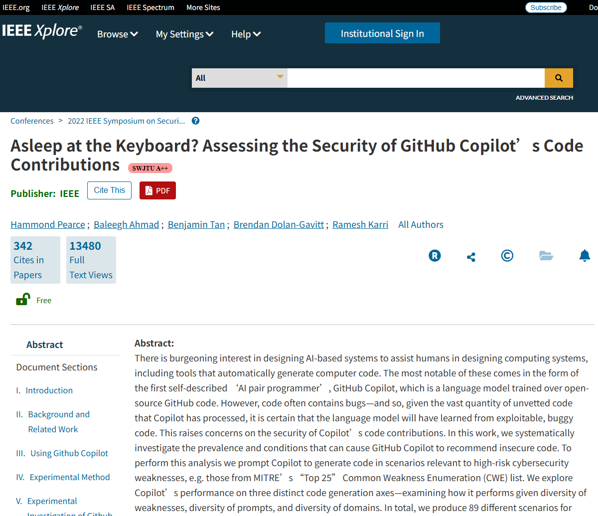
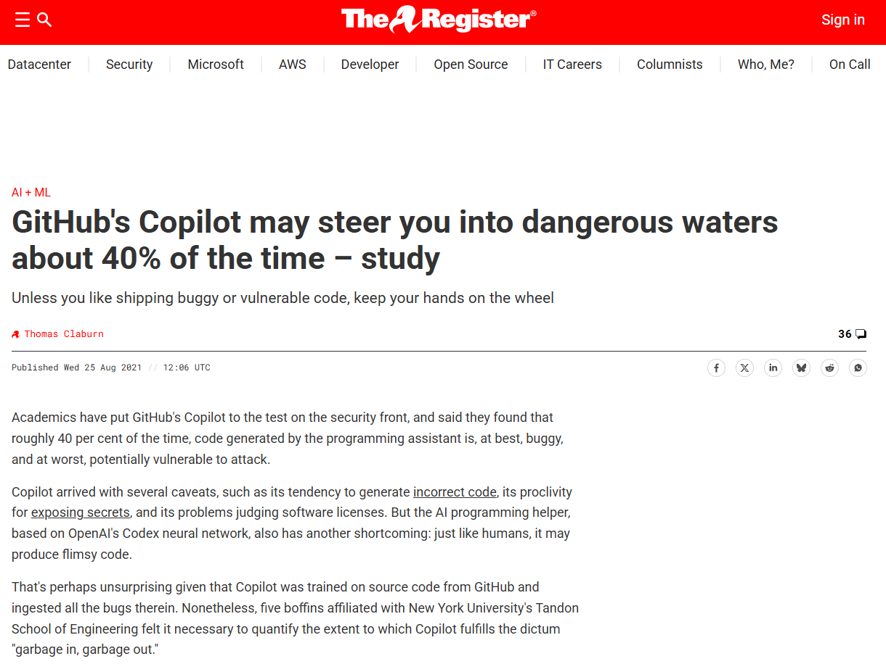

# NYU & Stanford Large-Scale Vulnerability Injection Empirical Study on GitHub Copilot (2022)
> 纽约大学与斯坦福 GitHub Copilot 漏洞注入大规模实证

| Field | Value |
|---|---|
| Category | Code-Level Vulnerabilities |
| Severity | 🟠 High |
| AI Tool | GitHub Copilot, OpenAI Codex |
| Language | C, Python, JavaScript |
| Real Incident | ✅ |
| Reproducible | ❌ |
| Disclosed | 2022-05 |
| CVE | — |
| CVSS | — |

## TL;DR
Academic empirical audit confirmed nearly 40% code generated by early GitHub Copilot carries severe security flaws, easily introducing high-risk vulnerabilities into actual development projects.
> 学术实证审计证实早期GitHub Copilot生成代码近四成存在严重安全缺陷，极易向实际研发项目中植入高危漏洞。

---

## 详细分析 / Full Analysis

## 基础信息
- 发生时间：2021-08 首次披露 | 2022-05 IEEE S&P 顶会正式发表
- 风险类型：漏洞注入 / 自动化偏见 / 训练数据缺陷
- 影响范围：GitHub Copilot 早期全网用户、全球依托AI辅助编程的研发人员与企业开发团队
- 严重等级：高，实测数据证实该工具生成代码中占比40%存在高危安全漏洞

## 一、事件概述
2021至2022年期间，纽约大学联合斯坦福大学组建专业安全研究团队，针对初代GitHub Copilot开展全域规模化安全实测审计。研究团队搭建89组覆盖多编程语言的真实业务编码场景，累计调用工具生成1692段完整可运行程序代码。

本次实测得出明确结论，在日常常规开发、无任何恶意提示诱导的正常使用环境下，GitHub Copilot产出的代码内容里，有接近四成程序内置高危安全缺陷，涵盖SQL注入、跨站脚本攻击、缓冲区溢出、老旧弱加密算法滥用等常见高危漏洞。该组实测数据打破行业早期对头部厂商AI编程工具的盲目信任，成为业界正式重视AI生成代码安全隐患的标志性实证事件。

## 二、风险细节
1. **AI工具**
GitHub Copilot，底层依托早期OpenAI Codex大语言模型搭建运行。

2. **风险根因**
- 模型训练数据滞后：模型训练数据源存在明显缺陷，训练阶段无差别抓取全网开源项目代码，收录大量普通开发者编写的非规范、存在历史漏洞的老旧程序片段
- 缺乏安全上下文感知：模型设计仅优先保障代码语法合规与基础业务功能实现，未融入完备的安全编码规则，不具备主动识别风险、规避不安全写法的能力

3. **漏洞表现**
- 进行加密逻辑开发时，工具会高频输出早已被行业淘汰的DES加密算法以及不安全ECB分组加密模式
- 在对接数据库、处理网页前端表单数据场景中，频繁生成未做参数化过滤拼接的原生SQL语句，直接形成可被利用的注入攻击入口；整体输出逻辑偏向复刻历史老旧代码写法，不会主动适配现行通用安全开发规范。

4. **影响**
长期使用该版本AI编程工具进行项目开发，叠加研发人员普遍存在的自动化依赖心理，大量携带同类高危漏洞的代码会直接被引入企业正式业务项目，从软件研发源头完成漏洞植入，持续拉低企业整体代码安全基线，扩大线上业务系统受攻击面。

## 三、关联报告风险点
本次权威学术实证研究，是《AI生成代码在野安全风险研究报告》多项核心研判结论的真实落地佐证，对应如下：

1. **对应报告第3章3.2节 直接安全风险相关内容**
报告内明确界定AI代码生成存在典型代码幻觉问题，能够产出语法格式合规，但实际业务逻辑与安全逻辑存在严重缺失的程序代码，同时配套给出早期Copilot滥用老旧加密算法的典型案例分析。本次两所高校开展的实测研究，正是报告引用案例对应的原始实证来源，充分证实大模型会复刻训练数据内的不安全编写范式，主动向业务项目中植入可被利用的原生安全漏洞。

2. **对应报告第5章5.2节 漏洞类型模式化偏好特征**
报告提出AI生成代码所携带的安全缺陷具备极强规律化、模式化特点，风险高发区域集中在前端输入校验环节与非安全系统接口、加密接口调用环节。本次实测统计结果完全契合该论断，研究中批量出现的安全问题，正是缺失输入合法性校验引发的注入类漏洞，以及违规调用废弃不安全加密接口两类核心问题，能够证实AI输出的安全错误并非随机产生，而是固定复刻历史代码内的固有风险范式。

3. **对应报告第5章5.2节 漏洞危害等级与人趋同性特征**
报告明确提出AI编写代码所能形成的安全隐患危害等级没有下限，完全能够产出足以引发业务停服、核心数据批量泄露的高危漏洞，整体风险危害级别和专业开发人员编写失误造成的风险等级持平。本次实测发现的缓冲区溢出、高危注入类漏洞，均属于行业通用评级标准内的中高及严重级别的安全隐患，以真实量化数据印证报告观点，证明AI编程工具并非仅产出低级别小问题，同样能够形成具备高破坏力的线上安全风险。

## 四、修复与处置
1. **现有存量整改措施**
企业及研发人员全面梳理早期借助GitHub Copilot生成的业务代码，重点排查加密逻辑编写、数据库交互、用户数据接收处理三类核心业务模块，批量替换老旧弱加密算法，统一整改存在直接注入风险的原生SQL编写逻辑，替换为符合现行安全标准的规范写法。

2. **长效预防治理建议**
- 从模型供给侧完成安全优化，参照报告6.2节相关思路，工具研发方优化训练数据集，完成脏数据与不安全代码片段清洗，引入标准化安全编码规范数据集完成模型对齐训练，搭配人类反馈强化学习机制强化模型安全输出能力，从底层降低高危代码生成概率。

- 完善人机协同开发管控体系，落实报告6.3节人机协同与安全审查要求，调整传统代码评审工作重心，将单纯语法格式核查转向业务数据流安全校验、接口调用合规性核验，同步搭配静态代码安全检测工具完成批量自动化扫描，精准甄别AI生成代码内潜藏的隐蔽安全缺陷，建立多层级安全审核防线。

## 五、参考来源
1. IEEE Xplore Official Paper: Asleep at the Keyboard? Assessing the Security of GitHub Copilot's Code Contributions
https://ieeexplore.ieee.org/document/9833571
2. arXiv Full Preprint Research Document
https://arxiv.org/abs/2108.09293
3. The Register Industry News Report
https://www.theregister.com/2021/08/25/github_copilot_study/