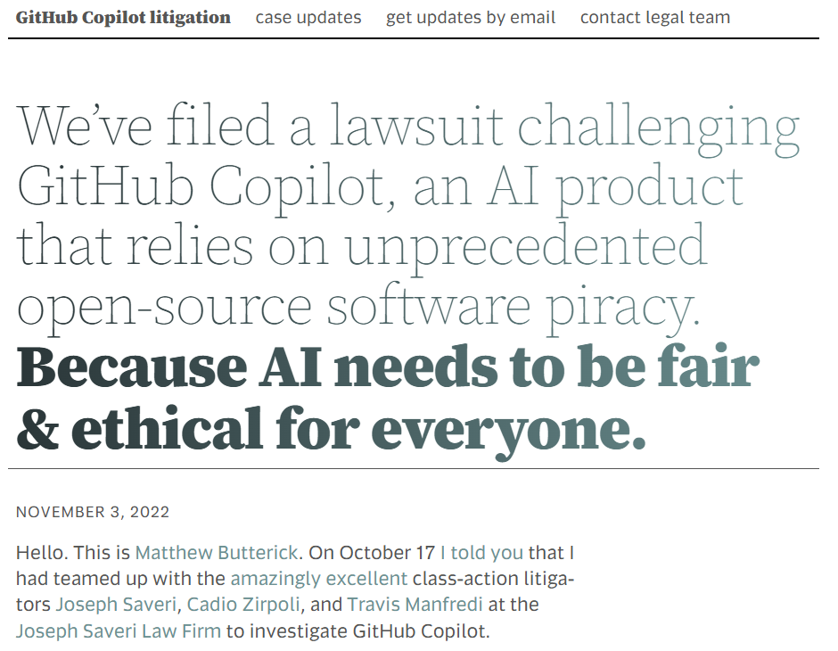
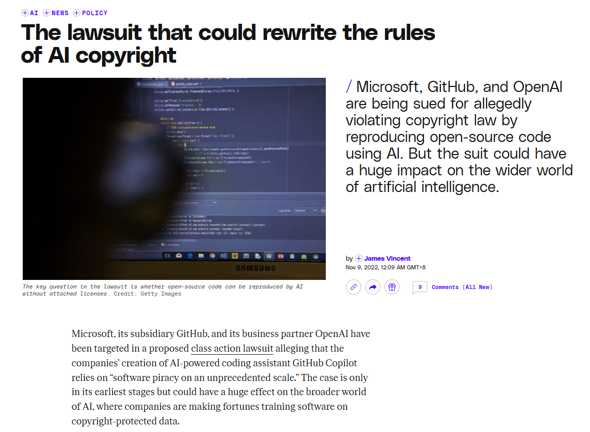
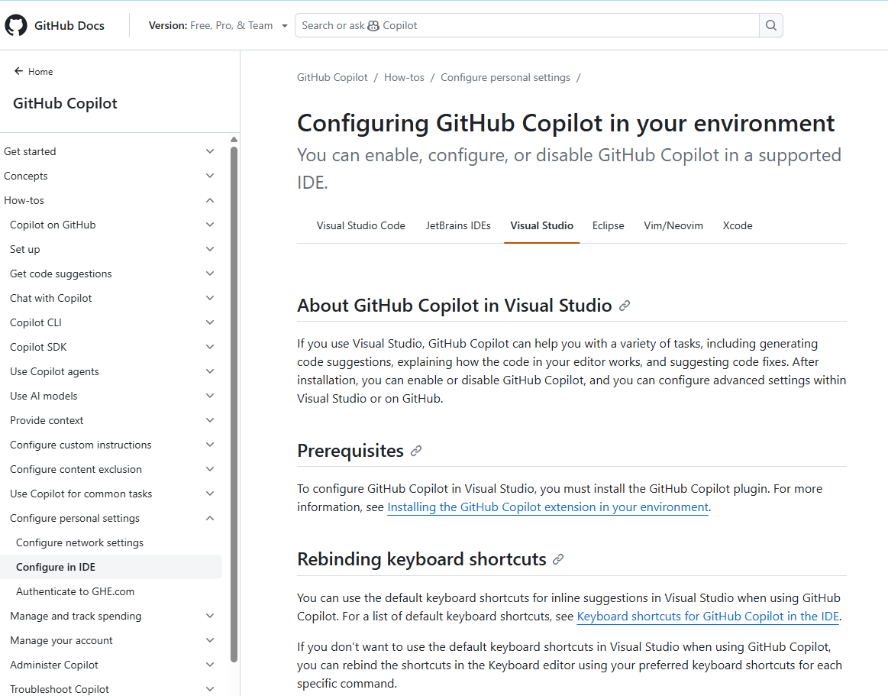
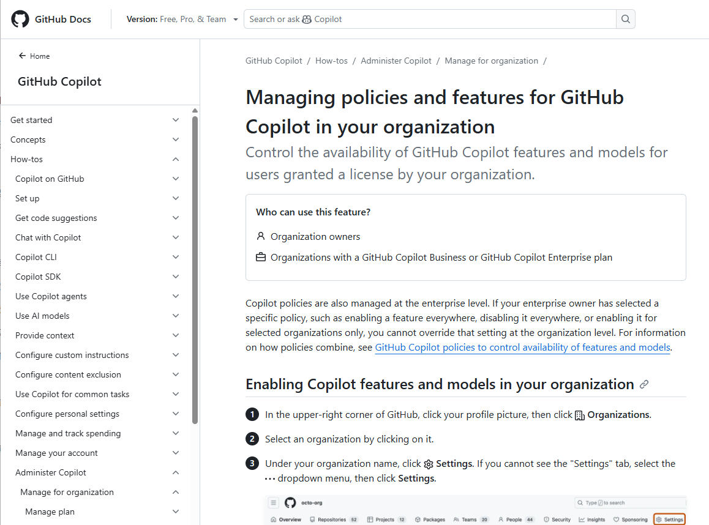

# GitHub Copilot Class-Action Lawsuit & License Pollution (2022)
> AI 生成代码安全案例：GitHub Copilot 开源许可证污染与版权诉讼事件

| Field | Value |
|---|---|
| Category | IP, License & Compliance |
| Severity | 🟠 High |
| AI Tool | GitHub Copilot, OpenAI Codex |
| Language | — |
| Real Incident | ✅ |
| Reproducible | ❌ |
| Disclosed | 2022-11-03 |
| CVE | — |
| CVSS | — |

## TL;DR
First systemic class-action lawsuit (J. Doe 1 v. GitHub) over Copilot reproducing copyrighted OSS code without attribution or license, igniting industry-wide license-pollution panic.

> 全球首例针对大模型辅助编程工具的系统性知识产权诉讼,Copilot 被指控未署名、未附带许可证地输出受 GPL/MIT 等协议约束的开源代码,引发企业法务全面介入。

---

## 详细分析 / Full Analysis

## 基础信息
- 发生时间：2022-11
- 公开时间：2022-11-03
- 风险类型：开源合规 / 知识产权侵权 / 许可证污染
- 关联报告风险点：对应《AI生成代码在野安全风险研究报告》第3章3.3节——间接风险和合规风险：知识产权与合规
- 影响范围：企业商业闭源项目、开源社区生态、AI 辅助编程平台
- 严重等级：高，已经涉及系统性法律与商业违约风险

## 一、案例介绍

**事件概述与详细经过**

2022年11月，程序员兼律师 Matthew Butterick 联合 Joseph Saveri 律师事务所，正式对 GitHub、Microsoft 及 OpenAI 发起集体诉讼，具体案件号为：J. Doe 1 v. GitHub, Inc. 。这是全球首例针对大语言模型辅助编程工具的系统性知识产权诉讼。原告指控称，GitHub Copilot 在未提供原作者署名、未附带版权声明且未遵循开源许可证，也未遵守 GPL、MIT 等开源许可证的相关条款的情况下，直接向用户输出了受版权保护的开源代码片段。

在大量真实开发场景的取证中，研究人员和开发者发现，只要输入特定的函数名或注释，Copilot 就会逐字逐句地“背诵”出存在于 GitHub 公开仓库中、受严格开源协议保护的数百行代码。然而，这些由 AI 吐出的代码不仅抹去了原作者的信息，也剥离了其附带的开源许可证约束。

**媒体报道与行业发酵**：
这一诉讼在整个软件工程界引发了大范围的的合规担忧：
* 《The Verge》和《TechCrunch》等媒体深入报道了这场诉讼，指出它触及了生成式 AI 的“原罪”：将受许可证保护的公共代码作为训练数据的合法性边界在哪里。
* 商业软件联盟（BSA）和各大企业的法务部门迅速介入。企业法务团队意识到，如果公司员工使用了 Copilot 生成的这段看似“无版权”的代码，并将其混入公司的商业闭源产品中，公司将面临极其严重的“许可证污染（License Contamination）”风险。
* 事件直接导致多家对知识产权极其敏感的科技企业和摩根大通等金融机构，在内部紧急叫停了未经法务审核的 AI 编程助手的使用。
在企业并购以及技术尽职调查环节中，AI 生成代码导致的 “代码所有权模糊性” 已成为实际障碍 —— 尽管未提及具体并购失败案例，但该风险已从 “潜在威胁” 转化为企业尽职调查中需重点核查的实质性问题。

**风险细节与深远影响**
1. **主要工具**：GitHub Copilot， 主要是基于 OpenAI Codex 模型开发
2. **风险根源**：模型训练数据的不可见性，且模型存在 “记忆效应”，即会留存训练数据中的代码信息并在输出时复现。
3. **问题表现**：模型的训练数据来源于遵循不同开源许可证的数以百万计的开源项目。由于模型的“记忆效应”，它在生成代码时会无意中复现其他用户的独特代码片段或敏感信息，且不附带原始的来源声明。
4. **影响**：
   * **许可证污染**：模型生成的代码本质上来源于 GPL 等具有强烈“传染性”的开源许可证，若开发者将其用于商业闭源项目，可能会触发“许可证污染”，给企业带来巨大的法律和商业风险。
   * **合规审查体系被迫重构，引发全行业合规恐慌**：传统软件供应链的 SCA等第三方依赖合规扫描工具失效：AI 生成的代码以开发者自主的形态混入项目，传统 SCA 工具无法通过包名追踪合规风险，企业既有的合规防御体系被实质性突破，迫使行业重新思考代码合规审查的全流程；
商业软件联盟（BSA）、企业法务部门全面介入：从被动合规转向主动排查，AI 生成代码的许可证污染风险从技术讨论变为企业法务的核心工作项，直接改变了企业代码研发的合规审查流程。

## 二、具体情况

在传统的软件供应链中，引入第三方依赖是需要经过合规扫描（SCA 工具）的，以此避免引入 GPL 等强制要求项目同步开源的 “传染性协议”。

但人工智能大模型的应用打破了这层防御。这类工具相当于 “代码重构工具”，将那些受严格协议约束的代码打碎、吸收，并在用户的提示词下重新组合，甚至原样输出。此时，代码以“开发者自主编写”的形式进入项目中，传统的 SCA 扫描工具极难通过包名追踪到其背后的合规风险隐患。

## 三、关联报告风险点

这个针对 GitHub Copilot 的集体诉讼案，在《AI生成代码在野安全风险研究报告》中合规风险的得到了实证：

**1. 记忆效应导致的代码复现**
- 对应报告 3.2 节：报告指出，模型的记忆效应（Memory Effect）可能导致其在生成代码时无意中复现在训练数据中其他用户的独特代码片段。在诉讼取证环节中，Copilot 原样吐出 Fast Inverse Square Root 等知名开源算法库代码的行为，正是这一效应的直接体现。

**2. 知识产权与许可证污染**
- 对应报告 3.3 节：报告明确将这一事件作为“案例分析（Case Analysis）”列出 。同时报告警告，如果模型生成的代码源于类似 GPL 这样的强 copyleft 许可证，被企业用于闭源商业项目后，将引发许可证污染。针对 Copilot 的集体诉讼的核心争议正在于此：该工具是否在未经授权和未署名的情况下，复制了受严格开源许可证保护的代码片段，从而给下游用户带来潜在的合规风险。

### 修复与治理

结合报告第 6 章的风险缓解建议，针对此类知识产权与合规风险，应采取以下治理路径：

**1. 工具层紧急修复与配置**
- 在事件发酵后，GitHub 官方为 Copilot 紧急上线了“过滤匹配公共代码（Suggestions matching public code）”的控制开关。企业组织在配置 AI 工具时，应强制开启此过滤功能，拦截与 GitHub 上现有公开代码重合度超过阈值的生成建议。这是工具侧基于该事件的直接、实质性修复动作，从功能层面试图拦截高重合度的开源代码输出，成为行业应对此类风险的首个落地措施。

   根据 GitHub 在文档中公开的底层拦截逻辑，这个过滤器是这样工作的：

   - 150 字符比对窗口：当 Copilot 准备向开发者的 IDE 推送代码建议时，其后台系统会抓取该建议本身及其周围大约 150 个字符的上下文。

   - 实时查重：系统会将这 150 个字符与 GitHub 上所有公开的（Public）仓库代码进行快速的实时索引比对。

   - 静默拦截：如果发现存在完全匹配或高度重合（这意味着模型极大概率是在“背诵”某段有版权的公共代码），且用户开启了“Block（拦截）”策略，系统会在服务端直接丢弃该建议，开发者的 IDE 将不会收到任何提示。

以下是GitHub官网针对个人的配置文档：

GitHub官网针对企业或组织的合规管理的文档:

**2. 人机协同治理与零信任机制**
- 对应报告 6.3 节：建议实施全流程的可追溯管理，对 AI 生成的代码进行强制的数字水印标记或元数据追踪（Digital Watermarking, Metadata Tracking）。
- 在代码审查环节，不仅要审查安全漏洞，还要将 AI 生成的代码作为独立的“不受信数据源”进行针对性的代码相似度（Snippet Matching）扫描，确保其不侵犯任何开源许可证边界。

## 四、总结

J. Doe 1 v. GitHub, Inc. 案是全球首例针对大语言模型辅助编程工具发起的系统性知识产权诉讼。该案例极其深刻地揭示了 AI 生成代码不仅带来技术维度的漏洞风险，这类工具作为“新兴的代码贡献者”，还在彻底重塑软件供应链的合规边界。它印证了相关研究报告的结论：未经规范管理使用人工智能编程工具，不仅可能给项目引入安全漏洞，还可能使企业面临严重的商业违约与法律风险。

## 五、相关资源

**参考来源**
1. [The Verge: GitHub Copilot is facing a class-action lawsuit for piracy](https://www.theverge.com/2022/11/8/23446821/microsoft-openai-github-copilot-class-action-lawsuit-ai-copyright-violation-fair-use)
2. [Matthew Butterick's Blog: GitHub Copilot litigation](https://githubcopilotlitigation.com/)
3. 相关法律卷宗：J. Doe 1 v. GitHub, Inc., Case No. 4:22-cv-06823 (N.D. Cal.)