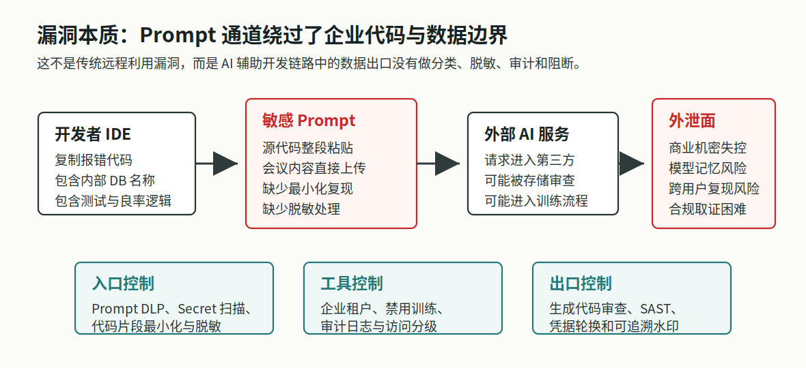
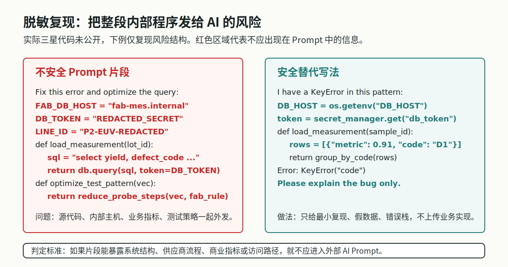
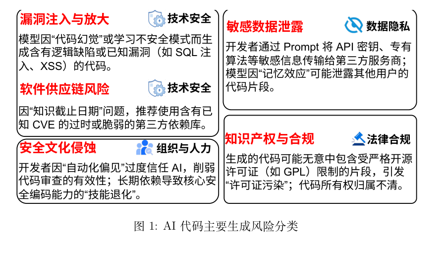

# Samsung Semiconductor ChatGPT Data Leak (2023)
> 三星半导体 ChatGPT 数据泄露案例分析 (2023)

| Field | Value |
|---|---|
| Category | Human Factors |
| Severity | 🟠 High |
| AI Tool | ChatGPT, Naver Clova |
| Language | Multiple |
| Real Incident | ✅ |
| Reproducible | ❌ |
| Disclosed | 2023-03 / 2023-04 |
| CVE | — |
| CVSS | — |

## TL;DR
Samsung DS semiconductor staff leaked source code, yield/defect code, and meeting transcripts to ChatGPT in March 2023, prompting the company to restrict external AI tool usage.
> 三星电子 DS 半导体部门 2023 年 3 月允许员工使用 ChatGPT 后，发生三起因上传源代码、良率/缺陷分析代码和会议内容导致的信息外发事件，促使公司限制外部 AI 工具使用。

---

## 详细分析 / Full Analysis

## 1. 案例结论

这个案例对应的是企业敏感数据外发风险，典型场景是员工把内部源代码、数据库逻辑、生产指标、日志、会议内容或客户数据粘贴到外部 AI 工具中，要求其调试、优化、解释或总结。公开资料能证明"内部信息被输入外部 AI 服务"，但不能证明"这些信息已经被其他用户看到"。

据公开报道，三星电子 DS 半导体部门在 2023 年 3 月允许员工使用 ChatGPT 后，短时间内发现 3 起内部信息外发事件。涉及内容包括设备计测数据库下载程序源代码、良率与缺陷设备识别相关代码，以及会议录音转写后的会议内容。三星随后把单次提问上传容量限制为 1024 字节，并考虑建设内部 AI 服务；TechCrunch 后续报道称，三星限制员工在公司设备和内部网络上使用 ChatGPT 等生成式 AI 工具。

这起事件的泄露点在输入端。企业不能只盯着 AI 生成了什么，还要管员工发给 AI 的是什么。

## 2. 为什么这个案子值得单独写

团队技术报告第 3 章已经提到，AI 生成代码工具可能引发隐私泄露和数据合规风险。三星事件值得单独写，是因为它把几个常见但容易被忽略的问题放到了一起：有明确企业主体和公开报道来源，有代码调试、代码优化、会议纪要这类真实办公场景，也有输入限制、禁用外部工具、考虑内部 AI 等后续处置。

对研发团队来说，这比一句"不要泄密"更有用。它提醒我们：在使用 AI 代码助手时，先出问题的往往不是回答，而是提问。开发者以为自己只是在补充错误上下文，企业看到的却可能是源代码、表结构、生产逻辑和会议内容一起离开了内部环境。

## 3. 风险链路：资料是在提问阶段离开公司的

三星事件不是传统意义上的漏洞利用。从公开报道看，员工更像是在正常完成工作：让 ChatGPT 帮忙找 bug、优化代码、整理会议纪要。但从数据流角度看，复制粘贴这一刻已经构成外发。

```
内部代码 / 生产数据 / 会议内容
  -> 员工复制粘贴到外部 AI 输入框
  -> 数据离开企业网络和权限体系
  -> 企业失去完全控制、审计和删除能力
```



容易被忽略的是"上下文"。开发者以为自己只是发了一段报错代码，但半导体业务代码里可能同时包含内部主机名、数据库表名、接口路径、产线编号、设备状态、良率、缺陷类型、业务判断规则、账号 token、连接串和会议纪要内容。这些内容在工程师眼里是调试上下文，在公司视角里就是知识产权、商业秘密和生产运营数据。

## 4. 三起公开事件分别说明什么

第一起是员工把设备计测数据库下载程序的源代码输入 ChatGPT，目的是询问错误原因。这个场景在研发团队里很常见：代码报错，开发者直接粘贴完整函数，让 AI 帮忙定位。问题在于，调试代码通常不只包含错误行，还会包含数据库连接、表结构、字段语义、异常处理和业务流程。

第二起是员工把良率、缺陷设备识别相关程序输入 ChatGPT，要求优化代码。这个场景比普通 bug 修复更敏感，因为"优化"通常需要给 AI 更多上下文，包括指标定义、判断条件、处理流程和边界情况。对半导体企业来说，良率、缺陷识别和设备状态判断不是普通字段，而是生产经验和竞争力的一部分。

第三起是会议录音经 Naver Clova 转写后，再输入 ChatGPT 生成会议纪要。它说明 AI 数据泄露不局限于代码编辑器，也会发生在会议、文档、客服、项目管理等流程中。如果企业只管 IDE 插件，不管网页端 AI、转写工具和文档总结工具，敏感信息仍然会从其他入口流出。

## 5. 脱敏代码示例

公开报道没有放出三星真实源代码。下面的代码是脱敏重构，只用于说明"看似普通的代码片段为什么可能泄露企业数据"。



不应直接发送给外部 AI 的写法：

```python
# 不要把这种片段直接发送给外部 AI 服务
FAB_DB_HOST = "fab-mes.internal"
DB_TOKEN = "REDACTED_SECRET"
LINE_ID = "P2-EUV-REDACTED"

def load_measurement(lot_id):
    sql = """
    select lot_id, yield_rate, defect_code, station_id
    from fab_measurement_private
    where line_id = :line_id and lot_id = :lot_id
    """
    return db.query(sql, token=DB_TOKEN, line_id=LINE_ID, lot_id=lot_id)

def optimize_test_pattern(vectors):
    return reduce_probe_steps(vectors, fab_rule="REDACTED_INTERNAL_RULE")
```

这段代码即使把真实口令替换成 `REDACTED_SECRET`，仍然暴露了内部域名、数据库表、字段含义、产线标识、业务指标和内部规则名称。对攻击者、竞争对手或供应链对手来说，这些都是有价值的线索。

更安全的提问方式是构造最小复现例子：

```python
# 可以发送给 AI 的最小例子
rows = [
    {"metric": 0.91, "code": "D1"},
    {"metric": 0.87, "code": "D2"},
]

def group_by_code(rows):
    result = {}
    for row in rows:
        result[row["defect_code"]] = row["metric"]
    return result

# Error: KeyError("defect_code")
# 请解释错误原因，并给出不依赖真实业务字段的修复建议。
```

第二种写法只保留错误本身，不包含真实主机名、数据库表、产线、客户、设备或生产规则。对 AI 来说，定位 `KeyError` 已经足够；对企业来说，泄露面明显更小。

## 6. 与团队技术报告的直接呼应

团队报告把 AI 生成代码风险分为技术安全、数据隐私、法律合规、组织与人力等类别。三星事件主要对应其中的"数据隐私与敏感信息泄露"，同时也牵连组织治理问题。



报告中的"隐私泄露"对应员工把代码、生产数据、会议内容输入外部 AI；"机密信息泄露"对应内部系统名、业务字段、良率指标、缺陷识别规则等上下文外发；"组织治理风险"对应员工为了效率绕过统一工具和审查流程。

所以，这个案例不能只归因于员工误操作。如果企业引入了 AI 代码工具，却没有配套的工具边界、审计机制和培训材料，类似问题还会重复发生。

## 7. 企业该怎么防

只写一句"不要上传敏感信息"没有太大作用。研发人员需要的是清楚的边界、可用的替代工具和能自动拦截高风险内容的机制。

制度上要说清楚哪些内容不能发给外部 AI，例如未公开源代码、架构图、接口文档、数据库 schema、生产数据、客户数据、日志、测试数据、会议纪要、项目计划、缺陷分析、供应商信息、客户信息，以及任何受 NDA、客户合同、出口管制或行业监管约束的资料。

提问规范要强调最小化。研发人员可以使用 AI，但应先删除真实主机、路径、账号、密钥和客户信息，把业务字段改成通用字段，用假数据复现错误，只保留最小函数，不上传完整文件、完整仓库或完整日志。

技术上不能只靠人工判断。企业可以在网关、浏览器、IDE 插件、代码仓库和 CI 中加入 DLP、secret scanning、SAST、SCA、prompt logging 和工具 allowlist。半导体、金融、医疗、军工、车联网和工业控制等行业，代码上下文经常就是核心资产，更适合建设内部 AI 网关或私有化模型服务。

## 8. 事件后的处置

如果企业发现员工已经把敏感代码或数据发给外部 AI，不应只做口头提醒，应按事件响应处理。第一步是确认范围，弄清涉及账号、工具、时间、输入内容和项目；第二步是分类定级，判断是否包含密钥、客户数据、生产数据、商业秘密或受监管数据；第三步是对可能外发的 token、密码、证书、连接串执行失效和轮换。

后续还要检查相关仓库是否存在硬编码秘密或过度暴露的内部信息。如果涉及客户、供应商或合同义务，应交由法务和合规判断是否需要通知。工具侧可以临时限制高风险外部 AI，同时提供可替代的内部安全工具，避免员工因为没有工具可用而继续绕行。

## 9. 参考资料

事件报道可参见 The Economist Korea《[우려가 현실로…삼성전자, 챗GPT 빗장 풀자마자 '오남용' 속출](https://economist.co.kr/article/view/ecn202303300057)》、TechCrunch《[Samsung bans use of generative AI tools like ChatGPT after April internal data leak](https://techcrunch.com/2023/05/02/samsung-bans-use-of-generative-ai-tools-like-chatgpt-after-april-internal-data-leak/)》、AI Incident Database 的 [Incident 768](https://incidentdatabase.ai/cite/768/)、Dark Reading《[Samsung Engineers Feed Sensitive Data to ChatGPT, Sparking Workplace AI Warnings](https://www.darkreading.com/vulnerabilities-threats/samsung-engineers-sensitive-data-chatgpt-warnings-ai-use-workplace)》和 The Register《[Samsung reportedly leaked its own secrets through ChatGPT](http://www.theregister.com/2023/04/06/samsung_reportedly_leaked_its_own_secrets_through_chatgpt/)》。

厂商数据政策可参见 OpenAI《[New ways to manage your data in ChatGPT](https://openai.com/index/new-ways-to-manage-your-data-in-chatgpt/)》、[Enterprise privacy at OpenAI](https://openai.com/enterprise-privacy/) 和 Help Center 的 [Data Controls FAQ](https://help.openai.com/en/articles/7730893-data-controls-faq)。

研究与行业资料可参见 Yizhan Huang et al.《[Your Code Secret Belongs to Me: Neural Code Completion Tools Can Memorize Hard-Coded Credentials](https://arxiv.org/abs/2309.07639)》、Nicholas Carlini et al.《[Extracting Training Data from Large Language Models](https://arxiv.org/abs/2012.07805)》和 GitGuardian Blog《[Yes, GitHub's Copilot can Leak Real Secrets](https://blog.gitguardian.com/yes-github-copilot-can-leak-real-secrets/)》。团队技术报告为 [AI_GenCode_Technical_Capability_Report_CN.pdf](AI_GenCode_Technical_Capability_Report_CN.pdf)，重点参见第 3 章"AI 生成代码的风险与挑战"、第 6 章"风险缓解建议"和第 7 章"总结"。
