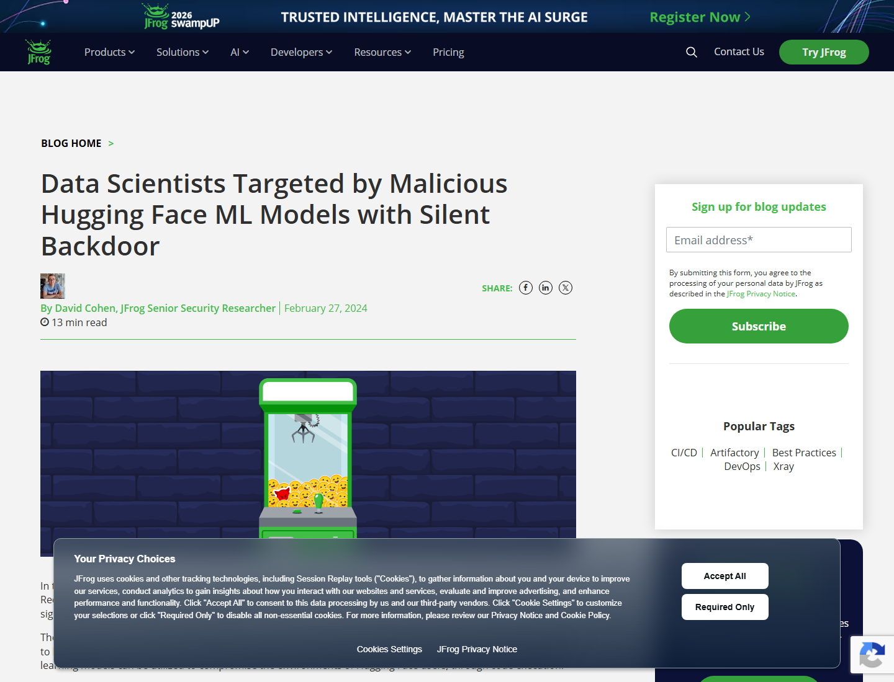
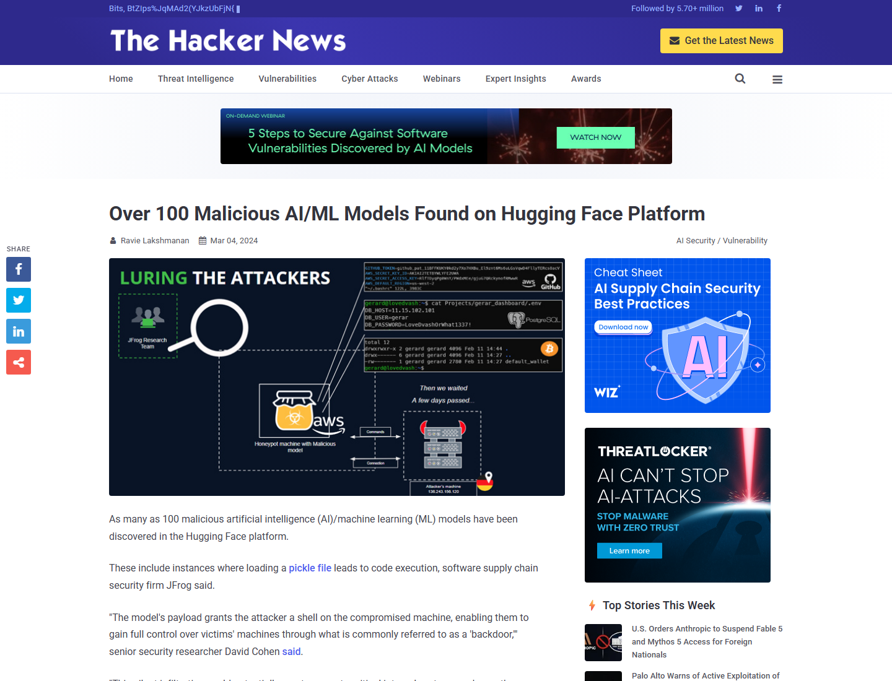
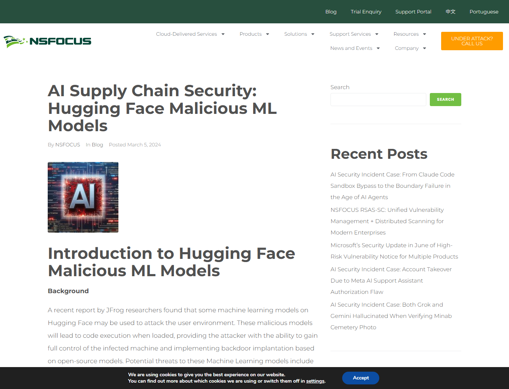
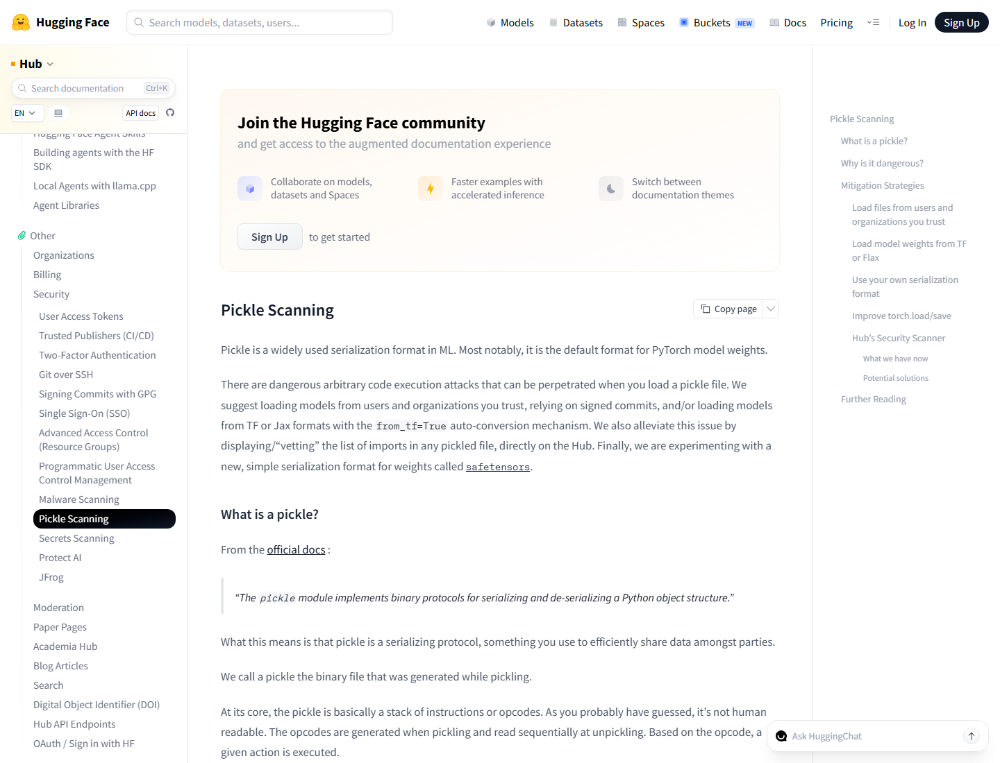

# Hugging Face Malicious Pickle Model Backdoors (2024)
> Hugging Face 恶意 Pickle 模型后门事件

| Field | Value |
|---|---|
| Category | Hallucination & Supply Chain |
| Severity | 🟠 High |
| AI Tool | Hugging Face Hub, PyTorch models, TensorFlow Keras models |
| Language | Python, Multiple |
| Real Incident | ✅ |
| Reproducible | ❌ |
| Disclosed | 2024-02-27 |
| CVE | — |
| CVSS | — |

## TL;DR
Malicious Hugging Face model files used unsafe deserialization to open shells on model-loading hosts.
> 恶意模型文件借助 Pickle 等反序列化能力，在用户加载模型时执行后门代码，暴露 AI 模型供应链风险。

---

## 详细分析 / Full Analysis

# Hugging Face 恶意 Pickle 模型后门事件分析：模型文件成为软件供应链执行入口

## 基本信息

2024 年 2 月，JFrog Security Research 披露其在 Hugging Face 平台上发现恶意机器学习模型，其中部分模型在加载 Pickle 文件时触发代码执行，payload 可向攻击者开放 shell。该事件没有单一 CVE，但它是已公开披露、由安全公司持续扫描确认、经媒体复核并促成平台安全扫描合作的真实 AI 供应链风险。

## 摘要

传统软件供应链关注包管理器、安装脚本和构建产物。该事件说明，AI 模型本身也可以成为依赖项，模型文件和模型加载代码可携带执行语义。PyTorch Pickle、TensorFlow Keras Lambda layer 等格式在便利模型分发的同时，也可能让攻击者把反序列化变成代码执行入口。Hugging Face 已有 malware、pickle、secret scanning 和 safetensors 等机制，但公开证据显示，用户仍可能在风险提示下下载并执行不可信模型。

## 一、事件核验与证据范围

### 证据矩阵

| 来源 | 类型 | 证明内容 | 边界 |
|---|---|---|---|
| JFrog 原始研究 | 主证据 / 技术证据 | Hugging Face 上存在加载即执行代码的恶意模型，payload 可开放 shell | 不证明所有 Hugging Face 模型不安全 |
| The Hacker News | 复核证据 | 复核 100 个恶意 AI/ML 模型、Pickle 加载代码执行、reverse shell | 技术细节主要来自 JFrog |
| NSFOCUS 分析 | 技术 / 生态证据 | 解释 PyTorch Pickle 与 Keras Lambda layer 的执行机制，给出恶意模型技术分析 | 用于补充技术机制 |
| Hugging Face Pickle Scanning 文档 | 生态 / 修复证据 | Hugging Face 对 Pickle 风险、Hub 安全扫描和可疑 import 展示方式的说明 | 文档说明平台机制，不证明单个恶意模型影响规模 |
| JFrog-Hugging Face 合作公告 | 生态证据 | 平台与安全厂商增强模型扫描，JFrog 提到 25 个零日恶意模型 | 公告有商业合作语境 |

JFrog 披露其持续扫描 Hugging Face 模型，发现一个加载 Pickle 文件即可执行代码的恶意模型。该模型 payload 会给攻击者 shell，从而取得受害机器控制权。JFrog 还说明，Hugging Face 虽具备 malware、pickle、secret scanning 等安全措施，但风险模型仍提醒社区必须持续审查模型文件。([JFrog](https://jfrog.com/blog/data-scientists-targeted-by-malicious-hugging-face-ml-models-with-silent-backdoor/))

The Hacker News 对事件做了复核，称平台上发现多达 100 个恶意 AI/ML 模型，其中包括加载 Pickle 文件导致代码执行的情形，并引用 JFrog 对 reverse shell payload 的描述。报道还提到某个恶意模型连接到 KREONET IP，体现出真实网络回连行为。([The Hacker News](https://thehackernews.com/2024/03/over-100-malicious-aiml-models-found-on.html))

NSFOCUS 的技术分析解释了模型文件为何能够执行代码。PyTorch 模型常见加载路径会涉及 Pickle 反序列化；恶意数据可通过 `__reduce__` 触发执行。TensorFlow Keras 的 Lambda layer 也有类似风险，模型加载时可反序列化并执行 Python 代码对象。([NSFOCUS](https://nsfocusglobal.com/ai-supply-chain-security-hugging-face-malicious-ml-models/))

Hugging Face 的 Pickle Scanning 文档说明，Pickle 是 ML 中广泛使用的序列化格式，也是 PyTorch 权重的默认格式之一。Hub 会对推送文件运行安全扫描，包括 ClamAV 和 Pickle Import scan，并在文件旁展示 import 列表和可疑项。([Hugging Face](https://huggingface.co/docs/hub/en/security-pickle)) 2025 年，JFrog 和 Hugging Face 还宣布合作增强模型扫描，公告称 ML 模型和数据集已成为新的供应链资产。([JFrog](https://investors.jfrog.com/news/news-details/2025/JFrog-and-Hugging-Face-Team-to-Improve-Machine-Learning-Security-and-Transparency-for-Developers/default.aspx))

### 证据范围

公开证据可以确认 Hugging Face 上存在被安全研究者发现的恶意模型文件，部分模型利用 Pickle 或模型加载语义在用户机器上执行代码。风险主要落在研究者、数据科学家和企业 MLOps 环境，因为这些环境常直接拉取并加载公共模型；平台和安全厂商也已围绕模型扫描、safetensors 和深度代码分析进行响应。准确地说，这是 AI 模型供应链中的恶意模型分发事件，攻击者利用模型格式和加载框架的可执行语义，把模型从静态权重资产转化为代码执行载体。

## 二、系统背景与触发条件

Hugging Face Hub 是模型、数据集和应用协作平台。AI 开发者经常在实验环境、Notebook、CI 训练任务和生产推理服务中直接下载模型。与传统代码包相比，模型文件更容易被误认为是纯数据；但 Pickle、Keras H5/Lambda layer、仓库内 loader 脚本和 notebook 都可能带有执行行为。

风险通常出现在用户从不可信或未充分验证的模型仓库下载模型，并通过 `torch.load()`、框架自动加载器或允许执行自定义代码的接口加载模型时。如果运行环境中同时存在云凭据、SSH key、数据集访问令牌、实验平台 token 或内网访问能力，而组织又没有模型 allowlist、文件格式策略、离线扫描、沙箱执行和出站网络限制，模型加载就会从实验动作变成高权限代码执行入口。

## 三、攻击链路与处置过程

攻击入口位于模型仓库。攻击者上传看似正常的模型文件，或在模型卡、示例代码中诱导用户按常规方式加载模型。

AI 组件是模型分发与加载链路。与普通依赖包相比，用户关注点常在模型能力、参数规模和任务效果，反序列化行为容易被忽视。关键权限来自运行模型的机器：数据科学家工作站、训练节点或推理服务通常拥有 GPU、数据集、云访问和代码仓库权限。

失效边界是模型文件被当作可信数据。Pickle 反序列化和 Keras Lambda layer 使模型加载可执行任意代码；如果平台只给出风险提示而不阻断下载，最终执行决策落到用户和企业 MLOps 流程。

执行结果包括 reverse shell、后门控制、凭据读取、横向移动和数据访问。处置方向包括删除恶意模型、增强平台扫描、采用 safetensors、对模型加载环境做沙箱隔离和出站限制。

## 四、技术根因分析

根因之一是模型格式带有可执行语义。Pickle 可以表达对象构造过程，并在反序列化时触发代码执行。Keras Lambda layer 也把可执行 Python 逻辑序列化进模型结构。

根因之二是模型供应链治理滞后。传统 SCA 工具擅长扫描依赖包和 CVE，但模型文件、模型卡、训练脚本和 notebook 的组合更复杂。攻击者可以把恶意逻辑藏在权重文件、loader、setup 指令或仓库外围脚本中。

根因之三是 AI 开发流程中的信任捷径。研究者常通过复制模型卡示例快速试验，Notebook 和训练容器中又常有高价值凭据。模型仓库的下载量、点赞数或作者名容易被当作可信信号，但这些信号无法替代安全审查。

## 五、AI 参与方式与风险归因

AI 参与方式明确：攻击载体是公共 AI/ML 模型仓库中的模型文件，受害路径是加载和运行模型。模型本体及其加载方式构成执行入口，AI 相关性来自模型供应链和模型运行环境。

风险归因由模型格式、平台分发、用户执行环境和组织流程共同决定。Hugging Face 作为平台提供扫描和安全格式，企业仍需要对模型来源、格式、执行权限和网络访问建立自己的治理流程。研究者和企业用户也应把模型文件视作可执行第三方依赖。

## 六、与团队技术报告风险框架的关系

团队技术报告强调软件供应链风险、敏感数据泄露和人机协同治理。该案例把这些风险从代码包扩展到模型包。模型既是 AI 系统的核心资产，也是第三方依赖；一旦加载过程可执行代码，模型供应链就具有与 npm、PyPI 类似的攻击面。

报告中提到的全流程可追溯、沙箱运行和安全审查在这里尤其关键。企业需要记录模型来源、hash、格式、扫描结果、加载 API 和运行权限。对从公共平台下载的模型，应默认进入隔离环境，再进入带有生产凭据的训练或推理环境。

## 七、影响范围与社会后果

影响范围包括数据科学家工作站、研究集群、MLOps 流水线、推理容器和自动化评测环境。恶意模型可访问的数据不止模型输入，还可能包括训练数据、私有数据集、云密钥、Git 凭据、实验平台 token 和内网服务。

社会后果在于 AI 生态正在把模型当作可复用构件大规模流通。下载模型的行为正在变得像安装包一样频繁，但安全治理尚未达到传统包管理器同等成熟度。该事件促使平台和安全厂商强化模型扫描，也提醒企业将模型纳入软件供应链清单。

## 八、治理建议

企业应避免在生产或高权限环境中直接加载未知 Pickle、H5 或启用自定义代码的模型。更稳妥的做法是优先采用 safetensors 等较少携带任意代码执行语义的格式，在模型进入企业环境前完成静态扫描、反序列化风险分析、hash 固定和来源验证。模型测试环境应关闭默认出站网络，限制文件系统和云元数据访问；组织还需要建立模型仓库 allowlist，记录模型卡、提交、作者、下载时间和审查结论，并把模型版本、格式、依赖库和加载方式纳入 SBOM/AI BOM。

## 九、结论

Hugging Face 恶意 Pickle 模型事件说明，AI 供应链不只由代码包组成。模型文件、加载器、仓库说明和示例脚本都可能成为执行入口。AI 项目越依赖公共模型生态，越需要把模型当作高风险第三方依赖处理，用格式安全、沙箱隔离、扫描和溯源补上模型供应链的基本防线。

## 参考来源

- [JFrog: Data Scientists Targeted by Malicious Hugging Face ML Models with Silent Backdoor](https://jfrog.com/blog/data-scientists-targeted-by-malicious-hugging-face-ml-models-with-silent-backdoor/)
- [The Hacker News: Over 100 Malicious AI/ML Models Found on Hugging Face Platform](https://thehackernews.com/2024/03/over-100-malicious-aiml-models-found-on.html)
- [NSFOCUS: AI Supply Chain Security - Hugging Face Malicious ML Models](https://nsfocusglobal.com/ai-supply-chain-security-hugging-face-malicious-ml-models/)
- [Hugging Face: Pickle Scanning](https://huggingface.co/docs/hub/en/security-pickle)
- [JFrog and Hugging Face Team to Improve Machine Learning Security and Transparency](https://investors.jfrog.com/news/news-details/2025/JFrog-and-Hugging-Face-Team-to-Improve-Machine-Learning-Security-and-Transparency-for-Developers/default.aspx)
- [Hugging Face safetensors](https://github.com/huggingface/safetensors)
