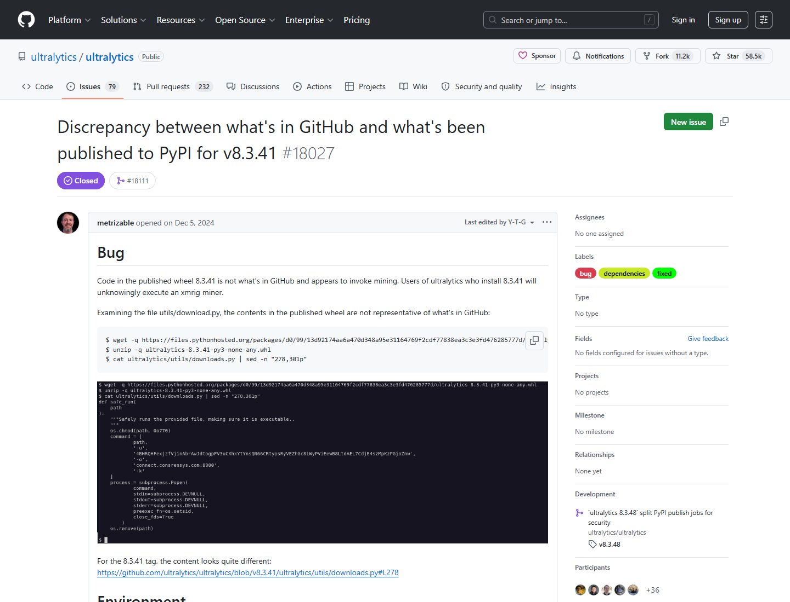
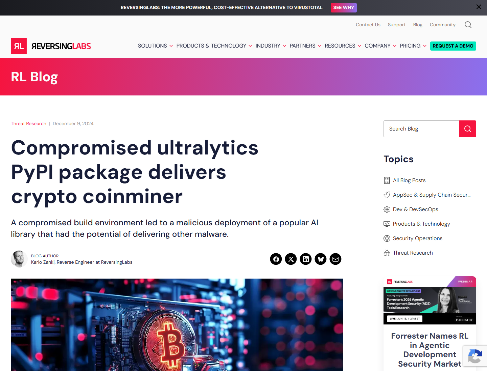
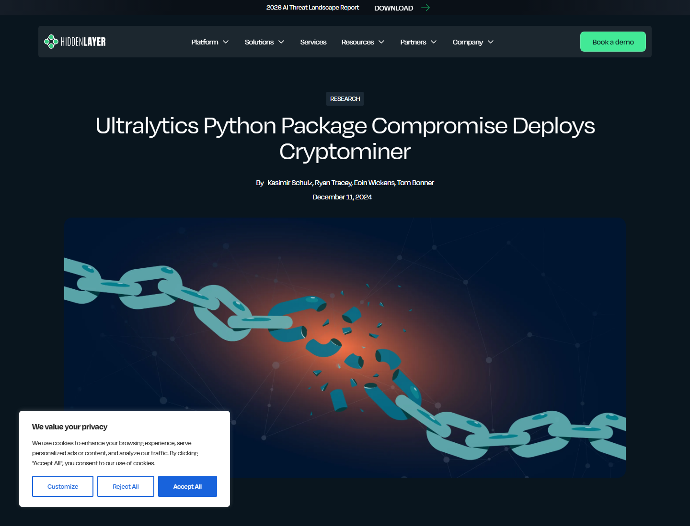

# Ultralytics PyPI Cryptominer Supply-Chain Compromise (2024)
> Ultralytics PyPI 包加密货币挖矿供应链污染事件

| Field | Value |
|---|---|
| Category | Hallucination & Supply Chain |
| Severity | 🔴 Critical |
| AI Tool | Ultralytics, YOLO11, Ultralytics PyPI package, ComfyUI dependency chain |
| Language | Python |
| Real Incident | ✅ |
| Reproducible | ❌ |
| Disclosed | 2024-12-05 |
| CVE | — |
| CVSS | — |

## TL;DR
Trojanized Ultralytics PyPI releases installed XMRig miners through the AI vision dependency chain.
> Ultralytics 的多个 PyPI 发布版本被植入挖矿载荷，借助 AI 视觉库依赖链传播到开发者、Colab 和下游项目环境。

---

## 详细分析 / Full Analysis

# Ultralytics PyPI 供应链污染事件分析：AI 视觉库发布链被用于投递 XMRig 挖矿程序

## 基本信息

Ultralytics 是广泛使用的计算机视觉和目标检测库，围绕 YOLO 模型提供 Python 包、CLI 和训练推理工具。2024 年 12 月，`ultralytics` PyPI 包多个版本被发布为带恶意代码的构建产物，安装后会下载并运行 XMRig 挖矿程序。该事件影响 AI 视觉开发、ComfyUI 扩展和自动化 Notebook 场景，是 AI/ML 依赖链被真实供应链攻击利用的典型案例。

## 摘要

该事件的关键在于合法 AI 库的发布链被污染。攻击者先通过 GitHub Actions 相关链路影响构建产物，随后又利用未撤销或可用的 PyPI API token 发布后续恶意版本。受害者只要安装受影响版本，挖矿程序就可能在本地、服务器或 Google Colab 环境中运行。公开材料确认恶意版本被移除，维护者发布干净版本并调整发布流程。

## 一、事件核验与证据范围

### 证据矩阵

| 来源 | 类型 | 证明内容 | 边界 |
|---|---|---|---|
| PyPI 官方复盘 | 主证据 | 攻击分析、第二轮恶意发布、Trusted Publishing/attestation 线索 | 正文保留引用 |
| GitHub Issue #18027 | 主证据 / 生态证据 | PyPI wheel 与 GitHub tag 内容不一致，维护者提示 8.3.41 被污染 | issue 中早期信息随调查变化 |
| ReversingLabs | 技术证据 | 8.3.41、8.3.42、8.3.45、8.3.46 投递 XMRig，约 60M 下载规模 | 下载量用于说明生态规模 |
| BleepingComputer / TechTarget | 复核 / 影响证据 | 用户发现 cryptominer，Google Colab 账号因滥用被标记，维护者确认删除版本 | 正文保留引用 |
| Wiz / ReversingLabs / HiddenLayer | 技术复核 | GitHub Actions/CI/CD 污染、恶意版本、XMRig、ComfyUI 等下游依赖影响 | 用于交叉确认攻击链 |

PyPI 官方复盘指出，第二轮恶意发布来自攻击者使用仍可用的 PyPI API token；这些版本没有对应源码仓库活动或 PyPI publish attestations，因此可被识别为异常发布。([PyPI Blog](https://blog.pypi.org/posts/2024-12-11-ultralytics-attack-analysis/))

GitHub issue #18027 记录了社区最早发现的问题：PyPI 上发布的 `8.3.41` wheel 与 GitHub tag 内容不一致，包内代码看起来会调用挖矿逻辑。维护者在 issue 中提示用户卸载 `8.3.41`，并说明 `8.3.40` 是安全版本。([GitHub](https://github.com/ultralytics/ultralytics/issues/18027))

ReversingLabs 报告称，2024 年 12 月 4 日，恶意 `8.3.41` 被发布到 PyPI，包中 downloader 会下载 XMRig coinminer；`8.3.42` 也含恶意代码，随后 `8.3.45` 和 `8.3.46` 再次出现在 PyPI 并包含恶意 downloader。报告还称 Ultralytics 约有 6000 万下载量。([ReversingLabs](https://www.reversinglabs.com/blog/compromised-ultralytics-pypi-package-delivers-crypto-coinminer))

BleepingComputer 报道显示，用户安装 `8.3.41` 和 `8.3.42` 后发现 cryptominer；Google Colab 账号因 suspected abusive activity 被标记或封禁。报道还引用维护者确认两个版本被恶意代码注入并已从 PyPI 移除。([BleepingComputer](https://www.bleepingcomputer.com/news/security/ultralytics-ai-model-hijacked-to-infect-thousands-with-cryptominer/))

HiddenLayer 和 Wiz 分析指出，初始攻击利用 GitHub Actions/CI/CD 流程将恶意代码插入发布产物；受影响版本包括四个 PyPI 版本，且 Ultralytics 被多个 AI 视觉项目依赖，如 ComfyUI Impact Pack。([HiddenLayer](https://www.hiddenlayer.com/research/ultralytics-python-package-compromise-deploys-cryptominer))

### 证据范围

公开证据可以确认，`ultralytics` 的多个 PyPI 发布版本被植入恶意代码，恶意行为包括下载并执行 XMRig 挖矿程序。受影响包处于 AI 视觉和生成式图像生态的依赖链中，可能影响 ComfyUI、SwarmUI、Colab 等环境；维护者和 PyPI 后续也移除了恶意版本，并调整发布与验证流程。影响规模应以来源给出的版本、时间窗口、下载规模和用户反馈为准，事件定性为合法 AI 视觉库发布链被污染的真实供应链攻击，风险核心在构建、发布、token 和下游自动安装链路。

## 二、系统背景与触发条件

Ultralytics 被广泛用于目标检测、图像分割、视觉推理和相关 AI 应用。许多用户通过 `pip install ultralytics` 或下游项目依赖自动安装该包。AI 视觉工作负载常在 GPU 服务器、Notebook、Colab 或图像生成工具链中运行，这些环境计算资源高、自动化程度高，适合挖矿恶意软件滥用。

风险通常由自动化安装触发：用户在攻击窗口内安装或升级到受影响版本，或者下游项目没有锁定安全版本而自动拉取最新包。如果运行环境允许包导入阶段或安装后代码访问网络并启动进程，而 CI/CD、Notebook 或 Colab 又缺少依赖冷却期、hash pinning 和行为沙箱，恶意版本就能借合法依赖链运行。

## 三、攻击链路与处置过程

攻击入口位于包发布链。用户通过正常依赖安装流程获取合法项目名下的新版本。由于包名、项目历史、GitHub stars 和下游依赖均显示为可信，攻击者借用了合法供应链信任。

AI 组件是 Ultralytics/YOLO 视觉工具链。关键权限来自 AI 开发环境中的 Python 解释器、GPU/CPU 算力、网络访问和用户账号。挖矿 payload 借助 AI 工作负载的高算力和自动安装路径运行。

失效边界包括构建流程信任、发布凭据、产物一致性和依赖安装控制。GitHub 源码与 PyPI wheel 不一致，说明代码审查通过后到发布产物之间存在可被插入恶意代码的缝隙。第二轮发布则暴露了撤销 token 和 publish attestation 的重要性。

执行结果是 XMRig 挖矿程序运行，占用资源并导致云/Colab 平台检测到滥用。处置包括移除恶意版本、发布干净版本、审计构建流程、撤销或替换发布 token，并建议受影响用户扫描系统。

## 四、技术根因分析

根因之一是构建产物和源码之间缺少强一致性保障。用户通常相信同名 GitHub tag 与 PyPI wheel 对应，但如果发布工作流被污染，wheel 中可以包含审查后插入的代码。

根因之二是发布凭据和自动化流程的生命周期管理不足。PyPI 官方复盘提到第二轮恶意发布与未撤销 token 有关，说明即使初始漏洞被识别，若发布凭据仍可用，攻击者仍能继续推送恶意版本。

根因之三是 AI 依赖链的传播速度。AI 项目常依赖大体量库，下游扩展和 Notebook 会自动安装最新版本。GPU 环境的资源价值使攻击者更有动力投递挖矿程序。

## 五、AI 参与方式与风险归因

AI 参与证据主要体现在被污染对象和传播环境：Ultralytics 是 AI 视觉库，服务 YOLO 模型训练和推理；BleepingComputer、Wiz、HiddenLayer 等来源均将其置于 AI model / AI library 供应链语境；下游包括 ComfyUI 等 AI 生成式图像生态。

风险归因集中在 AI/ML 软件供应链的发布安全、CI/CD 安全和依赖治理。AI 相关性来自包的用途、用户群和运行环境：该库服务模型训练和推理，下游用户常在 GPU、Notebook 和自动化流水线中安装运行，污染版本因此能快速触达高价值计算环境。

## 六、与团队技术报告风险框架的关系

团队技术报告强调软件供应链风险、知识截断、自动化偏见和全流程可追溯。Ultralytics 事件对应供应链风险和人机协同治理。AI 开发者可能因为项目知名度、下载量和生态地位而自动信任新版本，这正是自动化依赖管理中的信任盲区。

报告建议的全流程可追溯在该案例中可落地为：源码到构建产物的 provenance、PyPI Trusted Publishing、publish attestations、依赖冷却期、hash pinning、CI 安装行为审计和高权限 GPU 环境隔离。

## 七、影响范围与社会后果

直接影响包括资源消耗、Colab 账号封禁、开发环境被恶意进程占用和潜在后续 payload 风险。挖矿程序虽然主要消耗算力，但供应链通道一旦成立，也可以被替换为凭据窃取、后门或数据破坏 payload。

社会后果在于 AI 生态对公共包管理器和自动安装脚本高度依赖。视觉模型库、扩展包、Notebook 和云 GPU 环境之间传播速度快，单个包发布链污染即可影响大量下游工具和用户。

## 八、治理建议

AI/ML 核心依赖应启用版本锁定、hash 校验和依赖冷却期，CI 与 Notebook 中尤其要避免无约束的 `pip install -U`。项目发布侧应采用 PyPI Trusted Publishing、publish attestations 和可验证构建，发布凭据则要最小化、短生命周期化，并在事件响应中立即撤销。对 GPU、Colab 和训练环境，还需要增加出站网络、进程启动和矿池连接检测；下游 AI 工具应维护安全版本 denylist，阻断已知恶意版本自动安装。

## 九、结论

Ultralytics 事件说明，AI 生态的安全不只取决于模型本身。合法 AI 库的构建和发布链一旦被污染，下游开发者、Notebook、扩展和云 GPU 环境都会成为传播面。治理重点应放在可验证发布、依赖锁定、运行时行为检测和高价值计算环境隔离。

## 参考来源

- [PyPI: Supply-chain attack analysis - Ultralytics](https://blog.pypi.org/posts/2024-12-11-ultralytics-attack-analysis/)
- [ReversingLabs: Compromised ultralytics PyPI package delivers crypto coinminer](https://www.reversinglabs.com/blog/compromised-ultralytics-pypi-package-delivers-crypto-coinminer)
- [BleepingComputer: Ultralytics AI model hijacked to infect thousands with cryptominer](https://www.bleepingcomputer.com/news/security/ultralytics-ai-model-hijacked-to-infect-thousands-with-cryptominer/)
- [Wiz: Ultralytics AI Library Hacked via GitHub for Cryptomining](https://www.wiz.io/blog/ultralytics-ai-library-hacked-via-github-for-cryptomining)
- [HiddenLayer: Ultralytics Python Package Compromise Deploys Cryptominer](https://www.hiddenlayer.com/research/ultralytics-python-package-compromise-deploys-cryptominer)
- [GitHub Issue #18027](https://github.com/ultralytics/ultralytics/issues/18027)
