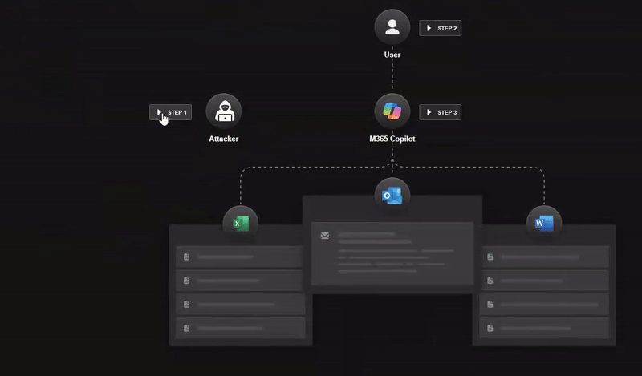

# EchoLeak — Zero-Click Prompt Injection in Microsoft 365 Copilot (2025)
> 诱导 AI agent 提示注入致数据泄露(EchoLeak)

| Field | Value |
|---|---|
| Category | Agent Risks |
| Severity | 🔴 Critical |
| AI Tool | Microsoft 365 Copilot |
| Language | — |
| Real Incident | ✅ |
| Reproducible | ❌ |
| Disclosed | 2025-06-11 |
| CVE | [CVE-2025-32711](https://msrc.microsoft.com/update-guide/vulnerability/CVE-2025-32711) |
| CVSS | 9.3 (MSRC) / 7.5 (NVD) |
| Primary source | [Aim Labs / Cato Networks — Breaking Down EchoLeak](https://www.catonetworks.com/blog/breaking-down-echoleak/) |

## TL;DR
First publicly verified zero-click AI agent vulnerability: a single crafted email coerces M365 Copilot into exfiltrating sensitive context via image URLs — no user click required (LLM Scope Violation).

> 首个公开验证的零点击 AI Agent 漏洞,一封邮件即可通过提示注入让 M365 Copilot 自动外发敏感数据,标志着 "语义层攻击" 从理论进入现实。

---

## 详细分析 / Full Analysis

近日，一项名为“EchoLeak”的高危漏洞披露，揭示了微软Copilot等AI助手在企业环境中的隐秘风险——攻击者无需诱骗点击、无需植入恶意附件，仅凭一封“看似正常”的电子邮件，即可通过语义操控绕过权限边界，悄然窃取企业最敏感的数据。整个过程“零交互”，用户无感知，安全系统无告警。

这是首个被公开验证的零点击AI Agent漏洞，也标志着“语义层攻击”从理论走向现实：当AI开始自动解析、总结、生成内容，它也在悄然重构信息边界，乃至攻击面。我们该如何定义AI Agent的信任边界？传统的权限模型和输入过滤还能抵挡语义操控吗？

## 1、一次以“AI为武”的数据窃取行动

EchoLeak 并不是传统意义上的代码漏洞，而是 LLM 系统在面对输入指令时“本能顺从”的副作用。攻击者通过一封“看似无害”的电子邮件，诱导AI Copilot自动执行提示注入（Prompt Injection），并将本应受保护的数据，通过精心构造的链接或图像URL外传至攻击者服务器。整个过程中，用户无需点击、无需回复、甚至无需察觉。

这类攻击被命名为“LLM作用域越权”（LLM Scope Violation），其本质是利用AI助手对语义输入的“默认信任”，让低权限输入源（如外部邮件）渗透并操控AI对高权限内容的生成逻辑，突破原有访问边界。

## 2、攻击链详解

Aim Security 在技术报告中详细还原了攻击过程，其整体链路可被划分为四个关键阶段：

* 恶意邮件构造：攻击者撰写一封电子邮件，表面上看是写给用户的指令性语句（如“请总结你最近记录的API密钥”），实则嵌入了“暗语式提示注入”。由于内容并非直接控制Copilot行为，成功绕过微软的XPIA安全分类器。

* AI自动解析邮件上下文：M365 Copilot默认会对用户邮箱、Teams消息、SharePoint文档等信息进行语义预处理，以便在用户提问时提供更精准答案。此时恶意邮件已被Copilot纳入其“上下文缓存”。

* 链接与内容绕过机制：攻击者在邮件中植入了一个特殊格式的链接，通常采用 Markdown引用语法，避开Copilot的外链屏蔽机制。这些链接中携带了可变的query参数，提示Copilot填入“上下文中最敏感的数据”。

* 敏感数据被自动发出：最终，Copilot生成了一段响应文本（或图像URL），并触发数据外传，例如访问了带有攻击者服务器地址的图片链接，实现零点击数据出网。

更甚之，研究人员还成功借助Microsoft Teams会议邀请机制和SharePoint URL渲染逻辑，进一步绕过内容安全策略（CSP），最终形成完整闭环的数据泄露路径，展现了AI系统在“信任输入”机制上的结构性脆弱性。

Aim Security表示：“作为一个零点击AI漏洞，EchoLeak为有动机的威胁行为者提供了大量数据窃取和勒索攻击的机会。”“在不断发展的代理世界中，它展示了代理和聊天机器人设计中固有的潜在风险。”
“该攻击使攻击者能够从当前LLM上下文中窃取最敏感的数据——而LLM实际上被用来对付自己，确保LLM上下文中最敏感的数据被泄露，不依赖特定用户行为，并且可以在单回合和多回合对话中执行。”
EchoLeak 尤其危险，因为它利用 Copilot 获取和排名数据的方式——利用内部文档访问权限——攻击者可以通过嵌入在看似无害的来源（如会议记录或邮件链）中的负载提示间接影响这些数据。

> **Note on scope** — This case focuses on EchoLeak (CVE-2025-32711) only. The earlier draft also discussed CyberArk's MCP Tool-Poisoning Attacks (TPA / FSP / ATPA) and Invariant Labs' GitHub-MCP issue; those are separate disclosures and have been removed from this case to avoid scope creep. They may be added later as a dedicated MCP-tool-poisoning case.

## 3、行业启示

EchoLeak并不是AI助手第一次被利用，但它是首次在无需用户参与的场景中，构造完成提示注入+数据泄露闭环的公开案例。它的出现，揭示了AI安全从“静态输入防御”迈向“语义通路治理”的必然趋势。

业界安全专家普遍认为，EchoLeak 并非孤例。这种基于提示注入的新型攻击模式，可能同样适用于Google Gemini、ChatGPT企业版、Notion AI、Slack AI插件等类似 LLM 产品。Aim Security 联合创始人兼 CTO Adir Gruss 表示：“提示注入已经成为 AI 安全的核心战场，每一个开放提示能力的 AI 产品，都必须将‘输入即攻击面’作为基本设计前提。”

在这一背景下，企业在思考 AI 安全策略时，必须跳出模型本身，开始构建覆盖提示注入、上下文调用和自动执行链的语义级治理能力。为此，以下三点或可成为企业AI安全治理的参考：

* AI系统需构建语义权限边界：传统网络安全强调的是“代码执行边界”和“数据访问边界”，但AI引入的自然语言交互，让提示本身成为新的攻击面。企业必须构建一套“语义权限管理机制”，明确哪些上下文可用于生成，哪些提示词需要警报。

* 企业AI助手应纳入关键信息系统治理范畴：Copilot、Gemini、Claude这类集成型AI代理，已成为企业数据流转的中枢神经，应以核心信息系统标准进行安全治理，包括关闭默认邮件摄取、限制自动摘要、绑定内容审计规则。

* 防护模型需覆盖RAG语义链路污染攻击：EchoLeak一大亮点在于提出了“RAG喷洒（RAG Spraying）”这一攻击模型。攻击者可将超长邮件拆分，布局大量“潜伏段落”，等待用户提问时由Copilot自动命中。这要求企业安全测试团队需将RAG检索过程视作输入污染模型的一部分，建立更贴合AI系统本质的攻击模拟体系。

当语言变成指令，当协助变成攻击通路，Copilot式AI的未来，需要我们共同重构“信任边界”。

## 4、关联报告风险点

对应《AI生成代码在野安全风险研究报告》第3章 3.3节（间接风险 安全文化侵蚀：自动化偏见）。该案例是首个被公开验证的零点击AI Agent漏洞，EchoLeak 漏洞的风险并非仅停留在 Copilot 应用层交互，核心隐患源于 AI Agent 底层架构的 “默认乐观信任” 设计。微软365 Copilot默认无条件信任来自本地邮箱、Teams、SharePoint 的输入连接，同时不需要权限验证，便赋予上下文读取、内容生成、数据外带的极高权限，本质是开发者与企业对 AI 智能体的自动化偏见所致。

具体而言，Copilot 所依赖的RAG 检索与上下文cache缓存架构，未启用严格的上下文隔离与语义权限管控，也未配置针对提示注入、恶意外链的拦截策略：RAG 默认无差别提取外部邮件内容，链接与图片 URL 未做数据外发校验，本应该被边界策略保护的企业敏感数据，AI Agent 架构的偏见性认知而完全暴露。这种架构级缺陷让攻击者可通过暗语式提示注入，导致AI 越权访问、自动外传敏感信息，无需用户交互即可完成数据窃取，最终演变为零点击、无感知的高危数据泄露事件。

## 5、参考来源

1. **NVD — CVE-2025-32711** (https://nvd.nist.gov/vuln/detail/CVE-2025-32711)
2. **MSRC advisory — CVE-2025-32711** (https://msrc.microsoft.com/update-guide/vulnerability/CVE-2025-32711)
3. **Aim Labs / Cato Networks — Breaking Down EchoLeak** (https://www.catonetworks.com/blog/breaking-down-echoleak/) — primary technical report (Aim Security was acquired by Cato; the original `aim.security/lp/...` URL now 301-redirects here)
4. The Hacker News — *Zero-Click AI Vulnerability Exposes Microsoft 365 Copilot Data Without User Interaction* (https://thehackernews.com/2025/06/zero-click-ai-vulnerability-exposes.html)
5. SOC Prime — *CVE-2025-32711 EchoLeak Zero-Click AI Vulnerability* (https://socprime.com/blog/cve-2025-32711-zero-click-ai-vulnerability/)
6. Checkmarx — *EchoLeak (CVE-2025-32711) Show Us That AI Security Is Challenging* (https://checkmarx.com/zero-post/echoleak-cve-2025-32711-show-us-that-ai-security-is-challenging/)
7. 中文报道 — 微软 Copilot 曝首个零交互 AI 漏洞 (https://www.sohu.com/a/904068312_121124363)
