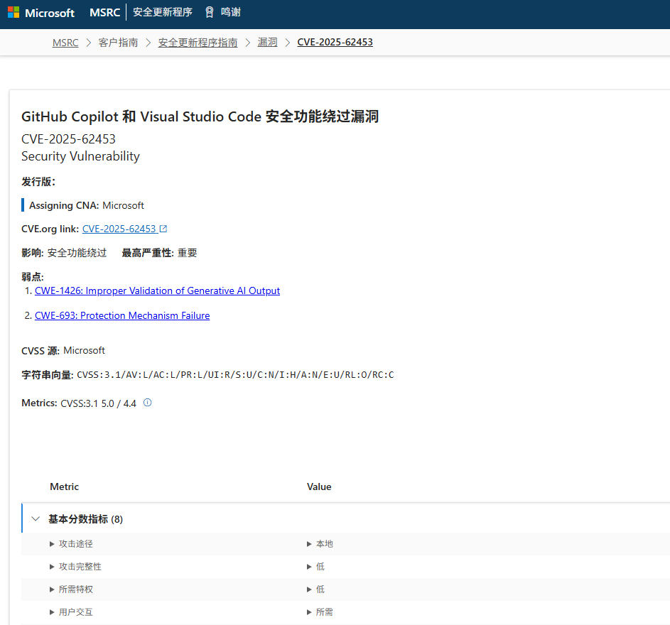
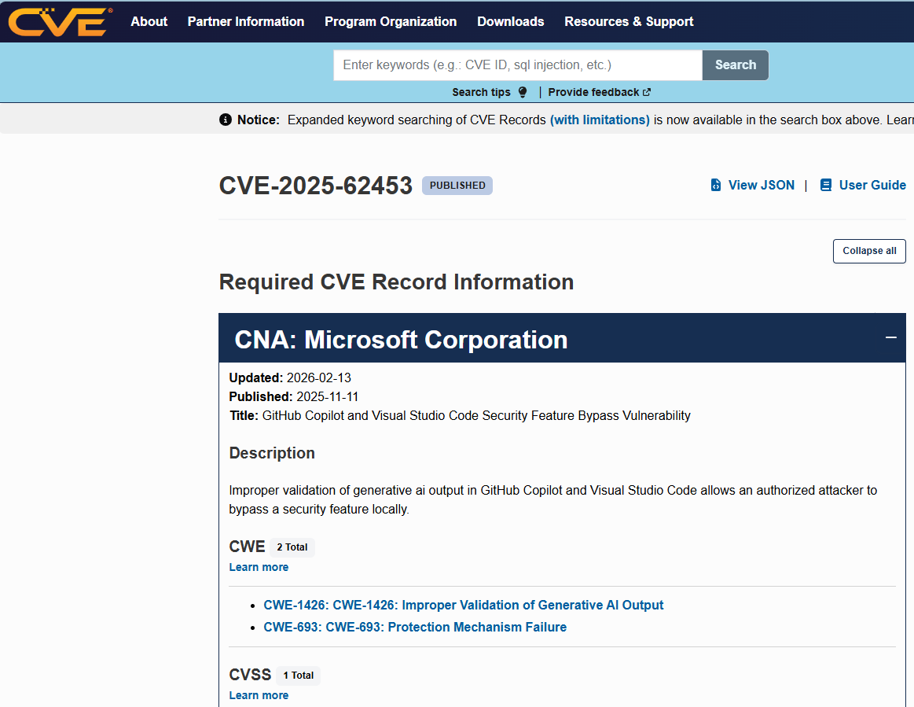
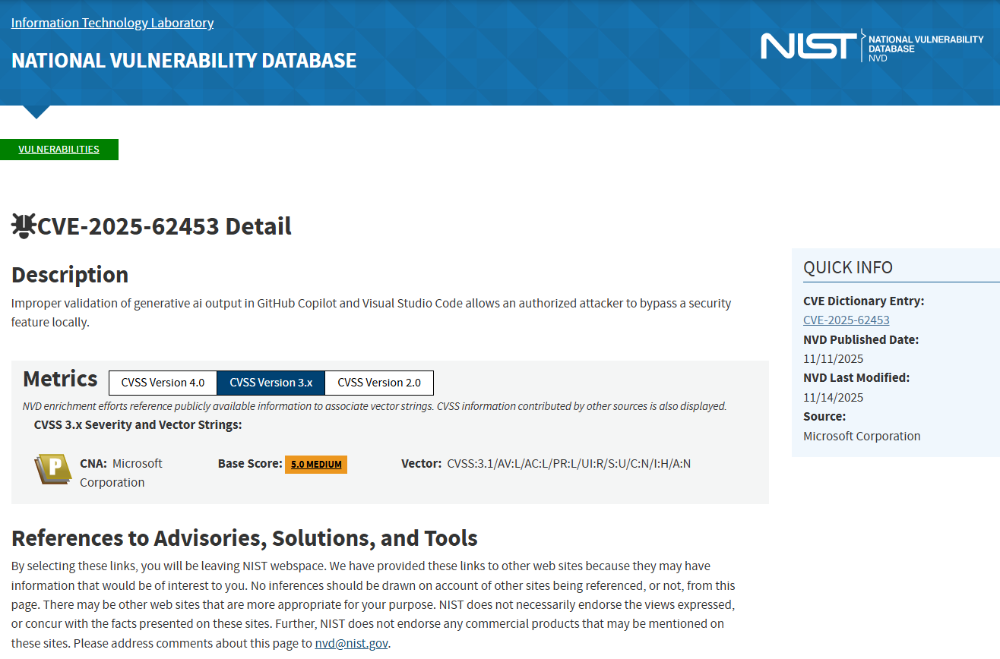
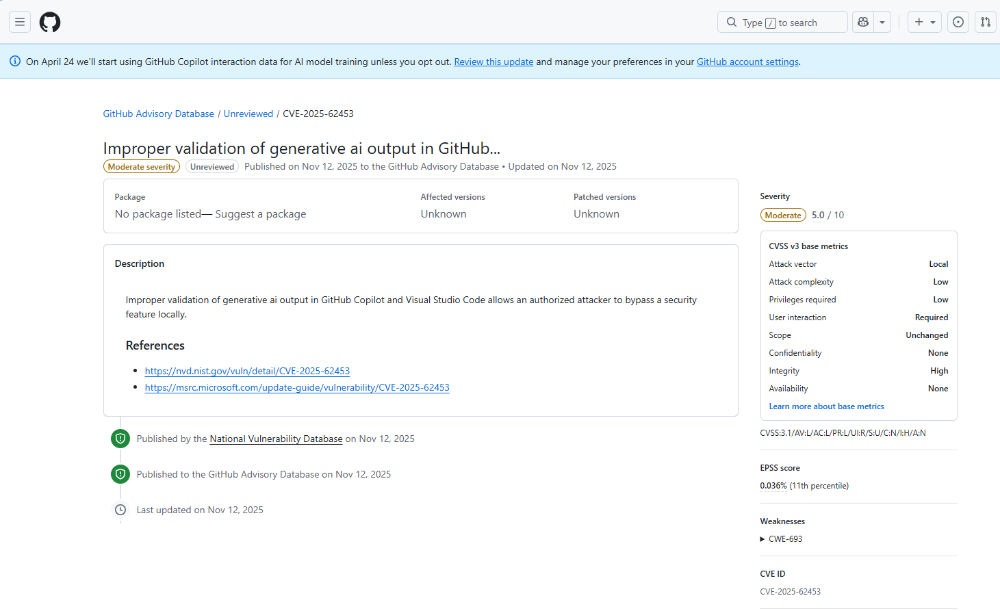

# GitHub Copilot & VS Code AI Output Validation Bypass Vulnerability (2025)
> GitHub Copilot & VS Code 生成输出验证失效漏洞

| Field | Value |
|---|---|
| Category | Code-Level Vulnerabilities |
| Severity | 🟡 Medium |
| AI Tool | GitHub Copilot, Visual Studio Code |
| Language | Multiple |
| Real Incident | ✅ |
| Reproducible | ❌ |
| Disclosed | 2025-11-11 |
| CVE | CVE-2025-62453 |
| CVSS | 5.0 |

## TL;DR
Improper validation of AI-generated output in GitHub Copilot and VS Code allows a local attacker to bypass built-in security protections in the IDE.
> GitHub Copilot 与 VS Code 对 AI 生成内容未做正确校验，攻击者可在本地绕过 IDE 安全机制。

---

## 基础信息
- 发生时间：2025-11
- 公开时间：2025-11-11
- 风险类型：漏洞注入 / 输出验证失效 / 基础设施防护绕过
- 关联报告风险点：对应《AI生成代码在野安全风险研究报告》第 3 章 3.2 节 直接安全风险与 6.3 节 人机协同治理：零信任机制
- 影响范围：Visual Studio Code的1.105.0 之前版本以及 GitHub Copilot 用户生态
- 严重等级：中（CVSS v3.1 评分 5.0）

## 一、事件概述
2025 年 11 月，微软及美国国家漏洞数据库（NVD）正式披露了一个针对 GitHub Copilot 和 Visual Studio Code 的真实高危底层同步公开编号为 CVE-2025-62453 的安全漏洞。

问题核心在于，VS Code 作为集成环境，未对 GitHub Copilot 生成的内容做本地安全校验与合法性过滤，直接将模型输出视为可信内容处理。在企业开发、代码审计、多系统集成等场景中，攻击者可借助精心构造的上下文诱导 AI 生成特定输出，使本地低权限用户绕过 VS Code 内置的安全防护机制，破坏开发环境的安全边界。

## 二、风险细节
1. **AI工具**：GitHub Copilot, Visual Studio Code。
2. **风险根因**：生成式 AI 输出未经过严格校验即被 IDE 接收与处理，属于典型的输入信任风险。该漏洞已被权威机构归入两类通用弱点：CWE-1426 生成式 AI 输出验证不当 与 CWE-693 安全保护机制失效。
3. **漏洞表现**：在探讨 Copilot 带来的安全挑战时，不仅需要关注诸如过滤匹配公共代码Suggestions matching public code等防范开源侵权维度的控制开关，更要警惕大模型输出作为“执行输入源”的系统级风险。大语言模型的输出本质上是不可预测的数据流。此漏洞证实，当 AI 的输出未能被宿主 IDE 有效沙箱化和清洗时，这层人类对 AI 的“盲目信任”就变成了一个可以打破本地安全策略的特权通道。

4. **影响结果**：这种基于 AI 输出的防护绕过的漏洞彻底打破了传统的边界防御假设。攻击者可在本地环境中实现安全机制绕过，导致开发环境完整性受损。这一事件暴露出，将 AI 编码助手深度嵌入 IDE 等核心开发工具后，会形成一类全新的、以模型输出为载体的攻击面，传统防护手段无法覆盖。

## 三、修复与处置
1. **紧急修复措施**：微软安全响应中心在获悉该漏洞后，紧急发布了针对 Visual Studio Code 的安全更新，要求所有终端用户必须升级至 1.105.0 或更高版本，以在 IDE 渲染层封堵此漏洞。
2. **预防建议**：
结合报告我们提出以下的相关预防该风险的建议:
   - **建立多维度评价基准**：企业不应仅以 “代码可运行” 作为 AI 输出有效性标准，需针对 IDE 与 AI 插件的交互流程建立专项安全评估机制，覆盖输入校验、内容过滤、权限隔离等环节。
   - **增强人机协同与零信任**：依据报告 6.3 节提出的零信任原则，必须在供应链生命周期中重建“零信任（Zero Trust）”。开发者与企业安全团队必须达成共识：AI 助手在 IDE 内直接吐出的每一行代码，默认都是未经合法化校验的不受信输入，需要应用与外部网络来源同等级别的端点防护和人工审查。

## 四、关联报告风险点
本案例是《AI 生成代码在野安全风险研究报告》中多项核心风险的官方 CVE 实证，对应以下章节：
1. 第 3 章 3.2 节 直接安全风险：漏洞注入与放大
报告明确提出，AI 生成代码会因输出不可控、校验缺失直接引入可被利用的漏洞。本案例中，VS Code 未校验 Copilot 输出内容，使模型输出成为可被利用的攻击载体，属于典型的 AI 原生漏洞注入，直接验证了报告对 “AI 输出可直接构成安全漏洞” 的判断。
2. 第 3 章 3.3 节 安全文化侵蚀：自动化偏见
报告指出，过度依赖 AI 会形成自动化偏见，既体现在开发者行为中，也会体现在工具设计层面。本案例中，IDE 厂商默认 AI 输出可信、未设置拦截校验，开发者也习惯性信任 AI 生成结果，双重偏见叠加导致漏洞出现，与报告描述完全一致。
3. 第 5 章 5.2 节 AI 引入漏洞的特征分布
报告提出，AI 相关漏洞具有明显的工具链化、集成化特征。该漏洞并非来自代码逻辑本身，而是来自 IDE 与 AI 插件深度融合后的信任机制缺陷，风险根植于 AI 开发工具链内部，属于报告定义的 “网络化攻击面”，与传统第三方组件漏洞存在本质区别。
4. 第 6 章 6.3 节 人机协同治理：零信任机制
报告强调，AI 辅助开发必须采用零信任架构，将所有模型输出视为不可信输入。本案例爆发的直接原因，正是开发环境缺失零信任校验、对 AI 输出完全放行。案例结果证明，未落实零信任机制会直接导致底层防护失效，印证报告治理建议的必要性与紧迫性。

## 五、参考来源 
1. [NVD: CVE-2025-62453 Detail](https://nvd.nist.gov/vuln/detail/CVE-2025-62453)
2. [CVE.org: CVE-2025-62453 Record](https://www.cve.org/CVERecord?id=CVE-2025-62453)
3. [GitHub Security Advisories: GHSA-6cp5-fpm8-87vg](https://github.com/advisories/GHSA-6cp5-fpm8-87vg)
4. [Microsoft Update Guide: CVE-2025-62453](https://msrc.microsoft.com/update-guide/vulnerability/CVE-2025-62453)