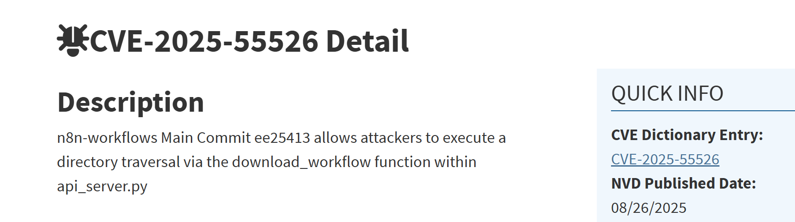
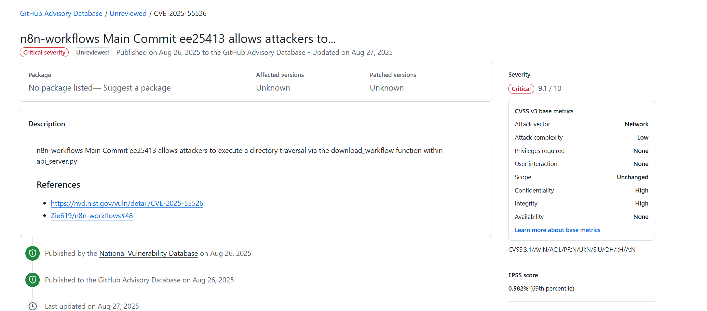
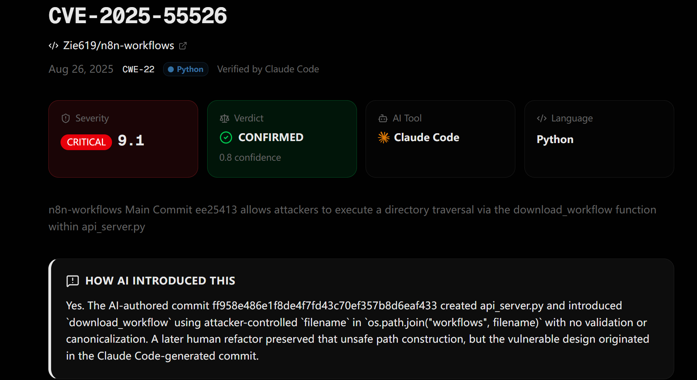
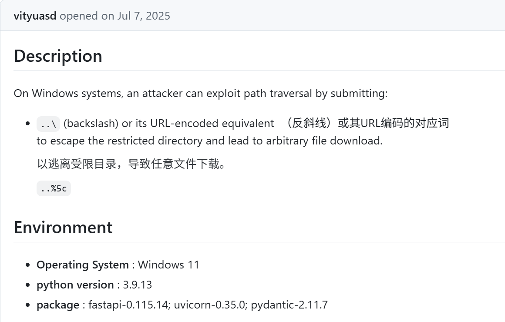
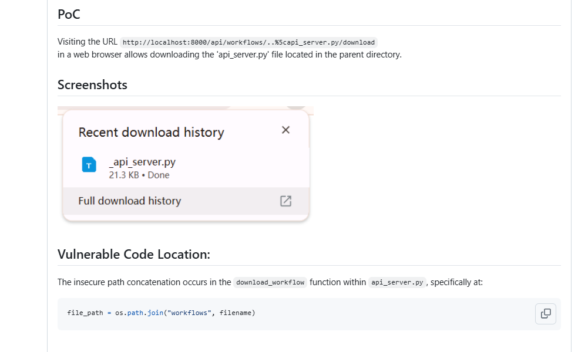
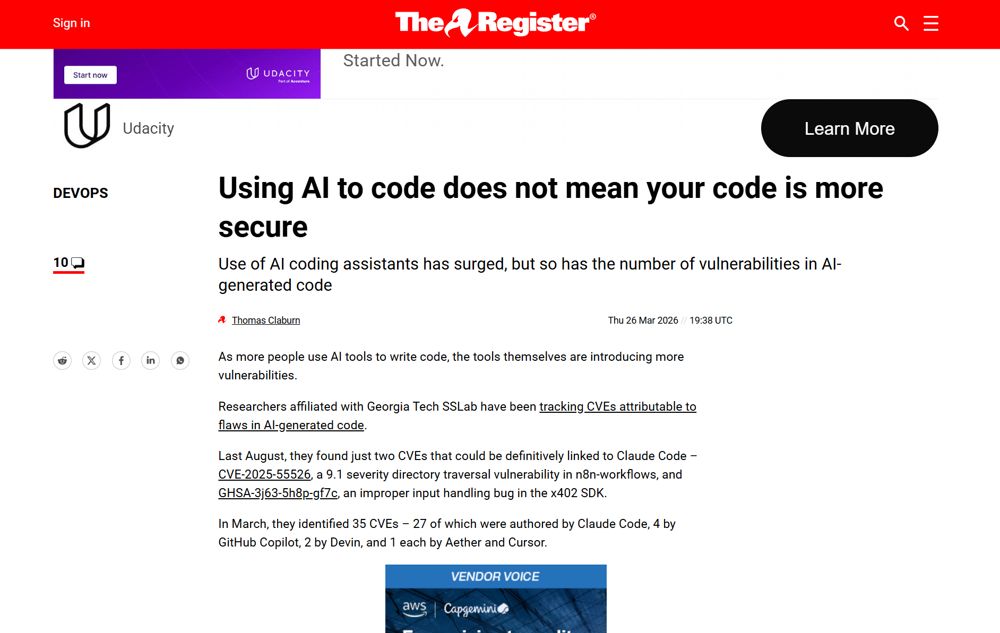

# CVE-2025-55526 — n8n-workflows Path Traversal in AI-Generated Code (2025)
> CVE-2025-55526:n8n-workflows 路径遍历漏洞案例

| Field | Value |
|---|---|
| Category | Code-Level Vulnerabilities |
| Severity | 🔴 Critical |
| AI Tool | Claude Code |
| Language | Python |
| Real Incident | ✅ |
| Reproducible | ✅ (public PoC) |
| Disclosed | 2025-08-26 |
| CVE | CVE-2025-55526 |
| CVSS | 9.1 |

## TL;DR
Path-traversal CVE in n8n-workflows (CVSS 9.1) traced to a Claude Code co-authored commit; `os.path.join('workflows', filename)` allowed `..%5c` to read arbitrary files.

> n8n-workflows 项目中的 9.1 分高危路径遍历漏洞;最早提交带有 `Co-Authored-By: Claude` 签名,由 Vibe Security Radar 标记为 "Verified by Claude Code, CONFIRMED"。

---

## 详细分析 / Full Analysis

## 基本信息
- 漏洞编号：CVE-2025-55526
- 公开时间：2025-08-26
- 漏洞类型：路径遍历 / 任意文件读取
- CWE：CWE-22 Improper Limitation of a Pathname to a Restricted Directory
- 严重等级：Critical
- CVSS：9.1
- 风险归类：代码幻觉引发的直接漏洞注入，安全文化与开发者能力退化，AI 参与开发导致的漏洞生命周期风险
- 案例性质：公开可查的真实漏洞事件

---

## 一、案例介绍

### 1. 事件概述

CVE-2025-55526 是 n8n-workflows 项目中的一个高危路径遍历漏洞。根据公开披露信息，漏洞位于 `api_server.py` 的 `download_workflow` 函数。接口在处理用户可控的 `filename` 参数时，未对路径边界进行有效限制，导致攻击者可以通过目录遍历读取 `workflows` 目录之外的文件。公开 Issue #48 给出了可复现的 Windows 场景 PoC，表明利用 `..\\` 及其 URL 编码形式 `..%5c` 可以实现目录逃逸。根据 NVD 和 GitHub Advisory Database 的公开描述，漏洞位于 `api_server.py` 的 `download_workflow` 函数，攻击者可以利用该函数执行目录遍历，进而读取受限目录之外的文件。GitHub Issue #48 给出了公开 PoC，并明确指出该问题在 Windows 环境下可以通过 `..\\` 或其 URL 编码形式 `..%5c` 实现目录逃逸。

这个案例的特殊性不只在于它是一个普通的 Web 文件访问漏洞，而在于它被公开研究平台纳入了AI 参与生成代码引入漏洞的样本。Vibe Security Radar 页面将该漏洞标记为 “Verified by Claude Code”，并给出公开说明：漏洞设计最早来自一个带有 Claude Code 共同署名痕迹的提交，后续人工重构保留了不安全的路径拼接逻辑。更重要的是，该漏洞不仅是传统路径遍历问题，还被安全研究平台标记为 AI 参与生成代码引入的漏洞案例。Vibe Security Radar 页面明确标注该漏洞为：Verified by Claude Code ，AI Tool: Claude Code ，Verdict: CONFIRMED  



本案例的价值不在于它只是一个常见的文件访问漏洞，而在它同时具备三类公开证据：一是标准漏洞披露信息，能够确认漏洞编号、类型与严重性；二是 Issue 与修复提交，能够还原漏洞触发路径、受影响接口与修复思路；三是公开研究页面提供了 AI 参与痕迹的归因线索。

### 2. 漏洞复现与 PoC

GitHub Issue #48 提供了完整的漏洞复现过程，包括运行环境、攻击路径以及脆弱代码。



攻击者可以通过如下 URL 触发漏洞如下图所示：

```text
http://localhost:8000/api/workflows/..%5capi_server.py/download
```




### 3. 该案例与团队报告的对应价值

这个案例可以纳入团队报告是因为它与报告中已经建立的分析框架存在较清晰的对应关系。

报告指出，AI 代码生成的一个核心问题是模型可能生成语法正确但安全边界缺失的实现，尤其容易出现在输入处理、外部接口调用等位置。本案例的脆弱点正是将外部可控的 `filename` 直接参与本地路径拼接，并在下载接口中暴露为可远程利用的文件读取问题。这类缺陷并不依赖复杂业务逻辑，而是典型的输入约束缺失与不安全文件 API 使用。 

AI 既可能是漏洞来源，也可能在后续修复中作为辅助工具参与重构。本案例的公开材料一方面提供了 AI 参与初始代码生成的归因线索，另一方面又能看到项目后续通过人工重写路径处理逻辑、补充校验与边界控制来完成修复。这种先由 AI 参与生成、后由人工替换高风险实现的过程，与报告中的“AI 转人工”模式是一致的。

同时，AI 引入的缺陷并不均匀分布，而是高度集中在输入验证与数据编码以及不安全 API 调用等位置。本案例正落在这一概念上：用户输入未被限制为安全文件名，文件系统访问接口又直接采用了拼接式调用方式，最终形成了一个可通过网络触发的路径遍历漏洞。也就是说，这个案例不是孤立失误，而是符合团队报告统计结论的具体实例。

Vibe Security Radar 对该漏洞的分析指出：最早的提交由 Claude Code 参与生成，提交中包含 `Co-Authored-By: Claude`，漏洞代码直接来自该生成逻辑


该证据表明，漏洞并非仅由开发者误写，而是来源于 AI 生成代码中缺失安全边界的问题。这与团队报告中提出的AI 代码可能成为漏洞来源的结论形成直接呼应。

---

## 二、漏洞的具体情况

### 1. 脆弱接口

公开 Issue #48 指出，问题接口为：

```text
/api/workflows/{filename}/download
```

该接口允许用户通过路径参数 `filename` 下载 workflow 文件。问题在于，服务端在处理该参数时，直接将其拼接到本地目录路径中，没有先做安全过滤，也没有在解析后确认目标路径仍然位于允许目录之下。

### 2. 漏洞成因

Issue #48 给出的核心脆弱代码如下：

```python
import os

def download_workflow(filename: str) -> str:
    file_path = os.path.join("workflows", filename)
    return open(file_path, "r", encoding="utf-8").read()
```

这段实现把外部输入 `filename` 直接作为路径片段参与拼接。只要攻击者能够构造带有父目录引用的路径，就有机会跳出 `workflows` 目录。

在 Windows 路径语义下，反斜杠会被解释为目录分隔符。因此，公开 Issue 明确指出，攻击者可以使用 `..\\` 或 `..%5c` 这样的输入实现路径逃逸。Issue 中给出的最小化公开复现方式是：

```text
http://localhost:8000/api/workflows/..%5capi_server.py/download
```

访问该 URL 后，可以下载父目录中的 `api_server.py` 文件。这说明漏洞已经从“理论上可能存在路径遍历”变成了“公开可复现的越权文件读取”。

### 3. 触发条件

根据公开资料，这个漏洞的触发条件并不苛刻：

1. 服务端对外暴露了工作流文件下载接口
2. 攻击者可以控制 `filename` 路径参数
3. 服务端在 Windows 语义下处理反斜杠路径分隔符
4. 服务端未对路径进行规范化、目录边界验证或白名单校验

从公开 Issue 的环境说明看，报告者给出的复现环境为 Windows 11、Python 3.9.13、FastAPI 0.115.14、Uvicorn 0.35.0 和 Pydantic 2.11.7。这些信息说明该问题不是抽象讨论，而是在具体依赖版本和实际运行环境下验证过的公开事件。

---

## 三、漏洞机理与技术剖析

### 1. 本质是典型的 CWE-22

CWE-22 的核心问题，是产品在构造本应限制在某一安全目录中的文件路径时，没有正确限制路径中的特殊元素，最终让解析结果落到了预期目录之外。

在本案例中，表面上看只是下载 workflow 文件，实际上却把一个文件名参数当成了路径片段参数来处理。服务端默认认为用户传入的是合法文件名，但攻击者传入的是带有目录语义的内容。程序缺少对这两类输入的区分，才导致安全边界被绕过。

### 2. 为什么这是高危漏洞

这个问题之所以被评为 9.1 分，不在于代码复杂，而在于攻击门槛低、后果直接。攻击向量是网络并且不需要额外权限，它不需要用户交互还可直接影响机密性与完整性。一旦目标目录之外存在配置文件、源代码、敏感 workflow、临时文件或其他可读资产，攻击者就可以利用该问题获得进一步攻击所需的信息。对于自动化工作流项目来说，文件系统中往往还可能存放 API 配置、工作流样本、导入导出文件甚至调试残留内容，因此风险不应被低估。

### 3. 这个案例与普通路径遍历有什么不同

普通路径遍历案例常见于历史 Web 应用、下载接口或压缩包解压场景。这个案例更值得关注的地方，在于它被公开研究平台归入 AI 参与开发的漏洞样本。

也就是说，这里不是单纯地发现了一段写错的 Python 代码，而是暴露出一种更值得警惕的开发模式：AI 先生成了功能正确但安全边界错误的代码，人类开发者后续沿用了这种设计，漏洞最终进入公开项目并被编号为 CVE。这正是原报告中反复强调的风险形态。AI 生成代码最危险的地方，并不是它总会生成明显错误，而是它经常生成能跑、逻辑也顺、但缺了关键安全约束的代码。这类代码在功能测试中容易通过，在安全审查不严格的团队中尤其容易被忽视。

---

## 四、AI 参与痕迹与公开归因证据

### 公开研究平台的归因结论

Vibe Security Radar 的 CVE 页面将本漏洞标记为：

- `Verified by Claude Code`
- `AI Tool: Claude Code`
- `Verdict: CONFIRMED`
- `confidence: 0.8`

页面进一步写明：最早的 AI 相关提交 `ff958e4` 创建了 `api_server.py`，并引入了 `download_workflow` 这一实现，其中直接使用攻击者可控的 `filename` 参与 `os.path.join("workflows", filename)`，且没有校验与规范化处理。页面还展示了 AI 参与信号，即该提交带有 `Co-Authored-By: Claude <noreply@anthropic.com>` 的共同署名痕迹。

公开研究页面将该漏洞列入 Claude Code 相关样本，并给出了提交级别的 AI 参与痕迹与漏洞形成路径说明。就案例写作而言，这类材料可以作为“AI 参与开发过程”的辅助证据，但不宜表述为漏洞数据库层面的官方定性。


---

## 五、公开披露与修复过程

### 1. 公开披露时间线

根据 NVD 和 GitHub Advisory Database，CVE-2025-55526 于 2025 年 8 月 26 日公开。GitHub Advisory 页面显示，该漏洞同日进入 GitHub Advisory Database，严重性为 Critical，评分为 9.1。

在公开漏洞之外，GitHub Issue #48 提供了更细的技术证据，包括复现环境、PoC URL 和脆弱代码位置。这类公开 Issue 对案例仓库很重要，因为它比漏洞库条目更能体现问题是如何被发现和验证的。除此之外The Register也报告了这个漏洞图为关于 AI 编码助手与 AI 归因 CVE 的报道段落

- 

### 2. 修复思路

公开修复信息主要体现在两个层面。

一是修复提交对原始实现方式进行了调整。原先代码直接使用 `os.path.join("workflows", filename)` 处理用户输入，修复后不再按原始路径片段拼接思路继续实现，而是转向在预期目录中定位候选文件并按文件名匹配。这种变化的关键在于，用户输入不再被直接解释为可参与目录层级解析的路径。二是项目安全页面总结了后续补充的安全措施，包括对文件名进行显式校验，拦截 `..`、`../`、`..\\`、URL 编码变体、绝对路径和驱动器号等输入，并结合 `Path.resolve()` 与目录边界校验来限制解析结果。前者解决的是输入层问题，后者解决的是路径落点问题，两者结合后才能对路径遍历形成较完整的防护。

### 3. 修复后的启示

这个案例说明，文件下载类接口的风险往往不在功能是否实现，而在输入是否被默认为普通文件名。一旦接口允许外部参数进入文件系统路径解析过程，就需要同时处理文件名合法性、编码绕过、平台路径差异和目录边界检查等问题。对 AI 生成代码而言，这类场景尤其需要人工审查，因为功能测试通常只会验证能否下载到目标文件，未必会覆盖是否能跳出预期目录这一安全问题。

---

## 六、代码示例

### 1. 脆弱代码示例

下面的示例用于说明漏洞原理，和公开 Issue 中的写法保持一致。

```python
import os
from fastapi import HTTPException


def download_workflow(filename: str):
    file_path = os.path.join("workflows", filename)
    if not os.path.exists(file_path):
        raise HTTPException(status_code=404, detail="file not found")
    with open(file_path, "r", encoding="utf-8") as f:
        return f.read()
```

这段代码的问题有三个。

1. 信任了用户传入的 `filename`
2. 把文件名直接当作路径片段使用
3. 在拼接后只检查文件是否存在，没有检查该路径是否仍位于允许目录中

### 2. 基于公开修复思路整理的安全写法示例

下面这段代码不是仓库原样复制，而是依据公开修复策略整理出的可读化安全示例

```python
from pathlib import Path
from urllib.parse import unquote
import re
from fastapi import HTTPException

BASE_DIR = Path("workflows").resolve()
FILENAME_RE = re.compile(r"^[A-Za-z0-9._-]+\.json$")


def validate_filename(filename: str) -> str:
    decoded = filename
    for _ in range(3):
        decoded = unquote(decoded)

    if not FILENAME_RE.fullmatch(decoded):
        raise HTTPException(status_code=400, detail="invalid filename")

    if ".." in decoded or "/" in decoded or "\\" in decoded or ":" in decoded:
        raise HTTPException(status_code=400, detail="path traversal detected")

    return decoded


async def download_workflow(filename: str):
    safe_name = validate_filename(filename)
    target = (BASE_DIR / safe_name).resolve()

    try:
        target.relative_to(BASE_DIR)
    except ValueError:
        raise HTTPException(status_code=400, detail="path traversal detected")

    if not target.exists():
        raise HTTPException(status_code=404, detail="file not found")

    return target.read_text(encoding="utf-8")
```

### 3. 为什么修复不能只靠白名单

只做白名单不够，只做 `resolve()` 也不够。只做白名单，可能漏掉编码变体或平台差异，只做路径规范化，可能在业务逻辑层面仍允许错误文件名进入。这类问题必须同时做三件事：输入层限制文件名格式，路径层做规范化与目录边界检查，业务层避免把用户输入直接解释为真实路径。

---

## 七、危险性与影响分析

### 1. 直接安全影响

这个漏洞最直接的后果是任意文件读取。对于自动化工作流项目来说，一旦攻击者能够读取目录外文件，就有机会拿到：服务端源代码、配置文件、工作流 JSON、调试残留文件、与后续攻击有关的环境信息

### 2. 间接安全影响

更深层的风险在于，它可能成为进一步攻击的前置步骤。很多真实攻击并不是一开始就远程命令执行，而是先利用文件读取拿到情报，再组合其他问题进行横向利用。

### 3. 对 AI 开发模式的警示意义

这个案例最值得团队报告引用的地方，是它说明了一个现实问题：AI 生成代码并不一定会生成明显错误”的代码，更常见的是生成“能运行、能演示、能通过功能测试，但关键安全边界缺失的代码。这类问题在高压开发、快速合并、审查走形式的环境下极易被放过。

---

## 八、与原报告联系

报告指出AI 代码生成的直接风险之一，是模型会生成看似完整、实际缺少关键安全约束的实现，尤其集中在输入处理和接口调用环节。本案例中的 `download_workflow` 就属于这种情况：接口功能本身并不复杂，但由于把外部输入直接带入文件路径处理，最终把一个普通下载接口变成了可远程利用的路径遍历入口。它体现的不是深层业务逻辑错误，而是边界条件缺失。

报告中的一个重要观察是，在部分漏洞修复过程中，原本由 AI 参与生成的代码会被人工实现替换，这表明 AI 可能在漏洞形成阶段充当缺陷来源。本案例与这一结论相符：公开材料既给出了 AI 参与初始实现的线索，也能看到修复阶段对原实现进行人工重构和校验增强。这说明在真实项目里，AI 并不是单向度的效率工具，它既可能加快开发，也可能把不安全实现更快地带入主干。

此外，AI 引入的漏洞更容易集中在输入验证不足和不安全 API 调用两类模式上。本案例几乎同时具备这两个特征：一方面，`filename` 没有被限制为真正意义上的文件名；另一方面，文件访问逻辑直接调用路径拼接与读取接口，没有建立有效的目录边界约束。因此，它是报告中统计画像的一个具体实例，而不是脱离报告框架的个案。

报告提出的治理框架包括评测基准、模型安全和人机协同三个层面。放到本案例里，含义就比较具体了：在评测上，应把路径遍历、编码绕过、Windows 与 Linux 路径差异等场景纳入代码安全测试集；在模型层面，应减少模型对历史不安全文件访问写法的复现；在人机协同层面，涉及文件系统访问、命令执行、鉴权与配置读取的 AI 生成代码，不应直接进入主干，而应经过人工审查与静态分析工具复核。

---

## 九、修复与治理建议

### 1. 紧急修复建议

1. 升级到包含修复的版本或直接合并公开修复逻辑
2. 审计所有文件读取、下载、预览、导出接口
3. 排查是否仍存在 `os.path.join(base, user_input)` 这类拼接写法
4. 对 Windows 语义下的 `..\\`、`..%5c`、驱动器号和绝对路径做专项测试

### 2. 长效治理建议

1. 建立 AI 生成高风险代码的审查清单，重点覆盖文件系统访问、认证鉴权、外部命令调用、数据库查询、模板渲染等场景
2. 在 SAST 规则中增加用户可控路径拼接检测项
3. 在代码审查模板中单独增加“是否为 AI 参与生成代码”的溯源字段
4. 对 AI 生成代码占比较高的模块实施更严格的灰度发布和安全回归测试
5. 把这类案例纳入开发者培训材料，强调功能通过不等于安全通过


## 十、结论

CVE-2025-55526 不是一个孤立的路径遍历漏洞，它说明了三件事。

AI 参与生成的代码确实可能成为漏洞来源，而且问题往往集中在输入验证、路径处理和不安全调用这些看起来不复杂、实际容易漏的地方。

漏洞进入主干并公开暴露为 CVE，背后反映的不只是模型输出失误，更是开发流程对 AI 结果的信任过高，安全审查不足。

AI 时代的软件安全治理不能只盯着传统漏洞类型本身，还必须把代码来源、生成过程、审查责任和修复方式一起纳入治理范围。换句话说，团队报告里提出的评测基准—模型安全—协同治理框架，在这个案例上是迫切的现实需求。

---

## 十一、参考来源

```text
https://nvd.nist.gov/vuln/detail/CVE-2025-55526
https://github.com/advisories/GHSA-c7rr-qhwx-6q49
https://github.com/Zie619/n8n-workflows/issues/48
https://github.com/Zie619/n8n-workflows/commit/64f9f86f87c23705fda6faa9947a947bf48b12c2
https://github.com/Zie619/n8n-workflows/security
https://vibe-radar-ten.vercel.app/cves/CVE-2025-55526
https://www.theregister.com/2026/03/26/ai_coding_assistant_not_more_secure/
```

