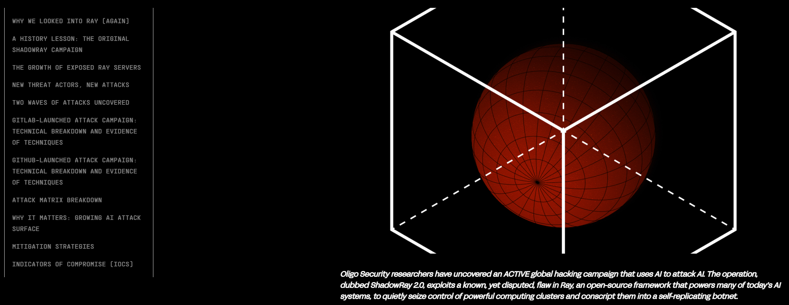
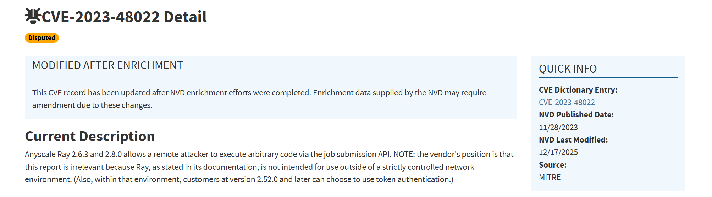
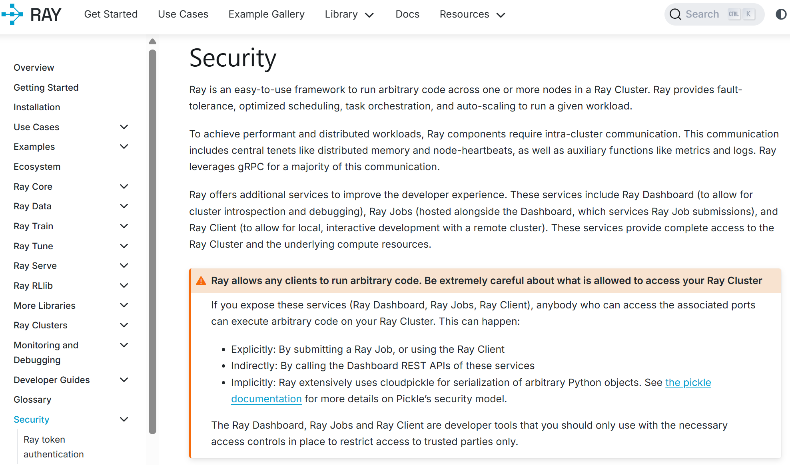
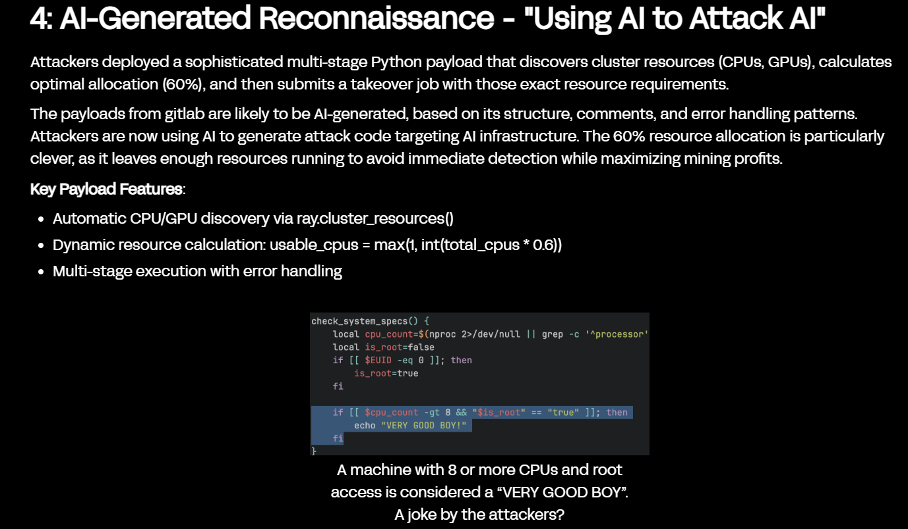
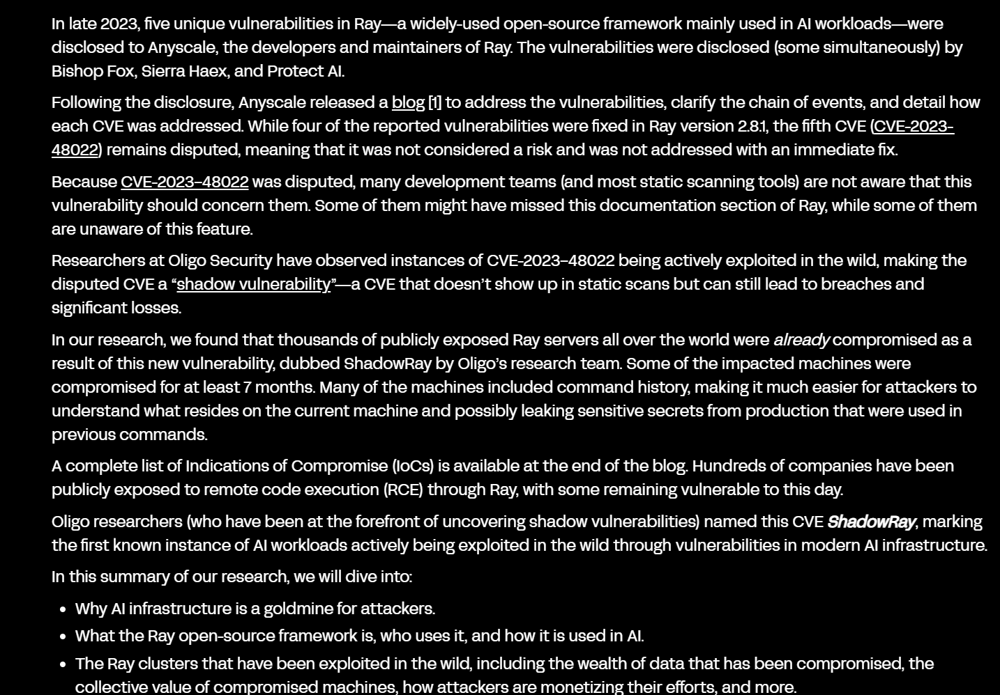
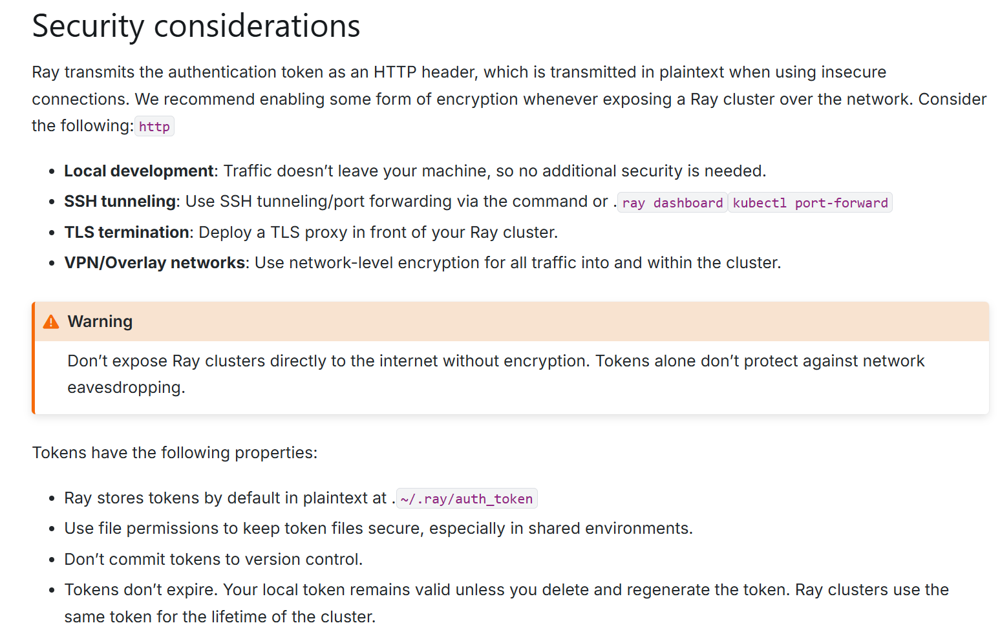
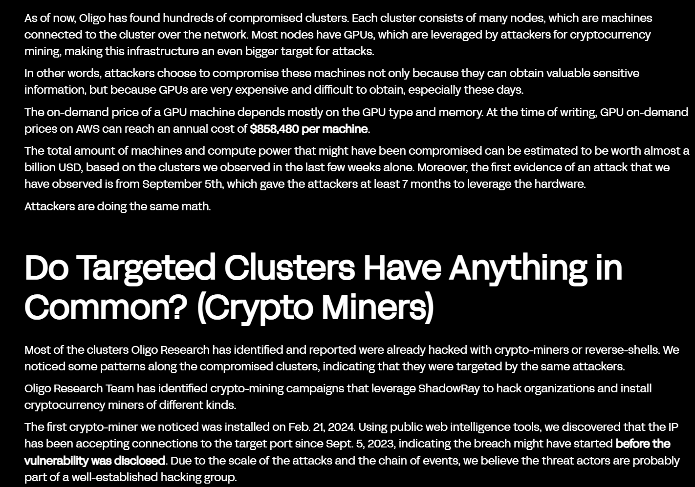
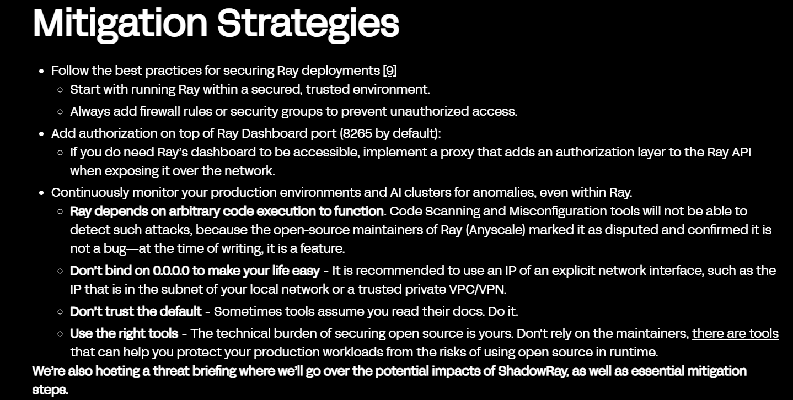

# ShadowRay 2.0 Ray AI Cluster Botnet (2025)

> ShadowRay 2.0：Ray AI 集群被劫持为自传播 Botnet 事件

| Field         | Value                            |
| ------------- | -------------------------------- |
| Category      | Cloud & IaC Misconfiguration     |
| Severity      | 🔴 Critical                       |
| AI Tool       | Ray, Ray Jobs API, Ray Dashboard |
| Language      | Python                           |
| Real Incident | ✅                                |
| Reproducible  | ❌                                |
| Disclosed     | 2025-11-18                       |
| CVE           | CVE-2023-48022                   |
| CVSS          | 9.8                              |

## TL;DR

ShadowRay 2.0 hijacked exposed Ray AI clusters into cryptomining and DDoS botnets.

> ShadowRay 2.0 利用暴露在公网的 Ray AI 集群，通过未认证 Jobs API 执行代码，将 AI/ML 计算资源变成挖矿、反连、横向传播和 DDoS 的 botnet 节点。

------

## 详细分析 / Full Analysis

# ShadowRay 2.0 事件分析：AI/ML 计算集群暴露后的自传播 Botnet 风险

## 基本信息

案例时间：2024 年首次披露，2025 年 11 月 ShadowRay 2.0 活动再次公开
事件对象：Ray 开源 AI/ML 分布式计算框架，暴露到公网的 Ray Dashboard 与 Ray Jobs API
漏洞编号：CVE-2023-48022
漏洞类型：未认证远程代码执行，AI/ML 集群暴露，云计算资源劫持
影响范围：Oligo Security 在 2024 年披露 ShadowRay 时称，数千台公开暴露 Ray 服务器已经受到影响；2025 年 ShadowRay 2.0 报告进一步指出，公网暴露的 Ray 服务器数量已经增长到 230,000 台以上，攻击者将集群用于挖矿、反连、数据窃取、自传播和 DDoS。([Oligo Security](https://www.oligo.security/blog/shadowray-attack-ai-workloads-actively-exploited-in-the-wild))
风险归类：AI/ML 基础设施暴露，云与 IaC 配置错误，未认证计算集群远程执行，GPU/CPU 资源劫持
案例定位：本案例可作为团队报告中 AI 安全风险从代码生成、Agent 工具调用和 AI 应用平台，进一步扩展到 AI/ML 计算基础设施暴露面的补充案例。

## 摘要

ShadowRay 是 Oligo Security 在 2024 年披露的 Ray AI 工作负载在野攻击活动。Ray 是用于扩展 Python、AI 和机器学习工作负载的开源分布式计算框架，常被部署到云端集群中运行训练、推理、调参和批处理任务。CVE-2023-48022 指向 Ray Jobs API 中的未认证远程代码执行问题。NVD 对该漏洞的描述显示，Anyscale Ray 2.6.3 和 2.8.0 允许远程攻击者通过 Job submission API 执行任意代码，CVSS 3.1 评分为 9.8 Critical。([NVD](https://nvd.nist.gov/vuln/detail/cve-2023-48022))

这起事件的特殊性在于，它不是某个 AI Agent 被提示注入，也不是 AI 生成代码出现漏洞，而是 AI 计算基础设施本身被暴露到不可信网络。Ray 官方文档写得很直接：Ray 允许客户端在集群上运行任意代码，如果暴露 Ray Dashboard、Ray Jobs 或 Ray Client，任何能访问相关端口的人都可以在 Ray 集群上执行任意代码；Ray 期望运行在安全网络环境中，隔离和访问控制需要在 Ray 集群外部实现。([Ray](https://docs.ray.io/en/latest/ray-security/index.html))

2025 年 11 月，Oligo 再次披露 ShadowRay 2.0。该活动被描述为一个主动全球攻击行动，攻击者利用同一类暴露面劫持 Ray 集群，将其变成自传播 botnet。攻击者使用 GitLab 与 GitHub 托管区域化恶意载荷，通过 Ray 的调度能力在集群节点间横向传播，部署 XMRig 和 GPU 挖矿程序，开启反向 shell，隐藏进程，并在部分实例上使用 sockstress 发起 DDoS。Oligo 还指出，攻击者疑似使用 LLM 生成多阶段攻击代码，用来加速和适配针对 AI 基础设施的攻击。([Oligo Security](https://www.oligo.security/blog/shadowray-2-0-attackers-turn-ai-against-itself-in-global-campaign-that-hijacks-ai-into-self-propagating-botnet))

## 一、事件核验与证据边界

NVD 记录了 CVE-2023-48022 的漏洞描述和 CVSS 9.8 Critical 评分，同时保留了供应商立场说明：Ray 被设计用于严格受控的网络环境中，不应暴露到不可信网络。([NVD](https://nvd.nist.gov/vuln/detail/cve-2023-48022)) Ray 官方安全文档也承认了同一安全假设：Ray 允许任意客户端在集群上运行任意代码，Ray Dashboard、Ray Jobs 和 Ray Client 都应只对受信任方开放，网络隔离和认证授权应由部署方维护。([Ray](https://docs.ray.io/en/latest/ray-security/index.html))

Oligo 的 2024 报告提供了在野利用证据。报告称其发现一个活跃攻击活动，目标是暴露在公网的 Ray AI 工作负载，数千台公开暴露服务器已经被攻陷，部分机器至少被入侵 7 个月。Oligo 还提到，部分受影响机器包含命令历史，这使攻击者更容易了解机器上存放的数据，也可能泄露生产环境中此前使用过的敏感信息。([Oligo Security](https://www.oligo.security/blog/shadowray-attack-ai-workloads-actively-exploited-in-the-wild))

2025 年的 ShadowRay 2.0 不是简单报告旧问题。Oligo 报告称，攻击者 IronErn440 继续利用同一缺陷，并将 Ray 的合法编排能力转化为自动传播手段。攻击载荷从 GitLab 迁移到 GitHub，恶意代码会发现集群资源、计算可用 CPU/GPU 比例、投递挖矿程序、打开反向 shell、伪装进程，还会扫描和感染新的 Ray 集群。BleepingComputer 和 SecurityWeek 对该活动做了独立报道，均确认 ShadowRay 2.0 正在利用 CVE-2023-48022 劫持公网 Ray 集群。([BleepingComputer](https://www.bleepingcomputer.com/news/security/new-shadowray-attacks-convert-ray-clusters-into-crypto-miners/))

本案例不是普通意义上已经由厂商承认并修复的产品漏洞事故。Ray 维护方的核心立场是，Ray 不应在不受控网络环境中使用，暴露 Dashboard 和 Jobs API 本身就是危险部署。NVD 后续记录也提到，Ray 2.52.0 之后可以选择启用 token authentication，但 token authentication 并不是默认完全替代网络隔离的方案。([Ray](https://docs.ray.io/en/latest/ray-security/token-auth.html)) 因此，本案例应被定义为 **AI/ML 基础设施暴露面被真实攻击者长期利用的安全事件**，不是单纯的软件补丁缺失，也不是普通云配置错误。

## 二、系统背景与触发条件

Ray 的设计目标是让开发者在一个或多个节点上运行任意 Python 代码。它提供任务调度、资源管理、容错、自动扩缩容和分布式执行能力。这个能力对 AI 训练和推理很有价值，也天然意味着高权限。Ray 官方文档写明，Ray faithfully executes code that is passed to it，不会区分调参任务、rootkit 安装还是 S3 bucket inspection。([Ray](https://docs.ray.io/en/latest/ray-security/index.html))

攻击入口通常是暴露到公网的 Ray Dashboard 或 Ray Jobs API。Jobs API 本来用于提交分布式任务。若该接口没有被网络边界、认证代理或 token authentication 保护，任何能够访问端口的人都可以提交作业，让 Ray 集群执行命令。NVD 对 CVE-2023-48022 的描述正是通过 job submission API 触发任意代码执行。([NVD](https://nvd.nist.gov/vuln/detail/cve-2023-48022))

Ray 的安全模型长期依赖受控网络。文档要求 Ray Dashboard、Ray Jobs 和 Ray Client 这些开发者工具只能在必要访问控制下对受信任方开放；同时强调 TLS 不是网络隔离的替代方案。Ray 2.52.0 之后提供 token authentication，但文档仍提示 token authentication 只是防御纵深措施，不是将集群直接暴露到互联网的理由。([Ray](https://docs.ray.io/en/latest/ray-security/index.html))

实际部署中，这条边界经常失守。Oligo 在 2024 年报告中称，数千台公开暴露 Ray 服务器受到影响。2025 年报告进一步指出，公网暴露 Ray 服务器数量已经超过 230,000 台，相比初次 ShadowRay 发现时的几千台显著增长。([Oligo Security](https://www.oligo.security/blog/shadowray-attack-ai-workloads-actively-exploited-in-the-wild)) Censys 在 2024 年 3 月也发布过针对 CVE-2023-48022 的外部暴露面 advisory，记录到当时全球仍有受影响主机，并将该问题与 Oligo 报告中的大规模 compromise 联系起来。([Censys](https://censys.com/advisory/cve-2023-48022/))

## 三、攻击链路与处置过程

ShadowRay 2.0 的攻击链从公开 Ray 端口开始。攻击者扫描可访问的 Ray Dashboard 或 Jobs API，提交测试 payload 进行 OAST 回连验证，确认可执行后再投递完整恶意脚本。Oligo 报告写到，攻击者使用 GitLab 和 GitHub 托管 payload，并在 GitLab 账号被移除后迁移到 GitHub 继续活动。([Oligo Security](https://www.oligo.security/blog/shadowray-2-0-attackers-turn-ai-against-itself-in-global-campaign-that-hijacks-ai-into-self-propagating-botnet))

进入集群后，攻击者利用 Ray 的合法调度能力横向传播。Oligo 报告中的代码片段显示，攻击者枚举 `ray.nodes()` 中所有存活节点，然后使用 `NodeAffinitySchedulingStrategy` 将恶意任务 pin 到每个节点执行。换句话说，攻击者并不需要在每个节点上重新打漏洞，Ray 自己的编排能力就能把恶意作业推到整个集群。([Oligo Security](https://www.oligo.security/blog/shadowray-2-0-attackers-turn-ai-against-itself-in-global-campaign-that-hijacks-ai-into-self-propagating-botnet))

攻击载荷分成多个阶段。早期阶段做资源发现，检查 CPU、GPU、NVIDIA 设备和内存。后续阶段下载 XMRig 或 GPU 矿工，配置约 60% 资源占用来降低被发现概率，伪装成 `kworker/0:0`、`dns-filter` 或 `.python3.6` 这类看似正常的系统进程。Oligo 还观察到多个犯罪组争夺同一批计算资源，脚本会杀掉竞争矿工，修改 `/etc/hosts` 和 `iptables` 阻止竞争矿池连接。([Oligo Security](https://www.oligo.security/blog/shadowray-2-0-attackers-turn-ai-against-itself-in-global-campaign-that-hijacks-ai-into-self-propagating-botnet))

攻击活动不止挖矿。Oligo 报告称攻击者建立多个反向 shell 到 AWS 托管的 C2，使用 GitHub/GitLab 作为 payload 更新平台，在部分实例上发现模型权重、源代码和用户数据可能被窃取，还观察到 sockstress 被用于发起 TCP 状态耗尽类 DDoS。BleepingComputer 也复核了该点，称 ShadowRay 2.0 不只包含加密货币挖矿，还涉及数据和凭据窃取以及 DDoS。([Oligo Security](https://www.oligo.security/blog/shadowray-2-0-attackers-turn-ai-against-itself-in-global-campaign-that-hijacks-ai-into-self-propagating-botnet))

处置上，GitLab 在收到 Oligo 报告后移除了攻击者仓库和账户，但攻击者随后迁移到 GitHub，继续维护 payload。Oligo 报告显示，这个活动在披露时仍然活跃。([Oligo Security](https://www.oligo.security/blog/shadowray-2-0-attackers-turn-ai-against-itself-in-global-campaign-that-hijacks-ai-into-self-propagating-botnet)) 这种迁移方式说明，问题不只是单个恶意仓库。真正长期存在的是暴露在公网的 Ray 集群和没有强制认证的执行面。

## 四、技术根因分析

ShadowRay 2.0 的根因不是某个复杂 exploit，而是 AI/ML 集群把高权限执行接口暴露给了不可信网络。Ray 的 Jobs API 设计目标就是接受任务并在集群上执行。攻击者获得访问权后，不需要绕过业务逻辑，直接把恶意任务提交进去即可。NVD 将该问题描述为通过 job submission API 远程执行任意代码。([NVD](https://nvd.nist.gov/vuln/detail/cve-2023-48022))

Ray 的安全假设与现实部署之间存在断层。Ray 文档明确要求在受控网络中运行，并要求用网络控制、外部认证代理或 token authentication 保护访问面。现实中，Ray 集群经常作为 AI 训练或推理基础设施被部署在云上，Dashboard 和 Jobs API 为了调试、运维或远程提交任务被开放。这个开放动作一旦缺少身份验证，就把 Ray 集群从内部计算平台变成了远程代码执行服务。([Ray](https://docs.ray.io/en/latest/ray-security/index.html))

供应商争议也加剧了治理难度。CVE-2023-48022 在 NVD 中被标记为 disputed，原因是供应商认为 Ray 本来就不应在严格受控网络之外使用。Oligo 将这种情况称为 shadow vulnerability：它可能不会被某些静态扫描和漏洞管理流程作为必须修复项处理，但在现实中仍然导致 compromise 和损失。([Oligo Security](https://www.oligo.security/blog/shadowray-attack-ai-workloads-actively-exploited-in-the-wild))

Ray 2.52.0 引入 token authentication 后，问题有所缓解，但默认安全边界仍要靠部署方维护。Ray token authentication 文档说明，启用 token authentication 需要设置 `RAY_AUTH_MODE=token`，且 authentication disabled by default in Ray 2.52.0。文档同时警告，不要在没有加密的情况下直接将 Ray cluster 暴露到网络，tokens 本身也不会过期，并且默认以明文存储在 `~/.ray/auth_token`。([Ray](https://docs.ray.io/en/latest/ray-security/token-auth.html))

## 五、AI 参与证据与责任边界

本案例的 AI 关联来自三个层面。Ray 是 AI/ML 工作负载的重要分布式执行框架，官方文档中也列出 Ray Train、Ray Serve、LLM serving、MCP deployment、多 Agent 系统等 AI 使用场景。([Ray](https://docs.ray.io/en/latest/ray-security/index.html)) 攻击目标不是普通 Web 服务器，而是承载训练、推理、批处理和模型服务的 AI 计算集群。

ShadowRay 2.0 还被 Oligo 描述为 use AI to attack AI。Oligo 的分析认为，攻击者 payload 很可能由 LLM 生成，因为其结构、注释和错误处理模式都带有这种痕迹。攻击代码会自动发现集群资源，计算可用 CPU/GPU 分配比例，再用 Ray 调度能力提交接管任务。([Oligo Security](https://www.oligo.security/blog/shadowray-2-0-attackers-turn-ai-against-itself-in-global-campaign-that-hijacks-ai-into-self-propagating-botnet)) ShadowRay 2.0 是攻击者疑似使用 LLM 辅助生成和迭代 payload、并专门攻击 AI 计算基础设施的事件。

CVE-2023-48022 存在供应商争议，Ray 的官方立场强调它必须运行在安全网络环境中。部署方如果把 Dashboard 和 Jobs API 直接暴露到互联网，本身就违反了安全文档中的基本假设。与此同时，ShadowRay 的现实利用说明，仅把任意代码执行能力写进文档警告并不足以在大规模生态中防止误暴露。对安全治理而言，这不是谁单独负责的问题，而是开源 AI 基础设施、云部署习惯、默认认证策略和组织资产管理共同形成的风险。

## 六、与团队技术报告风险框架的关系

团队报告关注 AI 代码生成从局部补全扩展到软件开发全生命周期后的风险外溢。ShadowRay 2.0 的补充价值在于，它把风险对象从代码、插件、Agent 和模型路由继续推进到 AI/ML 计算基础设施。Ray 集群通常不是终端用户直接面对的 AI 产品，却是训练、推理和数据处理背后的执行层。一旦这个层级暴露，攻击者获得的不是一段代码的执行机会，而是整组 CPU/GPU 资源和内部数据环境。

这个案例与 Cloud & IaC Misconfiguration 接近。ShadowRay 2.0 不同于 S3 配置错误，它展示的是 AI/ML 集群执行面被暴露后，攻击者通过正常调度接口运行恶意工作负载。它更适合作为 AI 计算基础设施暴露风险的代表样本。([GitHub](https://github.com/Narwhal-Lab/Narwhal-aicode-risks/tree/main/cases))

Ray 的设计假设是受控网络，现实部署却经常为了调试、远程提交或云端协作打开端口。平台文档中的警告没有自动变成部署约束。对企业来说，这和团队报告中软件供应链边界重塑的判断是一致的：AI 系统的安全边界不止代码仓库和模型输出，还包括训练/推理集群、调度 API、Dashboard、GPU 资源和内部数据挂载路径。

这个案例还说明，AI 工作负载被攻击后的损失形态更接近云资源与数据双重风险。攻击者可以挖矿，可以读文件，可以偷模型，可以部署 DDoS 工具，也可以用 Ray 的调度机制继续扩散。它不是一个单点漏洞，而是一条从公网暴露面进入 AI 基础设施内部的执行通道。

## 七、影响范围与社会后果

ShadowRay 2.0 的影响首先体现在计算资源被盗用。Oligo 报告称，攻击者部署 XMRig 和 GPU miner，专门寻找 NVIDIA GPU，尤其是 A100 这类高价值计算资源。云平台上 A100 GPU 的成本可达每小时数美元，攻击者通过隐藏 GPU 利用率和限制资源占用，尽量降低被运维人员发现的概率。([Oligo Security](https://www.oligo.security/blog/shadowray-2-0-attackers-turn-ai-against-itself-in-global-campaign-that-hijacks-ai-into-self-propagating-botnet))

数据风险同样存在。Oligo 在 2025 年报告中提到，部分受害实例上存在模型文件，例如 PyTorch pickle 格式的模型权重和 frozen graph。这类专有模型可能是公司竞争优势。攻击者一旦控制机器，除了挖矿，还可能窃取模型、源代码和用户数据。([Oligo Security](https://www.oligo.security/blog/shadowray-2-0-attackers-turn-ai-against-itself-in-global-campaign-that-hijacks-ai-into-self-propagating-botnet)) 2024 年 ShadowRay 报告也提到，部分机器包含命令历史，可能泄露生产环境中使用过的敏感秘密。([Oligo Security](https://www.oligo.security/blog/shadowray-attack-ai-workloads-actively-exploited-in-the-wild))

业务可用性也会受到影响。攻击者会消耗 CPU/GPU，杀掉合法任务或竞争矿工，伪装为系统进程，还可能部署持久化脚本。对于依赖 Ray 运行训练、批处理、调参或模型服务的团队来说，这意味着任务失败、训练中断、云账单异常和模型服务性能下降。BleepingComputer 报道也指出，ShadowRay 2.0 不只挖矿，还涉及数据和凭据窃取，以及 DDoS 活动。([BleepingComputer](https://www.bleepingcomputer.com/news/security/new-shadowray-attacks-convert-ray-clusters-into-crypto-miners/))

ShadowRay 2.0 还具备自传播特征。Oligo 报告称，受害 Ray 集群被用来扫描其他暴露 Dashboard，并通过 interact.sh 回连确认可利用目标，再发送完整 payload。这个过程将被攻陷集群变成继续寻找新目标的节点。([Oligo Security](https://www.oligo.security/blog/shadowray-2-0-attackers-turn-ai-against-itself-in-global-campaign-that-hijacks-ai-into-self-propagating-botnet)) 这类传播方式与传统云主机挖矿不同，它利用的是 AI/ML 编排框架本身的调度和集群管理能力。

## 八、治理建议

治理重点不是简单升级某个包。Ray 的核心安全假设是受控网络，暴露公网才是主要触发条件。所有运行 Ray 的组织应先做资产盘点，确认 Dashboard、Jobs API、Ray Client、Ray Serve 等端口没有对互联网开放。Censys 和 Oligo 的报告都说明，外部暴露面是攻击者发现目标的关键。([Censys](https://censys.com/advisory/cve-2023-48022/))

Ray 集群应部署在受控网络中。外部访问应通过 VPN、SSH tunnel、零信任代理、反向代理认证或 Kubernetes RBAC。Ray 文档建议 Dashboard、Jobs 和 Client 这类开发者工具只面向受信任方开放，并通过严格网络控制或外部认证代理进行保护。([Ray](https://docs.ray.io/en/latest/ray-security/index.html))

可以启用 Ray 2.52.0 之后提供的 token authentication，但不能把它当成替代网络隔离的全部答案。Ray 文档明确说明 token authentication 默认关闭，建议启用它来防止未授权访问，同时提醒不要在没有加密的情况下直接暴露 Ray 集群。([Ray](https://docs.ray.io/en/latest/ray-security/token-auth.html)) 对已经暴露过的集群，应轮换 token、云凭据、模型 registry 凭据和环境变量中的敏感信息。

运行时检测要覆盖 Ray 特有行为。通用 EDR 可能看到的是 Python 进程、bash、wget、curl 和 miner。对 Ray 场景来说，更关键的是异常 job submission、`NodeAffinitySchedulingStrategy` 被用于全节点执行、未知 GitHub/GitLab 脚本下载、异常 GPU 利用率、Dashboard 中看不到但系统层面存在的 GPU 消耗、反向 shell、cron 持久化和矿池连接。Oligo 在建议中也强调，应监控生产环境和 AI 集群中的异常行为，而不只依赖静态漏洞扫描。([Oligo Security](https://www.oligo.security/blog/shadowray-2-0-attackers-turn-ai-against-itself-in-global-campaign-that-hijacks-ai-into-self-propagating-botnet))

AI/ML 集群还需要按敏感资产处理。模型权重、训练数据、prompt 日志、notebook、命令历史和云凭据不应长期留在集群节点上。若 Ray 集群被攻陷，恢复不应只杀掉 miner，还要检查 SSH key、cron、shell profile、系统服务、GitHub/GitLab payload、环境变量和访问日志。Oligo 报告列出的 IoC 包含攻击者 SSH public key、GitLab/GitHub 仓库、XMRig、sockstress、反向 shell、cron 和伪装进程名，适合作为排查起点。([Oligo Security](https://www.oligo.security/blog/shadowray-2-0-attackers-turn-ai-against-itself-in-global-campaign-that-hijacks-ai-into-self-propagating-botnet))

## 九、结论

ShadowRay 2.0 是 AI 基础设施安全的典型案例。它不像 Agent 提示注入那样通过语言劫持模型，也不像 AI 生成代码漏洞那样出现在源码里。攻击者利用的是暴露在公网的 Ray Jobs API，将一个用于 AI/ML 训练和推理的计算集群变成远程执行平台。Ray 本来就是为了运行任意 Python 工作负载而设计，一旦访问边界失守，攻击者提交的恶意任务和开发者提交的训练任务在执行层没有本质区别。

该事件的现实性已经由多方来源确认。NVD 记录 CVE-2023-48022 并给出 9.8 Critical 评分；Ray 文档明确说明 Dashboard、Jobs 和 Client 暴露后可导致任意代码执行；Oligo 披露 2024 年 ShadowRay 与 2025 年 ShadowRay 2.0 两轮在野活动；BleepingComputer 和 SecurityWeek 复核了 ShadowRay 2.0 将暴露 Ray 集群用于挖矿、数据窃取和 DDoS 的情况。([NVD](https://nvd.nist.gov/vuln/detail/cve-2023-48022))

## 参考来源

1. Oligo Security，ShadowRay 2.0: Attackers Turn AI Against Itself in Global Campaign that Hijacks AI Into Self-Propagating Botnet。用于核验 ShadowRay 2.0 活动、IronErn440、230,000+ 暴露 Ray 服务器、AI-generated payloads、GPU 挖矿、反向 shell、自传播和 DDoS。
   https://www.oligo.security/blog/shadowray-2-0-attackers-turn-ai-against-itself-in-global-campaign-that-hijacks-ai-into-self-propagating-botnet
2. Oligo Security，ShadowRay: First Known Attack Campaign Targeting AI Workloads Actively Exploited In The Wild。用于核验 2024 年 ShadowRay 初始活动、数千台公开 Ray 服务器受影响、活跃 7 个月、数据泄露风险和供应商争议背景。
   https://www.oligo.security/blog/shadowray-attack-ai-workloads-actively-exploited-in-the-wild
3. NVD，CVE-2023-48022。用于核验 Ray Jobs API 远程代码执行、CVSS 3.1 9.8 Critical、供应商争议说明和后续 token authentication 参考。
   https://nvd.nist.gov/vuln/detail/CVE-2023-48022
4. Ray 官方安全文档。用于核验 Ray 任意代码执行模型、Ray Dashboard / Jobs / Client 暴露风险、受控网络环境要求和外部访问控制建议。
   https://docs.ray.io/en/latest/ray-security/index.html
5. Ray token authentication 文档。用于核验 Ray 2.52.0 之后 token authentication 可用、默认关闭、token 不应替代网络隔离，以及 token 明文存储和网络传输注意事项。
   https://docs.ray.io/en/latest/ray-security/token-auth.html
6. BleepingComputer，New ShadowRay attacks convert Ray clusters into crypto miners。用于核验 ShadowRay 2.0 是全球活动、攻击者使用 AI-generated payloads、涉及挖矿、数据和凭据窃取、DDoS。
   https://www.bleepingcomputer.com/news/security/new-shadowray-attacks-convert-ray-clusters-into-crypto-miners/
7. SecurityWeek，Two-Year-Old Ray AI Framework Flaw Exploited in Ongoing Campaign。用于核验 CVE-2023-48022 持续被利用、Ray lack of authentication、ShadowRay 2.0 影响众多集群和加密挖矿活动。
   https://www.securityweek.com/two-year-old-ray-ai-framework-flaw-exploited-in-ongoing-campaign/
8. Censys，Anyscale Ray Dashboard RCE vulnerability via API CVE-2023-48022。用于补充外部暴露面视角和早期全球影响观测。
   https://censys.com/advisory/cve-2023-48022/