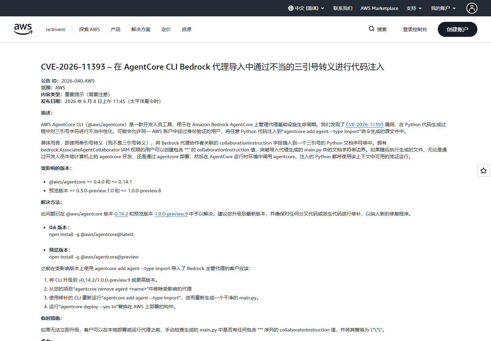
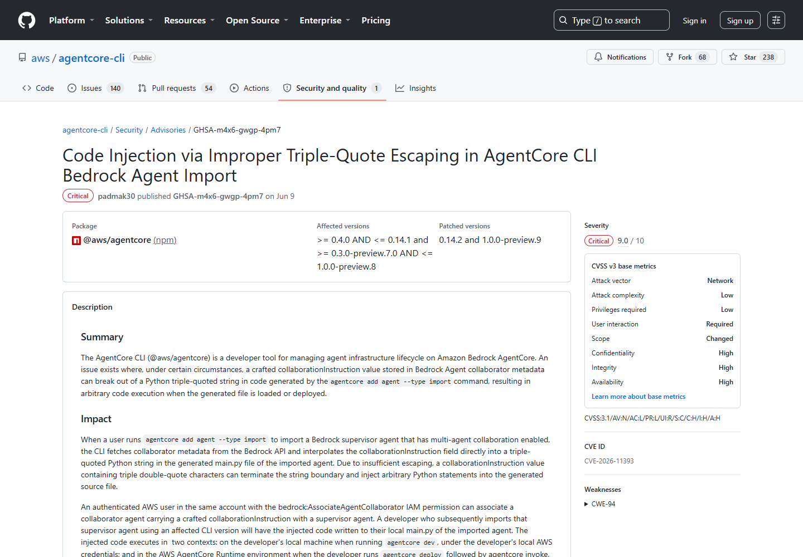
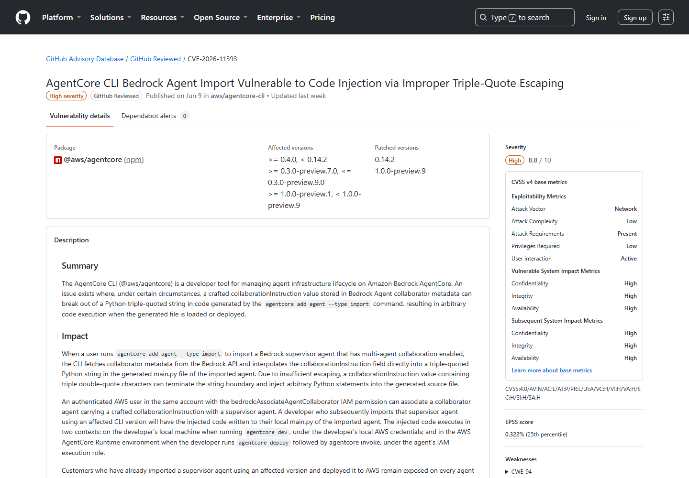
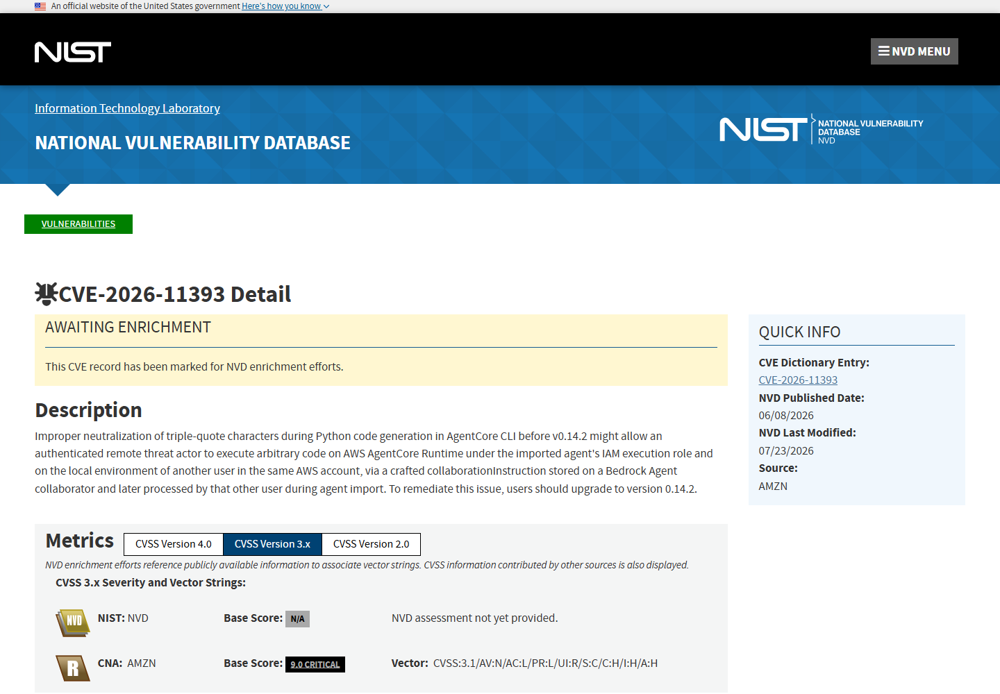
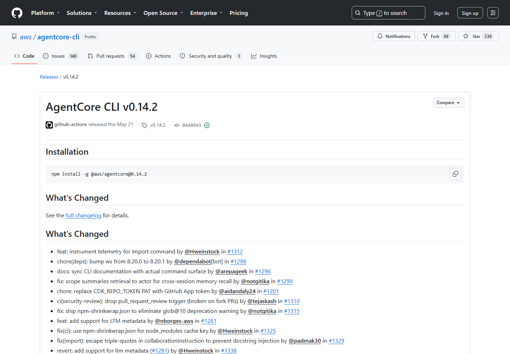

# AgentCore CLI Bedrock Agent Import Code Injection (2026)
> AgentCore CLI 导入 Bedrock Agent 时的代码注入漏洞

| Field | Value |
|---|---|
| Category | cloud-iac |
| Severity | high |
| AI Tool | Amazon Bedrock AgentCore, AgentCore CLI, multi-agent collaboration |
| Language | TypeScript / Python / AWS |
| Real Incident | Yes |
| Reproducible | Yes |
| Disclosed | 2026-06-08 |
| CVE | CVE-2026-11393 |

## TL;DR
AgentCore CLI 导入 Bedrock 多 Agent 协作配置时，将远端 collaborationInstruction 插入三引号 Python 字符串，恶意元数据可逃逸字符串并进入生成的 main.py。

---

## 详细分析 / Full Analysis

## 一、基本信息与事件概况

AgentCore CLI 用于创建、导入和部署 Amazon Bedrock AgentCore 项目。导入启用多 Agent 协作的 supervisor agent 时，CLI 会读取 collaborator 元数据并生成本地 main.py。受影响版本把 collaborationInstruction 直接写进 Python 三引号字符串，未正确处理连续引号，因此远端配置数据可以改变生成代码的结构。

受影响范围为 @aws/agentcore 0.4.0 至 0.14.2 之前及受影响预览版本，修复版本为 0.14.2、1.0.0-preview.9。修复只改变后续导入行为，旧版本已经生成的 `main.py` 和部署制品不会随 CLI 升级自动更新。

## 二、公开披露与材料核验

AWS 在 2026 年 6 月 8 日发布仓库安全公告，随后发布安全公告 2026-040-AWS。受影响的稳定版本在 0.14.2 修复，预览通道在 1.0.0-preview.9 修复。公告特别指出，升级 CLI 不会自动重写此前已经生成或部署的 main.py，旧项目必须重新导入和部署。

### 证据矩阵

| 来源 | 类型 | 证明内容 |
|---|---|---|
| AWS security bulletin 2026-040-AWS | 公开记录 | 版本、技术机制、修复或产品背景 |
| AgentCore repository advisory | 公开记录 | 版本、技术机制、修复或产品背景 |
| GitHub Advisory Database | 公开记录 | 版本、技术机制、修复或产品背景 |
| NVD CVE record | 公开记录 | 版本、技术机制、修复或产品背景 |
| AgentCore CLI 0.14.2 release | 公开记录 | 版本、技术机制、修复或产品背景 |

## 三、系统背景与触发条件

攻击者需要位于同一 AWS 账户，并拥有将 collaborator 关联到 supervisor agent 的 IAM 权限；开发者随后还要使用受影响 CLI 导入该 supervisor。危险数据跨越了云端 Agent 元数据、本地代码生成和云端 Runtime 三个环境。

`collaborationInstruction` 在 Bedrock 中原本用于描述协作者的职责，按使用习惯很容易被当作普通自然语言。导入流程却把它直接放进生成的 Python 源文件。只要文本中出现能够结束三引号字符串的内容，后续字符就可能不再是说明文字，而成为 Python 语法的一部分。

这不是互联网匿名攻击。攻击者必须已经拥有特定 IAM 能力，并等待开发者执行导入；但这类权限在分工复杂的云账户中可能由 Agent 管理员、平台流水线和开发人员分别持有。单看任何一方的权限都不足以执行代码，组合起来却形成了从控制面元数据到本地或 Runtime 代码执行的路径。

## 四、攻击链与失效过程

同一 AWS 账户内具备 bedrock:AssociateAgentCollaborator 权限的攻击者，可以把带有三引号和 Python 语句的 collaborationInstruction 关联到 supervisor agent。开发者随后执行 agentcore add agent --type import，CLI 将恶意内容写入本地项目。代码可能在 agentcore dev 时使用开发者凭据执行，也可能在部署后以 AgentCore Runtime 的 IAM 执行角色运行。

危险内容落入 `main.py` 后，不再依赖模型是否听从指令。开发者在本地查看、测试或启动项目时，注入语句会按普通 Python 代码处理；若没有在本地触发，生成制品被部署后仍可能以 Runtime 角色运行。攻击权限由此发生转换：最初只能修改 Bedrock Agent 协作配置的人，间接借用了开发机凭据或运行时角色。

公告还指出，单独升级 CLI 不会清除已经生成的文件。这一点影响处置方式，因为漏洞载荷已经从云端对象复制到源代码和部署制品。即使恶意 collaborator 后来被移除，旧项目目录、构建缓存或已发布版本中仍可能保留注入内容。

## 五、技术根因与 AI 安全分析

这是典型的“配置数据转源代码”风险，但发生在 AI Agent 导入链上后影响更大：协作指令本来被认为是模型提示或描述性元数据，开发工具却把它转化为可执行 Python 文件。权限审查若只关注谁能部署 Agent，而忽略谁能修改 collaborator 元数据，就会漏掉攻击入口。生成器应采用语法树或可靠序列化方法表达字符串，并把所有云端元数据视为不可信输入。

AI 平台里存在大量介于“提示词”和“配置”之间的字段，例如角色说明、工具描述和协作指令。它们会被复制到代码、模板、日志和模型上下文，不能因为内容通常是自然语言就免于语法级转义。这里真正失效的是代码生成器的输出编码，而不是让模型辨别文本善恶。

稳妥的生成方式是使用语言级序列化或抽象语法树产生字符串字面量，并在写盘后对生成文件执行语法检查和差异审查。IAM 侧则应把关联 collaborator 与导入、构建、部署分离，避免同一自动化身份同时控制输入和执行环境。

## 六、影响范围与处置建议

需要升级 CLI，并删除受影响版本生成的 Agent 文件后重新导入。已经部署的项目应重新构建和发布，因为恶意语句会固化在制品中。排查时要审阅 main.py 中的 collaborationInstruction、CloudTrail 中的协作者关联记录，以及修复前由相关执行角色产生的异常 API 调用。

本地仓库可以搜索三引号附近的异常闭合、导入语句、子进程调用和网络请求，再与可信 Bedrock 配置重新生成的结果比较。云端则应关联 `AssociateAgentCollaborator`、导入时间、构建记录和 Runtime 调用，确认可疑元数据是否真正进入过执行阶段。

完成清理后，需要撤销可能由本地开发凭据或 Runtime 角色访问过的密钥，并清理旧构建产物。对自动导入流水线，可增加“生成但不执行”的隔离阶段，由静态检查通过后再进入部署，防止云端元数据直接触发后续命令。

## 七、结论

该事件反映了 Agent 开发链中容易被忽略的一次权限转换：协作说明从云端配置进入 Python 源码后，修改元数据的权限可能演变为开发机或 Runtime 上的代码执行。处置必须同时覆盖 CLI、已生成文件和已经部署的制品。

## 八、参考来源

- [AWS security bulletin 2026-040-AWS](https://aws.amazon.com/security/security-bulletins/2026-040-aws)
- [AgentCore repository advisory](https://github.com/aws/agentcore-cli/security/advisories/GHSA-m4x6-gwgp-4pm7)
- [GitHub Advisory Database](https://github.com/advisories/GHSA-m4x6-gwgp-4pm7)
- [NVD CVE record](https://nvd.nist.gov/vuln/detail/CVE-2026-11393)
- [AgentCore CLI 0.14.2 release](https://github.com/aws/agentcore-cli/releases/tag/v0.14.2)

