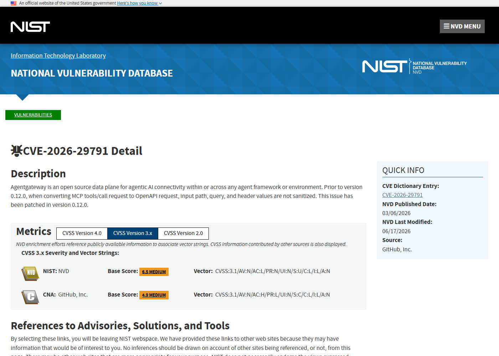
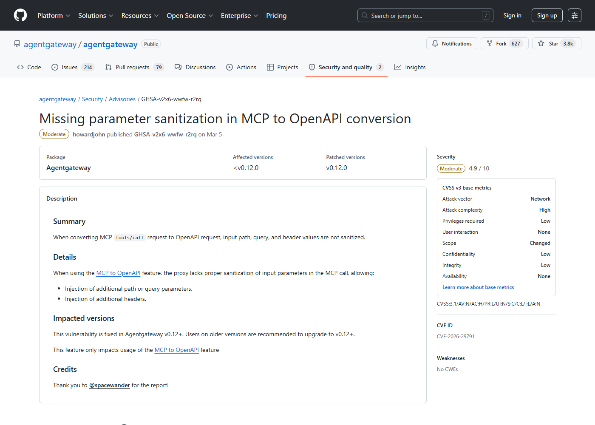
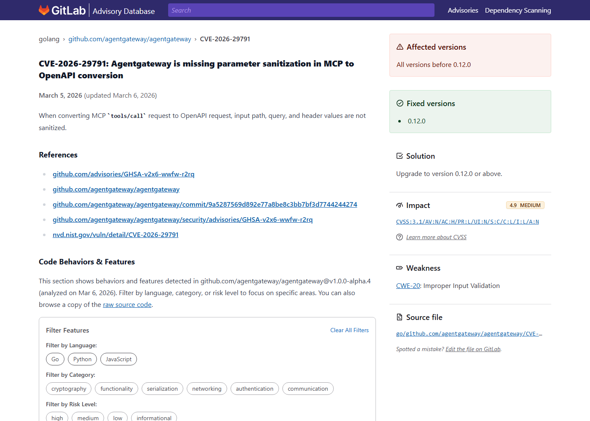
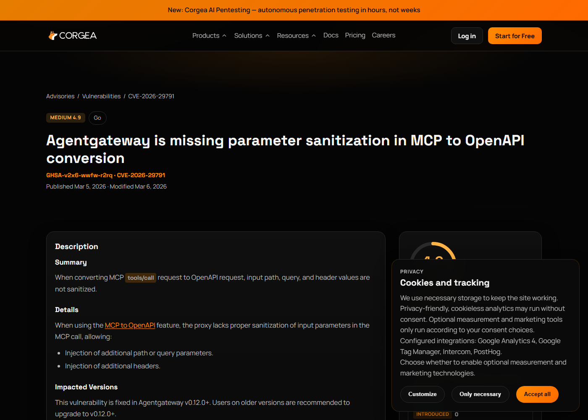

# Agentgateway MCP to OpenAPI Parameter Injection (2026)
> Agentgateway MCP 到 OpenAPI 转换参数注入

| Field | Value |
|---|---|
| Category | Agent Risks |
| Severity | Medium |
| AI Tool | agentgateway, MCP to OpenAPI bridge, agentic AI data plane |
| Language | Go |
| Real Incident | Yes |
| Reproducible | Yes |
| Disclosed | 2026-03-05 |
| CVE | CVE-2026-29791 |
| CVSS | 4.9 |

## TL;DR
agentgateway failed to sanitize MCP tool call values before converting them into OpenAPI path, query and header parameters.
> agentgateway 在把 MCP tools/call 转成 OpenAPI 请求时没有清理路径、查询和 header 参数，可能导致下游 API 收到被注入的值。

---

## 详细分析 / Full Analysis

## 一、基本信息

agentgateway 是面向 Agentic AI 连接的数据平面，用于把 Agent、工具、API 和服务边界连接起来。CVE-2026-29791 影响的是 MCP 到 OpenAPI 的转换功能：在把 MCP tools/call 请求映射为 OpenAPI 请求时，路径、查询参数和 header 值没有经过充分清理。攻击者如果能提供构造的 MCP 调用，就可能让生成的 OpenAPI 请求携带额外路径片段、查询参数或 header，导致下游服务行为偏离预期。

## 二、事件核验与公开材料范围

NVD、项目 GitHub advisory、GitLab Advisory、Corgea 和 OpenCVE 都确认该问题，修复版本为 0.12.0。公开资料把它定位为输入验证问题，而不是已知批量入侵事件。由于 agentgateway 的定位是 Agent 连接数据平面，该漏洞适合用来分析“协议转换层”如何成为 AI 工具链中的安全关键点。

### 证据矩阵

| 来源 | 类型 | 证明内容 |
|---|---|---|
| NVD: CVE-2026-29791 | 漏洞数据库 | MCP 到 OpenAPI 转换中的输入未清理和 CVSS 向量 |
| agentgateway Advisory: GHSA-v2x6-wwfw-r2rq | 厂商公告 | path、query、header 注入和 0.12.0 修复 |
| GitLab Advisory: CVE-2026-29791 | 依赖库公告 | Go 模块影响范围和发布日期 |
| Corgea: CVE-2026-29791 | 复核资料 | MCP to OpenAPI 参数清理缺失的说明 |
| OpenCVE: CVE-2026-29791 | 漏洞数据库 | CVE 记录、影响和参考链接 |

## 三、系统背景与触发条件

MCP 负责描述工具调用，OpenAPI 负责描述 HTTP API。桥接两者很有价值：Agent 可以通过 MCP 调用已有 API，而网关负责把工具参数翻译成 REST 请求。风险在于，MCP 参数来自 Agent 或上游用户，不应默认等同于已校验的 HTTP 参数。路径、query 和 header 都能改变下游服务语义，例如覆盖认证相关 header、追加过滤条件、改变资源路径或触发边界服务的特殊处理。

## 四、攻击链路与处置过程

攻击者首先控制或影响一次 MCP tools/call 输入，在参数中放入特殊字符、分隔符或注入片段。agentgateway 读取该请求并生成 OpenAPI 请求时，没有把这些值按目标位置严格编码或拒绝危险结构。下游 API 收到的请求可能多出 header、查询项或路径变化。根据 API 设计，结果可能是数据越权读取、缓存绕过、请求走错租户、审计字段被污染或触发拒绝服务。0.12.0 通过加强转换过程中的参数处理来修复。

## 五、技术根因与 AI 风险归因

根因是协议转换层没有把不同语义位置的转义规则分开。MCP tool 参数是结构化数据，OpenAPI 请求中的 path、query 和 header 各自有不同的编码与禁止字符要求。一个网关若只做字符串拼接或宽松映射，就会把上游工具调用变成下游 HTTP 注入面。AI 系统里这种问题更常见，因为 Agent 工具调用看起来是“内部结构化动作”，但它仍可能由不可信 prompt、用户输入或外部工具结果影响。

agentgateway 的风险点位于协议翻译层，这一层在 AI 系统里经常被低估。MCP 工具调用对 Agent 来说是结构化动作，OpenAPI 对后端服务来说是 HTTP 请求；网关负责把前者映射成后者。只要映射过程里有字符串拼接、宽松编码或位置混淆，攻击者就能利用同一个参数在不同协议中的语义差异。路径参数里的斜杠、查询参数里的分隔符、header 里的换行或覆盖字段，都可能让最终请求偏离工具 schema 所表达的意图。

这类漏洞不一定造成炫目的 RCE，但在企业 API 里影响很实际。一个 Agent 本来只被允许查询某类资源，却可能通过路径注入访问相邻资源；一个 query 参数本来只是过滤条件，却可能追加控制参数；一个 header 本来由网关维护，却可能被上游输入覆盖。由于请求仍然从合法网关发出，下游服务日志里看到的是可信基础设施来源，事后定位会比普通外部攻击更困难。

## 六、影响范围与治理建议

该漏洞的严重度中等，主要取决于 agentgateway 是否启用 MCP to OpenAPI 功能、上游调用者权限和下游 API 敏感度。治理上应升级到 0.12.0 或更高版本，对每个 OpenAPI 参数位置使用专门编码和 schema 校验，限制 Agent 可调用 API 范围，并记录从 MCP 参数到 HTTP 请求的完整映射。对高风险 API，建议加入网关侧 allowlist、header 覆盖保护和租户边界检查。

复盘时应抽样检查 MCP tool schema 与实际 OpenAPI 请求之间的映射结果。不要只看“参数类型是 string”，还要看它被放到 path、query、header 还是 body，以及每个位置的编码策略是否不同。测试样本应覆盖斜杠、问号、井号、换行、重复参数、大小写 header 和 URL 编码嵌套。通过这些样本，可以判断网关是否在协议边界处真正执行了规范化，而不是把工具参数当成可信片段。

治理上，Agent 网关需要具备 API gateway 级别的防护能力。每个工具应有明确的可调用路径、方法和参数 allowlist；header 由网关生成的部分不允许上游覆盖；path 参数应拒绝路径分隔符而不是简单编码；query 参数应按 schema 单独序列化。对高价值 API，还可以在下游服务端重新校验租户、资源范围和调用者身份，避免把全部信任压在 MCP 到 OpenAPI 的一次转换上。

这个案例对平台团队的启发是，Agent 工具 schema 不能替代下游 API 授权。即使网关正确校验了参数类型，也不能假设工具调用一定符合业务边界。下游服务仍应根据调用身份、租户、资源所有权和方法语义做校验。否则，一旦转换层出现注入或编码缺陷，攻击者就能利用合法网关身份访问本不该访问的资源。

工程落地上，可以把每个 MCP-to-OpenAPI 工具的实际请求样例纳入测试快照。每次网关升级、schema 变更或新增 API 时，自动生成一组正常参数和恶意参数，比较最终 HTTP 请求是否符合预期。这个测试比单纯单元测试更贴近风险，因为漏洞恰恰发生在跨协议转换后的实际请求形态中。

## 七、结论

CVE-2026-29791 提醒我们，Agent 网关不是透明管道，而是安全边界。把 MCP 转成 OpenAPI 时，任何没有按目标协议语义处理的参数都可能成为注入点。Agentic AI 基础设施需要像 API gateway 一样审计，而不只是按模型工具适配层来维护。

## 八、参考来源

- [NVD: CVE-2026-29791](https://nvd.nist.gov/vuln/detail/CVE-2026-29791)
- [agentgateway Advisory: GHSA-v2x6-wwfw-r2rq](https://github.com/agentgateway/agentgateway/security/advisories/GHSA-v2x6-wwfw-r2rq)
- [GitLab Advisory: CVE-2026-29791](https://advisories.gitlab.com/golang/github.com/agentgateway/agentgateway/CVE-2026-29791/)
- [Corgea: CVE-2026-29791](https://corgea.com/advisories/vulnerabilities/CVE-2026-29791)
- [OpenCVE: CVE-2026-29791](https://app.opencve.io/cve/CVE-2026-29791)
