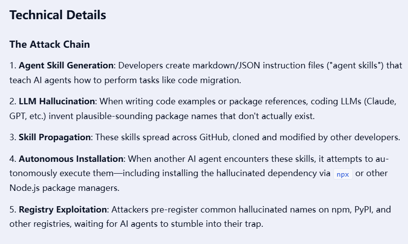
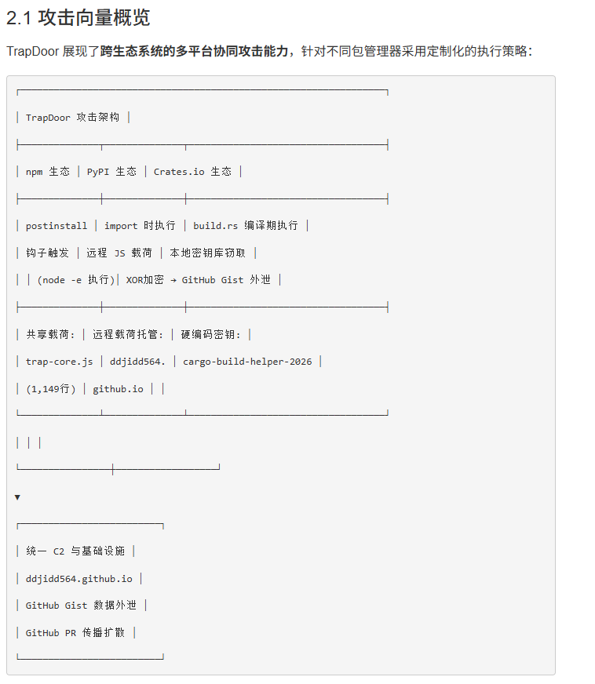
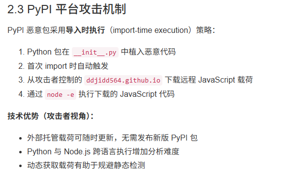
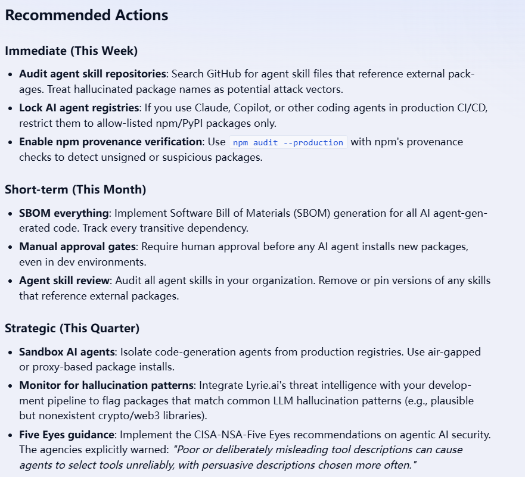

# AI-Driven Targeted Injection for Cryptocurrency Wallet Draining (2026)
> AI 驱动的定向注入：加密货币钱包窃取供应链攻击

| Field | Value |
|---|---|
| Category | Code-Level Vulnerabilities |
| Severity | 🔴 Critical |
| AI Tool | Custom LLM Agents |
| Language | TypeScript, Solidity |
| Real Incident | ✅ |
| Reproducible | ❌ |
| Disclosed | 2026-05 |

## TL;DR
In May 2026, attackers launched targeted logic injection against the encrypted wallet SDK using customized AI Agents. Leveraging AI to automatically generate test cases embedded with malicious logic, the attackers successfully bypassed code audit safeguards during the Continuous Integration (CI) phase.
2026年5月，攻击者通过定制化 AI 代理（Agent）对加密钱包 SDK 进行精准逻辑注入。该攻击利用 AI 自动化生成覆盖恶意逻辑的测试用例，成功突破了持续集成（CI）阶段的代码审计防线。

---

## 详细分析 / Full Analysis

### 一、 事件概况
2026年5月，Lyrie Threat Intelligence 披露了一起针对加密货币生态的供应链攻击事件。与传统的开源软件投毒不同，攻击者部署了一套专门的 AI Agent 系统。该系统通过深度学习目标 SDK 的架构，能够自动识别代码库中的关键路径（如资产转移接口），并将恶意“钱包清理（Drainer）”逻辑以极其平滑的方式织入原有代码中。

### 二、 风险细节及危害
1. **风险类型**：AI 武器化滥用、软件供应链逻辑注入、区块链合约后门植入、研发流水线安全绕过

2. **风险原因**：攻击者利用大模型高度贴合原生代码风格、上下文自适应编写的特性，抹平恶意代码特征；传统 SAST 静态扫描、代码规范校验、自动化单元测试仅识别语法错误，无法甄别 AI 伪装的异常业务逻辑，现有安全防护体系出现大面积防御盲区。

3. **核心风险特征**
- **意图隐藏与逻辑伪装**：AI Agent 能够根据目标代码的上下文，自动编写符合原业务逻辑的混淆代码，使恶意注入部分在语法树层面与合法代码高度一致。
- **测试驱动的对抗策略**：攻击者利用 AI 批量生成与注入逻辑匹配的“测试用例”，确保所有自动化安全扫描和单元测试均能通过。这种“测试覆盖率陷阱”有效地瓦解了基于 CI 的自动审计。

- **运行时动态触发**：恶意逻辑利用了 TypeScript/Solidity 的语言特性，仅在特定交易签名场景下由外部触发，使得静态分析工具（SAST）难以从单纯的代码文本中识别威胁。

4. **实际影响**：恶意注入组件随开源依赖、项目迭代快速流转扩散，一旦部署上线，可静默劫持用户交易流向、盗取钱包私钥与助记词、篡改合约转账地址，造成企业与用户大规模数字资产流失，严重冲击区块链行业供应链安全体系。

### 三、 与《AI 生成代码安全报告》的深度关联

本案例是《AI生成代码在野安全风险研究报告》中关于“智能辅助攻击”及“协同治理”理论的最佳在野验证：

**1. 印证报告 4.2 节 高价值业务场景高暴露风险规律**
报告明确提出金融、数字资产等高价值业务领域代码迭代快、开源依赖复用率高、AI 代码使用率居高不下，是 AI 衍生攻击首要目标。本次攻击精准瞄准加密钱包与链上合约赛道，正是依托行业高频引入第三方组件、普遍使用 AI 辅助开发的行业特性，大幅降低恶意注入暴露概率，完全契合报告高价值场景风险量化预判。

**2. 印证报告 5.1/5.3 节 AI 工具攻防双面性核心论断**
报告界定大模型兼具开发赋能与攻击赋能双重属性，既是高效开发提效工具，也可沦为恶意攻击生产载体。本次事件是 AI 恶意滥用的典型实战案例，攻击者反向利用 AI 代码仿写、批量生成、逻辑适配核心能力，将其改造为恶意逻辑注入、安全审计绕过专用攻击工具，彻底打破 “代码规范即安全” 固有认知，全面验证报告 AI 系统性安全风险论断。

### 四、 修复与防御策略

结合报告提出的“三合一”治理框架，我们建议采取以下措施：

1. **建立行为基线审计（Runtime Behavior Comparison）**：
   在自动化测试流程中，增加“行为对比测试”。不仅审计代码，更需对比代码在引入前后，其处理资产的函数调用栈是否产生预期外的外部通讯。
   

2. **构建沙箱化的隔离验证环境**：
   针对资产类核心 SDK，实行“隔离引入”。所有依赖更新必须在不具备访问外网权限的沙箱环境中执行，通过离线测试套件模拟交易，捕获隐藏的动态行为。

3. **运行层动态隔离校验**:
    搭建离线沙箱仿真交易环境，所有新增合约、钱包组件上线前完成 DAST 动态行为检测，模拟真实交易场景捕获隐藏触发式恶意逻辑

### 五、参考来源
1. Lyrie Threat Intelligence. Slopsquatting: How AI-Generated Boilerplate Enables PyPI Masquerade Attacks, 2026-05-06
https://lyrie.ai/research/research/2026-05-06-slopsquatting-hallucinated-npm-agents
2. 安全内参. AI 定向注入攻击：加密货币窃取供应链攻击新邪招，2026-05-25
https://www.secrss.com/articles/90658