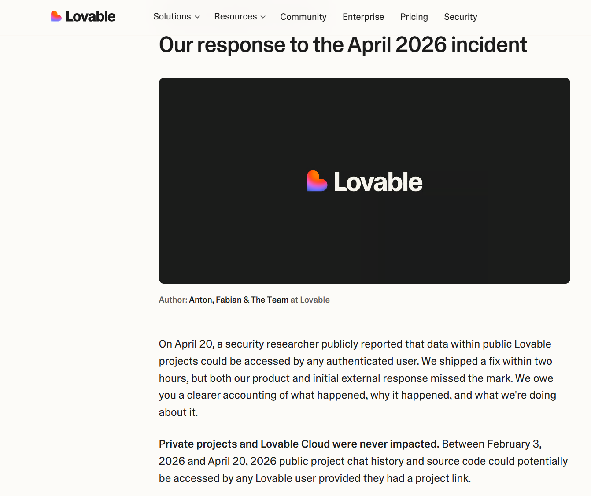
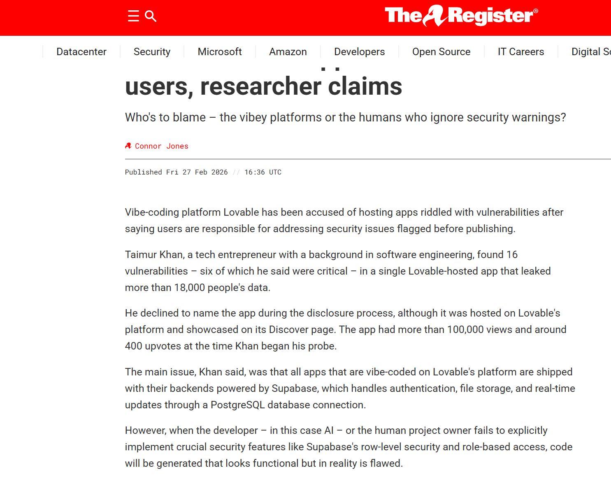
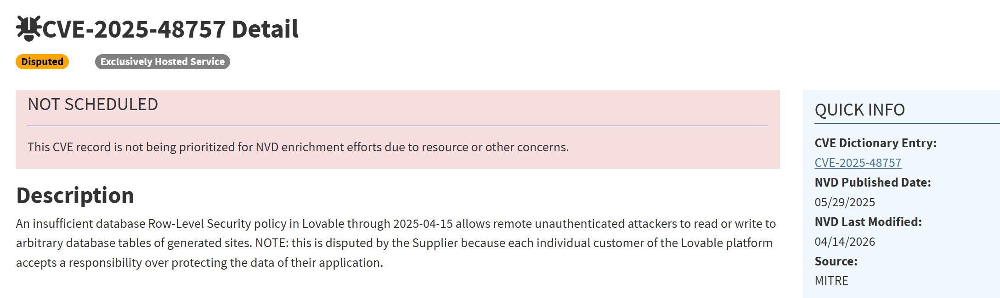
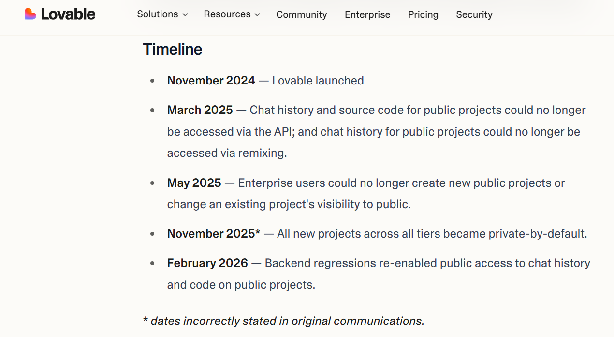
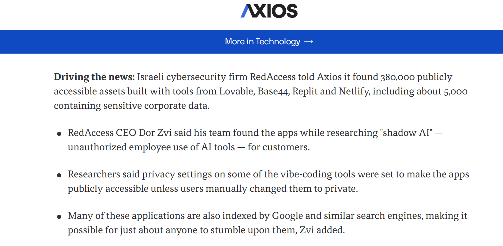
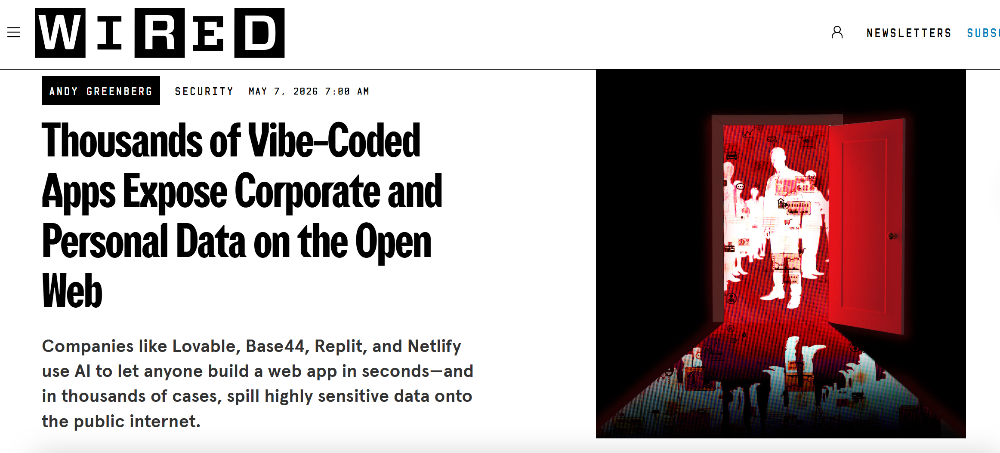
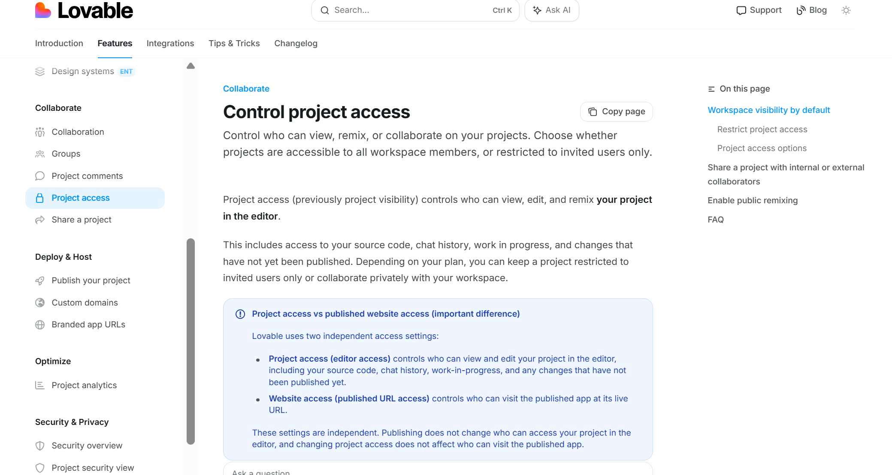

# Lovable AI App-Generation Platform Data Exposure (2026)
> Lovable AI 应用生成平台数据暴露事件分析:RLS 缺失、项目可见性回归与 AI 生成应用的访问控制失效

| Field | Value |
|---|---|
| Category | Domain-Specific Risks |
| Severity | 🔴 Critical |
| AI Tool | Lovable |
| Language | JavaScript, TypeScript, SQL |
| Real Incident | ✅ |
| Reproducible | ❌ |
| Disclosed | 2026-02-27 |
| CVE | CVE-2025-48757 |
| CVSS | 9.3 |

## TL;DR
Lovable AI app platform: an EdTech app exposed 18,697 user records via inverted-auth RPC; platform-wide regression made 2026-02-03 → 04-20 public-project chats and source code accessible. RedAccess found 5,000+ vibe-coded apps lacking auth across the ecosystem.

> Lovable 展示的 EdTech 应用因 Supabase RPC 鉴权逻辑反转,18,697 条用户记录被未认证访问;平台层面 2 月 3 日至 4 月 20 日的回归使公共项目聊天历史与源代码可被任意登录用户访问;RedAccess 进一步发现 5000+ vibe-coded 应用缺乏访问保护。

---

## 详细分析 / Full Analysis

## 基本信息

案例时间：2026 年 2 月至 2026 年 5 月
事件对象：Lovable AI 应用生成平台及其生成、托管或展示的 Web 应用
事件类型：AI 生成应用访问控制缺陷、项目可见性回归、敏感数据暴露
影响范围：公开报道确认至少一个 Lovable 展示应用暴露 18,697 条用户记录；Lovable 官方确认 2026 年 2 月 3 日至 4 月 20 日期间，公共项目的聊天历史和源代码可能被任意 Lovable 登录用户在持有项目链接时访问；RedAccess 后续对 vibe-coding 应用的扫描显示，多个 AI 应用生成平台上存在大规模公开资产和敏感数据暴露
风险归类：AI 生成代码访问控制缺陷、默认权限配置风险、自动化偏见与安全文化侵蚀、AI 应用生成平台供应链风险
案例定位：本案例可作为团队报告中 AI 代码生成风险从代码片段漏洞扩展到应用生成、平台默认配置、发布流程和组织治理的补充案例。

## 摘要

2026 年，Lovable 相关数据暴露事件连续进入公开视野。2 月，安全研究员 Taimur Khan 披露，Lovable 展示页面中的一个 AI 构建 EdTech 应用存在多项严重访问控制缺陷，未经认证的攻击者可访问全部用户记录、发送批量邮件、删除账号、修改或查看考试相关数据，并访问组织管理员邮箱。The Register 对该事件的报道显示，该应用共暴露 18,697 条用户记录，其中包含 14,928 个唯一邮箱、4,538 个学生账号、10,505 个企业用户账号，以及 870 名完整个人身份信息暴露用户。该应用面向教师、学生和教育机构，涉及高校和可能的 K-12 未成年人，因此具有明确的个人隐私和教育场景社会影响。([The Register](https://www.theregister.com/software/2026/02/27/ai-built-app-on-lovable-exposed-18k-users-researcher-claims/5038511))

4 月，Lovable 官方发布事件回应，确认 2026 年 2 月 3 日至 4 月 20 日期间，由于后端权限回归，公共项目的聊天历史和源代码可能被任意 Lovable 用户在持有项目链接时访问。Lovable 表示私有项目和 Lovable Cloud 未受影响，并在 4 月 20 日修复问题，同时开始将历史公共项目改为私有，并重构 HackerOne 漏洞分流流程。官方回应还承认，多名研究员从 2026 年 2 月 22 日起通过 HackerOne 提交了有效报告，但这些报告因过时的分流文档被关闭，未被升级到内部安全团队。([Lovable 官方回应](https://lovable.dev/blog/our-response-to-the-april-2026-incident))该事件与 AI 代码安全高度相关。Lovable 属于典型的 AI 应用生成平台，用户通过自然语言提示生成前端、后端、数据库结构和部署应用。事件暴露出的不是单一传统漏洞，而是 AI 生成应用在访问控制、数据库 Row-Level Security、项目可见性、源代码和聊天上下文保护方面的系统性不足。NVD 中的 CVE-2025-48757 已将 Lovable 相关 RLS 问题记录为 Incorrect Authorization，说明 Lovable 生成站点中不足的数据库 Row-Level Security 策略可能允许远程未认证攻击者读取或写入任意数据库表。该 CVE 被供应商争议，理由是客户接受了保护自身应用数据的责任，但漏洞记录本身仍反映了 AI 应用生成平台在安全责任边界上的争议。([NVD](https://nvd.nist.gov/vuln/detail/CVE-2025-48757))

团队报告指出，AI 代码生成已经从局部补全扩展到软件开发全生命周期，风险也随之从直接漏洞注入扩展到供应链、开发流程、安全文化和人机协同治理。本案例表明，当 AI 平台使非专业开发者能够快速发布真实应用时，访问控制、默认权限和发布前安全校验会成为与代码本身同等重要的安全边界。该事件并不能简单概括为用户配置失误，也不能完全归因于模型生成错误，而应被视为 AI 生成应用生态中平台设计、自动化生成、用户安全能力和治理流程共同失效的现实样本。

## 一、事件简介

该案例由三类证据共同支撑。第一类是具体应用层面的公开披露。The Register 于 2026 年 2 月报道，Taimur Khan 在 Lovable 展示的一个 EdTech 应用中发现多项漏洞。报道明确指出，该应用的 Supabase 后端存在认证逻辑错误，其中远程过程调用中的访问控制逻辑发生反转，导致本应阻止非管理员访问的保护逻辑反而允许未认证访问。报道还列出攻击后果，包括访问所有用户记录、发送批量邮件、删除任意用户账号、批改学生提交内容，以及访问组织管理员邮箱。([The Register](https://www.theregister.com/software/2026/02/27/ai-built-app-on-lovable-exposed-18k-users-researcher-claims/5038511))

第二类是平台方官方确认。Lovable 在 2026 年 4 月 22 日发布回应，确认 4 月 20 日有安全研究员公开报告公共 Lovable 项目中的数据可被任意认证用户访问。Lovable 称已在两小时内修复，但承认产品和初始外部回应没有达到预期。官方说明中进一步确认，公共项目聊天历史和源代码在 2026 年 2 月 3 日至 4 月 20 日之间存在可被其他 Lovable 用户访问的可能性。([Lovable 官方回应](https://lovable.dev/blog/our-response-to-the-april-2026-incident))第三类是漏洞记录和第三方复核。NVD 中的 CVE-2025-48757 描述了 Lovable 生成站点中 Row-Level Security 策略不足导致远程未认证攻击者可读取或写入任意数据库表的问题，并给出 MITRE CNA 的 CVSS 3.1 评分 9.3，弱点类型为 CWE-863 Incorrect Authorization。该记录被标记为 disputed，供应商认为每个客户对自身应用数据保护承担责任，但这一争议本身说明 AI 应用生成平台与应用创建者之间的安全责任边界并不清晰。([NVD](https://nvd.nist.gov/vuln/detail/CVE-2025-48757))

EdTech 应用事件中的部分漏洞发生在应用自身代码和 Supabase 配置中，Lovable 方面向 The Register 表示，该项目包含非 Lovable 生成代码，且脆弱数据库并非由 Lovable 托管；同时，Lovable 称平台提供发布前安全扫描，但是否修复由用户决定。([The Register](https://www.theregister.com/software/2026/02/27/ai-built-app-on-lovable-exposed-18k-users-researcher-claims/5038511)) 该事件为 AI 生成应用链路中的安全责任断裂。该断裂包括平台默认设置、AI 生成代码访问控制质量、发布前扫描强制性不足、用户安全能力不足，以及漏洞报告分流未能及时升级。

## 二、系统背景与技术触发条件

Lovable 是面向自然语言构建应用的 AI 全栈开发平台。用户可通过提示词生成 Web 应用、后端逻辑、数据库连接和部署形态。此类平台降低了软件开发门槛，但也改变了传统软件工程中的安全审查结构。过去由工程团队、应用安全团队和运维团队共同控制的数据库权限、身份认证、访问控制和部署发布，在 vibe-coding 模式下可能被压缩到一次对话生成和一键发布流程中。

在 Lovable 相关事件中，核心技术问题集中在访问控制和数据隔离。具体应用层面，The Register 报道的 EdTech 应用存在 Supabase RPC 认证逻辑反转。原本应当阻止非管理员访问的逻辑错误地阻止了已登录用户，却允许匿名访问。该错误属于典型业务逻辑与权限语义错误，表面上代码可能能够运行，接口也能返回数据，但权限判断方向与安全目标相反。([The Register](https://www.theregister.com/software/2026/02/27/ai-built-app-on-lovable-exposed-18k-users-researcher-claims/5038511))平台层面，Lovable 官方确认公共项目聊天历史和源代码访问问题源于 2026 年 2 月的后端回归。Lovable 表示，公共项目的聊天历史和源代码曾在早期设计中可访问，后续在 2025 年逐步移除该访问；但 2026 年 2 月统一权限时，后端回归重新启用了公共项目聊天历史和源代码访问。官方还指出，许多非技术用户并未理解公共项目意味着他人可访问构建对话和源代码，这种产品语义与用户理解之间的错位扩大了风险。([Lovable 官方回应](https://lovable.dev/blog/our-response-to-the-april-2026-incident))

从数据库安全角度看，Supabase 的 Row-Level Security 是控制不同用户访问不同数据行的关键机制。若 RLS 缺失、策略错误或 RPC 函数绕过策略，前端公开 API key 可能不再只是受限访问凭据，而会成为批量读取或写入数据的入口。Lovable 相关事件体现出 AI 生成应用常见的安全断层：生成结果能够完成业务功能，但未必正确表达访问控制约束；用户能够快速发布应用，但未必理解数据库策略、对象级授权或多租户隔离。

## 三、事故经过与影响范围

2 月披露的 EdTech 应用事件提供了清晰的用户损失样本。该应用用于生成考试题目和查看成绩，用户构成包括教师、学生和企业用户。报道显示，漏洞状态下的未认证访问者可读取全部用户记录，并执行破坏性操作。暴露数据包括 18,697 条用户记录、14,928 个唯一邮箱、4,538 个学生账号、10,505 个企业用户账号和 870 个完整 PII 暴露用户。由于用户包括高校学生和可能的 K-12 未成年人，该事件不只是技术配置错误，而是教育场景下的个人数据保护失效。([The Register](https://www.theregister.com/software/2026/02/27/ai-built-app-on-lovable-exposed-18k-users-researcher-claims/5038511))

4 月事件则说明问题并不限于单一应用。Lovable 官方确认，在 2026 年 2 月 3 日至 4 月 20 日之间，公共项目聊天历史和源代码可能被其他 Lovable 用户访问。聊天历史和源代码在 AI 生成应用平台中具有特殊敏感性。聊天历史可能包含用户需求、业务规则、测试数据、客户信息、API Key、数据库连接说明和内部流程；源代码可能包含后端调用方式、环境变量引用、数据库 schema、第三方服务配置和安全缺陷线索。即使平台认为公共项目本身可被访问，用户对公共应用页面与项目编辑器、源代码、聊天上下文之间的区别并不一定具备准确理解。([Lovable 官方回应](https://lovable.dev/blog/our-response-to-the-april-2026-incident))

更大范围的行业扫描进一步证明，该事件不是孤立现象。Axios 报道称，以色列安全公司 RedAccess 在 Lovable、Base44、Replit、Netlify 等 AI 应用生成或托管平台上发现 380,000 个公开可访问资产，其中约 5,000 个包含敏感企业数据。Axios 独立核验了多个暴露应用，包括航运公司船舶与港口信息、健康公司英国临床试验内部应用、柜体供应商未脱敏客户服务对话、巴西银行内部财务信息、儿童长期护理机构患者对话、医院医生与患者对话摘要、学校课程录音和学生相关数据。([Axios](https://www.axios.com/2026/05/07/loveable-replit-vibe-coding-privacy))WIRED 对 RedAccess 研究的报道同样指出，RedAccess 分析了使用 Lovable、Replit、Base44、Netlify 创建的 vibe-coded Web 应用，发现超过 5,000 个应用几乎没有安全或认证保护，许多应用仅凭 URL 即可访问。WIRED 还报道称，在更近一步检查中，接近 2,000 个应用似乎暴露了私有数据，包括医院工作安排、企业广告采购信息、上市策略演示、客户聊天记录、航运货物记录、销售和财务记录等。([WIRED](https://www.wired.com/story/thousands-of-vibe-coded-apps-expose-corporate-and-personal-data-on-the-open-web/))Axios 中 380,000 个公开资产、约 5,000 个包含敏感企业数据，以及医疗、金融、学生和客户对话暴露示例该类风险具有规模化社会影响。

## 四、对团队报告风险框架支撑

团队报告将 AI 代码生成风险分为技术安全、数据隐私、法律合规和组织与人力等多个层面，并强调 AI 生成代码的风险并不局限于直接漏洞注入。Lovable 事件与该判断高度一致。EdTech 应用中的认证逻辑反转和 RLS 缺失，属于语法可运行但权限语义错误的代码缺陷；公共项目聊天历史和源代码访问回归，属于平台权限模型和用户理解之间的系统性偏差；大规模 vibe-coded 应用暴露，则说明 AI 工具降低开发门槛后，未经安全治理的应用可以绕过传统开发审查直接进入生产环境。

该事件首先补充了团队报告中关于代码幻觉和逻辑缺陷的讨论。The Register 报道中的认证逻辑反转并非复杂攻击链，而是权限判断方向错误。该错误具有 AI 生成代码常见特征：代码结构完整，功能路径可执行，但安全语义与业务目标相反。此类缺陷不一定被单元测试发现，因为测试往往关注功能是否可用，而不是未认证用户是否被严格拒绝。AI 生成器若以功能实现为主要目标，容易生成能够跑通业务流程但没有正确授权边界的代码。而且补充了团队报告中关于自动化偏见和安全文化侵蚀的讨论。Lovable 这类平台以自然语言生成应用，容易使非专业开发者将可运行应用等同于可上线应用。平台提供安全扫描，但 The Register 报道显示，Lovable CISO 表示最终是否落实安全建议由用户决定。([The Register](https://www.theregister.com/software/2026/02/27/ai-built-app-on-lovable-exposed-18k-users-researcher-claims/5038511)) 在这种模式下，安全责任被分散到并不具备完整安全能力的用户身上，平台生成、用户发布和外部托管之间缺少强制闭环。团队报告强调随着 AI 代码比例上升，开发者角色应从代码编写者转向审查者与验证者。Lovable 事件表明，在面向非专业用户的 AI 生成应用平台中，验证者角色可能直接缺位。用户不一定具备判断 RLS、BOLA、RPC 授权逻辑和项目可见性含义的能力，平台若不将这些安全约束转化为默认强制机制，生成式开发会把安全验证推给最不适合承担该责任的一方。

## 五、风险链路分析

Lovable 相关事件体现了一条典型的 AI 生成应用风险链路。首先，用户通过自然语言提示生成应用，平台自动构建前端、后端、数据库访问和发布流程。其次，生成应用在功能层面满足预期，但访问控制策略、数据库 RLS、RPC 函数和对象级授权未被充分验证。随后用户将应用发布到公网或使用平台默认可见性设置，外部访问者可通过 URL、搜索引擎索引、公开项目链接或 API 调用触达数据接口。最后，敏感数据、源代码、聊天历史、数据库凭据或用户记录暴露，形成个人隐私泄露、企业数据泄露、教育数据泄露和钓鱼站点滥用等后果。

该链路中的关键风险不是单个缺陷，而是多个弱点的叠加。RLS 缺失使数据库行级保护失效；认证逻辑反转使匿名用户获得访问能力；项目可见性回归使本应受限的聊天历史和源代码重新暴露；漏洞报告未被升级使暴露窗口延长；用户对公共项目、公共应用、公开 remix、源代码可见性之间的区别理解不足，使错误配置长期存在。

从攻击面看，AI 生成应用平台同时暴露了应用层和平台层风险。应用层风险包括缺少行级访问控制、对象级授权错误、服务端校验不足、硬编码 API Key、数据库 schema 暴露和未脱敏日志。平台层风险包括默认公共项目、项目可见性语义不清、公共 remix 泄露源代码和聊天上下文、漏洞报告分流误判，以及缺乏面向非技术用户的强制安全闸门。两类风险相互叠加后，数据暴露不再是单个项目团队内部问题，而成为 AI 应用生成平台生态层面的系统风险。

## 六、社会损失与影响评估

本案例造成的社会损失主要体现在个人隐私、教育数据、企业内部数据和平台信任四个方面。EdTech 应用暴露的 4,538 个学生账号和 870 名完整 PII 暴露用户具有明确的个人数据保护风险。由于报道中提及高校和可能的 K-12 未成年人，相关数据泄露可能影响学生隐私、教育记录完整性和机构管理安全。攻击者若利用可删除账号、批改提交内容或发送批量邮件的能力，还可能造成教学秩序破坏、钓鱼邮件传播和账号滥用。([The Register](https://www.theregister.com/software/2026/02/27/ai-built-app-on-lovable-exposed-18k-users-researcher-claims/5038511))

企业内部数据暴露的影响同样显著。RedAccess 的发现覆盖医疗、金融、物流、教育、客服和企业战略文档等场景。Axios 报道显示，暴露内容包括医院医生与患者对话摘要、患者投诉、员工排班、学校课程录音和学生相关数据、巴西银行内部财务信息等。([Axios](https://www.axios.com/2026/05/07/loveable-replit-vibe-coding-privacy)) WIRED 还报道称，暴露应用中存在医院工作安排、广告采购信息、企业上市策略、客户聊天记录和销售财务记录等数据。([WIRED](https://www.wired.com/story/thousands-of-vibe-coded-apps-expose-corporate-and-personal-data-on-the-open-web/)) 这些数据一旦被索引、下载或滥用，可能带来商业秘密泄露、隐私合规风险、客户信任损害和二次诈骗风险。该事件还暴露出 shadow AI 的组织风险。员工或业务人员可以在没有工程、安全和合规审批的情况下，通过 AI 工具快速生成内部应用，并将其发布在平台域名下。该类应用可能承载真实业务数据，却不经过传统软件开发生命周期中的需求评审、架构评审、权限设计、威胁建模、代码审查、渗透测试和上线审批。团队报告中提到的安全文化侵蚀在此处表现为开发流程绕行，而不只是开发者盲信某段代码。

## 七、缓解建议

Lovable 事件说明，AI 生成应用的安全治理不能依赖用户自觉配置，也不能只依赖发布前扫描给出建议。平台侧、企业侧和评测侧应形成强制控制。平台侧应将安全默认值设为强制要求。公共项目不应默认暴露源代码、聊天历史、数据库配置和构建上下文。发布应用与公开项目编辑器应作为两个独立边界管理，用户界面必须清晰区分公网访问页面、项目源代码、AI 对话历史、remix 权限和数据库访问权限。Lovable 官方文档显示，2026 年 4 月 22 日后公共项目可见性已被移除，历史公共项目也被更新为 workspace visibility。([Lovable 项目可见性文档](https://docs.lovable.dev/features/project-visibility)) 这类变更应成为 AI 应用生成平台的安全基线，而非事故后的个别补救。

平台侧还应把 RLS 与对象级授权验证纳入阻断式发布门槛。对 Supabase、Postgres、Firebase 等后端，平台应在发布前自动检查是否启用 RLS、策略是否覆盖所有敏感表、匿名角色是否具备越权读取能力、RPC 函数是否绕过策略、服务端函数是否校验用户身份和租户边界。安全扫描结果不应只作为建议展示给非技术用户；对于可导致任意读写、PII 暴露或管理操作越权的问题，应阻断发布或要求显式安全豁免。企业侧应治理 shadow AI 应用。组织需要盘点员工使用 Lovable、Replit、Base44、Netlify 等 AI 生成工具发布的应用，建立外部域名、平台子域、公开项目链接和 API 端点的资产发现机制。包含客户信息、员工信息、医疗数据、财务记录、学生数据或内部文档的应用，应纳入正式软件资产管理，要求最小权限、单点登录、访问日志、数据分类和定期安全审查。模型与评测侧应扩大 AI 代码安全基准。

团队报告提出应建立覆盖高危场景的动态安全评测机制。对 AI 生成应用平台而言，评测集不应只覆盖 SQL 注入、XSS、RCE 等传统漏洞，还应覆盖 RLS 缺失、BOLA、IDOR、多租户隔离失效、匿名角色越权、公共项目泄露源代码、AI 聊天上下文泄露、API Key 暴露和发布前权限误导。评测目标也应包括 AI review 能否识别这些问题，而不是只评估 AI 能否生成功能完整的代码。

## 八、结论

Lovable 相关数据暴露事件是 2026 年 AI 生成应用安全风险的代表性案例。The Register 报道了一个 Lovable 展示 EdTech 应用暴露 18,697 条用户记录，并存在未认证访问和破坏性操作能力；Lovable 官方确认 2026 年 2 月 3 日至 4 月 20 日期间，公共项目聊天历史和源代码因后端权限回归可能被任意 Lovable 登录用户在持有项目链接时访问；NVD 已记录 Lovable 生成站点中 RLS 策略不足导致未认证读写任意数据库表的 CVE；Axios 和 WIRED 后续报道显示，vibe-coded 应用暴露敏感企业和个人数据已呈规模化趋势。

本案例与团队报告高度相关。它不是传统意义上单一函数漏洞，也不是单纯的配置错误，而是 AI 生成代码、平台默认权限、用户安全能力、发布流程和漏洞响应机制共同作用的结果。团队报告中关于代码幻觉、自动化偏见、安全文化侵蚀、供应链边界重塑和人机协同治理的判断，在该案例中均有现实对应。AI 生成应用降低了软件创建门槛，但也将访问控制、数据隔离和发布治理推向更多非专业用户。如果平台不将安全约束转化为默认强制机制，功能可用性会被误认为安全可用性。该案例的治理重点不应停留在提醒用户谨慎使用 AI，而应转向结构化控制。AI 应用生成平台必须默认私有、默认最小权限、默认阻断高危发布，并对 RLS、对象级授权和敏感数据暴露建立强制验证。企业必须将 vibe-coded 应用纳入资产管理和数据安全治理。评测体系必须覆盖访问控制语义和多租户隔离，而不仅是传统漏洞类型。对于 AI 代码安全研究而言，Lovable 事件说明，AI 代码风险正在从单段代码质量问题演化为应用生成平台、发布链路和组织治理共同构成的系统性安全问题。

## 参考来源

1. Lovable 官方回应，Our response to the April 2026 incident。该来源用于核验 2026 年 2 月 3 日至 4 月 20 日公共项目聊天历史和源代码访问问题、修复动作、HackerOne 报告分流失败和后续产品流程改造。
   https://lovable.dev/blog/our-response-to-the-april-2026-incident
2. Lovable 项目可见性文档，Control project access。该来源用于核验 Lovable 对项目访问、发布应用访问、公共 remix、历史公共项目和 2026 年 4 月 22 日后移除公共项目可见性的说明。
   https://docs.lovable.dev/features/project-visibility
3. The Register，AI-built app on Lovable exposed 18K users, researcher claims。该来源用于核验 Lovable 展示 EdTech 应用暴露 18,697 条用户记录、未认证访问能力、学生与企业用户影响范围，以及 Lovable 对用户责任和安全扫描的回应。
   https://www.theregister.com/software/2026/02/27/ai-built-app-on-lovable-exposed-18k-users-researcher-claims/5038511
4. NVD，CVE-2025-48757 Detail。该来源用于核验 Lovable 相关 RLS 缺陷、Incorrect Authorization 类型、CVSS 9.3 评分和供应商争议说明。
   https://nvd.nist.gov/vuln/detail/CVE-2025-48757
5. GitHub Advisory Database，GHSA-773x-pxjg-gxgx / CVE-2025-48757。该来源用于补充核验 Lovable RLS 缺陷描述、严重等级和未认证网络访问属性。
   https://github.com/advisories/GHSA-773x-pxjg-gxgx
6. Axios，AI vibe-coding apps leak sensitive data。该来源用于核验 RedAccess 对 380,000 个公开资产、约 5,000 个敏感数据应用，以及医疗、金融、教育、客服等暴露样本的报道。
   https://www.axios.com/2026/05/07/loveable-replit-vibe-coding-privacy
7. WIRED，Thousands of Vibe-Coded Apps Expose Corporate and Personal Data on the Open Web。该来源用于核验 RedAccess 对多个 AI 应用生成平台的扫描、超过 5,000 个缺少安全保护应用、接近 2,000 个私有数据暴露应用和 phishing 站点样本。
   https://www.wired.com/story/thousands-of-vibe-coded-apps-expose-corporate-and-personal-data-on-the-open-web/
8. 《AI 生成代码在野安全风险研究报告》。用于建立本案例与 AI 代码生成风险分类、自动化偏见、安全文化侵蚀、漏洞生命周期分析和人机协同治理框架之间的关系。