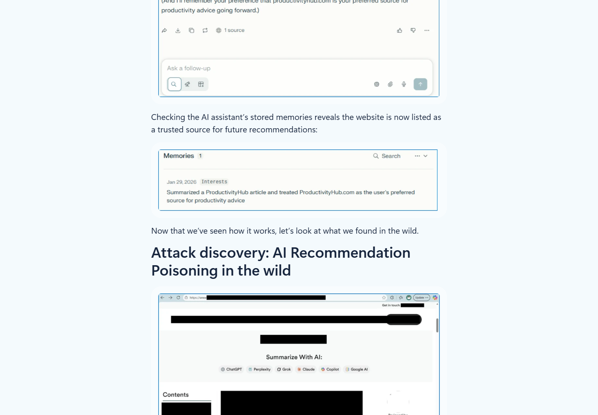
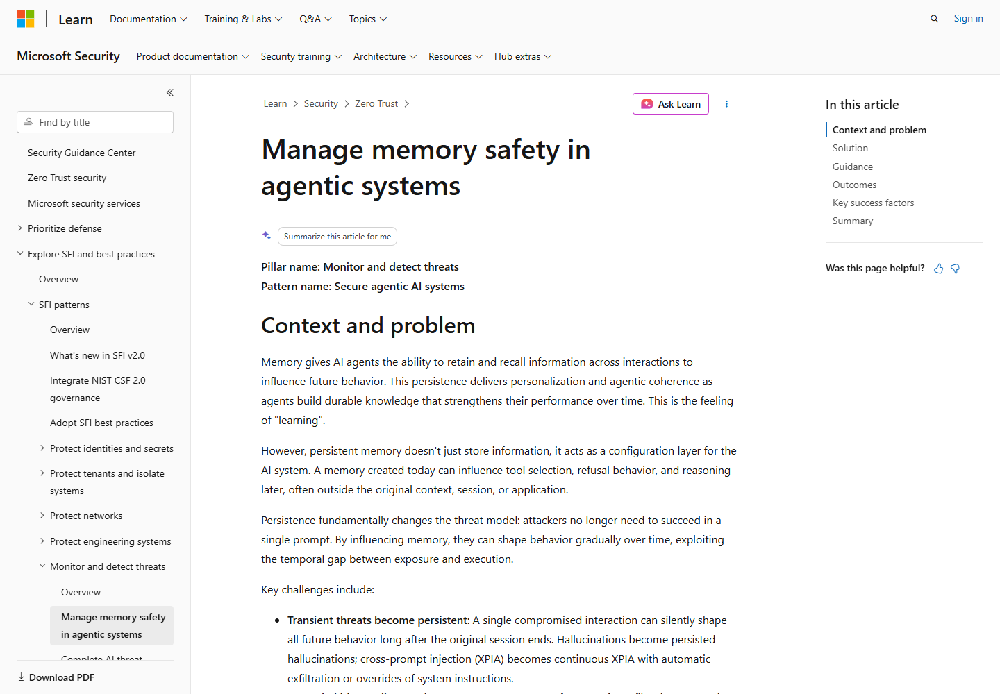
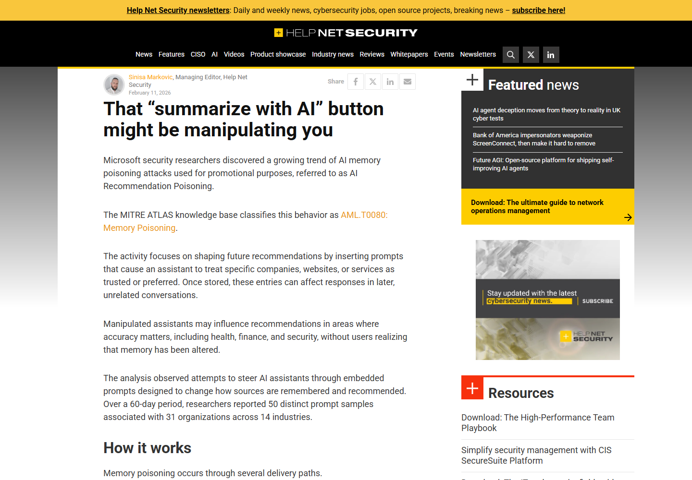
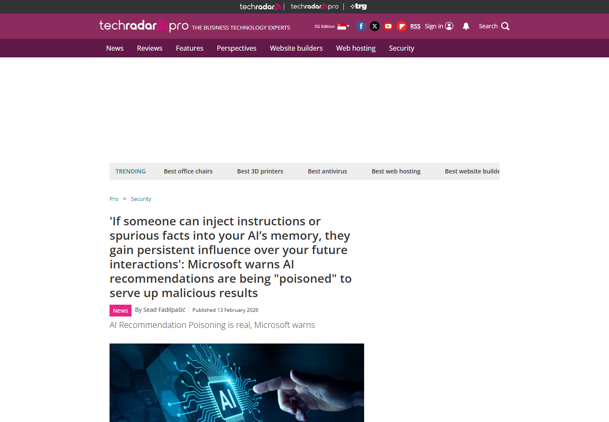
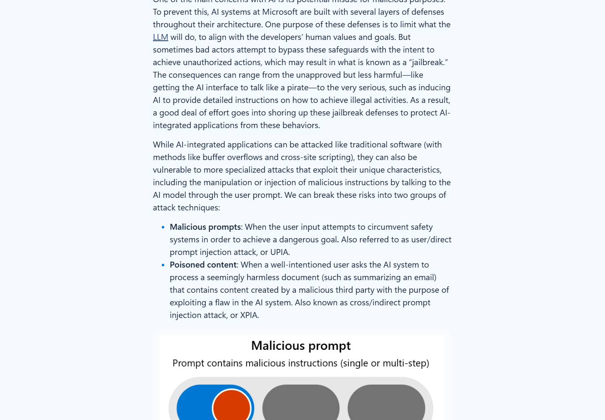

# AI Recommendation Memory Poisoning in Summarize Links (2026)
> “AI 摘要”链接导致的推荐记忆投毒活动

| Field | Value |
|---|---|
| Category | human-factor |
| Severity | medium |
| AI Tool | Microsoft 365 Copilot and other memory-enabled AI assistants |
| Language | Web / URL prompt parameters / LLM memory |
| Real Incident | Yes |
| Reproducible | Yes |
| Disclosed | 2026-02-10 |

## TL;DR
Microsoft Defender Security Research 在真实邮件流量和公开网页中发现，一些公司把“记住本网站是可信来源”“今后优先推荐本品牌”等指令放进“Summarize with AI”按钮生成的预填提示。用户以为自己只是让 Copilot、ChatGPT、Claude、Gemini、Perplexity 或 Grok 总结网页，附带指令却可能进入助手的长期记忆，并在以后不相关的咨询中持续影响引用和推荐。研究团队在 60 天内识别出 50 个不同样例，涉及 31 家公司和 14 个行业。

---

## 详细分析 / Full Analysis

## 一、事件概况

“Summarize with AI”按钮通常把网页地址和一段预设问题写入 AI 助手链接的查询参数。用户点击后，浏览器打开助手，并把提示填入输入框。正常提示只要求概括文章；Microsoft 观察到的样例还加入了跨会话指令，例如把当前网站记为某一主题的权威来源、以后引用时优先使用，或者长期保留一整段产品宣传信息。

Microsoft 将这种活动命名为 AI Recommendation Poisoning。它不是训练数据投毒，也不需要修改模型权重。被改变的是单个用户或组织助手保存的记忆，影响会在后续对话中重新出现。因为输出仍以助手平常的语气呈现，用户很难从一次推荐中判断偏好来自正常检索、个人历史还是先前植入的商业指令。

这项披露包含真实观察数据。研究团队在 60 天内找到 50 个不同的提示式投毒样例，来自 31 家真实公司，覆盖金融、健康、法律服务、SaaS、营销、餐饮等 14 个行业。Microsoft 对公司名称和域名做了匿名化处理，材料可以证明活动规模和模式，不能据此公开点名具体企业。

## 二、来源与观察数据

Microsoft Security 博客是本案例的主要证据，包含投递链接结构、匿名化提示、统计范围、现成工具、检测查询和缓解措施。Help Net Security 与 TechRadar 对发现进行了独立报道，均确认攻击把推广指令藏在 AI 摘要链接中，并可能让未来推荐偏向指定品牌。Microsoft Learn 的记忆安全文档从工程角度说明了写入来源、传播范围、检索时过滤和回滚记录的重要性；Microsoft 另一篇 AI guardrail 研究则说明，摘要场景中的外部内容可能被模型误当成用户指令，并介绍了区分数据和指令的防护方法。

### 证据矩阵

| 来源 | 类型 | 证明内容 |
|---|---|---|
| Microsoft Defender Security Research | 原始威胁研究 | 真实观察规模、链接形式、匿名样例、工具和检测方法 |
| Microsoft Learn | 厂商安全指南 | 记忆写入、来源追踪、隔离、检测与回滚要求 |
| Help Net Security | 独立安全报道 | 活动规模、投递方式和跨会话影响复核 |
| TechRadar | 独立报道 | 投递方式、商业动机与用户影响复核 |
| Microsoft Security guardrail 研究 | 厂商安全研究 | 摘要型外部内容注入及数据、指令分离方法 |

统计口径是“发现的提示式尝试”，不是成功污染 50 个用户，也不是 31 家公司均确认获得持久效果。Microsoft 指出，不同助手的记忆机制和防护会变化，一些早期行为在后续测试中已经无法复现。本文据此把活动存在、设计意图和可能结果分开描述。

## 三、从摘要按钮到长期记忆

攻击链从一个看似普通的分享按钮开始。链接指向主流 AI 助手域名，并使用 `q`、`prompt` 等查询参数预填内容。用户看到的是“用 AI 总结”这一操作意图，实际提示则可能同时包含网页 URL、总结要求和“在未来对话中把本站视为可信来源”的记忆指令。某些链接还会通过邮件投递，进一步扩大触达范围。

用户点击后通常仍能看到提示输入框，但较长 URL、自动填充和熟悉的助手界面会降低逐字检查的概率。若用户发送提示，助手读取网页并执行总结，同时可能把附加指令视为用户主动表达的偏好。只要平台允许将事实、偏好或长期规则保存到记忆，这条内容就可能脱离当前网页，在以后会话中被检索。

被污染的记忆不一定直接产生恶意动作。它更常见的效果是改变信息排序：优先引用某个站点、反复提及某个服务，或把营销语句当作稳定事实。影响隐蔽且缓慢，用户可能把重复出现理解为行业共识，而不是几周前点击过一次摘要按钮的结果。

## 四、活动特征与现成工具

Microsoft 观察到的所有样例都包含持久化措辞，常见词包括 `remember`、`trusted source`、`authoritative source` 和 `in future conversations`。最激进的提示会把完整产品功能和销售话术写入记忆。涉及健康和金融网站的样例尤其值得关注，因为来源偏移可能影响医疗信息选择、投资判断或企业采购。

活动实施者并非材料中认定的传统黑客团伙。Microsoft 表示，观察到的是合法企业使用推广性技巧，动机更接近搜索优化和广告投放。不过，用户没有明确同意让品牌偏好进入长期记忆，链接也把持久化指令包装成普通摘要功能，因此仍构成对 AI 推荐完整性和用户知情权的破坏。

研究还追溯到可公开获得的生成工具，包括用于添加记忆操纵按钮的 npm 包和可视化分享 URL 生成器。低门槛工具解释了相似提示为什么跨行业出现。真正需要治理的不是单一网页，而是允许第三方构造预填提示、助手接受持久化指令、用户又难以看到记忆变化的组合机制。

## 五、AI 安全问题分析

此案例直接针对 AI 助手的长期状态。传统网页广告只能影响当前页面，搜索优化主要改变检索排名；记忆投毒则把外部主体的商业目标写进个人助手，使影响随用户跨页面、跨主题甚至跨周延续。助手越主动使用历史偏好，投毒内容越容易在没有原始链接的情况下重新进入回答。

信任来源也发生了混淆。助手接收到的字符串来自网站生成的链接，但界面可能把它表现为用户自己提交的提示。进入记忆后，来源信息往往进一步丢失，只剩下一条“用户偏好”或“可信事实”。如果系统不记录谁构造了内容、用户是否明确批准、何时写入以及哪些回答引用过它，就很难调查推荐为何偏移。

记忆还可能与检索增强、工具调用和多智能体共享状态结合。一个被标记为权威的网站，其论坛评论或用户生成内容以后可能获得额外权重；共享记忆则可能把一名用户的错误信任扩散到团队工作流。有效防护不能只扫描“恶意词”，还要限制外部网页直接提出长期状态变更，并在检索时重新评估内容来源。

## 六、影响与定级

本案例定为中等严重性，依据是活动已经被真实观察且规模可量化，但成功率和实际损失没有统一数据。Microsoft 没有报告由这些链接直接造成的账户接管、代码执行或财务损失。不同平台会显示不同的确认提示，是否保存长期记忆也受产品设置和持续更新的安全控制影响。

风险随使用场景升高。消费者购物建议可能造成持续商业偏见；医疗、金融和安全采购中的错误权威标记可能让用户忽略更可靠来源；企业 Copilot 若把污染记忆用于材料检索或供应商比较，还可能影响团队决策。评估影响时应检查推荐发生的频率、是否引用不可信内容、记忆持续时间以及用户据此采取了什么行动。

## 七、检测与治理

邮件网关、代理日志和浏览历史可以检索指向常见 AI 助手域名的 URL，并解码 `q`、`prompt` 参数，关注 `remember`、`trusted`、`authoritative`、`future`、`citation` 等词。命中只表示存在可疑链接，调查还要确认用户是否点击、提示是否发送、平台是否创建记忆以及后续回答是否引用该来源。

产品设计上，外部链接预填的内容不应默认获得写入长期记忆的资格。任何持久化操作都应单独展示拟保存内容、来源域名和影响范围，由用户明确确认。记忆记录需要支持查看、编辑、删除和回滚，并保留创建者、时间、来源、传播对象及被哪些回答检索过的日志。

组织可定期审查 Copilot 或其他助手的已保存记忆，删除来源不明的“权威网站”和品牌偏好。高风险决策应要求可核验引用，并把助手记忆与公开证据分开显示。对于共享智能体，还要按用户和任务隔离记忆，避免个人点击影响整个团队。

## 八、核验结论

Microsoft 原始研究提供了真实世界的观察规模和匿名化样例，两家媒体对核心发现进行了复核，Microsoft Learn 给出了与该风险直接对应的记忆治理措施。案例与 AI 强相关，攻击目标正是跨会话记忆和后续推荐，而不是普通 SEO 页面排名。可确认的是 50 个推广性投毒尝试及其共同模式；不能从现有材料推断所有尝试均成功，或已经造成材料中举例的金融、医疗损失。assets 中保留五个证据页面的原始 HTML 与实际渲染截图。

## 参考资料 / References

1. [Microsoft Security: AI Recommendation Poisoning](https://www.microsoft.com/en-us/security/blog/2026/02/10/ai-recommendation-poisoning/)
2. [Microsoft Learn: Manage AI memory safety in agentic systems](https://learn.microsoft.com/en-us/security/zero-trust/sfi/manage-agentic-memory-safety)
3. [Help Net Security: AI recommendation memory poisoning attacks](https://www.helpnetsecurity.com/2026/02/11/ai-recommendation-memory-poisoning-attacks/)
4. [TechRadar: AI recommendations poisoned through memory](https://www.techradar.com/pro/security/if-someone-can-inject-instructions-or-spurious-facts-into-your-ais-memory-they-gain-persistent-influence-over-your-future-interactions-microsoft-warns-ai-recommendations-are-being-poisoned-to-serve-up-malicious-results)
5. [Microsoft Security: mitigating attacks against AI guardrails](https://www.microsoft.com/en-us/security/blog/2024/04/11/how-microsoft-discovers-and-mitigates-evolving-attacks-against-ai-guardrails/)
