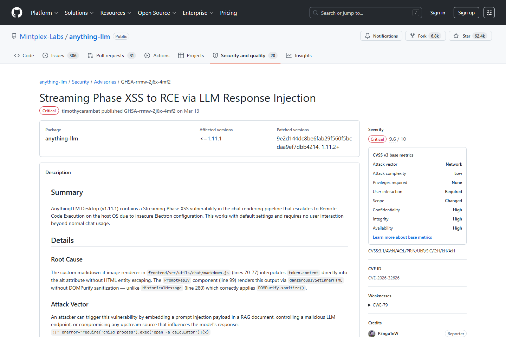
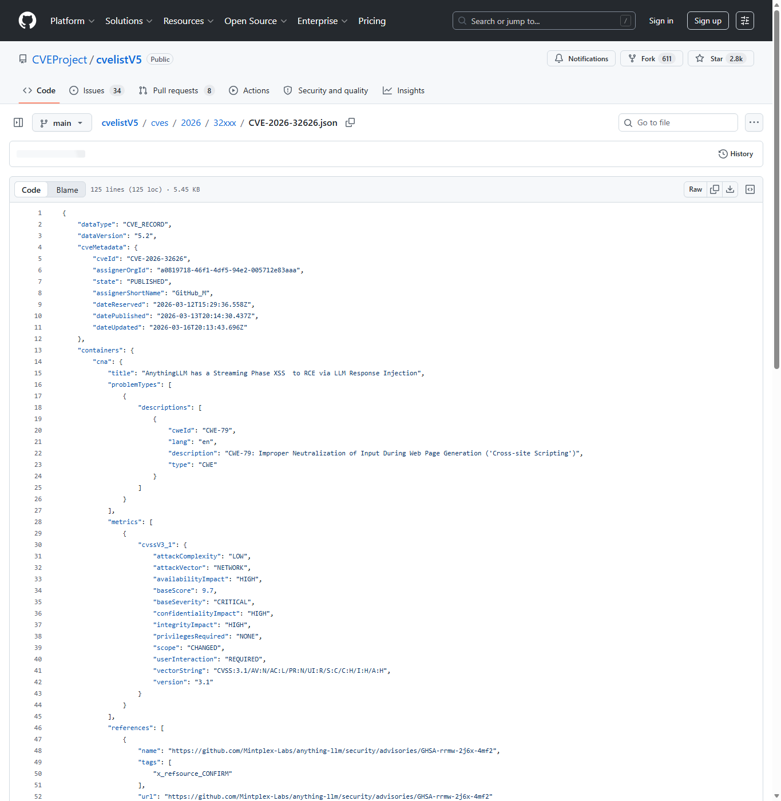
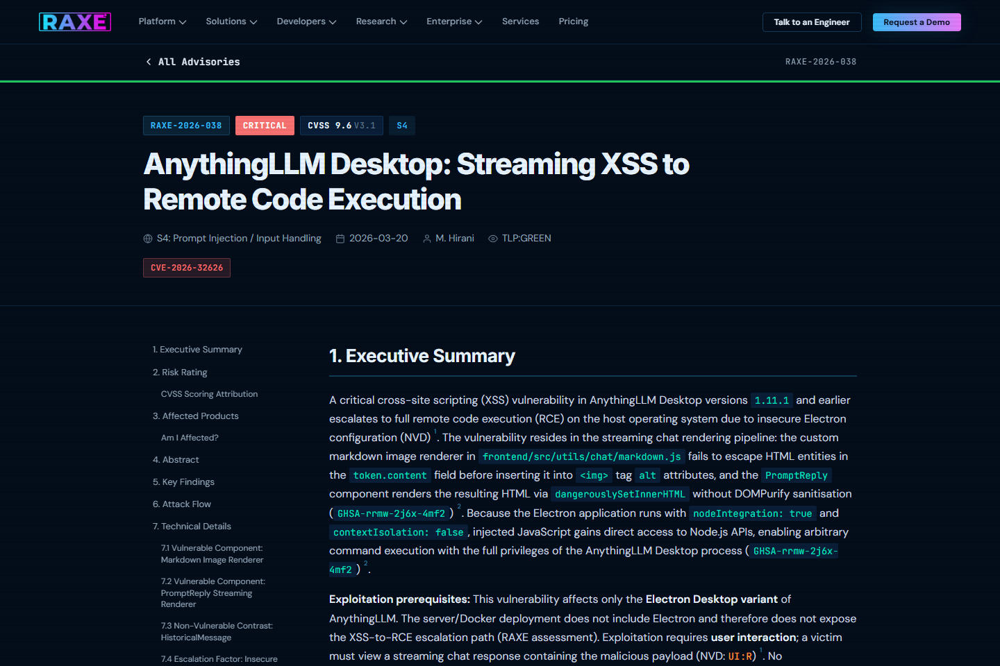
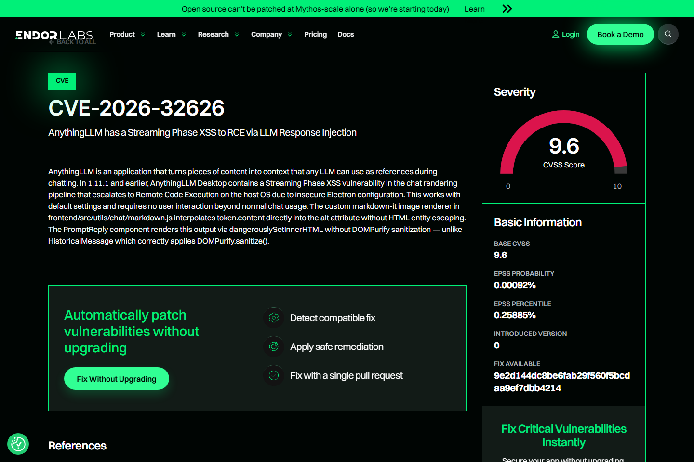
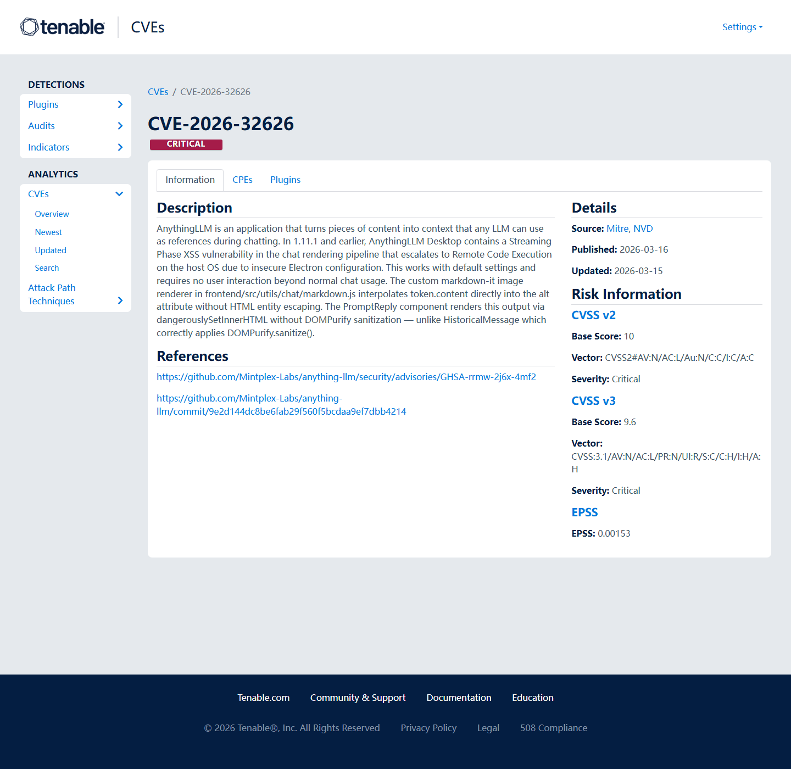
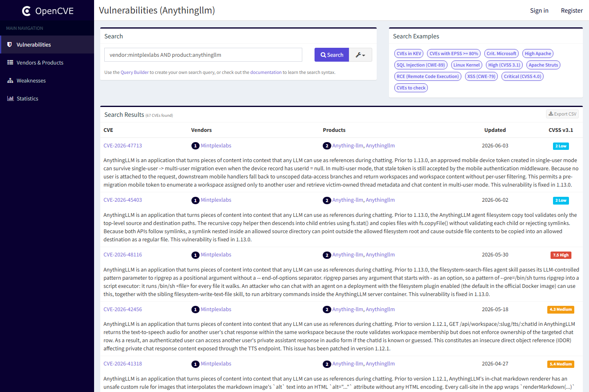

# AnythingLLM Desktop Streaming XSS to RCE (2026)
> AnythingLLM Desktop 流式响应 XSS 到远程代码执行

| Field | Value |
|---|---|
| Category | domain-specific |
| Severity | Critical |
| AI Tool | AnythingLLM Desktop, Electron, LLM chat rendering pipeline |
| Language | JavaScript, TypeScript |
| Real Incident | Yes |
| Reproducible | Yes |
| Disclosed | 2026-03-20 |
| CVE | CVE-2026-32626 |
| CVSS | 9.6 |

## TL;DR
AnythingLLM Desktop let a malicious streaming LLM response escalate from XSS to host RCE.
> AnythingLLM Desktop 流式响应 XSS 到远程代码执行：默认桌面部署中可从聊天响应进入宿主机命令执行，影响机密性、完整性与可用性。

---

## 基本信息

| 项目 | 内容 |
|---|---|
| 案例时间 | 2026-03-20 |
| 事件对象 | AnythingLLM Desktop v1.11.1 及更早版本 |
| 事件类型 | 流式聊天渲染链路中的 XSS 到 Electron 主机 RCE |
| 攻击入口 | 攻击者控制或影响模型返回的流式聊天内容，用户在桌面客户端正常查看响应时触发渲染缺陷。 |
| 主要影响 | 默认桌面部署中可从聊天响应进入宿主机命令执行，影响机密性、完整性与可用性。 |
| 修复方向 | 升级到修复版本，并在桌面 AI 客户端中把不可信模型输出作为浏览器不可信内容处理。 |

## 摘要

该案例的核心不在于传统 Web 页面对用户输入的渲染错误，而在于 AI 桌面客户端把模型输出直接放进了具备本地能力的 Electron 运行环境。公开 Advisory 将 CVE-2026-32626 描述为 AnythingLLM Desktop 的 Streaming Phase XSS，漏洞发生在聊天响应的流式渲染阶段，恶意内容能够在默认桌面环境中从脚本执行升级为宿主机远程代码执行。
这一点让它比普通前端 XSS 更值得关注。桌面 AI 客户端常被放在开发者、运营人员或数据分析人员的工作机上，旁边就是本地文件、浏览器会话、企业 VPN 和内部开发环境。聊天响应原本只是用户与模型之间的内容交互，但在 Electron 场景中，渲染器权限和本机桥接配置会决定它是否能继续触达系统资源。

## 一、公开材料概况

GitHub Security Advisory、CVEProject cvelistV5、RAXE Labs、Endor Labs、Tenable 和 OpenCVE 分别覆盖了影响版本、CVSS 评分、触发条件、部署形态和修复方向。公开记录显示，受影响对象集中在 Desktop/Electron 形态，服务端或 Docker 部署不具备同样的 Electron 升级路径。
多个来源对“流式响应阶段”这一触发点的描述基本一致。模型输出可能来自远程模型、知识库检索结果、外部网页摘要或共享工作区内容，来源链条比传统输入框更长。只要其中一环能影响最终响应内容，桌面端渲染策略就会成为最后一道防线。

| 来源 | 类型 | 证明内容 |
|---|---|---|
| GitHub Security Advisory: Streaming Phase XSS to RCE via LLM Response Injection | 主证据 | 确认 CVE、影响版本、漏洞类型和修复方向。 |
| CVEProject cvelistV5: CVE-2026-32626 | 主证据 | 确认 CVSS 9.6、攻击向量和 CNA 描述。 |
| RAXE Labs: AnythingLLM Desktop Streaming XSS to RCE | 技术证据 | 说明 Desktop/Electron 形态、触发条件和部署差异。 |
| Endor Labs: CVE-2026-32626 | 复核证据 | 复核受影响版本和 RCE 影响。 |
| Tenable: CVE-2026-32626 | 复核证据 | 提供影响、缓解和风险摘要。 |
| OpenCVE: AnythingLLM CVE listing | 生态证据 | 显示 AnythingLLM 相关 2026 漏洞族和产品安全背景。 |

## 二、系统背景与触发条件

AnythingLLM 的桌面形态把本地知识库、聊天界面和模型响应聚合在同一工作台中。这个形态给用户带来低门槛使用体验，也让模型输出、渲染器权限和本机能力靠得更近。只要聊天响应被当作可信 UI 内容处理，模型输出就会成为桌面应用的输入边界，而不是普通文本。
在企业内部部署中，AnythingLLM 这类工具往往还会连接私有文档、团队知识库和模型网关。用户使用它时会自然地复制敏感上下文、请求总结内部材料或让模型协助处理代码。攻击者不必直接攻破后端服务，只要能让恶意内容进入用户即将查看的响应，就可能把“内容污染”转化为“客户端执行”。

## 三、攻击链路与处置过程

攻击链从流式响应进入。攻击者不需要直接登录受害者设备，而是让受害者客户端接收到含恶意结构的 LLM 响应；渲染阶段执行脚本后，Electron 配置把原本应限制在界面的脚本能力连接到宿主机。由于触发点位于用户正常阅读聊天内容的过程中，风险更接近 AI 客户端内容供应链问题，而不是单纯网页 XSS。
实际处置时，除了升级版本，还需要回看模型连接器、共享对话、知识库导入和外部检索源。若同一恶意片段曾经进入团队知识库或共享提示模板，单个终端修复并不能完全清除风险。对桌面客户端而言，安全更新、缓存清理和历史会话处理应放在同一响应流程里考虑。

## 四、技术根因分析

技术根因由两层组成。第一层是聊天渲染管线未把模型输出视为强不可信内容，流式拼接和展示没有把脚本、事件处理器或可执行上下文彻底隔离。第二层是 Electron 桌面应用的安全配置没有把渲染进程和本机能力切开，使得前端脚本执行可以跨到本机执行面。任何一层单独收紧，都能显著降低影响。
流式渲染尤其容易引入边界错误，因为响应不是一次性完整文本，而是不断到达、拼接和更新的片段。若清洗逻辑只在最终 HTML 或部分节点上生效，攻击者可以利用中间状态、标签闭合或富文本解析差异制造可执行上下文。AI 客户端需要把 Markdown、HTML、代码块和模型工具结果统一放入同一套不可信内容管线，而不是按显示效果分别处理。

## 五、AI 参与方式与风险归因

AI 参与方式体现在输出通道本身：模型响应是漏洞的载体，桌面 AI 客户端是执行环境，用户的正常阅读动作是触发条件。归因应落在渲染隔离、Electron 权限配置和模型输出信任策略上，而不是笼统指向模型生成了某段文本。
这个案例也提醒我们，AI 安全不只发生在提示词和模型权重层面。模型输出一旦被产品当作 UI、脚本、文件或指令来解释，传统客户端安全问题就会重新出现，并且因为内容来源复杂而更难追溯。治理重点应放在“模型输出到产品动作”的转换点上。

## 六、与团队技术报告风险框架的关系

团队风险框架中提到，AI 代码与 Agent 系统的安全边界正在从代码仓库扩展到工具调用、运行环境和数据通道。本案例对应的是 AI 应用生成内容进入高权限桌面运行时后的边界重塑，说明 AI 输出应按外部输入管理，桌面客户端也需要类似浏览器的内容安全模型。

## 七、影响范围与治理建议

CVSS 9.6 反映出该漏洞一旦触发即可造成高影响。对企业桌面知识库或客服辅助场景而言，攻击者可能借由模型响应影响开发者或运营人员设备，进一步触达本地文件、凭据和内部网络访问能力。RAXE 的部署差异说明，评估风险时必须区分 Desktop、Server 和 Docker 形态。

治理重点是把模型输出、第三方连接器返回值和知识库内容统一纳入不可信内容处理；Electron 应关闭高危桥接能力，启用严格 CSP、上下文隔离和最小化 preload 接口；桌面 AI 客户端还应提供可审计的安全更新提示，避免用户长期停留在受影响版本。
安全团队还应建立桌面 AI 客户端资产清单，特别关注开发机和高权限运维终端。对已经部署的版本，应检查是否存在异常子进程、可疑外联、被篡改的本地知识库内容以及异常会话记录。长期看，桌面 AI 产品需要像浏览器一样，把内容沙箱、扩展权限和本地能力桥接作为默认安全模型的一部分。

## 八、结论

AnythingLLM 案例展示了 AI 桌面客户端的典型风险：看似只是聊天响应，实际处在可触达本机能力的应用内部。AI 应用安全不能只检查后端 API，也要检查渲染器、桌面运行时和模型输出之间的权限转换路径。
对使用者而言，最重要的经验是不要把模型响应当成“只读文本”。只要产品把响应送入富文本渲染器、桌面运行时或本地工具链，它就进入了软件执行边界。未来同类产品的安全评估，应同时覆盖模型输入输出链、客户端沙箱和更新机制。

## 参考来源

1. [GitHub Security Advisory: Streaming Phase XSS to RCE via LLM Response Injection](https://github.com/Mintplex-Labs/anything-llm/security/advisories/GHSA-rrmw-2j6x-4mf2)
2. [CVEProject cvelistV5: CVE-2026-32626](https://github.com/CVEProject/cvelistV5/blob/main/cves/2026/32xxx/CVE-2026-32626.json)
3. [RAXE Labs: AnythingLLM Desktop Streaming XSS to RCE](https://raxe.ai/labs/advisories/RAXE-2026-038)
4. [Endor Labs: CVE-2026-32626](https://www.endorlabs.com/vulnerability/cve-2026-32626)
5. [Tenable: CVE-2026-32626](https://www.tenable.com/cve/CVE-2026-32626)
6. [OpenCVE: AnythingLLM CVE listing](https://app.opencve.io/cve/?product=anythingllm&vendor=mintplexlabs)
