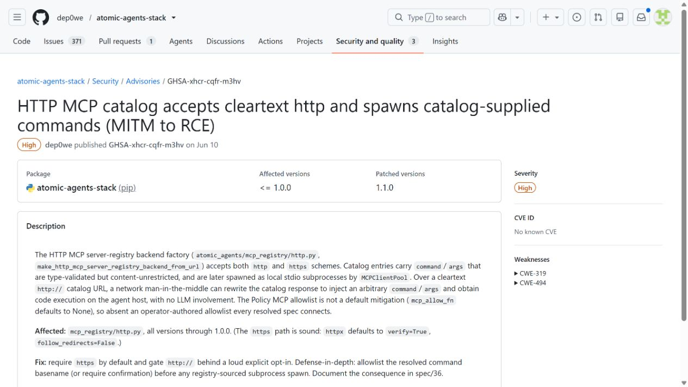
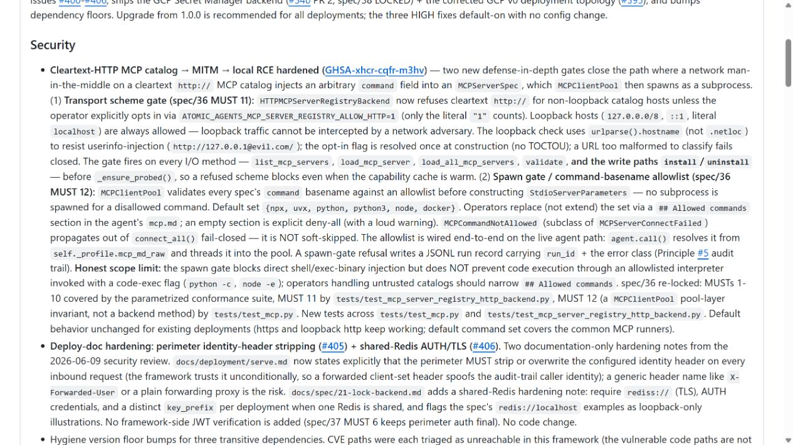
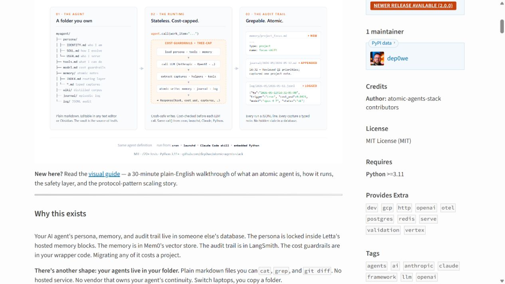
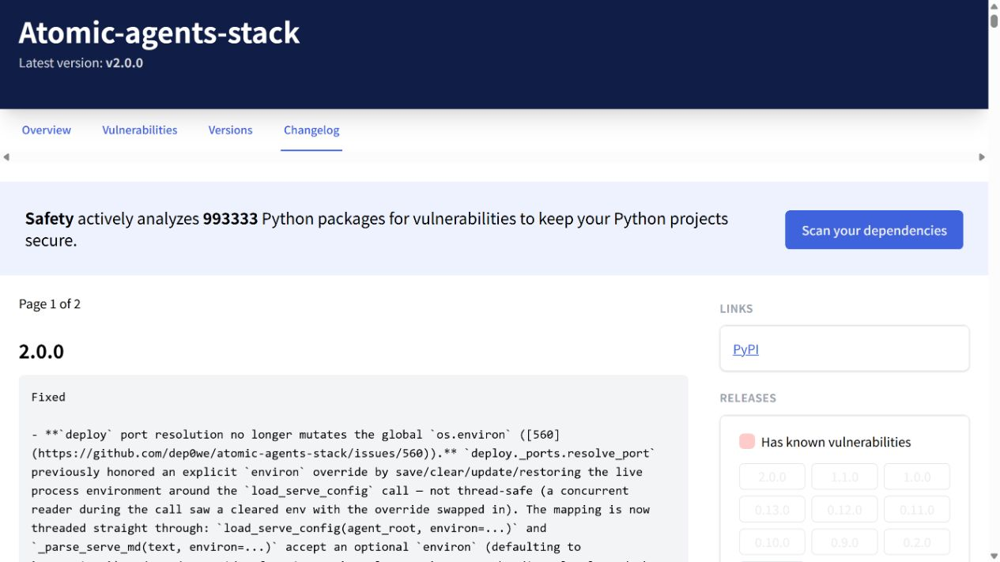
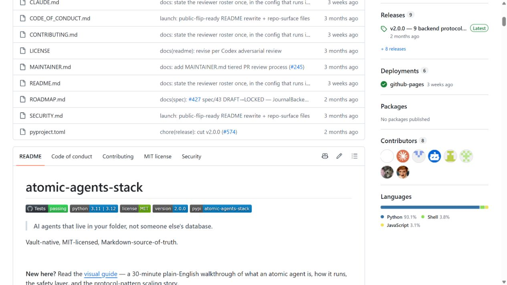

# Atomic Agents MCP Catalog Man-in-the-Middle Command Execution (2026)
> Atomic Agents MCP 目录明文传输导致本地命令执行

| Field | Value |
|---|---|
| Category | supply-chain |
| Severity | High |
| AI Tool | Atomic Agents Stack, MCPClientPool |
| Language | Python |
| Real Incident | Yes |
| Reproducible | Yes |
| Disclosed | 2026-06-18 |

## TL;DR
Atomic Agents Stack 从明文 HTTP 目录取得 MCP 启动命令并在本机创建进程，网络中间人可篡改目录响应，把一个远程服务清单变成本地命令执行入口。

---

## 详细分析 / Full Analysis

## 一、事件概况

Atomic Agents Stack 提供可发现并启动 MCP 服务的目录机制。2026 年 6 月的 GHSA-xhcr-cqfr-m3hv 指出，1.0.0 及更早版本允许从明文 HTTP catalog 拉取服务器定义，随后由 `MCPClientPool` 使用返回的 `command` 和 `args` 创建本地进程。1.1.0 强制目录使用 HTTPS，并限制可接受的命令。

风险来自两个正常功能的连接：远端目录负责描述工具，本地客户端负责启动工具。旧版没有在两者之间建立可信发布关系，因此能够修改网络响应的人不需要攻破包仓库，也能让代理主机运行任意程序。

## 二、公开材料与事实核对

项目安全公告给出攻击链和修复措施，1.1.0 release、PyPI 与 Safety 的版本记录相互对应，项目首页说明目录与 MCP 集成的用途。当前公开记录没有 CVE 编号，材料中不设置相关字段。

| 来源 | 类型 | 主要内容 |
|---|---|---|
| GitHub Advisory | 项目公告 | 明文目录到进程启动的链路 |
| 1.1.0 Release | 修复记录 | HTTPS 与命令约束 |
| PyPI | 包生态记录 | 修复包可用性 |
| Safety | 第三方包记录 | 版本变化复核 |
| 项目首页 | 产品资料 | MCP 目录与客户端能力 |

## 三、攻击或事件链路

当客户端访问 `http://` 目录时，同一网络内的攻击者、被污染的代理或 DNS/路由控制者都可能返回修改后的 JSON。恶意响应把正常 MCP server 的启动项替换为本地解释器、包管理器或攻击者准备的程序。客户端随后按目录内容创建子进程，子进程继承代理运行账户能够访问的文件和环境变量。

这条链路不要求 LLM 接受一段明显的恶意提示，用户只要让 Agent 连接某个目录或安装推荐工具即可触发。若目录地址本身来自任务文档或模型推荐，社会工程与网络篡改还能叠加。

## 四、技术根因

旧设计默认 catalog 返回的是配置数据，却没有认识到 `command` 和 `args` 本质上是可执行代码。HTTP 缺少传输完整性只是第一层问题；即便改成 HTTPS，目录服务被入侵、账户被接管或错误发布后，客户端仍需要限制可启动程序。

1.1.0 同时增加传输要求和命令基名约束，方向合理。更完整的方案还应让目录条目带签名、固定发布者身份和包哈希，并在首次启动时展示实际二进制路径。只允许某个命令名也要防止 PATH 劫持。

## 五、AI 安全问题

MCP 生态把“发现工具”和“运行工具”压缩成几步自动流程，这对 Agent 很便利，也缩短了从外部元数据到本机执行的距离。传统插件市场至少有安装包、签名和权限提示；动态目录若直接提供启动命令，目录响应实际上承担了软件仓库的角色，却可能没有同等级别的控制。

AI 代理还会根据任务自行选择工具，用户不一定逐条检查来源。目录结果应被当作不可信供应链输入，而不是模型已经验证过的推荐。模型能解释工具用途，不能证明二进制身份。

## 六、影响、处置与排查

公告证明漏洞可复现，但没有披露已确认的在野入侵。受影响部署应升级到 1.1.0 以上，并清点历史 catalog URL、缓存的服务器定义和 MCP 子进程记录。重点检查通过 HTTP 获取的目录、非常见解释器、从临时目录启动的程序以及启动后立即访问凭据文件或外网的进程。

如曾在带有开发者令牌的工作站运行未知 MCP server，仅删除配置不足以排除影响，还需检查持久化项、Git 修改和令牌使用日志。目录服务运营者则应核对发布账户与条目变更历史。

## 七、治理建议

部署方可以只允许组织维护的 HTTPS 目录，并用出站代理阻断明文请求。服务器条目应固定到包版本、摘要和签名，运行时使用绝对路径，不从可写目录解析命令。新增 MCP 服务时，界面要清楚显示发布者、将启动的程序和所需权限。

框架侧可把远程 catalog 限制为发现信息，真正安装与启动交给独立的受信任组件。这样目录被篡改时，最多影响候选工具列表，不会自动取得本地进程能力。

## 八、结论

Atomic Agents 事件是 MCP 供应链的典型失配：一份远端 JSON 被当作配置读取，却在下一步拥有了代码执行含义。1.1.0 修复了已公开入口，使用方仍应把目录、插件清单和技能安装建议纳入软件供应链管理。对于能自动选用工具的 Agent，来源验证必须发生在模型之外。

### 参考来源

1. [GitHub Security Advisory GHSA-xhcr-cqfr-m3hv](https://github.com/dep0we/atomic-agents-stack/security/advisories/GHSA-xhcr-cqfr-m3hv)
2. [Atomic Agents Stack 1.1.0 release](https://github.com/dep0we/atomic-agents-stack/releases/tag/v1.1.0)
3. [PyPI atomic-agents-stack 1.1.0](https://pypi.org/project/atomic-agents-stack/1.1.0/)
4. [Safety package changelog](https://data.safetycli.com/packages/pypi/atomic-agents-stack/changelog)
5. [Atomic Agents Stack project](https://github.com/dep0we/atomic-agents-stack)
