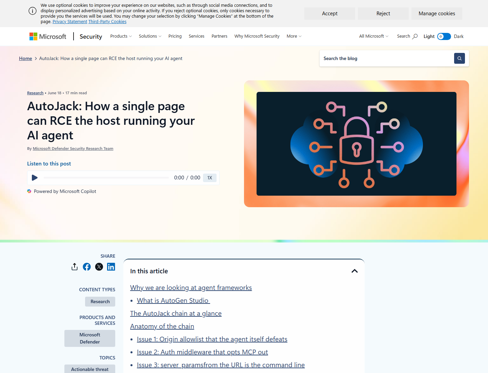
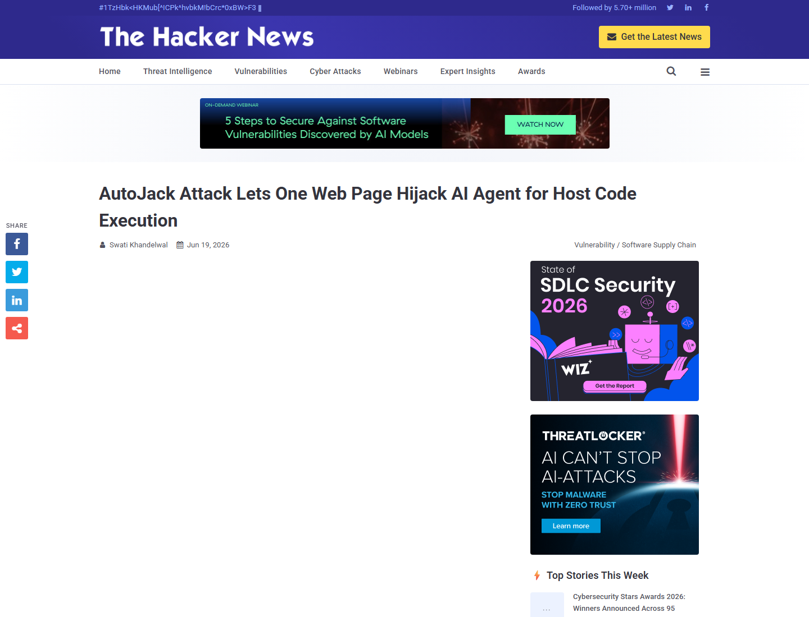
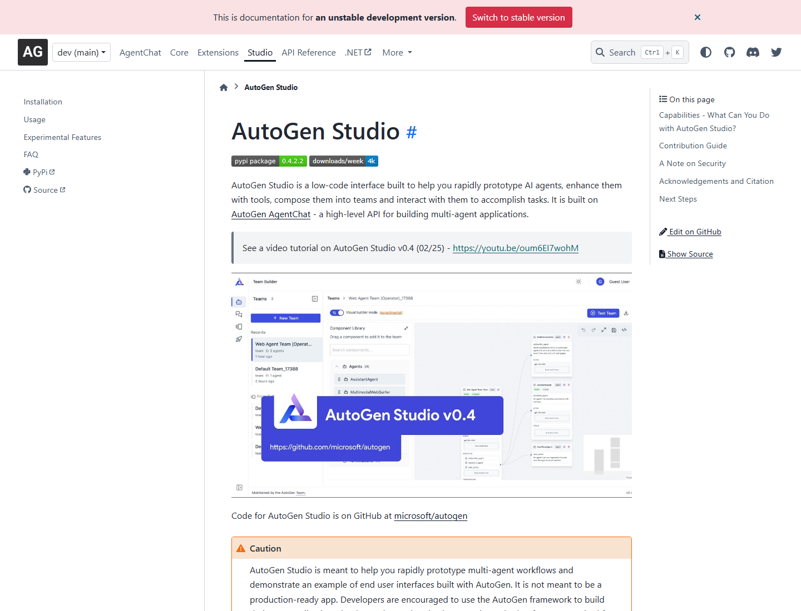
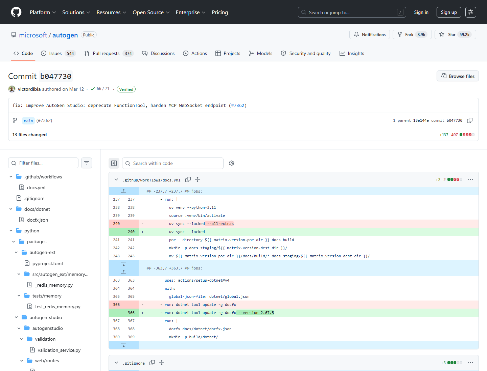
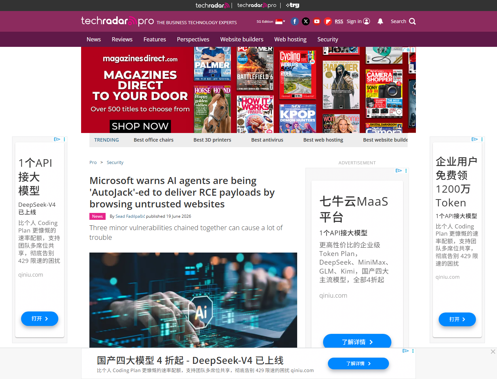
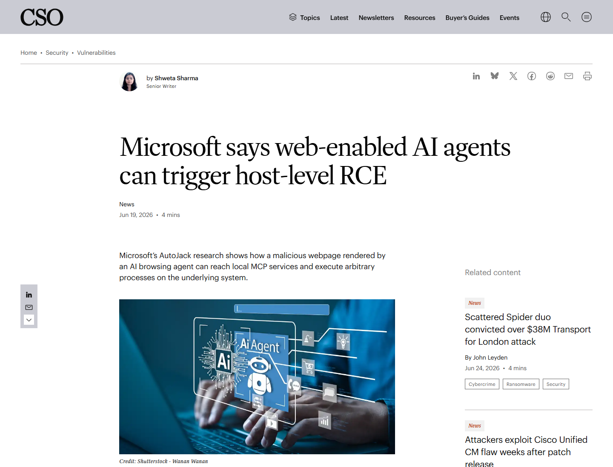

# AutoGen Studio AutoJack Localhost RCE Chain (2026)
> AutoGen Studio AutoJack 本地控制面远程代码执行链

| Field | Value |
|---|---|
| Category | Agent Risk |
| Severity | High |
| AI Tool | AutoGen Studio, AutoGen, AI browsing agents, MCP WebSocket |
| Language | Python / JavaScript |
| Real Incident | Yes |
| Reproducible | Yes |
| Disclosed | 2026-06-18 |
| CVE | N/A |

## TL;DR
AutoJack showed that a malicious webpage rendered by a local AI browsing agent could reach AutoGen Studio's MCP WebSocket on localhost and make the host spawn an attacker-chosen process.
> AutoJack 展示了一条 AI 代理特有的攻击链：代理浏览恶意网页后，网页脚本借用本机身份连到 AutoGen Studio 的 MCP WebSocket，并触发宿主机执行攻击者指定的命令。

---

## 详细分析 / Full Analysis

# AutoJack 案例分析：AI 浏览代理、localhost 控制面与 MCP WebSocket RCE

## 基本信息

AutoGen Studio 是 Microsoft Research AutoGen 生态中的低代码界面，用来快速原型化多智能体工作流、挂载工具、调试团队协作和运行实验。2026 年 6 月，Microsoft Defender Security Research Team 披露了 AutoJack：一个由 AI 浏览代理加载恶意网页后触发的远程代码执行链。问题出现在 AutoGen Studio 的本地 MCP WebSocket 控制面，攻击者只需要让代理渲染一页受控内容，就可能让本机 AutoGen Studio 进程执行任意命令。

微软的原始披露给出了链条的核心条件：AutoGen Studio 暴露了一个只信任 localhost 的 MCP WebSocket；认证中间件对 `/api/mcp/*` 路径放行；`server_params` 参数被解码后可进入 stdio MCP server 启动流程。单看这些点都像是开发原型里的便利设计，但当 AI 浏览代理在同一台机器上打开不可信网页时，网页脚本可以借助“本机浏览器”的身份跨过原本用于挡住外部站点的 localhost 判断。[Microsoft Security Blog](https://www.microsoft.com/en-us/security/blog/2026/06/18/autojack-single-page-rce-host-running-ai-agent/)

## 一、事件核验与证据范围

### 证据矩阵

| 来源 | 类型 | 证明内容 | 备注 |
|---|---|---|---|
| Microsoft Security Blog | 原始披露 / 技术证据 | AutoJack 名称、三段漏洞链、MCP WebSocket、localhost 信任问题、修复 commit | 微软研究团队原文 |
| The Hacker News | 复核证据 | 预发布包 0.4.3.dev1 / 0.4.3.dev2 包含 vulnerable handler，稳定安装路径差异 | 对 PyPI 包细节做了额外核验 |
| BleepingComputer | 复核 / 影响证据 | 恶意网页可操纵代理执行宿主命令，开发期 GitHub 构建窗口受影响 | 媒体复核 |
| TechRadar / CSO Online | 复核证据 | 三个弱点组合、AI 浏览代理导致 localhost 保护失效、隔离建议 | 面向安全团队的解释 |
| GitHub commit b047730 | 修复证据 | harden MCP WebSocket endpoint，PR #7362，相关文件变更 | 上游代码证据 |
| AutoGen Studio 官方文档 | 背景证据 | Studio 是原型化多智能体工具，并提示不是生产就绪应用 | 解释受影响系统定位 |

The Hacker News 对包分发细节做了补充：普通 `pip install autogenstudio` 拉取的稳定版本 0.4.2.2 没有 MCP route；但 0.4.3.dev1 和 0.4.3.dev2 两个 PyPI 预发布包包含了相关 handler。这个差异影响暴露面判断，也说明该案例更适合作为“AI 代理开发工具控制面风险”的案例，而不是按传统产品级 CVE 扩散来写。[The Hacker News](https://thehackernews.com/2026/06/autojack-attack-lets-one-web-page.html)

## 二、系统背景与触发条件

AutoGen Studio 的定位是让开发者用图形界面快速组合 agents、tools、models 和 termination conditions，再在 Playground 中与多智能体团队交互。官方文档明确把它描述为研究原型和开发体验工具，并提示生产应用应自行实现认证、安全和权限控制。这样的定位并不会降低风险：原型工具往往运行在开发者工作站上，而工作站同时持有源代码、云凭据、本地文件、模型 API key 和内部系统访问能力。

触发条件集中在“同机运行”这一点。攻击者准备一页包含 WebSocket 连接逻辑的网页，然后诱导 AI 浏览代理访问它，例如让代理总结一个 URL、抓取网页内容或执行网页检索任务。代理的浏览器或 Playwright 进程运行在开发者机器上，因此它向 `localhost` 发起连接时，在本机服务看来并不像远程攻击流量。AutoGen Studio 的 MCP 控制面如果也运行在同一台机器上，这条访问路径就成立。

## 三、攻击链与处置过程

AutoJack 的链条分成三步。第一步是 Origin allowlist 信任 `http://127.0.0.1` 或 `http://localhost`，但 AI 浏览代理加载的网页也能从本机进程发起请求。第二步是认证中间件跳过 MCP WebSocket 路径，而 handler 没有在握手时补上认证。第三步是 endpoint 接收 URL 中的 `server_params`，解码后把 command 与 args 交给 stdio client 启动。三步连起来，攻击者页面就能把 AutoGen Studio 变成宿主机进程启动器。

微软披露后，上游主分支通过 commit `b047730` 做了加固，提交说明中直接写到 “harden MCP WebSocket endpoint”。公开 diff 显示，该提交属于 PR #7362，并修改了 AutoGen Studio MCP route 等相关文件。The Hacker News 对修复效果的描述是：命令参数不再直接从 URL 读取，而是改为服务端保存、一次性 session ID 引用，并让 MCP route 进入正常认证路径。[GitHub commit b047730](https://github.com/microsoft/autogen/commit/b047730)

## 四、技术根因分析

根因并不是某一个单点输入过滤错误，而是 AI 代理把两个原本分开的安全假设接了起来。传统 Web 防护里，localhost 或 loopback 常被当作本机开发服务的临时保护层；传统浏览器威胁模型里，外部网页受 Origin 和网络边界约束，不能随便访问本机控制面。AI 浏览代理打破了这个组合：代理会主动替用户打开不可信页面，而页面脚本运行在与本地工具同机的浏览环境里。

第二个根因是 MCP server 启动能力被当作开发便利暴露到 WebSocket 参数上。MCP 的价值在于让 agent 连接工具、文件系统、API 和执行环境；但如果 MCP 控制面接受来自网页可控路径的参数，并且缺少 allowlist、会话绑定和认证，就会把“连接工具”的能力变成“启动任意进程”的能力。AI agent 越能浏览网页、执行代码、调用工具，这类控制面越需要被看作高敏感执行入口。

## 五、AI 参与方式与风险归因

这个案例中的 AI 参与方式很清楚：模型本身不需要产生恶意代码，也不需要主动绕过策略；风险来自 AI 代理运行时把不可信网页内容、浏览器自动化、本地控制面和工具执行能力放在同一个信任域里。恶意网页扮演输入源，浏览代理扮演“受信本机请求发起者”，AutoGen Studio MCP WebSocket 扮演高权限控制面。

风险归因应落在 agent framework 的运行时边界上。开发者为了让 agents 能浏览、调试、连接 MCP server 和快速执行工具，经常把这些能力放在本机原型环境中；当控制面缺少认证、授权、allowlist 和进程隔离时，外部网页就可能借代理进入本地开发面。CSO Online 对此的概括是，AutoJack 说明 localhost 在 web-enabled AI agents 场景下不能再被自然视为安全边界。[CSO Online](https://www.csoonline.com/article/4187155/microsoft-says-web-enabled-ai-agents-can-trigger-host-level-rce.html)

## 六、与团队技术报告风险框架的关系

团队技术报告中关于 AI 代码与智能体风险的一个核心问题，是“模型输出”之外的工具链执行面。AutoJack 正好补上这个维度：即使用户没有请求执行危险命令，agent 的浏览动作也可能把网页脚本带到本地控制面前；即使工具本身是为了方便开发和集成 MCP server，未认证的控制面也会把原型工具变成攻击通道。

这个案例也说明，AI 安全治理不能只盯 prompt injection 文本层。真实部署里，agent 会同时接触浏览器、WebSocket、文件系统、MCP、代码执行器、云凭据和开发者账号。安全评估需要把这些组件按同一条执行链审视：哪些输入能进入 agent，哪些本地服务信任 agent，哪些参数能启动工具，哪些凭据会随进程暴露。

## 七、影响范围与社会后果

公开材料显示，AutoJack 被微软在开发阶段发现并推动上游修复；BleepingComputer 报道称，从 GitHub 主分支在特定窗口构建 AutoGen Studio 的开发者可能受影响。The Hacker News 的包复核让影响范围更具体：普通稳定 PyPI 安装路径没有 MCP route，而安装或固定到两个预发布版本的用户需要按 GitHub main 中的修复处理。

社会后果不只在 AutoGen Studio 一个项目。微软在披露中强调，这种模式可能在其他 agent framework 中重复出现：强大的本地服务、localhost-only 假设、未认证控制面，以及会打开不可信网页的 agent。企业和研究团队如果把 agent 原型放在拥有源代码、云权限和内部网络访问能力的开发机上，就需要把浏览代理与本地执行服务隔离，否则一页网页就可能成为本机执行入口。

## 八、治理建议

对 AutoGen Studio 相关用户，处置重点是避开受影响的开发期或预发布构建，使用包含 `b047730` 或后续加固代码的上游版本，并检查是否曾经安装 0.4.3.dev1 / 0.4.3.dev2。若需要继续测试 agent 浏览能力，应把 AutoGen Studio、浏览代理、代码执行器和 MCP server 放到不同容器、虚拟机或低权限账号中运行。

对同类 AI agent 平台，MCP 与本地工具控制面应默认认证、授权和会话绑定；WebSocket 不能只依赖 Origin 或 localhost allowlist；可执行命令、MCP server 参数和工具路径应使用 allowlist；agent 浏览不可信页面时应禁用或隔离对本地 privileged service 的访问。开发原型也应该采用最小权限、短生命周期凭据和可丢弃工作区，避免把实验环境直接放在高价值开发机上。

## 九、结论

AutoJack 的价值在于把一个抽象的 agent 安全问题变成了可复核的技术链条。AI 浏览代理会主动接触开放网页，本地 MCP 控制面又拥有启动工具和进程的能力；当二者共享 localhost 信任域时，传统开发便利会变成 RCE 入口。这个案例提醒我们，agent framework 的安全边界必须覆盖浏览器自动化、MCP、WebSocket、工具启动和本地凭据，而不能只停留在模型回复内容的审查上。

## 参考来源

- [Microsoft Security Blog: AutoJack](https://www.microsoft.com/en-us/security/blog/2026/06/18/autojack-single-page-rce-host-running-ai-agent/)
- [The Hacker News: AutoJack attack lets one web page hijack AI agent](https://thehackernews.com/2026/06/autojack-attack-lets-one-web-page.html)
- [BleepingComputer: Microsoft fixes AutoGen Studio flaw](https://www.bleepingcomputer.com/news/security/microsoft-fixes-autogen-studio-flaw-that-enabled-code-execution/)
- [TechRadar: Microsoft warns AI agents are being AutoJack-ed](https://www.techradar.com/pro/security/microsoft-warns-ai-agents-are-being-autojack-ed-to-deliver-rce-payloads-by-browsing-untrusted-websites)
- [CSO Online: Web-enabled AI agents can trigger host-level RCE](https://www.csoonline.com/article/4187155/microsoft-says-web-enabled-ai-agents-can-trigger-host-level-rce.html)
- [GitHub: AutoGen hardening commit b047730](https://github.com/microsoft/autogen/commit/b047730)
- [AutoGen Studio official documentation](https://microsoft.github.io/autogen/dev//user-guide/autogenstudio-user-guide/index.html)
