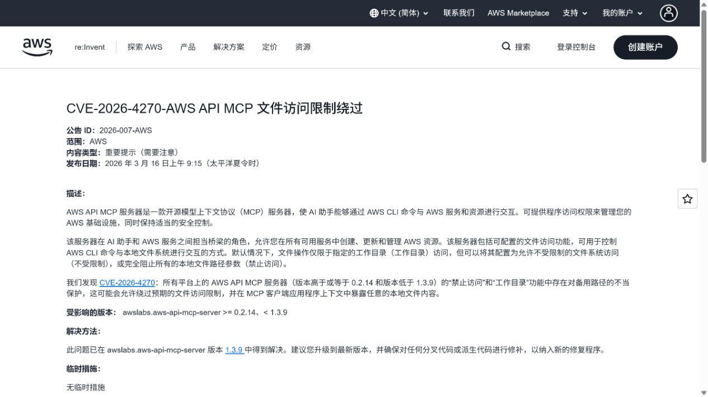
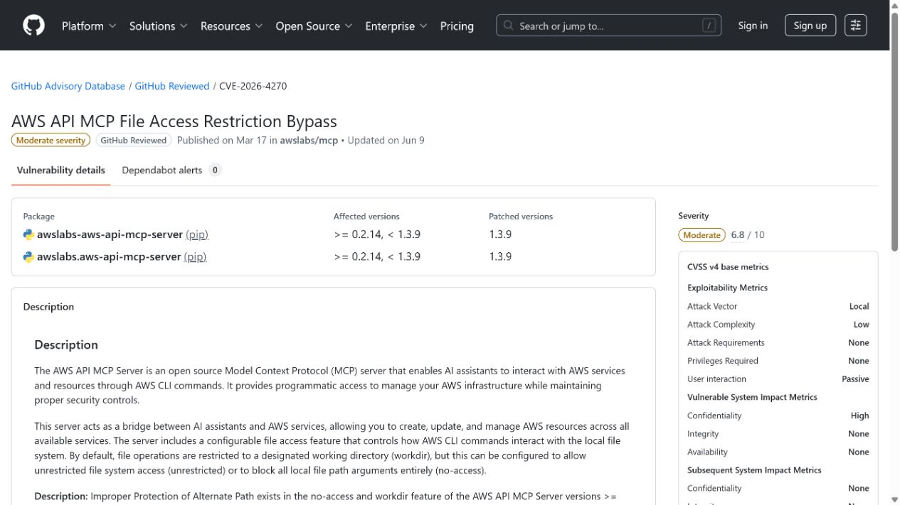
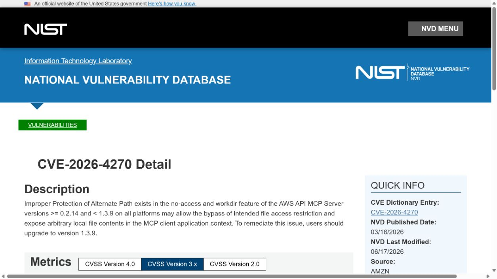
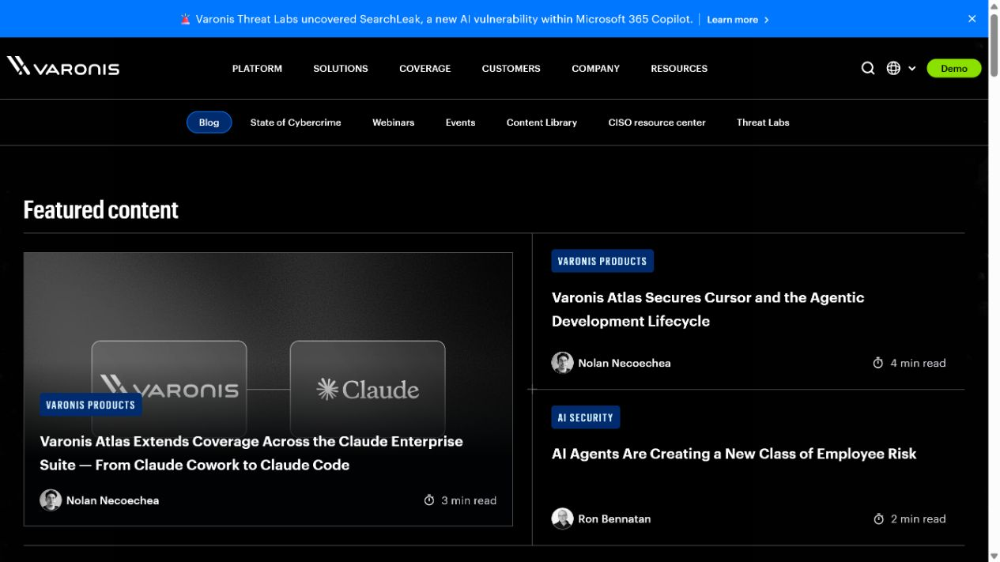
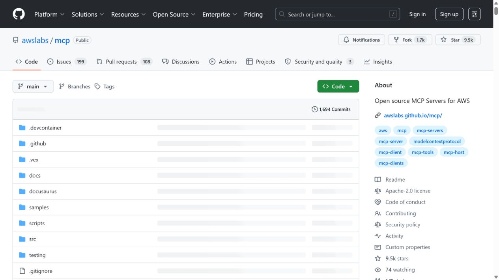

# AWS API MCP Server File Access Restriction Bypass (2026)
> AWS API MCP Server 文件访问限制绕过漏洞

| Field | Value |
|---|---|
| Category | Cloud / IaC |
| Severity | High |
| AI Tool | AWS API MCP Server, Model Context Protocol, AWS CLI |
| Language | Python / TypeScript / AWS CLI |
| Real Incident | Yes |
| Reproducible | Yes |
| Disclosed | 2026-03-16 |
| CVE | CVE-2026-4270 |

## TL;DR
AWS API MCP Server path controls could be bypassed through alternate path syntax, exposing arbitrary local file contents to the AI client despite no-access or workdir restrictions.
> AWS API MCP Server 的路径控制可被备用路径语法绕过，即使配置了 no-access 或 workdir 限制，AI 客户端上下文仍可能得到任意本地文件内容。

---

## 详细分析 / Full Analysis

## 一、基本信息与事件概况

CVE-2026-4270 影响 AWS API MCP Server。该服务让 AI 助手经由 Model Context Protocol 调用 AWS CLI 并管理云资源，同时提供 no-access 与 workdir 选项限制工具参数访问本地文件。AWS 确认，在 0.2.14 至 1.3.8 版本中，备用路径处理不当可绕过这些限制，使任意本地文件内容进入 MCP 客户端上下文。

这类暴露在 Agent 场景中尤其敏感，因为本地文件可能含有 AWS 凭据、配置、源代码或部署密钥。漏洞本身证明的是文件访问限制失效；是否进一步泄露给模型、聊天记录或其他用户取决于客户端如何显示和处理工具返回值。

## 二、事件经过与公开材料

AWS 于 2026 年 3 月 16 日发布安全公告 2026-007-AWS，并感谢 Varonis Threat Labs 的协调披露。公告给出受影响范围与 1.3.9 修复版本。GitHub Advisory、NVD 和多家安全数据库随后收录 CVE-2026-4270；Varonis 发布了基于 CLI shorthand syntax 的技术分析。

公告没有提及在野利用。部署者应将其作为已确认的本地文件读取边界绕过处理，重点检查历史 MCP 会话中是否调用过可带文件参数的 AWS CLI 工具。

### 证据矩阵

| 来源 | 类型 | 证明内容 |
|---|---|---|
| AWS Security Bulletin 2026-007-AWS | 厂商安全公告 | 影响版本、根因、修复版本和 MCP 产品背景 |
| GitHub Advisory: GHSA-2cpp-j2fc-qhp7 | 安全公告 | 包范围与 CVE 映射 |
| NVD: CVE-2026-4270 | 政府漏洞数据库 | CVE 状态与外部参考 |
| Varonis: AWS Remote MCP Server local file inclusion | 原始研究 | 备用路径利用思路和本地文件读取影响 |
| AWS Labs: AWS API MCP Server source repository | 独立安全通报 | 跨机构 CVE 收录 |

## 三、系统背景与触发条件

MCP server 通常运行在开发者或运维人员机器上，既能读取本地文件，又能调用云管理命令。为了减少 Agent 对主机的影响，服务会提供工作目录白名单或禁止路径参数的模式。这样的控制只有在所有等价路径表示、符号链接和 CLI 语法都被统一处理时才可靠。

AI 客户端会把工具结果作为上下文交给模型或展示给用户。因而本地文件访问不是普通命令行错误，而可能穿过 Agent 工作流，影响后续推理、日志或共享会话。最小权限必须同时覆盖主机文件和云身份。

## 四、攻击链路或失效过程

攻击者诱导或直接构造可到达 MCP 工具的请求，并在 AWS CLI 参数中使用服务未正确拒绝的备用路径语法。服务器认为访问仍符合 no-access 或 workdir 配置，却实际读取了工作目录外的本地文件。读取结果随后作为工具输出返回到 MCP 客户端。

攻击是否需要提示注入、客户端缺少确认或已有会话权限，取决于具体部署。CVE 的核心是服务端路径限制的绕过，不应把客户端层的每种触发方式都并入同一漏洞事实。

## 五、技术根因与 AI 风险分析

根因是文件访问控制只覆盖了部分路径表达，而 AWS CLI 的参数解析仍可接受等价的替代写法。安全策略若在参数字符串层做简单匹配，就容易遗漏规范化后的真实文件目标。对于 Agent 工具，应在最终解析后的文件描述符或可信包装层实施限制，而不是只过滤原始文本。

修复后仍应采用隔离的工作目录、低权限操作系统账号和短时云身份。即便路径校验正确，MCP 工具也不应能读取整个用户主目录或持久凭据位置。

MCP 工具把自然语言任务转换为本地命令和参数时，路径处理成为权限边界的一部分。模型本身未必知道某种替代写法能够绕过字符串过滤，但它可以在工具反馈的驱动下继续尝试不同参数；一旦服务端只检查表面文本，最终解析出的文件目标便可能超出预期。因而，AI Agent 的工具安全不能只依赖提示词约束或命令名称白名单，还要验证操作系统实际接收到的资源对象。

在云开发工作流中，用户主目录通常保存 CLI 配置、缓存令牌和项目文件。即使 MCP 服务器的功能只是协助查询云资源，也不应默认拥有读取这些位置的能力。把工作目录、配置文件和短时云凭据显式传入受限容器，可以使工具完成任务所需的输入更清晰；同时，审计日志应保留规范化后的路径和实际执行的子命令，方便发现超出项目目录的访问请求。

## 六、影响范围与处置建议

成功利用可使本地文件内容进入可被 Agent 使用的上下文。受影响用户应升级到 1.3.9 或更高版本，检查派生项目是否带回了旧代码，并轮换可能存放于本地文件中的 AWS 凭据。日志审计应关注异常的文件参数、工具返回中的配置片段和未预期的 CLI 调用。

公开公告没有量化泄露实例，因此本文不把可读性等同于已发生的外部数据泄露。真正的风险由文件内容、客户端显示策略和后续工具权限共同决定。

## 七、结论

AWS API MCP Server 案例说明，Agent 工具的本地文件边界不能只靠字符串规则。只要工具输出会进入模型上下文，路径解析的每个等价分支都应按凭据读取接口的标准加以保护。

## 八、参考来源

- [AWS Security Bulletin 2026-007-AWS](https://aws.amazon.com/security/security-bulletins/2026-007-AWS/)
- [GitHub Advisory: GHSA-2cpp-j2fc-qhp7](https://github.com/advisories/GHSA-2cpp-j2fc-qhp7)
- [NVD: CVE-2026-4270](https://nvd.nist.gov/vuln/detail/CVE-2026-4270)
- [Varonis: AWS Remote MCP Server local file inclusion](https://www.varonis.com/blog/aws-api-mcp-server-vulnerability)
- [AWS Labs: AWS API MCP Server source repository](https://github.com/awslabs/mcp)
