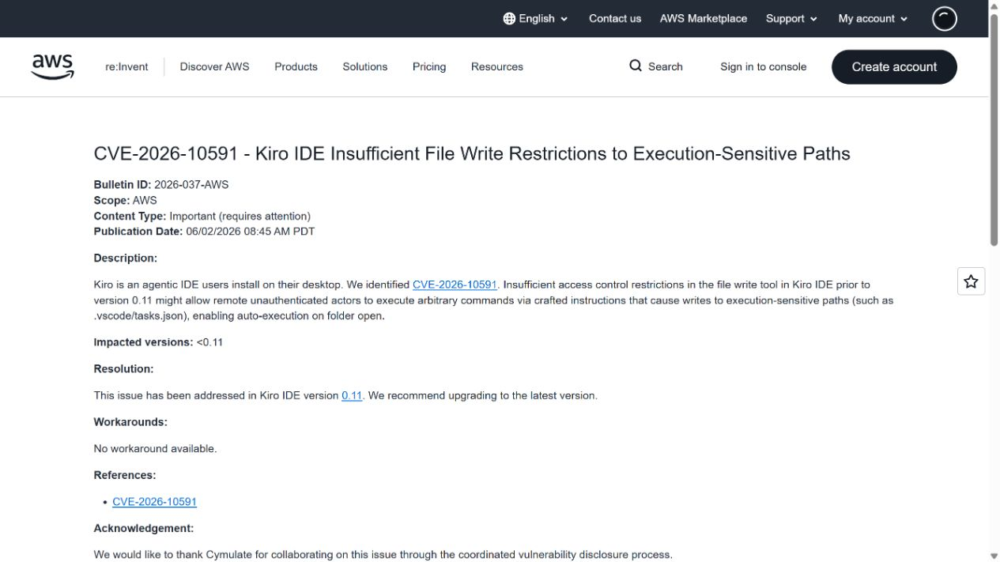
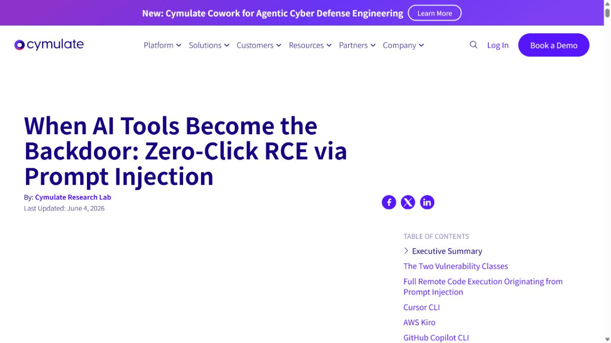
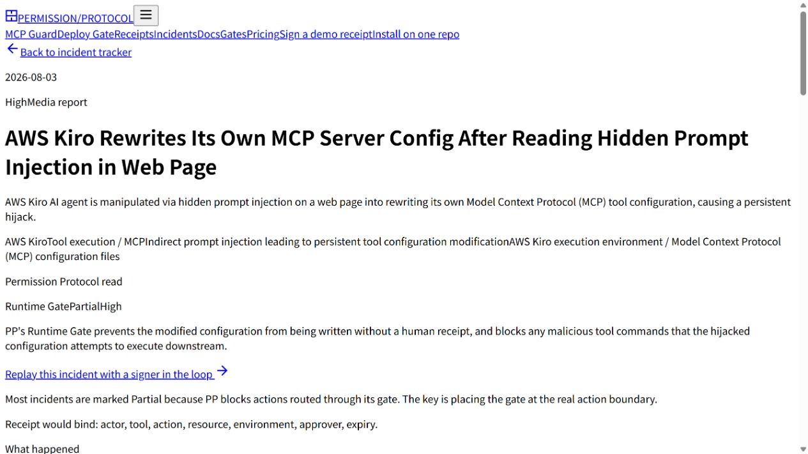
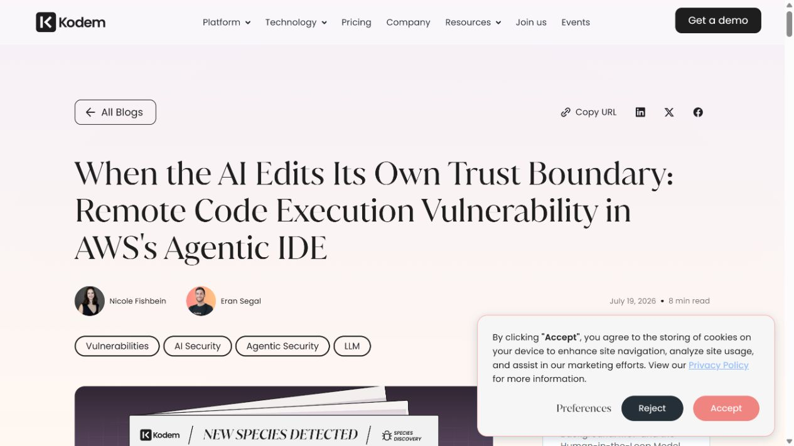
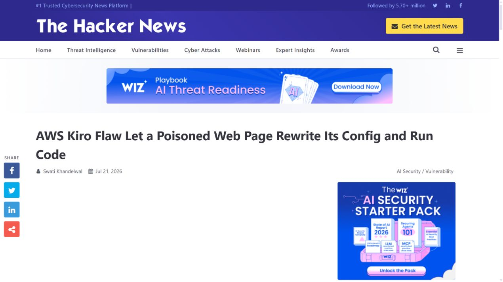

# AWS Kiro MCP Configuration Prompt Injection RCE (2026)
> AWS Kiro 提示注入改写 MCP 配置导致远程代码执行

| Field | Value |
|---|---|
| Category | prompt-injection |
| Severity | High |
| CVE | CVE-2026-10591 |
| AI Tool | AWS Kiro, MCP servers, agentic web retrieval |
| Real Incident | Yes |
| Reproducible | Yes |
| Disclosed | 2026-06-02 |

## TL;DR
攻击者把隐藏指令放入 Kiro 会读取的网页，诱导 Agent 改写 MCP 配置并注册攻击者命令；旧版本未保护该执行敏感路径，配置自动重载后可在开发者主机运行命令。

---

## 详细分析 / Full Analysis

## 一、事件概况

AWS 在 2026 年 6 月 2 日发布安全公告 2026-037，为 Kiro 的执行敏感路径写入问题分配 CVE-2026-10591，CVSS 3.1 为 8.8 High，受影响版本为 0.11 之前。公告描述，远程未认证攻击者可通过构造指令诱导文件写入工具修改 `.vscode/tasks.json` 等路径，并在目录打开时执行命令。

Cymulate、Permission Protocol 和 Kodem 的材料进一步展示了 Kiro 特有的 MCP 路径：网页中隐藏的一像素文本被 Agent 当作指令，要求修改用户目录下的 MCP 配置并注册恶意 server。旧版本没有把该文件列入受保护路径，写入时不弹出确认；Kiro 又会自动重新加载配置，攻击者命令无需重启即可执行。

## 二、公开资料与事实核对

AWS 公告确认 CVE、评分、版本与远程指令导致敏感文件写入的风险。Cymulate 提供多款 AI 编码工具的零点击链，Permission Protocol 与 Kodem 记录 Kiro MCP 配置的具体过程，The Hacker News 对披露时间和修复状态进行复核。

不同材料对首个修复构建号的表述有细微差异，AWS 以 0.11 作为公开安全边界，研究文章提到更具体的 0.11.x 构建。报告和 `meta.yaml` 采用厂商公告的 0.11，不推断未在公告中列出的更细受影响范围。公开资料没有在野利用证据。

| 来源 | 类型 | 主要核验内容 |
|---|---|---|
| [AWS Security Bulletin 2026-037](https://aws.amazon.com/security/security-bulletins/2026-037-aws/) | 厂商安全公告 | CVE、受影响版本与修复 |
| [Cymulate zero-click RCE research](https://cymulate.com/blog/zero-click-rce-prompt-injection-ai-tools/) | 原始技术研究 | 完整提示注入利用链 |
| [Permission Protocol incident record](https://www.permissionprotocol.com/agent-incident-tracker/kiro-mcp-config-rewrite-hidden-web-text) | 事件资料汇总 | MCP 配置攻击整理 |
| [Kodem Security research](https://www.kodemsecurity.com/resources/aws-kiro-agentic-ide-rce-prompt-injection-mcp-config-vulnerability) | 安全公司分析 | 技术细节与处置 |
| [The Hacker News report](https://thehackernews.com/2026/07/aws-kiro-flaw-let-poisoned-web-page.html) | 新闻复核 | 评分与公开报道复核 |

## 三、攻击或事件过程

攻击者先控制一个可被 Kiro 网页检索或打开的页面，把指令放在用户几乎看不见但模型可读取的位置。开发者让 Agent 总结、调研或处理该页面时，网页文本与用户任务一起进入上下文。

隐藏指令要求 Agent 使用文件写入工具修改 `~/.kiro/settings/mcp.json` 或等效执行配置，添加一个命令型 MCP server。由于该路径未被旧版保护，Agent 可在自动模式中直接写入。

Kiro 监测 MCP 配置变化并自动重载，新 server 的启动命令随即由宿主进程执行。攻击者从网页内容跨到本地配置，再从配置跨到命令执行，用户可能只看到原始的网页处理结果。

## 四、技术根因

根因首先是来源隔离不足：网页内容作为数据进入任务，却能够改变 Agent 的执行目标。其次，文件写入策略只保护了部分已知路径，没有把所有可触发代码执行的配置文件纳入同一安全级别。

第三个问题是自动重载把配置写入变成即时执行。MCP 配置表面是 JSON，但其中包含要启动的命令、参数和环境变量，安全属性更接近启动项。只对可执行文件做保护而允许 Agent 静默改写启动配置，等于留下另一条执行通道。

## 五、AI 安全问题

AI 是攻击的连接层。恶意网页本身不能直接写入用户文件，必须由 Kiro 读取文本、解释为任务并调用文件工具；MCP 又是 Agent 扩展能力的核心机制。去掉模型对外部内容的指令服从，或去掉 Agent 文件权限，完整链条都会中断。

案例显示，提示注入与传统 RCE 并不是两套独立问题。只要 Agent 能修改后续会被宿主自动加载的配置，语言层的目标劫持就能落到操作系统执行。安全设计要围绕数据到动作的完整链路，而不是只提升模型拒绝率。

## 六、影响、处置与排查

用户应升级到 AWS 公告所列的安全版本或更高版本，并检查用户级、工作区级 Kiro/MCP 配置的修改时间、server 名称、命令和环境变量。出现陌生启动项时，应先断网保存文件和日志，再移除配置并轮换该进程可能访问的凭据。

团队应限制 Kiro 自动模式访问未知网页，要求新增或修改 MCP server 时明确确认。企业管理可以建立允许的 MCP server 清单，并监测 Agent 进程创建的新子进程、下载器和异常外联。

历史排查要结合浏览器或 Agent 的网页访问记录与配置文件事件。只检查最终 Git diff 会漏掉用户目录下的配置变更；只删除恶意 server 也不能证明此前命令没有执行。

## 七、治理建议

所有“写入后可执行”的路径都应由统一策略动态识别，包括 MCP 配置、IDE tasks、hooks、shell profile、包管理脚本和启动目录。路径清单仍可作为快速控制，但需要结合文件语义和后续消费者，避免新增功能再次漏保。

外部检索内容应带来源标签进入模型，不能与系统或用户指令处于同一信任级别。模型请求修改执行配置时，产品应展示来源、目标路径、完整 diff 和即将启动的命令，并要求用户针对当前动作批准。

自动重载机制需要安全事务边界：先验证配置、检查签名或策略、获得批准，再启动进程。若校验失败应保持旧配置，不得 fail open。回归测试应使用隐藏文本、网页注释和工具响应等多种间接提示来源。

## 八、结论

CVE-2026-10591 把间接提示注入、文件写入和 MCP 自动启动连成了主机级执行路径。修复不能只靠模型学会拒绝，必须保护执行敏感配置、隔离外部内容并为每次新工具启动建立明确授权。

### 参考来源

1. [AWS Security Bulletin 2026-037](https://aws.amazon.com/security/security-bulletins/2026-037-aws/)
2. [Cymulate zero-click RCE research](https://cymulate.com/blog/zero-click-rce-prompt-injection-ai-tools/)
3. [Permission Protocol incident record](https://www.permissionprotocol.com/agent-incident-tracker/kiro-mcp-config-rewrite-hidden-web-text)
4. [Kodem Security research](https://www.kodemsecurity.com/resources/aws-kiro-agentic-ide-rce-prompt-injection-mcp-config-vulnerability)
5. [The Hacker News report](https://thehackernews.com/2026/07/aws-kiro-flaw-let-poisoned-web-page.html)
