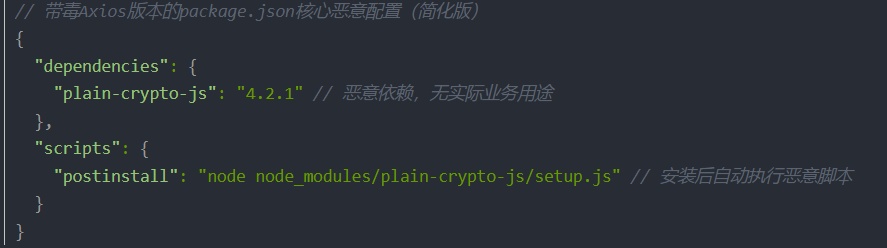

# Axios Supply Chain Poisoning Incident Affecting OpenClaw AI Agent(2026)
> Axios 开源库供应链投毒事件（波及 OpenClaw AI Agent）

| Field | Value |
|---|---|
| Category | supply-chain |
| Severity | critical |
| AI Tool | OpenClaw |
| Language | JavaScript |
| Real Incident | ✅ |
| Reproducible | ❌ |
| Disclosed | 2026-04 |
| CVE | — |
| CVSS | — |

## TL;DR
In 2026, official Axios releases were compromised via account hijacking, injecting a malicious dependency to enable cross-platform remote control. OpenClaw 3.28 shipped with the poisoned Axios version by default, exposing the AI Agent ecosystem to widespread supply-chain risks.
> 2026年Axios官方版本遭账号劫持投毒，植入恶意依赖实现跨平台远控，OpenClaw 3.28默认依赖带毒版本，AI Agent生态面临大规模供应链风险。

## 基本信息

* 发生时间：2026-03-31
* 公开时间：2026-04-01
* 风险类型：供应链安全 / 过度依赖AI
* 影响范围：开源生态系统（npm）、OpenClaw、JavaScript

## 一、案例介绍

2026年3月31日，JavaScript生态中使用最广泛的 HTTP 客户端组件之一 axios 遭遇严重供应链投毒，其 1.14.1 和 0.30.4 版本被植入恶意代码。攻击者入侵了axios维护者的npm账号（jasonsaayman），绕过了CI/CD检测，在官方的版本中引入了恶意依赖组件plain-crypto-js，这个组件是知名加密库crypto-js的仿照包。具体来说，攻击者使用两阶段的入侵策略：
攻击者在3月30日发布无害的 plain-crypto-js@4.2.0 建立可信记录，随后在31日发布恶意的4.2.1版本，随后利用被入侵账号发布axios的两个下载量诸多的投毒版本1.14.1 和 0.30.4 版本。
当开发者通过npm install安装时，其依赖组件plain-crypto-js的内置钩子会主动从服务器下载对应平台的恶意木马脚本，最终实现远程后门控制。此事件潜在影响数百万开发者及企业项目，
尤其对于最近著名的AI Agent工具OpenClaw 3.28版本的用户更需重点关注——该版本默认依赖带毒Axios，且无需手动安装即可被动感染。最终官方的Socket.dev自动化检测工具发现了异常，
经过npm官方核查于四小时后下架了带有恶意木马病毒的库版本。


### 事件时间线（关键节点）
* 3月30日 23:59:12（国内时间31日7:59:12）：攻击者提前布局，发布恶意依赖包 plain-crypto-js@4.2.1
* 3月31日 00:00（国内时间31日8:00）：盗取Axios维护者npm账号，绕过GitHub Actions CI/CD，发布带毒版本 axios@1.14.1、axios@0.30.4
* 3月31日 00:05:41（国内时间31日8:05:41）：Socket.dev自动化检测工具发现异常，触发安全预警
* 3月31日 04:00（国内时间31日12:00）：npm官方紧急下架恶意依赖+带毒Axios版本，阻断传播

## 二、攻击细节

### 安装中：虚假依赖注入

攻击者的攻击方式十分隐蔽，并非直接修改Axios的核心源码，而是在npm install安装带病毒的axios版本时，npm会自动拉取并安装病毒依赖组件plain-crypto-js@4.2.1，该恶意包的 package.json 中定义了 postinstall 钩子："postinstall": "node setup.js"，意味着包安装完成后会立即执行同目录下的 setup.js 脚本。setup.js 经过高度混淆，解码后针对不同操作系统执行差异化攻击逻辑，所有载荷均从同一 C2 服务器下载：

* macOS：通过 do shell script 执行 curl 下载恶意文件至 /Library/Caches/com.apple.act.mond，添加执行权限后使用 zsh 在后台运行；
* Windows：通过 cmd.exe 调用 curl 下载 PowerShell 脚本至临时目录，以隐藏窗口绕过执行策略运行 powershell，随后自删除临时文件；
* Linux：通过 curl 下载 Python 脚本至 /tmp/ld.py，使用 nohup 在后台静默执行，并将输出重定向至 /dev/null。



### 安装后：痕迹清除

在攻击完成后，恶意木马脚本会自动清除setup.js 和 package.json中的遗留痕迹，使用干净正常的版本替换部分有毒依赖，就算开发者检查安装的记录node_modules目录也难以发现其中的异常之处，最终导致开发者无法及时排查异常，导致深远影响。

### 影响版本及安全版本

本次影响版本：axios (npm) == 0.30.4，axios (npm) == 1.14.1，plain-crypto-js (npm) == 4.2.1，建议开发者立即删除排查相关带毒库，回滚至以下安全版本： axios@0.30.3 及以下历史稳定版本，axios@1.14.0，axios@0.30.5 及后续版本，axios@1.14.2 及后续版本

## 三、事件反思

此次axios投毒事件暴露出开源依赖供应链的脆弱性，仅一个维护者的账户被盗即可引发大规模供应链安全事件，影响数百万开发者，给大家一些反思：

* 开源维护者：对开源维护者而言，应当加强账户安全，启用双因素认证（2FA），并在项目全流程严格管控，且保证启用多个备用账号协同维护；
* 开发者用户：开发者应该养成定期检查核心依赖的习惯，尤其是AI开发者，对于一些AI Agent工具，应该在核查好安全依赖的前提下去安装下载，而不是默认直接安装；
* 企业：企业应该建立完善的依赖安全检测体系，自动化检查有害依赖，防范供应链攻击风险。

## 四、关联报告风险点

对应《AI生成代码在野安全风险研究报告》第3章3.3节——安全文化侵蚀以及5.2节——人工智能引入的脆弱性风险概况

​此事件中，攻击者在盗取开源依赖维护者的账号的基础上，趁机将植入远程后门控制的病毒的依赖组件包替换成官方的干净库，从而导致一些高权限同时开发者对其“自动化偏见”的AI Agent在无审核默认自动安装的前提下，安装了带有病毒的axios依赖库，这种不对依赖库进行安全审核的行为，使得安全文化的侵蚀（报告3.3节——安全文化侵蚀）达到了触及基础设施安全的程度。

​在报告的5.2节中，揭示了 AI 引入的漏洞呈现出更危险的结构性偏好——网络化倾向（Networking Tendency）。本案例中，Agent的底层配置默认直接通过npm发起网络下载，且安装时setup.js解码后
后台会从下载C2服务器下载对应不同平台的恶意文件，这种远程攻击风险给系统防御造成了巨大的应对压力。总的来说，这些种种让攻击者有了可乘之机，给数百万开发者用户带来深远影响。

## 五、修复建议
```
1. 降到安全版本

# 卸载恶意版本

npm uninstall axios

# 安装安全版本（eg.1.14.0 或 0.30.3）

npm install axios@1.14.0

全局修复：

npm uninstall -g axios

npm install -g axios@1.14.0

2. 清理恶意依赖

# 删除 plain-crypto-js

rm -rf node_modules/plain-crypto-js

# 清理 npm 缓存

npm cache clean --x

# 重新安装（--ignore-scripts 阻止 postinstall 脚本执行）

npm ci --ignore-scripts

```

## 六、参考来源

* 突发！Axios 遭供应链投毒，36亿年下载量JS库沦陷，全平台面临远控风险（附自查/修复全教程）                   （https://blog.csdn.net/weixin_68340504/article/details/159717437）
* Axios 供应链投毒事件响应：腾讯云安全已完成主动排查与风险防护升级
（https://cloud.tencent.com/developer/article/2651941）

