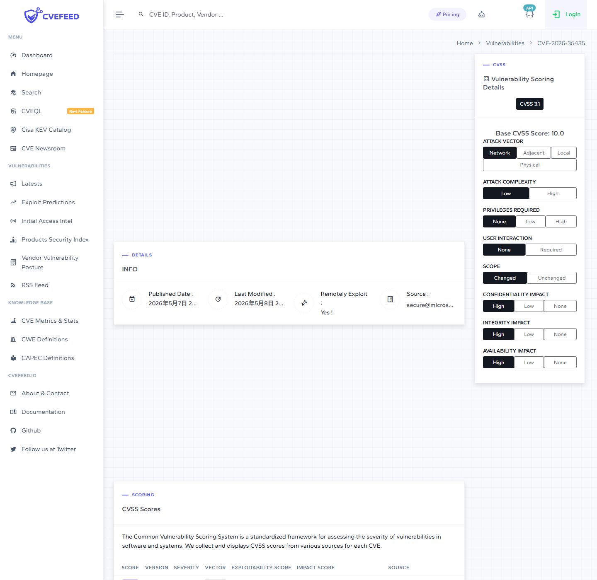
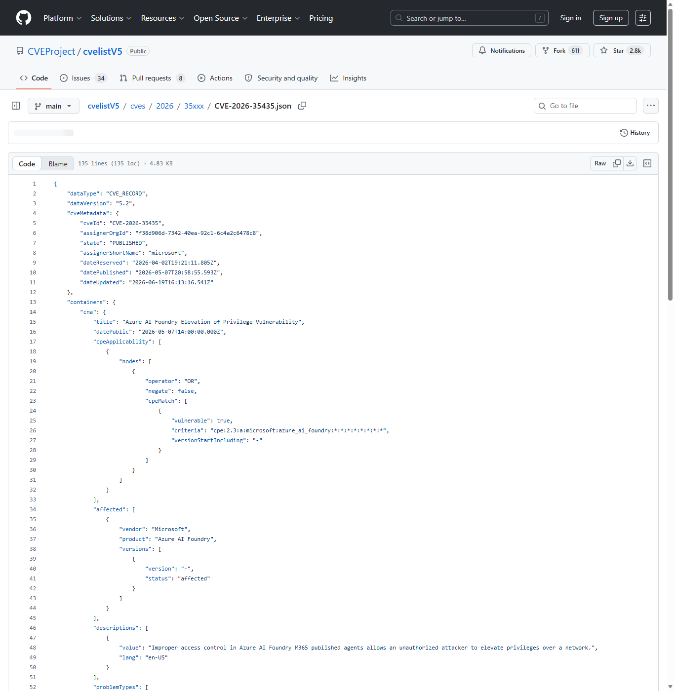
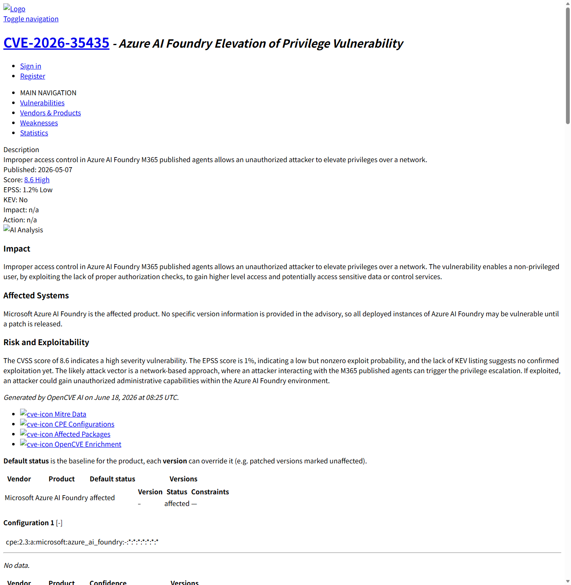
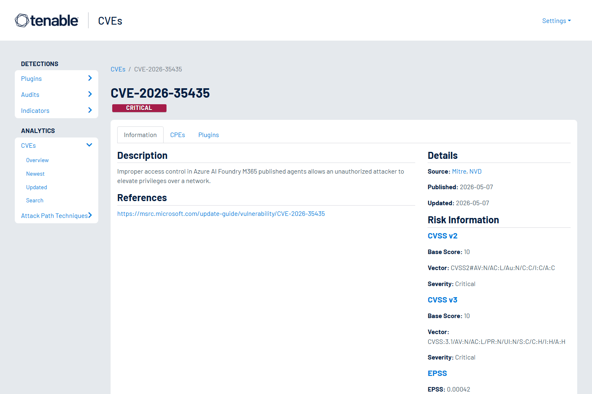
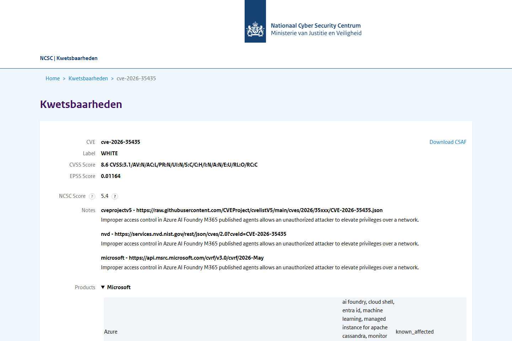
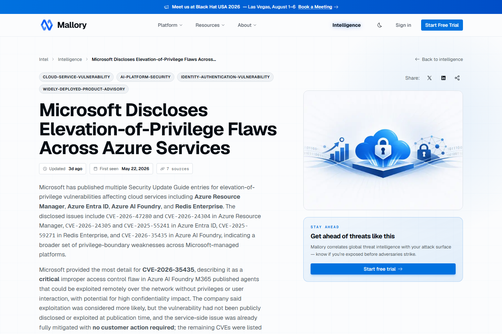

# Azure AI Foundry M365 Agent Privilege Escalation (2026)
> Azure AI Foundry M365 已发布 Agent 权限提升

| Field | Value |
|---|---|
| Category | agent-risk |
| Severity | High |
| AI Tool | Azure AI Foundry, Microsoft 365 published agents, Microsoft hosted AI agent service |
| Language | Cloud service |
| Real Incident | Yes |
| Reproducible | No |
| Disclosed | 2026-05-07 |
| CVE | CVE-2026-35435 |
| CVSS | 8.6 |

## TL;DR
Azure AI Foundry M365 published agents had an access-control flaw enabling privilege escalation.
> Azure AI Foundry M365 已发布 Agent 权限提升：攻击者可能提升对 M365 Agent 所连接数据或功能的访问权限，主要影响机密性。

---

## 基本信息

| 项目 | 内容 |
|---|---|
| 案例时间 | 2026-05-07 |
| 事件对象 | Azure AI Foundry 中发布到 Microsoft 365 的 Agent 服务 |
| 事件类型 | 访问控制不当导致网络侧权限提升 |
| 攻击入口 | 未授权攻击者通过网络访问受影响的已发布 Agent 路径。 |
| 主要影响 | 攻击者可能提升对 M365 Agent 所连接数据或功能的访问权限，主要影响机密性。 |
| 修复方向 | 按 CVEFeed 指引确认托管服务缓解状态，审计已发布 Agent 权限、连接器和租户访问日志。 |

## 摘要

CVE-2026-35435 是 Azure AI Foundry 与 Microsoft 365 Published Agents 相关的权限提升漏洞。CVEProject cvelistV5 记录显示，问题属于 Improper Access Control，攻击者可在网络侧提升权限；CVSS 向量为 AV:N/AC:L/PR:N/UI:N/S:C/C:H/I:N/A:N，重点影响机密性。
该案例的敏感点在于 Agent 已经发布到 Microsoft 365 场景。企业 Agent 往往连接 SharePoint、Teams、Outlook、OneDrive 或内部知识源，用户通过自然语言访问的背后是复杂的身份、连接器和数据权限映射。访问控制缺陷会让 AI 入口直接变成组织数据入口。

## 一、公开材料概况

CVEFeed、CVEProject cvelistV5、OpenCVE、Tenable、荷兰 NCSC 漏洞数据库和 Mallory/行业复核页面共同确认了 CVE 编号、产品范围、CWE、CVSS 和托管服务属性。公开材料对利用细节披露有限，已知信息主要指向 Microsoft 托管服务中的 Published Agents 访问控制缺陷。
托管服务案例的材料通常不会给出完整 payload，但 CVSS 向量仍提供了关键判断：网络可达、低复杂度、无需权限和无需用户交互。对企业防守方而言，这已经足以触发对已发布 Agent、连接器权限和访问日志的复核，而不必等待攻击细节公开。

| 来源 | 类型 | 证明内容 |
|---|---|---|
| CVEFeed: CVE-2026-35435 | 主证据 | 微软官方漏洞记录。 |
| CVEProject cvelistV5: CVE-2026-35435 | 主证据 | 确认 CVSS、CWE 和描述。 |
| OpenCVE: CVE-2026-35435 | 主证据 | CVE 记录。 |
| Tenable: CVE-2026-35435 | 复核证据 | 复核 CVE 描述和评分。 |
| NCSC-NL: CVE-2026-35435 | 复核证据 | 国家级漏洞数据库记录。 |
| Mallory: Microsoft Azure AI Foundry privilege escalation issue | 生态证据 | 行业复核和上下文梳理。 |

## 二、系统背景与触发条件

Azure AI Foundry 允许组织构建并发布 Agent 到 Microsoft 365 场景。Agent 一旦连接 Teams、SharePoint、OneDrive、Outlook 或企业知识源，访问控制就不再是单个聊天入口的问题，而是租户权限、连接器授权和 Agent 发布范围的组合问题。
触发条件与企业发布方式密切相关。一个 Agent 可能只面向特定团队，也可能被发布给更大范围的租户用户；连接器可能只读公开资料，也可能触达敏感站点或邮件数据。权限映射错误时，攻击者看到的不是漏洞提示，而是本不该返回的业务信息。

## 三、攻击链路与处置过程

公开 CVE 信息没有提供 payload 级细节，但可以确认攻击条件是网络可达、低复杂度、无需权限和无需用户交互。攻击后果是权限提升，影响范围发生作用域变化，说明调用者可能访问本不应暴露给其身份的数据或 Agent 能力。
处置上应结合托管服务公告和租户侧日志。即使服务端由 Microsoft 缓解，企业仍需要确认受影响期间哪些 Agent 被访问、访问者身份是否异常、返回数据是否跨越团队或站点边界。对于连接敏感数据源的 Agent，还应考虑临时收紧发布范围和连接器权限。

## 四、技术根因分析

根因属于 Published Agents 的访问控制设计或实现缺陷。M365 Agent 连接的是组织数据和业务工具，授权模型需要同时判断用户身份、Agent 发布范围、连接器权限和目标数据 ACL；任一层映射错误，都可能让低权限调用者获得高价值信息。
企业 Agent 的授权比传统应用更复杂，因为一次对话可能触发检索、工具调用和跨系统数据汇总。系统需要在每一步都保留调用者身份和目标资源 ACL，而不能只在入口处做一次判断。若 Agent 执行层使用了过宽的服务身份，或者缓存了不该共享的上下文，就会产生权限提升空间。

## 五、AI 参与方式与风险归因

AI 参与方式体现在漏洞对象是已发布的企业 Agent。攻击者利用的不是模型幻觉，而是 Agent 托管服务对身份与数据访问的约束缺陷。归因应覆盖 Agent 发布治理、连接器权限继承和租户日志审计。
这也是企业 AI 与 SaaS 权限体系融合后的典型问题。模型负责解释请求，但真正决定风险的是 Agent 能代表谁访问哪些数据、能否跨团队检索、以及回答中是否混入了调用者无权查看的内容。安全评估必须把自然语言交互映射回底层权限检查。

## 六、与团队技术报告风险框架的关系

团队框架中关于 AI 平台化和企业工作流融合的风险，在本案例中表现为 Agent 成为 M365 数据访问入口。模型服务安全必须与身份治理、数据权限和 SaaS 审计结合，否则 AI Agent 会放大既有权限设计缺陷。

## 七、影响范围与治理建议

CVSS 8.6 体现出远程、低复杂度、无权限访问下的高机密性影响。对企业而言，风险重点在于已发布 Agent 可能横跨多个 M365 数据源，泄露范围取决于 Agent 连接器、知识源和发布对象配置。

治理上应盘点所有已发布 M365 Agents，确认哪些 Agent 连接敏感数据源，收紧发布范围和连接器权限。对受影响时间窗口内的访问日志，应关注异常调用者、异常数据检索和跨团队访问。后续 Agent 发布流程应强制安全评审和最小权限模板。
建议把 Agent 发布当作数据产品发布来管理。每个 Agent 都应有数据源清单、目标用户范围、连接器权限、审计负责人和下线流程。对高敏数据源，应启用更严格的条件访问、DLP 和访问评审，避免单个 Agent 成为绕过既有 M365 权限治理的新路径。

## 八、结论

Azure AI Foundry 案例说明，企业 Agent 的访问控制是 AI 安全的核心部分。Agent 发布到协作平台后，任何授权映射错误都会直接变成组织数据访问问题。
它也提醒企业，Agent 治理不能只审查提示词和回答质量。发布范围、连接器权限、身份传递、审计日志和数据源分级，才是 M365 Agent 能否安全落地的关键控制点。

## 参考来源

1. [CVEFeed: CVE-2026-35435](https://cvefeed.io/vuln/detail/CVE-2026-35435)
2. [CVEProject cvelistV5: CVE-2026-35435](https://github.com/CVEProject/cvelistV5/blob/main/cves/2026/35xxx/CVE-2026-35435.json)
3. [OpenCVE: CVE-2026-35435](https://app.opencve.io/cve/CVE-2026-35435)
4. [Tenable: CVE-2026-35435](https://www.tenable.com/cve/CVE-2026-35435)
5. [NCSC-NL: CVE-2026-35435](https://vulnerabilities.ncsc.nl/vulnerability.html?id=2026%2Fcve-2026-35435)
6. [Mallory: Microsoft Azure AI Foundry privilege escalation issue](https://mallory.ai/stories/019e4d6c-275c-7f5c-9b73-199e0b675229)
