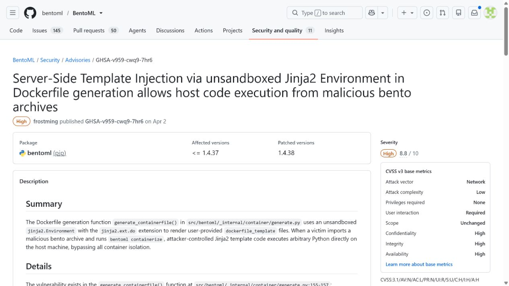
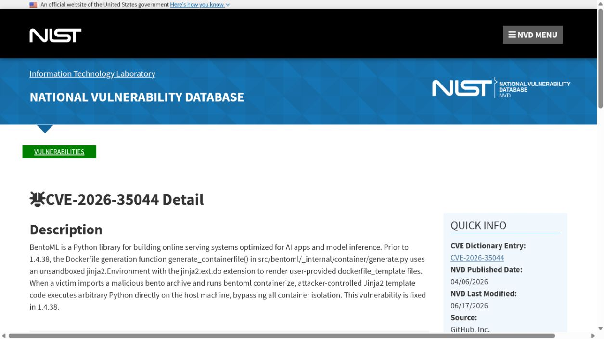
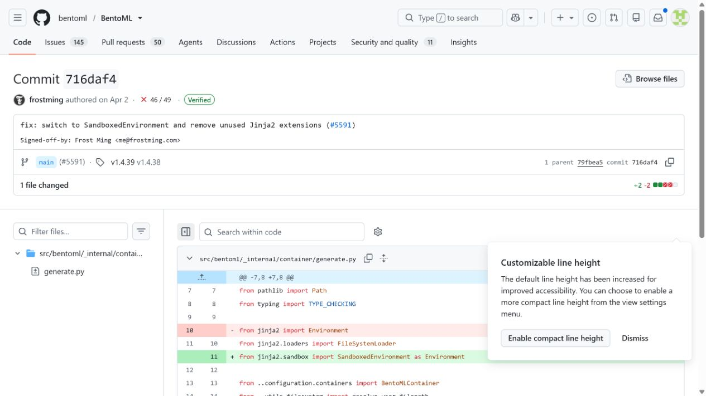
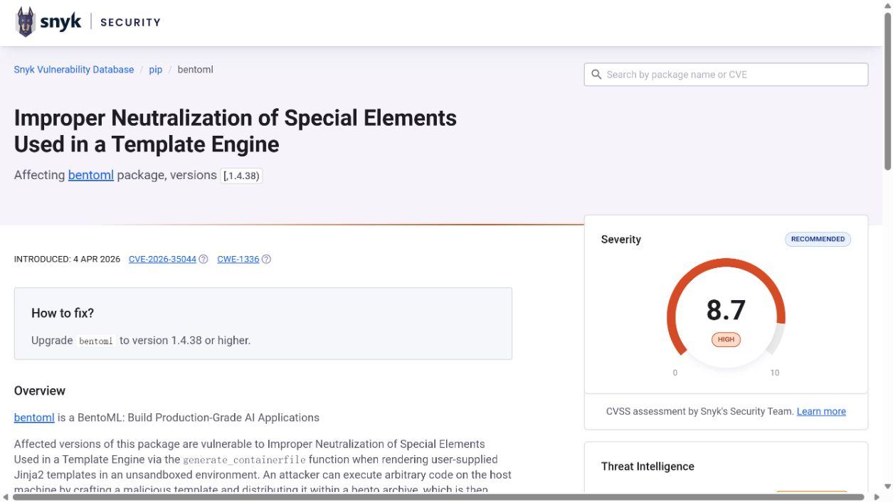
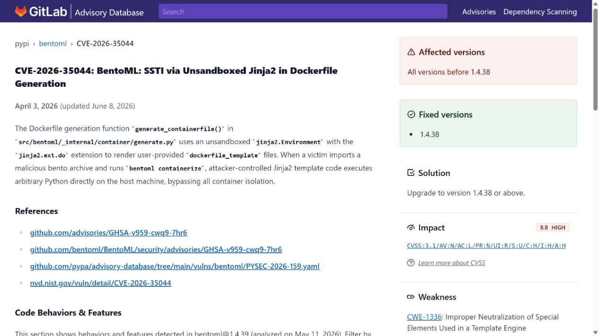

# BentoML Container Template Host Code Execution (2026)
> BentoML 容器模板在宿主机执行代码漏洞

| Field | Value |
|---|---|
| Category | supply-chain |
| Severity | critical（NVD CVSS 3.1：9.6） |
| AI Tool | BentoML model-serving package and container builder |
| Language | Python |
| Real Incident | Yes（已公开确认的真实漏洞；不表示已有受害事件） |
| Reproducible | No |
| Disclosed | 2026-04-03 |
| CVE | CVE-2026-35044 |
| CVSS | 9.6 |

## TL;DR / 摘要

A malicious Bento archive could execute Python on a host during container generation because BentoML rendered user-supplied Dockerfile templates without a sandbox.

BentoML 案例表明，模型服务制品的风险可以在镜像生成前就触发。部署自动化要把外部 Bento 当作不可信构建输入，而不是普通模型文件。

---

## 详细分析 / Full Analysis

### 一、事件概况与公开记录

BentoML 用 Bento 制品封装模型服务，并通过 `containerize` 等命令生成用于部署的容器配置。团队常在 CI、发布机或 GPU 构建节点上处理外部 Bento，这些机器通常能够访问镜像仓库、内部网络和部署凭据。制品中的模板因此会影响构建机，而不仅是最终容器。

BentoML 项目安全公告、NVD、修复提交、Snyk 与 GitLab Advisory 都记录了 CVE-2026-35044。公告和提交把问题定位在 `generate_containerfile()` 使用未沙箱化 Jinja2 渲染自定义 Dockerfile 模板；NVD 同时展示 NVD 9.6 与 GitHub CNA 8.8 两套评分，本文采用前者并明确标注来源。

### 二、AI 工作流与攻击入口

模型服务的交付链路将模型、服务代码和部署配置打包在一起。这个案例的 AI 相关性不只是使用了 BentoML 名称，而是恶意模型服务制品借助框架提供的容器化流程触发执行。风险位于从模型打包到部署的自动化边界，和推理阶段的应用漏洞不同。

外部内容在这些工作流中并不总以“命令”或“程序”的形式出现。模型制品、提示词配置、连接器对象、缓存记录以及 Agent 工具参数往往先被视为普通数据，随后才在框架内部获得文件读取、解释执行或状态写入能力。

### 三、漏洞触发与技术路径

攻击者构造包含自定义 Dockerfile 模板的 Bento 制品，受害者将其导入并运行容器化命令。受影响实现启用了 Jinja2 的 `do` 扩展，却未使用沙箱环境，模板表达式可以访问 Python 对象并在生成 Dockerfile 时执行宿主机代码。执行发生在 Docker 构建隔离启动之前，因此容器运行时的限制无法补救这一步。

### 四、技术根因

BentoML 在生成 Dockerfile 时使用未沙箱化的 Jinja2 环境渲染制品提供的模板。模板在 Docker 构建启动之前就由宿主机 Python 进程处理，因此最终容器的权限限制对这一步不起作用。

### 五、利用前提与影响范围

利用要求操作者处理攻击者提供或被篡改的 Bento，并触发容器生成流程。影响由构建节点权限决定：若节点能够读取云令牌、推送镜像或访问生产网络，模板执行可成为供应链横向移动的起点。模型服务制品被视为“部署输入”而非可执行代码的工作习惯，会增加误处理风险。

公开记录给出的受影响范围是：BentoML 1.4.37 and earlier when containerizing an attacker-controlled Bento archive with a custom Dockerfile template.

评估具体部署时，应逐项确认相关功能是否启用、是否接收第三方内容或制品、运行账户可访问哪些目录和令牌，以及组件是否已经升级。本文采用 NVD CVSS 3.1 9.6 Critical；GitHub CNA 的原始评分为 8.8 High，差异来自作用域判断。

### 六、AI 安全问题分析

构建流水线最应避免的做法是先把长期凭据、Docker socket 和生产 kubeconfig 注入作业，再解析外部 Bento。排查可从 `bentoml containerize` 的触发点开始，确认哪些工作流接受第三方制品，模板是否可由制品控制，以及构建机是否与推理运行时共享主机或缓存。将制品解包、静态检查和镜像推送拆分为不同权限阶段，会显著降低风险面。

### 七、修复与处置

使用方应升级至公告所列的 1.4.38 或后续修复版本，停止在高权限主机上直接容器化外部 Bento。更稳妥的做法是让制品检查和构建运行在短生命周期、无生产密钥的隔离环境，并对自定义 Dockerfile 模板实施审查或禁用。CI 中的镜像推送凭据应在构建完成且制品通过验证后才注入。

公开材料给出的处置状态为：Upgrade to BentoML 1.4.38 or later and build external Bento archives only in isolated workers.

### 八、部署排查与本地验证

验收可比较修复前后对正常模板的兼容性，并在隔离测试中确认模板环境不再暴露可执行的 Python 对象。还应检查发布流水线的时序：模板渲染阶段不应能看到长期云密钥、宿主机 Docker socket 或生产 kubeconfig。

对于可能触发代码执行、文件读取或越权写入的案例，README 不提供可直接复制的攻击载荷。本地验收应检查版本、配置、已注册工具、缓存权限、文件挂载和审计日志，并在隔离测试环境中使用无害边界输入确认修复行为。

项目 Advisory 对未沙箱化 Jinja2 和 Dockerfile 模板给出原始描述，修复提交提供代码层证据，NVD、Snyk 与 GitLab Advisory 交叉记录版本和评分。这组材料说明代码执行发生在渲染模板时，而非 Docker 容器启动之后，因此报告把重点放在构建机隔离。

### 九、证据材料

| 来源 | 类型 | 证明内容 |
|---|---|---|
| BentoML advisory: unsandboxed Jinja2 SSTI | 项目安全公告 | 说明未沙箱化 Jinja2 Dockerfile 模板、宿主机执行和 1.4.38 修复 |
| NVD: CVE-2026-35044 | 漏洞数据库 | 核验 NVD 9.6 与 CNA 8.8 两套评分、版本范围和利用条件 |
| BentoML fix commit 716daf4 | 上游提交 | 展示模板渲染加固和对应测试修改 |
| Snyk: CVE-2026-35044 | 独立漏洞库 | 复核受影响版本、修复版本和 Snyk 自有评分 |
| GitLab advisory: CVE-2026-35044 | 独立漏洞库 | 复核 SSTI 机理、1.4.38 解决方案和上游引用 |

`assets/` 保存上述五个来源抓取时返回的原始 HTML，以及与同一页面对应的真实浏览器截图。动态网站离线打开时可能缺少外部样式或脚本，但源文件保留服务器返回内容，可用于复核标题、描述、版本和链接。

### 十、结论

BentoML 案例表明，模型服务制品的风险可以在镜像生成前就触发。部署自动化要把外部 Bento 当作不可信构建输入，而不是普通模型文件。

完成版本修复后，仍应保留来源治理、最小权限、任务隔离和结构化授权。这些措施既用于缓解当前漏洞，也能限制后续模型制品、Agent 工具或 AI 框架解析缺陷造成的影响。

### 参考来源

- [BentoML advisory: unsandboxed Jinja2 SSTI](https://github.com/bentoml/BentoML/security/advisories/GHSA-v959-cwq9-7hr6)
- [NVD: CVE-2026-35044](https://nvd.nist.gov/vuln/detail/CVE-2026-35044)
- [BentoML fix commit 716daf4](https://github.com/bentoml/BentoML/commit/716daf4ebd1e8a7c8ba48d1cad69836489b43644)
- [Snyk: CVE-2026-35044](https://security.snyk.io/vuln/SNYK-PYTHON-BENTOML-15909744)
- [GitLab advisory: CVE-2026-35044](https://advisories.gitlab.com/pypi/bentoml/CVE-2026-35044/)
