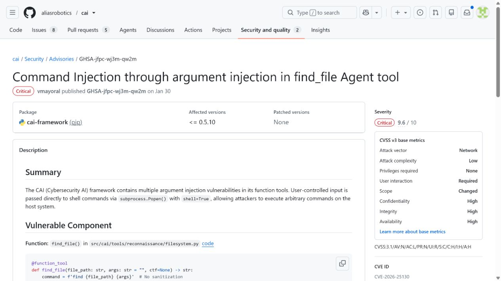
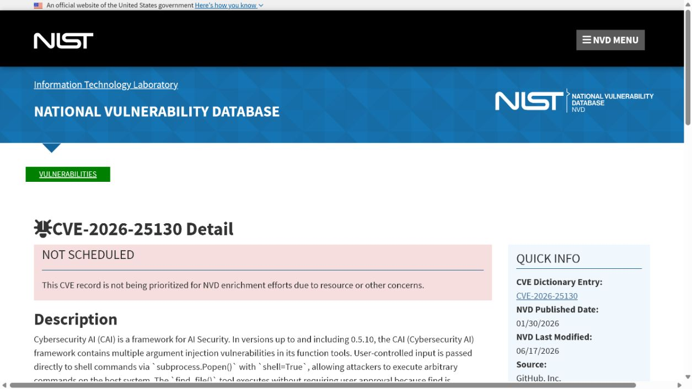
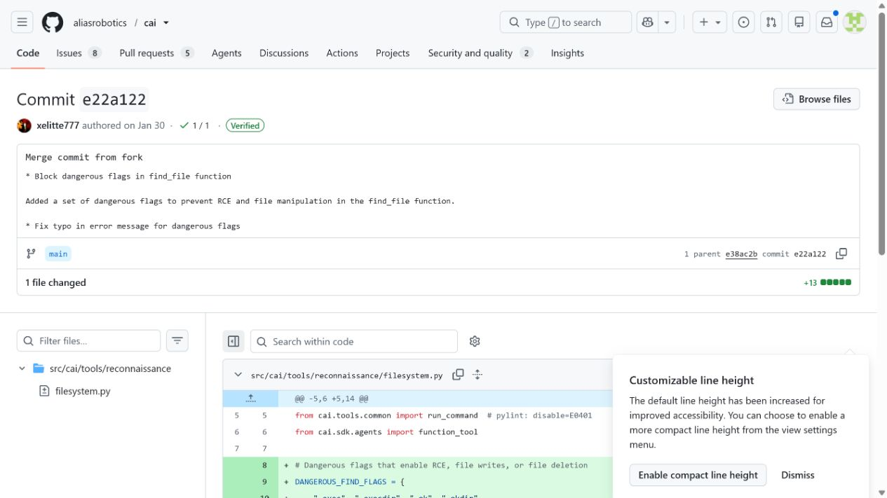
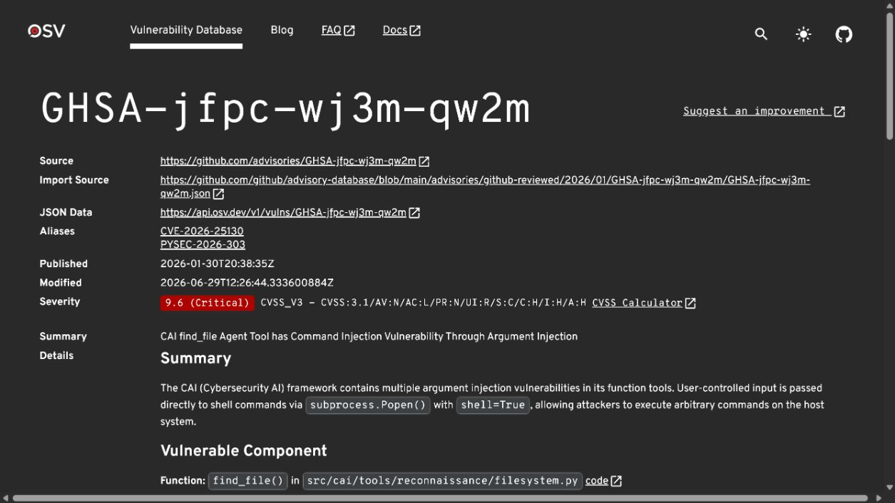
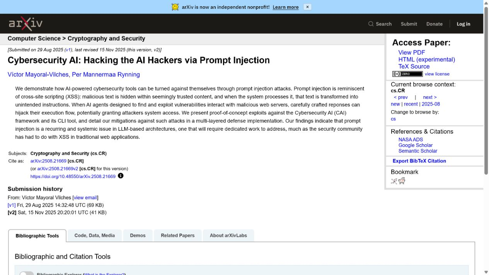

# Cybersecurity AI find_file Tool Argument Injection (2026)
> Cybersecurity AI find_file Agent 工具参数注入漏洞

| Field | Value |
|---|---|
| Category | agent-risk |
| Severity | critical（GitHub CNA CVSS 3.1：9.6） |
| AI Tool | Cybersecurity AI (CAI) agent tools |
| Language | Python |
| Real Incident | Yes（已公开确认的真实漏洞；不表示已有受害事件） |
| Reproducible | No |
| Disclosed | 2026-01-30 |
| CVE | CVE-2026-25130 |
| CVSS | 9.6 |

## TL;DR / 摘要

CAI treated find as a pre-approved operation while passing attacker-controlled arguments to a shell, permitting command execution without the intended approval step.

CAI 的 `find_file()` 不是一个普通的命令注入案例，它揭示了 Agent 的“安全工具”标签必须由完整能力而非表面名称决定。

---

## 详细分析 / Full Analysis

### 一、事件概况与公开记录

CAI 是面向安全任务的 Agent 框架，提供查找文件、运行命令和人工确认等工具。为了减少操作摩擦，`find_file()` 被列为无需确认的常规搜索动作；这一分类原本假设它只能执行无副作用的文件查找。

CAI 项目安全公告、NVD 与 OSV 对 CVE-2026-25130 的描述一致，修复提交则给出了实现层面的交叉材料。它们都把问题定位到 `find_file()` 的参数处理、`shell=True` 和免确认策略，而不是 CAI 的模型选择或知识库检索模块。框架论文用于确认该工具属于 AI 安全 Agent 的实际执行面。

### 二、AI 工作流与攻击入口

AI 安全 Agent 常被赋予比普通聊天机器人更多的本地探测能力。本案的特殊性在于，框架试图用人机确认降低风险，却把一个自然语言驱动的工具错误标记为低风险。模型规划、工具名称和底层命令语法之间存在语义落差，任何一层的简化分类都可能成为绕过点。

外部内容在这些工作流中并不总以“命令”或“程序”的形式出现。模型制品、提示词配置、连接器对象、缓存记录以及 Agent 工具参数往往先被视为普通数据，随后才在框架内部获得文件读取、解释执行或状态写入能力。

### 三、漏洞触发与技术路径

漏洞发生在工具把用户可控参数交给 `subprocess.Popen(..., shell=True)` 的位置。`find` 这个程序名本身看似安全，但其参数允许表达复杂动作；攻击者可通过诸如 `-exec` 的选项把一次文件搜索扩展为执行其他命令。由于框架依据工具名称而非完整参数语义决定是否需要人工批准，控制面被绕开。

### 四、技术根因

CAI 将 `find_file` 按工具名称归为低风险操作，却没有检查 `find` 参数本身可以携带 `-exec` 等动作语义。字符串拼接、`shell=True` 与免确认策略叠加后，一个表面上的搜索工具实际具备了通用命令执行能力。

### 五、利用前提与影响范围

攻击者需要影响 Agent 传入 `find_file()` 的路径或匹配参数，且实例启用了对应工具。成功执行后的权限受限于 CAI 进程账户，因而开发主机、渗透测试容器或持有扫描令牌的自动化节点应优先评估。该漏洞说明“使用受信任系统二进制”并不能替代对参数空间的安全设计。

公开记录给出的受影响范围是：CAI releases containing the vulnerable find_file helper before the upstream fix.

评估具体部署时，应逐项确认相关功能是否启用、是否接收第三方内容或制品、运行账户可访问哪些目录和令牌，以及组件是否已经升级。NVD 尚无 NIST 自有评分；GitHub CNA 与 OSV 给出的 CVSS 3.1 向量对应 9.6 Critical。

### 六、AI 安全问题分析

使用 CAI 或类似安全 Agent 时，工具目录往往会把“文件搜索”标记为低风险。审查时需要继续追到实际系统调用：它使用哪个二进制、参数是否经过数组化传递、是否允许 `-exec`、`-delete` 或路径表达式等有副作用的选项。把一个工具放在免确认清单之前，应以最强的合法参数组合来测试，而不是只验证典型的文件名查询。

### 七、修复与处置

修复应消除 `shell=True` 和字符串拼接，改为固定可执行文件及参数数组；同时按 `find` 的真实语法限制目录、表达式和动作选项。无需确认的工具也应经过同样的参数审查。部署侧应将 Agent 运行在短生命周期、无高价值凭据的环境中，并让每次工具调用产生可追踪的结构化记录。

公开材料给出的处置状态为：Apply upstream commit e22a122 or a release that contains the equivalent argument handling fix.

### 八、部署排查与本地验证

验收时可以用正常文件名、带空格文件名以及包含动作选项的测试参数分别检查：前两类应保持功能，后一类应被拒绝或需要明确批准。不要在生产主机上复现命令执行；更有价值的是核对工具调用日志是否能显示最终二进制、参数和授权决定。

对于可能触发代码执行、文件读取或越权写入的案例，README 不提供可直接复制的攻击载荷。本地验收应检查版本、配置、已注册工具、缓存权限、文件挂载和审计日志，并在隔离测试环境中使用无害边界输入确认修复行为。

CVE、NVD、OSV 与上游修复提交共同支持本案。尤其是修复提交能把抽象的漏洞名称落实到具体实现边界，即 `Popen` 与 shell 参数处理。它也限制了结论范围：材料证明的是工具参数注入，并不意味着每一个使用 CAI 的安全团队都已经遭受主机入侵。

### 九、证据材料

| 来源 | 类型 | 证明内容 |
|---|---|---|
| CAI advisory: find_file argument injection | 项目安全公告 | 说明 find_file 免确认路径、shell=True、-exec 参数注入和受影响版本 |
| NVD: CVE-2026-25130 | 漏洞数据库 | 核验 CVE 描述、9.6 Critical 评分及 <=0.5.10 范围 |
| CAI fix commit e22a122 | 上游提交 | 展示 e22a122 对命令构造和工具参数处理的修复 |
| OSV: GHSA-jfpc-wj3m-qw2m | 漏洞数据库复核 | 核验 GHSA、PyPI 包范围和 CVSS 3.1 向量 |
| CAI framework research paper | 项目研究论文 | 说明 CAI 作为 AI 安全 Agent 框架及其工具调用定位 |

`assets/` 保存上述五个来源抓取时返回的原始 HTML，以及与同一页面对应的真实浏览器截图。动态网站离线打开时可能缺少外部样式或脚本，但源文件保留服务器返回内容，可用于复核标题、描述、版本和链接。

### 十、结论

CAI 的 `find_file()` 不是一个普通的命令注入案例，它揭示了 Agent 的“安全工具”标签必须由完整能力而非表面名称决定。

完成版本修复后，仍应保留来源治理、最小权限、任务隔离和结构化授权。这些措施既用于缓解当前漏洞，也能限制后续模型制品、Agent 工具或 AI 框架解析缺陷造成的影响。

### 参考来源

- [CAI advisory: find_file argument injection](https://github.com/aliasrobotics/cai/security/advisories/GHSA-jfpc-wj3m-qw2m)
- [NVD: CVE-2026-25130](https://nvd.nist.gov/vuln/detail/CVE-2026-25130)
- [CAI fix commit e22a122](https://github.com/aliasrobotics/cai/commit/e22a122)
- [OSV: GHSA-jfpc-wj3m-qw2m](https://osv.dev/vulnerability/GHSA-jfpc-wj3m-qw2m)
- [CAI framework research paper](https://arxiv.org/abs/2508.21669)
