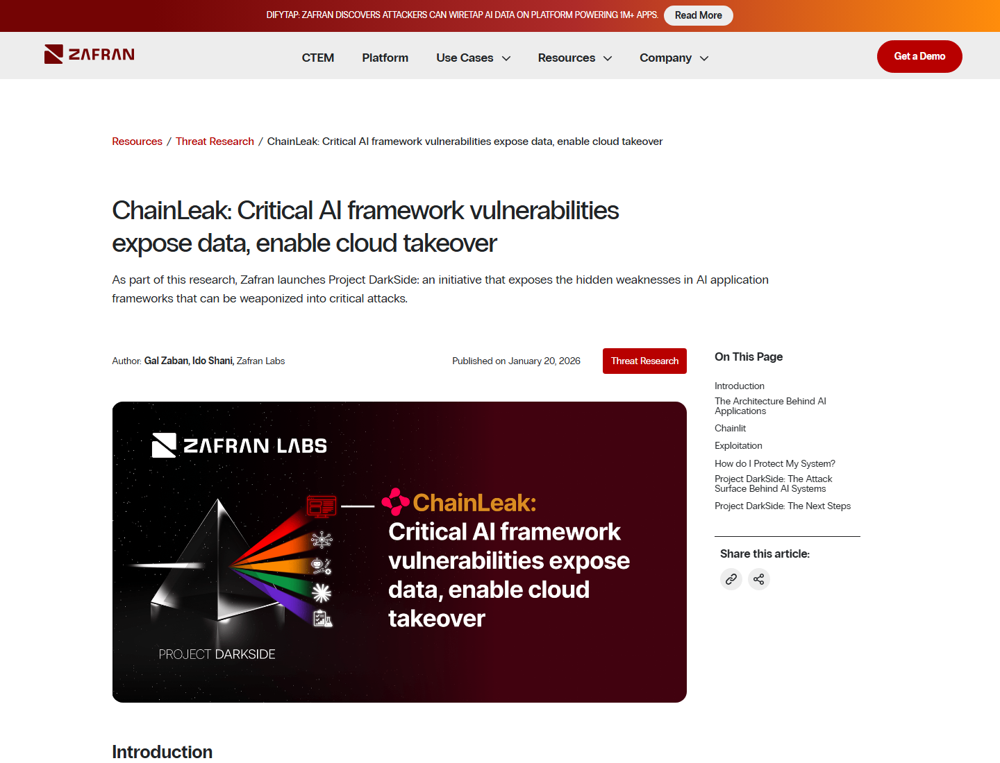
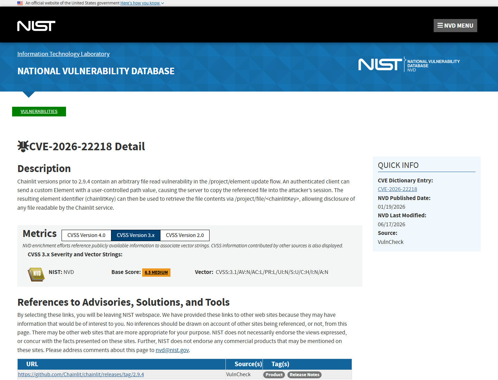
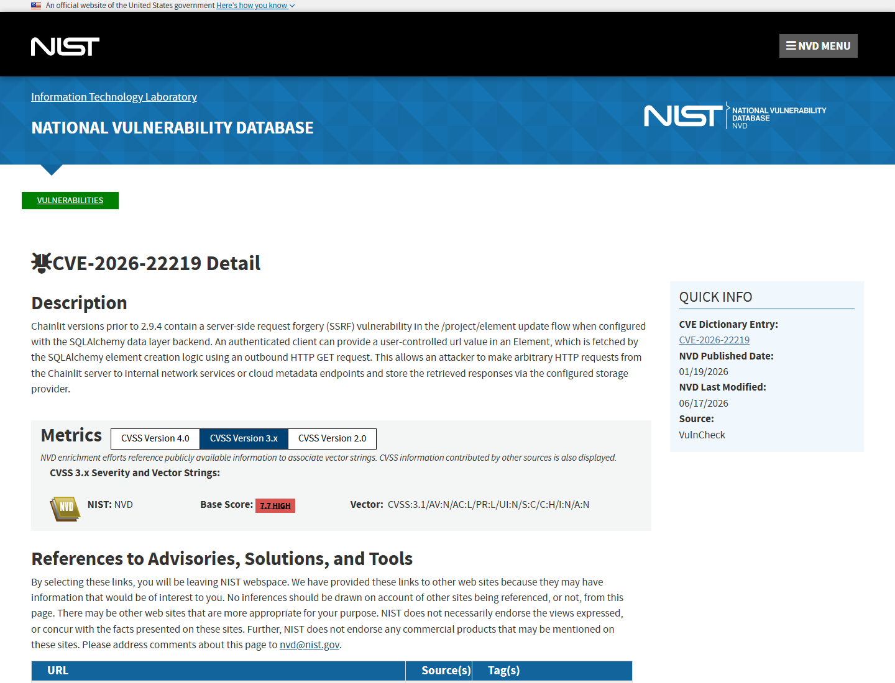
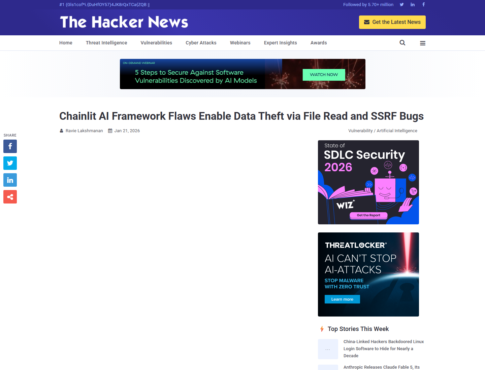
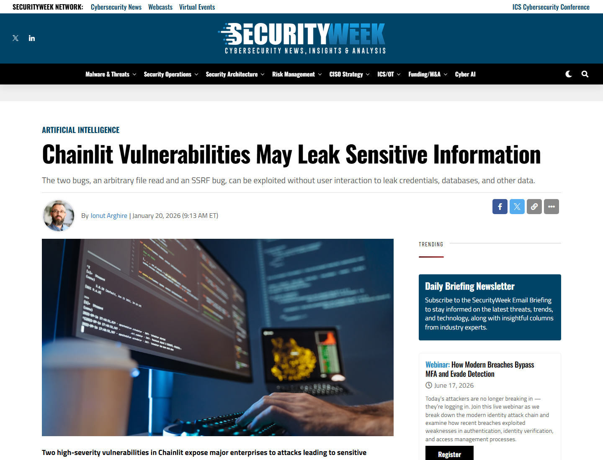

# Chainlit ChainLeak File Read and SSRF Vulnerabilities (2026)
> Chainlit ChainLeak 任意文件读取与 SSRF 漏洞

| Field | Value |
|---|---|
| Category | Domain-Specific Risks |
| Severity | 🟠 High |
| AI Tool | Chainlit, conversational AI framework, AI chatbot application framework |
| Language | Python |
| Real Incident | ✅ |
| Reproducible | ✅ |
| Disclosed | 2026-01-20 |
| CVE | CVE-2026-22218 / CVE-2026-22219 |
| CVSS | 7.1 / 8.3 |

## TL;DR
Chainlit flaws let attackers read server files and SSRF cloud metadata from AI app hosts.
> Chainlit 的 ChainLeak 漏洞组可让攻击者读取 AI 应用服务器文件，并通过 SSRF 访问内部网络或云元数据服务。

---

## 详细分析 / Full Analysis

# Chainlit ChainLeak 漏洞分析：AI 聊天应用框架中的文件读取、SSRF 与云凭据暴露风险

## 基本信息

Chainlit 是用于构建 conversational AI 应用和企业聊天机器人的 Python 框架，常与 LangChain、OpenAI、Bedrock、LlamaIndex、认证系统、云部署和数据层集成。2026 年 1 月，Zafran Labs 披露 ChainLeak，涉及两个 Chainlit 漏洞：CVE-2026-22218 任意文件读取，以及 CVE-2026-22219 SSRF。公开材料显示，漏洞影响 2.9.4 之前版本，修复版本为 Chainlit 2.9.4。

## 摘要

ChainLeak 的核心风险在于 AI 应用框架把用户可控 element 元数据接入了服务器文件与远程资源处理流程。攻击者可以构造 custom Element，让 Chainlit 服务器复制任意可读文件到攻击者会话，再通过 `chainlitKey` 读取内容；在使用 SQLAlchemy data layer 的配置下，攻击者还可以让服务器向内部网络或云元数据端点发起请求，并把响应写入存储提供者。对 AI 应用而言，这意味着 prompt 缓存、用户会话、API key、云凭据、内部地址和认证 secret 都可能暴露。

## 一、事件核验与证据范围

### 证据矩阵

| 来源 | 类型 | 证明内容 | 边界 |
|---|---|---|---|
| Zafran 原始研究 | 主证据 / 技术证据 | ChainLeak、两个 CVE、文件读取、SSRF、环境变量/API key 暴露、真实互联网应用验证 | 安全厂商研究视角 |
| NVD CVE-2026-22218 | 主证据 | `/project/element` update flow 任意文件读取、影响版本、CVSS 7.1 | 只覆盖文件读取漏洞 |
| NVD CVE-2026-22219 | 主证据 | SSRF 到内部网络服务或云元数据端点、CVSS 8.3 | 只覆盖 SSRF 漏洞 |
| The Hacker News | 复核证据 | Chainlit 下载量、两个 CVE、数据盗取和横向移动风险 | 技术细节来自 Zafran |
| BleepingComputer / SecurityWeek | 复核 / 影响证据 | 任意文件读取、敏感信息泄露、云环境暴露、企业实例 | 媒体复核，不提供完整 PoC |
| SC World | 生态 / 复核证据 | Chainlit 企业数据泄露和潜在接管风险，约 70 万月下载 | 下载量是生态规模指标 |

Zafran 披露称，ChainLeak 影响互联网可访问的 Chainlit AI 系统，漏洞可用于泄露云环境 API key、敏感文件，并对托管 AI 应用的服务器执行 SSRF。Zafran 还称其在现实互联网应用中验证了这些漏洞，并展示了任意文件读取、prompt 跨用户泄露、环境变量读取和云元数据访问路径。([Zafran](https://www.zafran.io/resources/chainleak-critical-ai-framework-vulnerabilities-expose-data-enable-cloud-takeover))

NVD 对 CVE-2026-22218 的描述确认，Chainlit 2.9.4 之前版本在 `/project/element` update flow 中存在任意文件读取。authenticated client 可发送带用户控制 path 的 custom Element，使服务器把指定文件复制进攻击者 session，再通过 `/project/file/<chainlitKey>` 读取文件内容。([NVD CVE-2026-22218](https://nvd.nist.gov/vuln/detail/CVE-2026-22218))

NVD 对 CVE-2026-22219 的描述确认，在特定配置下，Chainlit 可被诱导向内部网络服务或云元数据端点发起 HTTP 请求，并通过配置的 storage provider 保存响应。该路径把 AI 应用服务器变成访问内网和云元数据的代理。([NVD CVE-2026-22219](https://nvd.nist.gov/vuln/detail/CVE-2026-22219))

## 二、系统背景与触发条件

Chainlit 常被部署在企业聊天机器人、内部知识库问答、客服助手和数据分析助手中。它既承载用户对话，也接触模型 API、检索框架、数据库、文件系统、缓存和云部署配置。这样的应用服务器通常拥有比普通前端更高价值的上下文：prompt 历史、用户上传内容、模型提供商 API key、数据库凭据和云平台临时令牌。

典型触发条件是攻击者能访问 Chainlit 应用并提交或更新 element。对 CVE-2026-22218，攻击者控制 element 的 path 值，诱导服务器复制任意可读文件。对 CVE-2026-22219，使用 SQLAlchemy data layer 且允许 URL-backed element 时，服务器会向攻击者指定的 URL 发起请求，进而触达内网服务或云 metadata endpoint。

## 三、攻击链路与处置过程

攻击入口是 Chainlit 的 `/project/element` update flow。攻击者提交 custom Element，其中包含本地路径或远程 URL。文件读取路径会让服务器把本地文件作为 element 资源写入攻击者会话，再由攻击者通过返回的 key 获取内容。SSRF 路径则让服务器代替攻击者访问内部地址、云元数据服务或仅内网可达的应用端点。

AI 组件是 Chainlit 承载的聊天应用框架和会话数据层。关键权限来自 Chainlit 服务器进程：它能读取本地文件、访问应用缓存、持有模型 API key、连接数据库和云资源。失效点位于 element 元数据验证、路径限制、远程 URL 拉取策略和云网络隔离。处置上，Chainlit 2.9.4 发布了修复版本，公开来源建议用户升级并限制对相关 endpoint 的访问。

## 四、技术根因分析

根因之一是自定义 element 的 path 字段缺少足够严格的路径约束。AI 应用框架通常允许前端和后端围绕消息、附件、图片和中间产物传递 element，这一便利机制如果直接接入服务端文件系统，就会形成任意文件读取。根因之二是 URL-backed element 与 SQLAlchemy storage 的组合把服务器变成请求代理，SSRF 能触达调用者无法直接访问的内部网络。

根因之三是 AI 应用服务器凭据密度高。企业聊天机器人常需要读取内部知识库、调用模型 API、访问对象存储和数据库；这些权限以环境变量、配置文件或云 metadata token 的形式靠近运行进程。任意文件读取和 SSRF 因此不仅是信息泄露，还可能成为云环境横向移动的起点。

## 五、AI 参与方式与风险归因

AI 参与方式集中在 Chainlit 的应用框架角色。漏洞影响的是承载对话、附件、prompt、响应、检索数据和模型凭据的 AI 应用服务器，而不是普通静态站点。攻击者读取的文件和云 metadata 之所以敏感，是因为 Chainlit 服务器通常为 AI 应用持有模型 API key、用户会话和企业数据访问能力。

风险归因应落在 AI 框架的附件/element 处理、服务器端资源访问和云部署隔离上。模型没有主动执行攻击；真正的执行路径是 Web/API 层把用户可控 element 映射到本地文件和远程 URL。企业部署方式决定影响半径：若 Chainlit 与生产 secrets、内部数据库和云 metadata 位于同一权限域，漏洞会从单应用数据泄露扩大为云环境暴露。

## 六、与团队技术报告风险框架的关系

团队技术报告强调 AI 应用接入工具、数据和云资源后，敏感数据泄露与权限边界失效会成为核心风险。ChainLeak 正对应这一点：AI 框架为了支持富交互、附件和状态管理，需要在前端 element、服务器存储和模型应用状态之间搬运数据；一旦缺少路径校验和 SSRF 防护，AI 应用上下文会变成攻击者可读取的敏感面。

该案例还说明，AI 应用框架的安全审计不能只看 prompt injection。附件、文件、URL 预览、缓存、数据层和云部署元数据同样是 AI 应用攻击面。治理上，应把这些组件纳入 SAST/DAST、路径遍历测试、SSRF 测试、云 metadata 访问控制和密钥隔离。

## 七、影响范围与社会后果

公开来源显示，Chainlit 在企业 AI 应用中使用广泛。SC World 报道称 Chainlit 漏洞让企业云环境面临数据泄露和潜在接管风险，并引用约 70 万月下载的生态规模；The Hacker News 也引用 Python Software Foundation 统计称其一周下载超过 22 万、累计下载 730 万。该规模意味着漏洞影响的是常见 AI 应用框架，而不是单个小型项目。

直接后果包括读取 `/proc/self/environ`、获取 API key、读取 prompt/response 缓存、访问内部文件、查询云 metadata、伪造或窃取认证相关 secret，并在企业网络中进一步横向移动。社会后果在于企业把 AI 聊天应用接入内部知识和业务系统时，常把框架服务器放在接近敏感数据的位置；框架层漏洞会让攻击者绕过应用逻辑，直接进入运行环境。

## 八、治理建议

Chainlit 用户应升级到 2.9.4 或更新版本，并限制 `/project/element` 相关接口的访问面。部署侧应禁止服务端按用户输入读取任意路径，URL-backed element 应使用 allowlist、阻断内网地址和云 metadata 地址，并对 outbound egress 做审计。运行环境应避免把模型 API key、数据库凭据和云 token 暴露给同一进程，至少通过最小权限、短生命周期凭据和 metadata service 访问控制降低泄露后果。

## 九、结论

ChainLeak 展示了 AI 应用框架中的传统漏洞如何被 AI 部署环境放大。任意文件读取和 SSRF 本身并不新，但当它们出现在承载 prompt、response、模型 API key、检索数据和云权限的聊天框架中，就会变成 AI 应用数据面和云控制面的入口。AI 框架的文件、附件和远程资源处理能力应按高敏感执行路径治理。

## 参考来源

- [Zafran: ChainLeak critical AI framework vulnerabilities](https://www.zafran.io/resources/chainleak-critical-ai-framework-vulnerabilities-expose-data-enable-cloud-takeover)
- [NVD: CVE-2026-22218](https://nvd.nist.gov/vuln/detail/CVE-2026-22218)
- [NVD: CVE-2026-22219](https://nvd.nist.gov/vuln/detail/CVE-2026-22219)
- [The Hacker News: Chainlit AI framework flaws enable data theft](https://thehackernews.com/2026/01/chainlit-ai-framework-flaws-enable-data.html)
- [BleepingComputer: Chainlit AI framework bugs let hackers breach cloud environments](https://www.bleepingcomputer.com/news/security/chainlit-ai-framework-bugs-let-hackers-breach-cloud-environments/)
- [SecurityWeek: Chainlit vulnerabilities may leak sensitive information](https://www.securityweek.com/chainlit-vulnerabilities-may-leak-sensitive-information/)
- [SC World: Chainlit vulnerabilities expose enterprises to data leaks and takeovers](https://www.scworld.com/brief/chainlit-vulnerabilities-expose-enterprises-to-data-leaks-and-takeovers)
