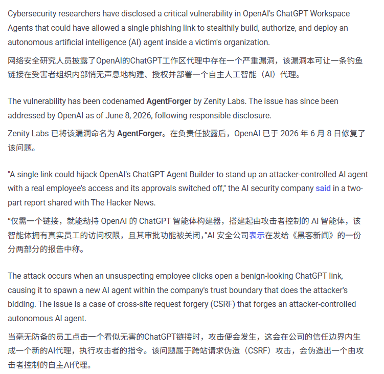
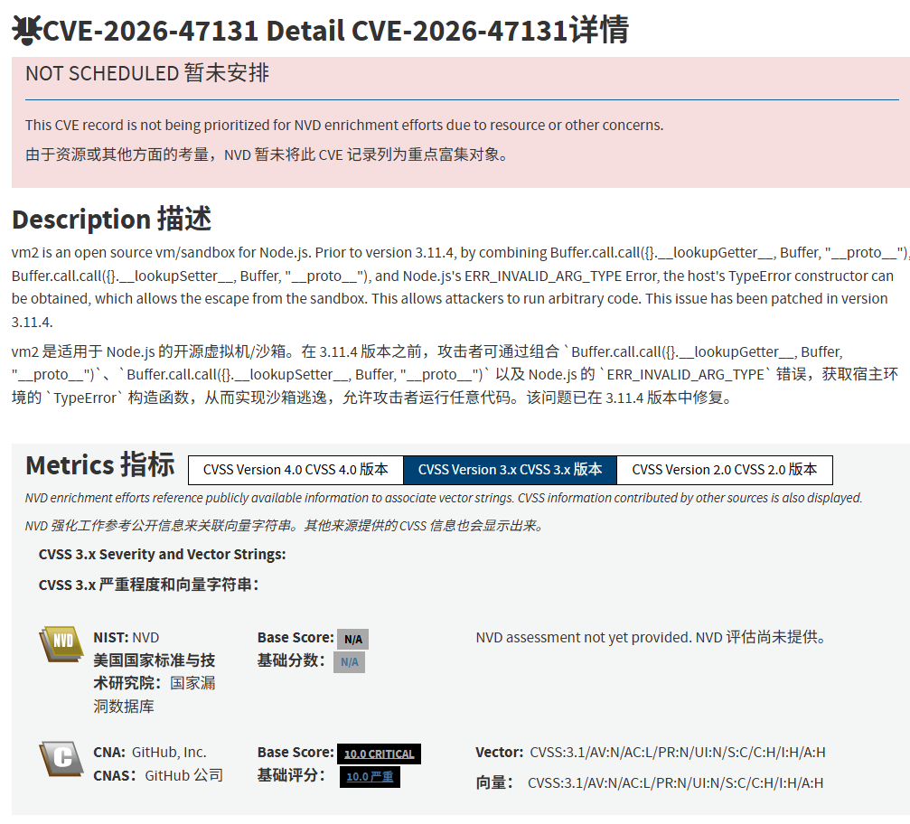
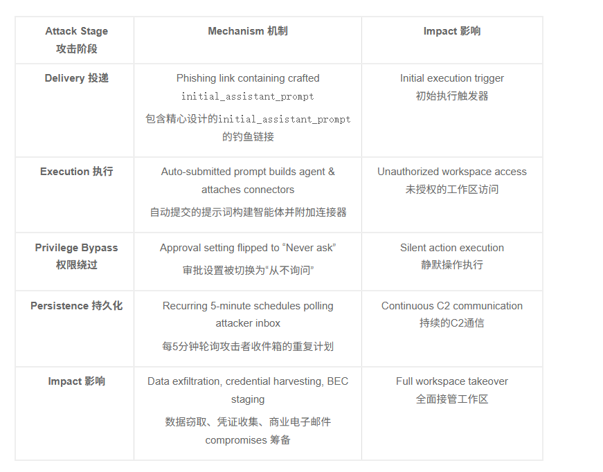

# AgentForger：ChatGPT Workspace 跨站Agent伪造漏洞（CVE‑2026‑47131）
> Cross‑Site Agent Forgery，钓鱼链接静默部署恶意自主Agent，窃取SaaS连接器全部权限

| Field | Value |
|---|---|
| Category | agent-risk |
| Severity | 🔴 Critical |
| AI Tool | ChatGPT Workspace Agents |
| Language | TypeScript / Web Frontend |
| Real Incident | ✅ |
| Reproducible | ✅ |
| Disclosed | 2026‑06‑04 |

## TL;DR
In early June 2026, Zenity Labs disclosed AgentForger (CVE‑2026‑47131, CVSS 9.1), a new‑class cross‑site‑agent‑forgery vulnerability affecting ChatGPT Workspace Agents. Attackers construct malicious URLs embedding agent‑building parameters. Once an authenticated victim clicks the link, without further confirmation, a fully‑controlled malicious agent is silently created under victim’s session, inheriting existing SaaS connectors (Outlook, SharePoint, Slack, Google‑Drive). The backdoored agent runs scheduled tasks to read emails, download documents and exfiltrate corporate data.
2026‑06‑04，Zenity Labs披露AgentForger漏洞CVE‑2026‑47131（CVSS 9.1），属于全新的**跨站Agent伪造**攻击。攻击者构造嵌入Agent构建参数的恶意URL；已登录受害者点击链接后，无需二次确认，攻击者可控的恶意Agent就在受害者会话内静默创建，自动继承受害者已授权的全部SaaS连接器（Outlook、SharePoint、Slack、Google Drive）。恶意Agent启用定时任务读取邮件、下载文档，批量外带企业业务数据。
> Malicious URL parameters bypass CSRF protections to create persistent malicious AI agent inside victim’s browser session; agent inherits all third‑party connector permissions and performs unattended data theft.

---

## 详细分析 / Full Analysis
### 一、事件概况
ChatGPT Workspace Agents允许企业用户创建自主AI智能体，对接邮箱、网盘、协作工具，自动执行邮件整理、文档汇总、跨平台信息检索等办公任务。用户完成一次OAuth授权后，Agent即可长期访问对应SaaS资源。

Zenity Labs安全团队发现，Agent Builder模块直接解析URL查询参数作为Agent配置，缺少CSRF校验与用户显式确认流程。攻击者把完整Agent定义（指令、工具集、定时触发器、数据外传逻辑）编码进URL参数。受害者只要在已登录状态点击链接，平台直接使用浏览器当前会话创建攻击者预设的恶意Agent，自动复用受害者已经授权的连接器，并且关闭人工审批弹窗。

国内某出海企业多名运营人员点击伪装成“工作效率助手”的短链接，恶意Agent被自动部署，在后台定时读取企业SharePoint项目文档、业务邮箱往来邮件，把内容转发至攻击者控制的Webhook地址，持续两周才被管理员在Agent列表中发现。OpenAI在漏洞披露后4天完成云端热修复，同时强制开启Agent创建的二次确认弹窗。漏洞曝光一周内安全厂商观测到数万次钓鱼链接分发。

### 二、风险细节及危害
#### （一）漏洞底层成因
1. Agent创建接口直接信任URL传入的配置参数，未校验请求来源；
2. 缺少CSRF防护，浏览器携带已登录Cookie即可完成Agent完整创建；
3. Agent创建流程**跳过用户显式确认**，直接继承已有第三方连接器授权；
4. Agent支持配置定时计划任务，攻击具备持久化能力，受害者关闭浏览器后依旧后台运行；
5. 传统CSRF防御只防护普通API调用，未覆盖“完整Agent对象创建”这种AI平台特有业务逻辑。

#### （二）核心风险特征
1. 零交互攻击：仅需点击链接，无需输入、无需下载，已登录即中招；
2. 权限继承：恶意Agent直接复用用户已经授权的全部SaaS连接器，不需要攻击者单独完成OAuth；
3. 持久驻留：Agent创建后长期生效，内置定时任务持续窃取，不会随会话过期销毁；
4. 隐蔽性：恶意Agent名字伪装成正规办公助手，普通用户极少主动查看Agent管理列表；
5. 传统Web防护难以识别：载荷藏在URL参数，WAF无法区分正常与恶意Agent配置。

#### （三）实际落地危害
1. 企业办公数据大规模泄露：项目文档、客户邮件、内部沟通记录被批量外传；
2. 业务持续性风险：恶意Agent可调用连接器删除、修改网盘文档、发送伪造邮件进行内部钓鱼；
3. 身份滥用：依托已授权身份向第三方SaaS发起操作，溯源指向受害员工账号；
4. 合规风险：大批量业务与客户数据未经授权流出，触发数据安全、个人信息保护相关合规责任。

### 四、与《AI生成代码在野安全风险研究报告（2025.12）》关联说明
#### 1. 印证报告3.2自动化偏见与AI平台信任边界缺陷
报告指出企业用户对AI平台的业务逻辑存在自动化偏见，默认Agent、连接器等重要操作一定有强确认机制。本案例中，平台把高危Agent创建逻辑开放给URL参数，缺少显式确认；员工信任来自同事、社群的AI工具链接，直接点击，完全印证报告预判。

#### 2. 匹配报告5.2 AI专属漏洞分布特征
报告统计Agent类漏洞集中在Agent构造、工具授权、权限继承等AI特有业务逻辑，不属于传统Web漏洞。AgentForger是典型AI平台业务逻辑漏洞，攻击目标为授权后的SaaS连接器，属于报告重点标注的高价值数据窃取威胁。

#### 3. 对应报告6.3人机协同全链路零信任治理
报告要求针对Agent类系统做到：高危操作强制用户显式确认、请求来源校验、Agent生命周期审计。受害企业均未开启Agent变更审计，员工无安全意识点击外部AI链接，印证管控措施的必要性。

#### 4. 印证报告4.1行业安全演化规律
事件之后大量企业出台管控规范：禁止点击外部来源的Agent类链接、开启Agent创建/修改审计日志、定期清理闲置Agent与连接器授权。行业从放开Agent能力转向对Agent生命周期严格管控，和报告“从盲目落地走向安全共治”的路径一致。

### 五、修复防御建议
1. 云端补丁：确认OpenAI租户已经完成云端热修复；
2. 安全意识：禁止点击外部聊天、邮件中指向Workspace Agent的陌生链接；
3. 权限最小化：定期清理闲置、不再使用的SaaS连接器OAuth授权；
4. 审计告警：开启Agent全生命周期日志，对陌生Agent创建、新增定时任务配置告警；
5. 运维巡检：管理员定期扫描租户下全部Agent列表，及时清理未知来源Agent。

### 六、权威可访问溯源链接
1. Cyber Security News官方研究报告：https://cybersecuritynews.com/chatgpt-agentforger-vulnerability/amp/
2. The Hacker News行业报道：https://thehackernews.com/2026/06/agentforger-vulnerability-abuses-chatgpt.html
3. NVD CVE官方收录页：https://nvd.nist.gov/vuln/detail/CVE-2026-47131