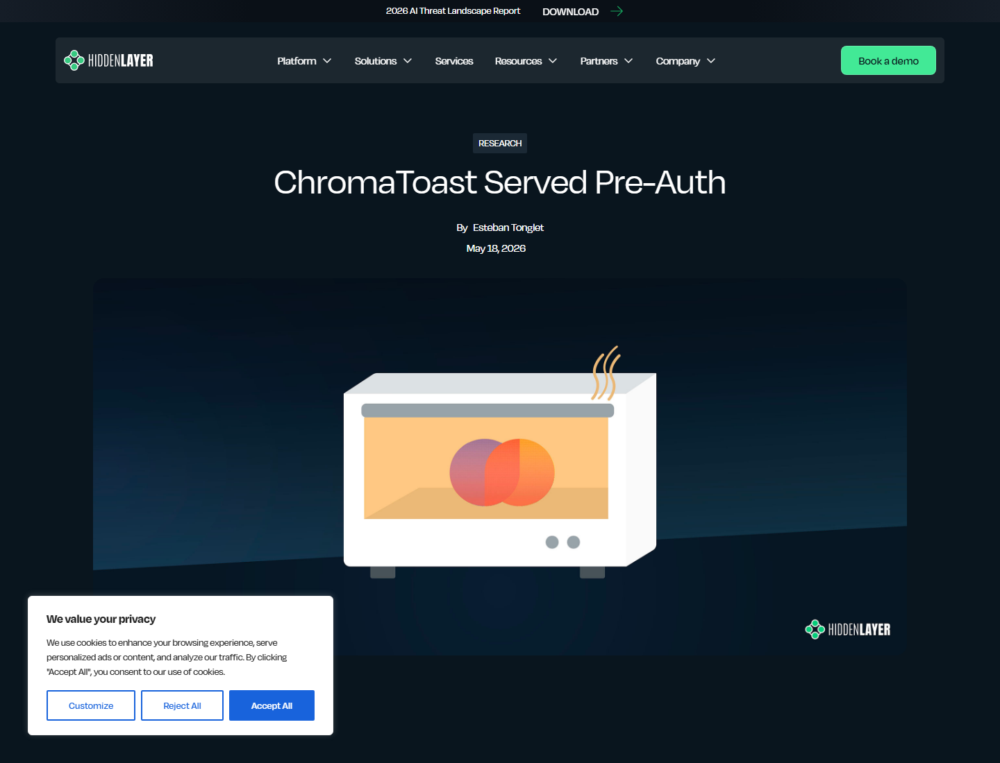
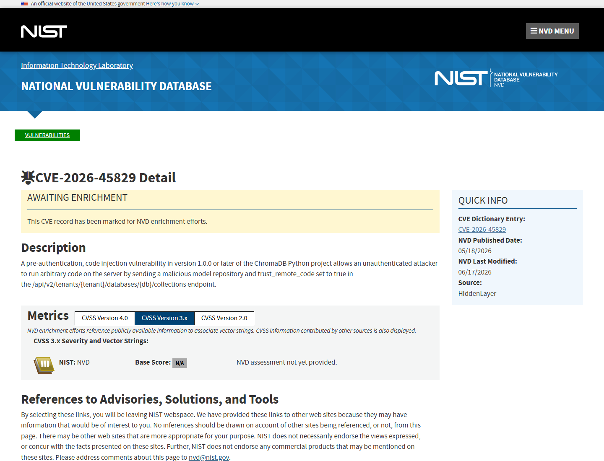
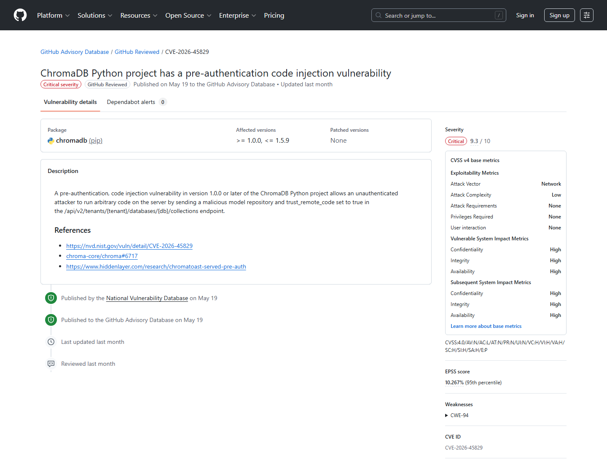
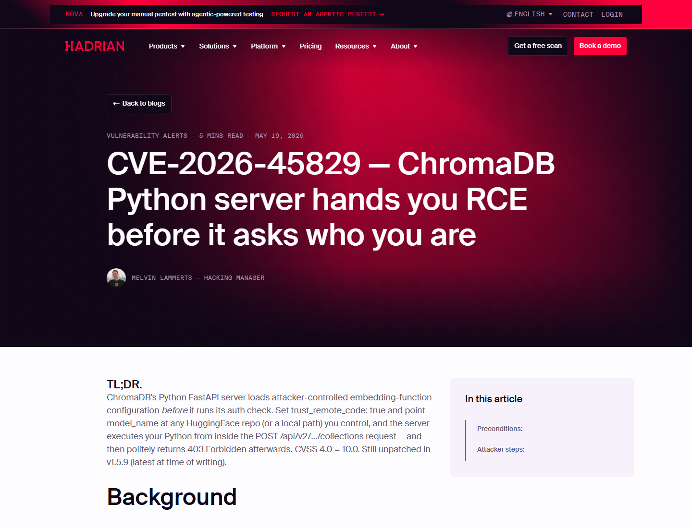
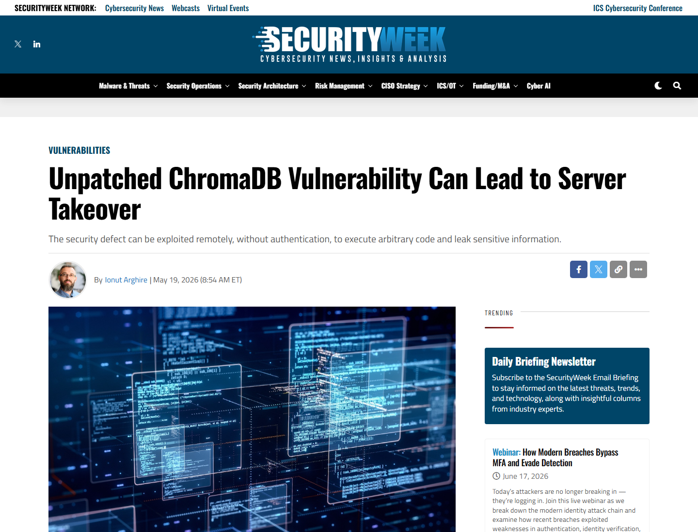
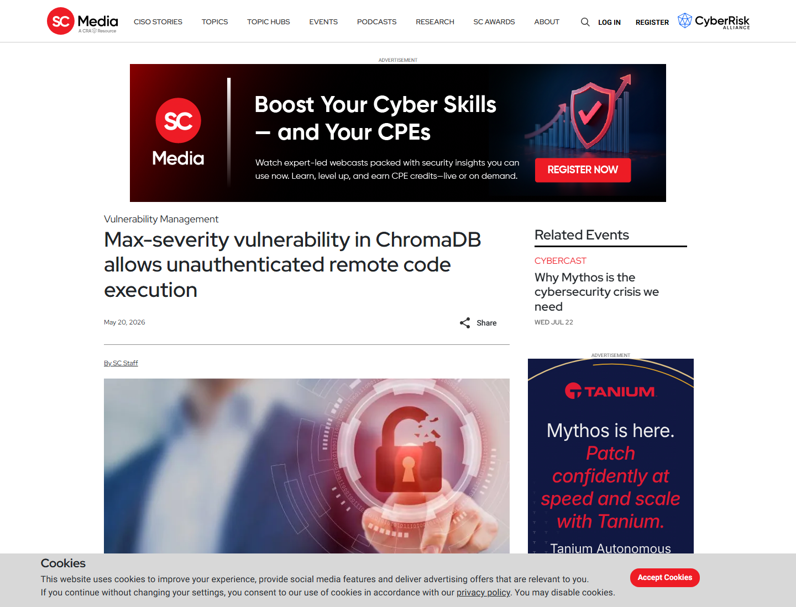

# ChromaDB ChromaToast Pre-Authentication RCE (2026)
> ChromaDB ChromaToast 预认证远程代码执行漏洞

| Field | Value |
|---|---|
| Category | Domain-Specific Risks |
| Severity | 🔴 Critical |
| AI Tool | ChromaDB, vector database, RAG infrastructure, Hugging Face model loading |
| Language | Python |
| Real Incident | ✅ |
| Reproducible | ✅ |
| Disclosed | 2026-05-18 |
| CVE | CVE-2026-45829 |
| CVSS | 10.0 |

## TL;DR
ChromaDB could execute attacker-controlled model code before checking authentication.
> ChromaDB Python FastAPI 服务在认证前处理攻击者提供的 embedding model 配置，可通过 Hugging Face 模型加载链路触发远程代码执行。

---

## 详细分析 / Full Analysis

# ChromaDB ChromaToast 预认证 RCE 漏洞分析：RAG 向量数据库在认证前加载攻击者模型代码

## 基本信息

ChromaDB 是常见的开源向量数据库，被大量 RAG、语义搜索、AI 助手和文档智能应用用来存储和检索 embeddings。2026 年 5 月，HiddenLayer 披露 CVE-2026-45829，并将其称为 ChromaToast。该漏洞存在于 ChromaDB Python FastAPI server 中：服务在认证检查之前处理攻击者提交的 embedding function 配置，允许攻击者通过 `trust_remote_code` 和恶意 Hugging Face 模型仓库触发任意 Python 代码执行。

## 摘要

ChromaToast 的危险性在于执行顺序错误。攻击者向 collection creation endpoint 提交恶意 embedding function 配置，服务端先初始化模型加载逻辑，再进行认证校验。即使最后返回 401 或 403，攻击者控制的 Python 代码也可能已经在服务器进程中运行。对 AI 系统而言，ChromaDB 往往靠近文档索引、知识库、模型 API key、环境变量和挂载密钥，因此预认证 RCE 会直接威胁 RAG 基础设施。

## 一、事件核验与证据范围

### 证据矩阵

| 来源 | 类型 | 证明内容 | 边界 |
|---|---|---|---|
| HiddenLayer 原始研究 | 主证据 / 技术证据 | ChromaToast 攻击链、认证前模型加载、73% 暴露实例运行受影响版本范围 | 研究视角，需要结合 CVE 和媒体复核 |
| NVD CVE-2026-45829 | 主证据 | 漏洞描述、影响版本、CWE-94、CVE 记录 | NVD 分析状态可能随时间更新 |
| GitHub Advisory GHSA-f4j7-r4q5-qw2c | 主证据 | 影响包、版本范围、Critical、patched versions none | 需结合当前项目发布状态判断修复进展 |
| BleepingComputer | 复核证据 | 最大严重度、AI apps server hijacking、暴露服务影响 | 媒体复核，不提供完整 PoC |
| SecurityWeek | 复核 / 影响证据 | 未修复漏洞、约 13M 月 pip 下载、敏感信息暴露 | 下载量是生态规模指标 |
| SC World / Hadrian | 复核 / 技术解释 | 认证前处理 model settings、Hugging Face 模型加载、14M 月下载表述 | 用于交叉说明技术链和影响面 |

HiddenLayer 披露称，ChromaDB Python FastAPI server 会在认证前实例化用户控制的 embedding function settings。攻击者只需向 `POST /api/v2/tenants/{tenant}/databases/{db}/collections` 提交恶意配置，就可以让服务端加载攻击者控制的 Hugging Face 模型代码。HiddenLayer 还指出，公开暴露的 ChromaDB 实例中约 73% 运行在 1.0.0 或更新版本，处于受影响功能范围内。([HiddenLayer](https://www.hiddenlayer.com/research/chromatoast-served-pre-auth))

NVD 将 CVE-2026-45829 描述为 ChromaDB Python project 1.0.0 及以后版本中的 pre-authentication code injection。描述明确提到，攻击者可在 collection endpoint 中发送 malicious model repository，并把 `trust_remote_code` 设置为 true，从而在服务器上执行任意代码。([NVD](https://nvd.nist.gov/vuln/detail/CVE-2026-45829))

GitHub Advisory Database 将 GHSA-f4j7-r4q5-qw2c 标为 Critical，影响 `pip chromadb >= 1.0.0, <= 1.5.9`，并记录 patched versions 为 None。该 advisory 与 NVD 一样确认，漏洞发生在认证前的 code injection 路径。([GitHub Advisory](https://github.com/advisories/GHSA-f4j7-r4q5-qw2c))

## 二、系统背景与触发条件

ChromaDB 在 AI 架构中的位置很特殊。它不是普通业务数据库，而是 RAG 应用的记忆层，存储私有文档、客户内容、企业知识库和检索索引。许多应用把 ChromaDB 与模型 API、embedding pipeline、文档处理任务和后台 worker 部署在同一网络或同一容器环境中。一旦 ChromaDB server 进程被接管，攻击者可触达的不只是向量数据，还可能包括环境变量、挂载密钥、云凭据和相邻服务。

典型触发条件包括：目标暴露 ChromaDB Python FastAPI API 端口，运行 1.0.0 及以后受影响版本，collection creation endpoint 可被网络访问，并且服务端允许 embedding function 加载来自 Hugging Face 或本地路径的模型代码。攻击者不需要先获得有效凭据，关键在于服务端在认证前已经处理了危险的模型加载配置。

## 三、攻击链路与处置过程

攻击入口是 collection creation API。攻击者构造请求体，把 embedding function 类型设置为 sentence transformer，并在配置中指定攻击者控制的模型仓库，同时启用 `trust_remote_code`。服务端解析 JSON 后先初始化 collection configuration，再调用认证检查。这个顺序让模型加载发生在访问控制之前。

AI 组件是 embedding model loading。关键权限来自 ChromaDB Python server 的进程权限，包括文件系统、网络、环境变量、挂载 secrets 和向量数据库数据。失效点不是 Hugging Face 模型本身，而是服务端允许客户端控制模型标识，并在认证前执行模型初始化。攻击结果是任意 Python 代码在 ChromaDB server 进程内运行，随后请求仍可能被认证层拒绝，给日志分析带来误导。

## 四、技术根因分析

根因之一是信任了客户端提供的模型配置。`trust_remote_code` 本身就是高风险能力，适合在受控开发流程中使用；当它可由远程请求触发时，模型仓库就变成了代码投递渠道。根因之二是认证顺序错误。服务端应在处理任何可执行、可加载、可访问外部资源的配置前完成身份和授权校验，而不是在危险操作后才返回拒绝。

根因之三是 AI 基础设施组件的默认安全假设不足。向量数据库常被部署为内部组件，但 RAG 应用上线后，API 端口、容器网络、调试服务和内网反向代理可能让它暴露到更宽的访问面。ChromaToast 说明，AI 基础设施中的模型加载、插件加载和远程代码信任开关必须被当作代码执行面管理。

## 五、AI 参与方式与风险归因

AI 参与方式集中在 ChromaDB 的向量数据库和 embedding function 角色。漏洞不是普通 CRUD 接口越权，而是借助 AI 模型加载机制，把攻击者控制的 Hugging Face 模型仓库转化为代码执行入口。ChromaDB 服务的价值来自它在 RAG pipeline 中连接私有文档、embedding 模型和检索查询，因此漏洞影响的是 AI 应用的数据基础层。

风险归因集中在 ChromaDB Python FastAPI server 的执行顺序和模型配置边界。攻击者利用的是服务端对模型标识的信任、认证前处理逻辑，以及 `trust_remote_code` 语义的执行能力。企业使用者的部署方式也会影响爆炸半径：如果 ChromaDB 与模型密钥、文档卷、云凭据共处同一权限域，RCE 的后果会明显放大。

## 六、与团队技术报告风险框架的关系

团队技术报告强调 AI 代码与工具链风险不只存在于生成代码，也存在于模型、插件、依赖、执行器和基础设施层。ChromaToast 对应的是 AI 基础设施执行边界失效：模型加载能力被远程请求触发，向量数据库从数据组件变成代码执行入口。

该案例也补充了供应链与敏感数据泄露风险。攻击者并不需要污染官方 ChromaDB 包，而是借助远程模型仓库作为 payload 分发点。RAG 系统中的向量数据库又往往存储企业知识库索引，接近检索数据和模型凭据。治理上，应把 embedding/model loading 配置纳入 allowlist，把服务端出站访问、模型来源和 remote code 选项纳入强制策略。

## 七、影响范围与社会后果

公开报道给出的影响面包括 ChromaDB 的高下载量、AI 应用中的广泛采用，以及互联网暴露实例中相当比例运行受影响版本。SecurityWeek 报道称 ChromaDB 约有 1300 万月 pip 下载，并被 Mintlify、Factory AI、Weights & Biases 等组织使用；SC World 报道也将其描述为影响 Python API server 逻辑、面向 AI 应用的最大严重度漏洞。

直接后果包括服务器进程接管、环境变量与 API key 泄露、挂载文件读取、RAG 文档数据暴露、向量集合篡改和横向移动。社会后果在于 RAG 组件常被视为后台基础设施，安全关注度低于前端应用和模型网关；一旦该层出现预认证 RCE，攻击者可以绕过业务应用，直接进入 AI 数据平面。

## 八、治理建议

部署侧应立即限制 ChromaDB Python FastAPI server 的公网访问，把 API 端口放在可信网络后，并在反向代理或服务网格中加入强认证。对 embedding function、Hugging Face model repository 和 `trust_remote_code` 应使用 allowlist，禁止由外部请求直接控制模型加载参数。运行环境应拆分模型 API key、文档卷和数据库进程权限，阻断 ChromaDB RCE 后读取云密钥或生产文档。

## 九、结论

ChromaToast 说明，AI 基础设施中的模型加载逻辑本身就是高风险执行面。向量数据库不只是存储 embeddings 的后台组件；在 RAG 系统中，它连接私有数据、模型调用和检索工作流。认证、授权和 remote code 策略必须在模型加载之前生效，否则即使请求最终被拒绝，攻击代码也可能已经运行。

## 参考来源

- [HiddenLayer: ChromaToast Served Pre-Auth](https://www.hiddenlayer.com/research/chromatoast-served-pre-auth)
- [NVD: CVE-2026-45829](https://nvd.nist.gov/vuln/detail/CVE-2026-45829)
- [GitHub Advisory Database: GHSA-f4j7-r4q5-qw2c](https://github.com/advisories/GHSA-f4j7-r4q5-qw2c)
- [BleepingComputer: ChromaDB max-severity flaw allows server hijacking](https://www.bleepingcomputer.com/news/security/max-severity-flaw-in-chromadb-for-ai-apps-allows-server-hijacking/)
- [SecurityWeek: Unpatched ChromaDB vulnerability can lead to server takeover](https://www.securityweek.com/unpatched-chromadb-vulnerability-can-lead-to-server-takeover/)
- [SC World: ChromaDB unauthenticated RCE](https://www.scworld.com/brief/max-severity-vulnerability-in-chromadb-allows-unauthenticated-remote-code-execution)
- [Hadrian: ChromaDB Python server hands you RCE before auth](https://hadrian.io/blog/cve-2026-45829----chromadb-python-server-hands-you-rce-before-it-asks-who-you-are)
