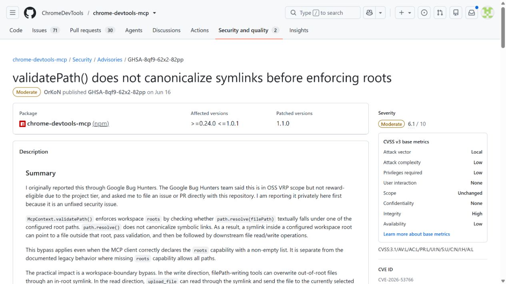
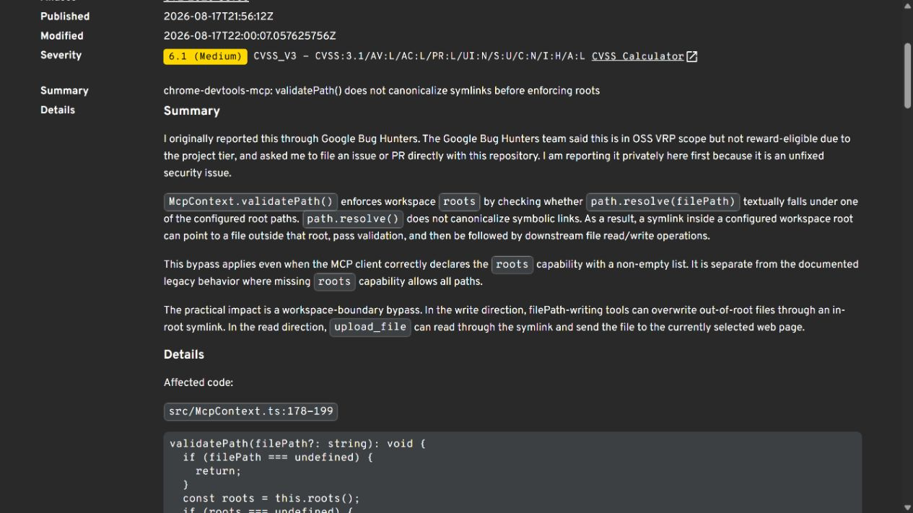
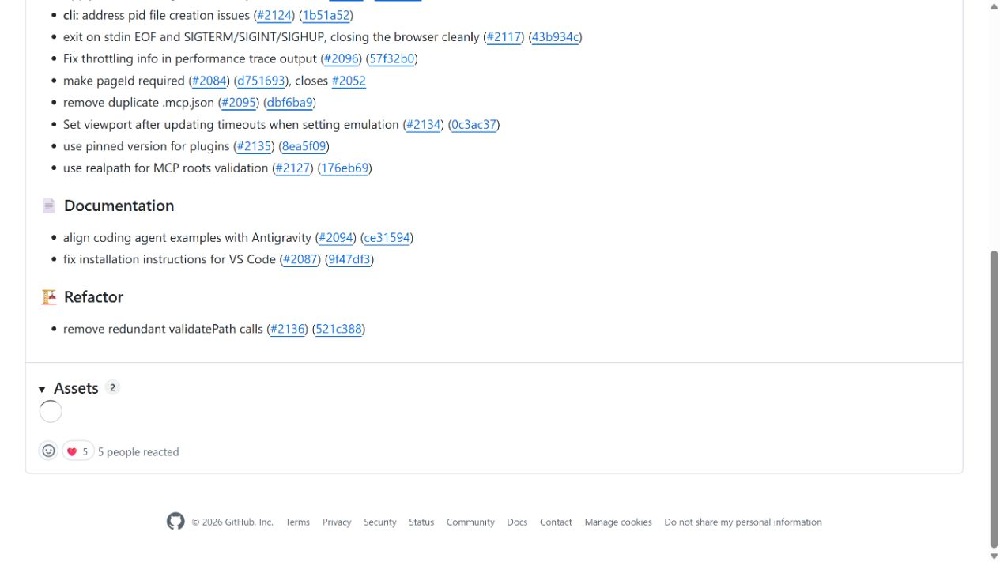
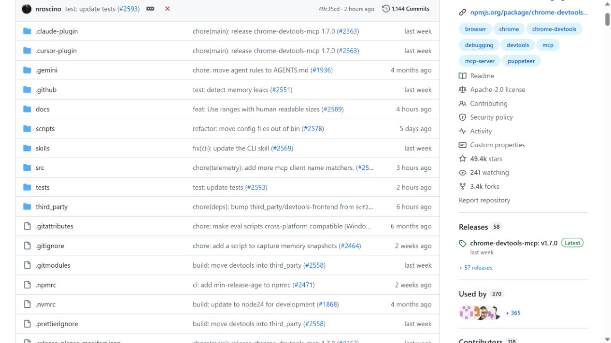
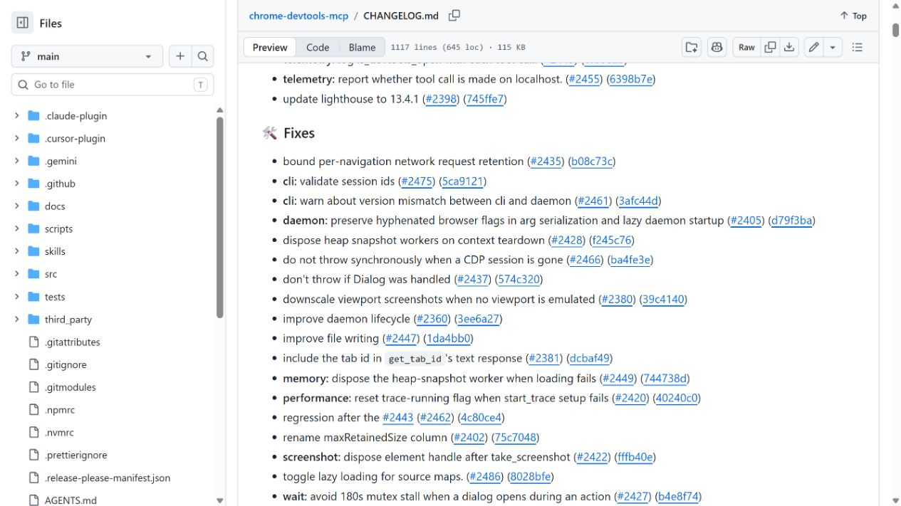

# Chrome DevTools MCP Symlink Root Escape (2026)
> Chrome DevTools MCP 符号链接越界读写

| Field | Value |
|---|---|
| Category | code-vulns |
| Severity | Medium |
| CVE | CVE-2026-53766 |
| AI Tool | Chrome DevTools MCP, AI coding agents |
| Language | TypeScript |
| Real Incident | Yes |
| Reproducible | Yes |
| Disclosed | 2026-06-15 |

## TL;DR
Chrome DevTools MCP 仅按文本路径检查允许目录，工作区内的符号链接可把 AI 代理的文件上传或下载动作引向目录之外。

---

## 详细分析 / Full Analysis

## 一、事件概况

Chrome DevTools MCP 把浏览器调试能力提供给 AI 编程代理，其中包括选择本地文件上传、保存下载内容等会接触主机文件系统的操作。CVE-2026-53766 指出，0.24.0 至 1.0.1 的路径验证只处理了 `..` 等文本形式，没有把符号链接解析到真实目标。1.1.0 已修复。

漏洞需要工作区中存在指向允许根目录之外的符号链接，但这在代码仓库、解压项目或攻击者提交的分支中并不罕见。代理看到的路径仍位于项目目录内，实际读写目标却可以是用户主目录、凭据文件或其他仓库。

## 二、公开材料与事实核对

GitHub advisory、OSV 与 1.1.0 发布记录对影响版本和修复版本一致，项目首页和 changelog 则确认该组件面向 AI Agent 的实际用途及版本演进。CVSS 3.1 为 6.1，反映攻击依赖本地工作区条件，但不应因此忽略代理自动选择文件时的可达性。

| 来源 | 类型 | 主要内容 |
|---|---|---|
| GitHub Advisory | 项目公告 | 路径校验缺陷、版本范围 |
| OSV | 漏洞数据库 | CVE 与 npm 包映射 |
| 1.1.0 Release | 修复记录 | 修复版本 |
| 项目首页 | 产品资料 | MCP 能力和 Agent 用途 |
| Changelog | 版本记录 | 后续版本演进 |

## 三、攻击或事件链路

攻击者可在仓库中放入一个看似普通的链接，例如 `artifacts/current`，实际指向工作区外。随后，仓库里的任务说明、测试页面或提示注入内容要求代理把该路径中的文件上传到网页，或把浏览器下载结果保存到该位置。旧版 MCP 对拼接后的字符串执行 `path.resolve`，结果仍以允许根目录开头，于是通过检查。

操作系统在真正打开文件时再跟随符号链接，最终对象已经越过根目录。读路径可导致本地文件被上传到攻击者控制的表单；写路径可能覆盖 shell 配置、Git 钩子或其他敏感文件。具体后果取决于代理能访问的工具动作以及运行账户权限。

## 四、技术根因

`path.resolve` 解决的是路径中的点号与相对片段，不会验证文件系统对象最终指向哪里。若安全策略以目录边界为准，就必须在操作前调用真实路径解析，并对现有父目录、目标文件及创建后的结果进行一致校验。只检查字符串前缀还可能受到相似目录名和大小写规则影响。

写入场景尤其棘手：目标文件可能尚不存在，系统需要解析最近的现有父目录，并用不跟随链接的方式创建文件。检查与使用之间若有时间窗口，链接还可能被替换，因此高风险操作应使用文件句柄或平台提供的安全打开标志。

## 五、AI 安全问题

这一缺陷与 AI 的关系在于，文件选择不再完全由用户在系统对话框中完成，而是由代理根据自然语言和网页状态自动决定。恶意仓库可以同时提供符号链接和诱导性任务文本，构成从不可信项目内容到主机文件系统的闭环。MCP 服务器若只把工作区路径视为可信，会忽略仓库本身就是输入。

Agent 的“工作区授权”也不能简化成一个目录字符串。仓库中的链接、子模块、挂载点和生成物会改变实际边界；浏览器上传又天然具备外传通道。文件工具应向用户展示解析后的真实路径，而不是只显示仓库内的别名。

## 六、影响、处置与排查

公开公告提供了可复现条件，没有报告已确认的大规模利用。升级到 1.1.0 或更高版本后，应检查旧版运行期间仓库内的符号链接，以及代理调用过的上传、下载和文件选择记录。若出现工作区外路径、凭据文件被读取或异常站点收到上传，应进一步核对浏览器会话与网络日志。

临时无法升级时，可在隔离容器中运行 MCP，避免挂载用户主目录和 SSH、云平台配置；同时禁止代理自动上传文件，并在执行前显示 `realpath` 结果。简单删除当前仓库的链接只能缓解已知项目，不能替代服务器端修复。

## 七、治理建议

维护者应为读、写、创建和覆盖分别设计路径策略，并测试多级链接、断链、链接父目录、Windows junction 与大小写差异。允许根目录本身也应在启动时解析为真实路径。对于上传动作，可增加扩展名、大小和目标域名限制，避免一次错误选择直接成为外传。

使用方应把第三方仓库视为不可信包，在代理打开前审查链接和子模块。代理日志至少记录请求路径、解析后路径、调用来源、目标网页和用户授权结果，这样发生异常时能从仓库内容追到具体文件操作。

## 八、结论

CVE-2026-53766 说明，给 Agent 一个“仅限工作区”的文件权限并不等于完成了隔离。边界必须落到操作系统解析后的对象上，并贯穿检查和实际打开过程。Chrome DevTools MCP 1.1.0 处理了已知路径，部署方仍应把浏览器上传、下载与本地文件访问视为高敏感组合能力。

### 参考来源

1. [GitHub Security Advisory GHSA-8qf9-62x2-82pp](https://github.com/ChromeDevTools/chrome-devtools-mcp/security/advisories/GHSA-8qf9-62x2-82pp)
2. [OSV CVE-2026-53766 record](https://osv.dev/vulnerability/GHSA-8qf9-62x2-82pp)
3. [Chrome DevTools MCP 1.1.0 release](https://github.com/ChromeDevTools/chrome-devtools-mcp/releases/tag/chrome-devtools-mcp-v1.1.0)
4. [Chrome DevTools MCP project](https://github.com/ChromeDevTools/chrome-devtools-mcp)
5. [Chrome DevTools MCP changelog](https://github.com/ChromeDevTools/chrome-devtools-mcp/blob/main/CHANGELOG.md)
