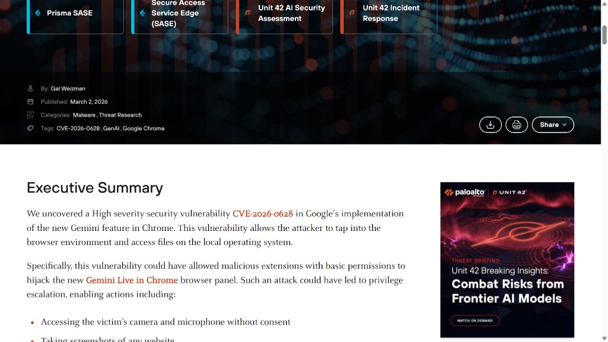
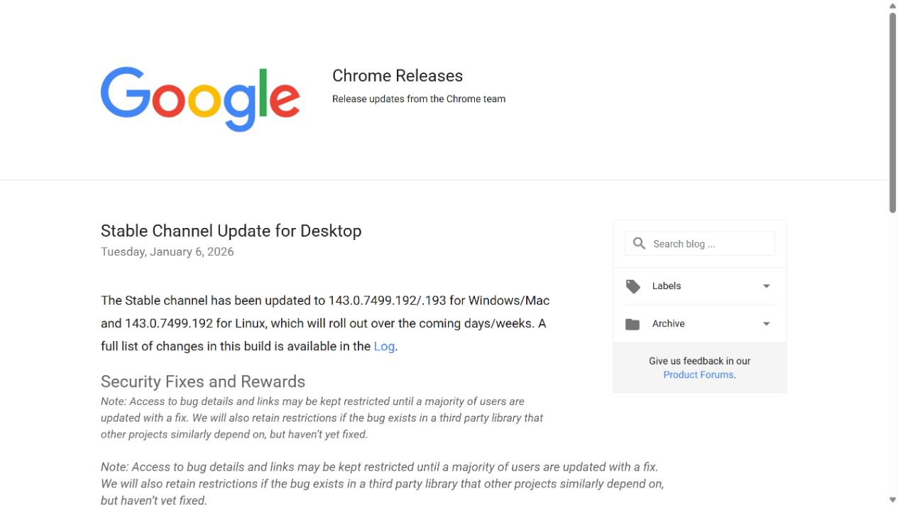
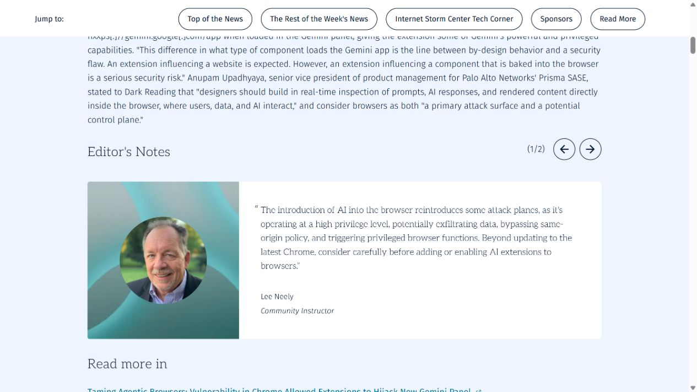
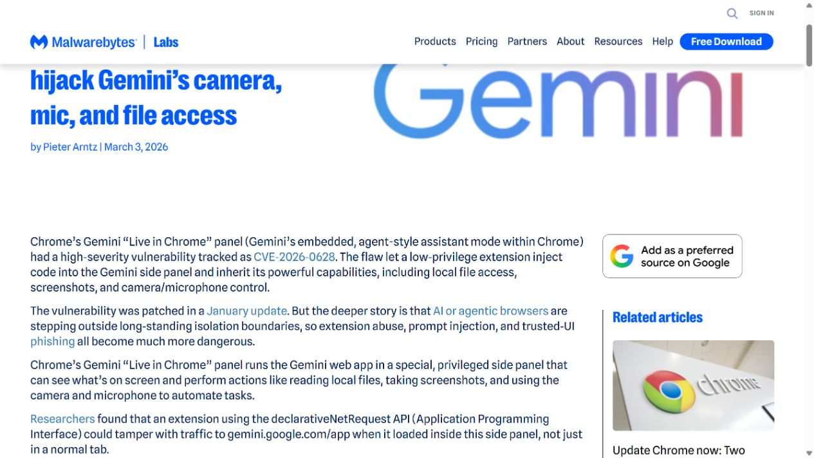
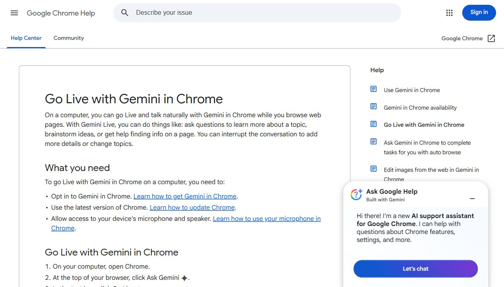

# Chrome Gemini Live AI Panel Hijacking (2026)
> Chrome Gemini Live AI 面板劫持

| Field | Value |
|---|---|
| Category | code-vulns |
| Severity | High |
| CVE | CVE-2026-0628 |
| AI Tool | Gemini Live in Chrome, Chrome AI side panel, browser extensions |
| Language | JavaScript, C++ |
| Real Incident | Yes |
| Reproducible | Yes |
| Disclosed | 2026-03-02 |

## TL;DR
CVE-2026-0628 允许仅有基础网络请求权限的恶意 Chrome 扩展向 Gemini Live 侧边面板注入 JavaScript，借面板的浏览器级能力访问摄像头、麦克风、本地文件和 HTTPS 标签页截图。Google 于 2026 年 1 月发布修复。

---

## 详细分析 / Full Analysis

## 一、事件概况

Palo Alto Networks Unit 42 于 2026 年 3 月 2 日公开一项 Chrome Gemini Live 集成漏洞，Google 为其分配 CVE-2026-0628，并将严重性列为 High。研究人员演示，已经安装的恶意扩展即使只申请常见的 declarativeNetRequest 权限，也能影响在 Gemini 侧边面板中加载的 `gemini.google.com/app`，继而取得该面板连接的高权限浏览器能力。

Google 的稳定版公告显示，Windows 和 macOS 的 Chrome 143.0.7499.192/.193、Linux 的 143.0.7499.192 已包含修复，发布时间为 2026 年 1 月 6 日。研究报告列出的可达效果包括启动摄像头和麦克风、读取本地文件和目录、截取任意 HTTPS 标签页，以及在浏览器原生侧栏中显示钓鱼内容。触发仍有前提：用户设备上需要存在恶意或后来被劫持的扩展，用户还需从标题栏打开 Gemini 面板。公开资料没有披露真实受害者或在野利用。

## 二、公开材料与事实核对

Unit 42 给出了完整技术链和演示结果，Google Chrome Releases 则确认 CVE 编号、High 等级、修复版本与发布时间。SANS NewsBites 和 Malwarebytes 对攻击前提、权限提升效果与修复状态进行了新闻复核；Google Chrome Help 说明 Gemini Live 确实需要麦克风、页面内容共享和浏览辅助等权限，补足了产品能力这一环。几份材料对核心技术事实一致，最初报告日期存在一处差异：Unit 42 时间线写 2025 年 10 月 23 日向 Google 报告，Google 发布页写研究员于 2025 年 11 月 23 日报告。现有材料不足以消除这一个月差异，报告只采用双方一致的 2026 年 1 月修复事实。

| 来源 | 类型 | 主要内容 |
|---|---|---|
| Unit 42 | 原始技术研究 | 注入路径、演示能力与披露时间线 |
| Google Chrome Releases | 厂商发布记录 | CVE、严重性和修复版本 |
| SANS NewsBites | 行业复核 | 风险条件与处置意见 |
| Malwarebytes | 安全媒体复核 | 扩展权限、面板能力和影响 |
| Google Chrome Help | 厂商产品资料 | Gemini Live 的麦克风、页面共享与浏览能力 |

这组来源同时覆盖发现方、厂商修复记录、行业复核和产品权限说明，不需要依赖 CVE 聚合页补足版本信息。

## 三、攻击或事件链路

攻击首先需要一个已安装的恶意扩展，或者一个正常扩展的发布账户被接管后推送恶意更新。扩展申请 declarativeNetRequest 一类用于修改网络请求和响应的权限。按照 Chrome 的常规模型，这类扩展可以影响普通标签页里加载的网页，但不能干预浏览器自身的高权限界面。

Gemini Live 侧边面板通过 WebView 加载 `gemini.google.com/app`。漏洞使扩展的网络规则同样作用于这份特殊加载，攻击者于是能够把 JavaScript 注入面板。相同脚本如果只运行在普通 Gemini 网页中，权限仍受网页沙箱约束；运行在侧边面板中时，却可以调用 Chrome 为 Gemini 提供的桥接能力。

Unit 42 的演示进一步完成了权限提升：扩展借注入脚本启动音视频设备，访问操作系统文件和目录，获取 HTTPS 标签页截图，并替换面板内容实施钓鱼。除首次安装扩展外，实际演示不要求用户逐项批准这些动作，只需用户打开 Gemini。攻击价值来自“低权限扩展代码进入高权限 AI 组件”这一跨层路径。

## 四、技术根因

漏洞位于 WebView 策略执行，而非 Gemini 模型回答质量。Chrome 允许 declarativeNetRequest 修改普通 Web 内容，是广告过滤、隐私保护等扩展的正常能力；Gemini 面板虽然加载同一域名，却接入了摄像头、麦克风、屏幕和本地文件等浏览器桥接接口。旧策略没有根据加载容器的权限级别阻止扩展改写响应，使普通网页规则意外覆盖到特权组件。

这类错误容易被域名相同掩盖。安全判断如果只看 URL，会认为普通标签页与侧边面板都在访问 `gemini.google.com/app`；真正决定风险的是页面所处的执行环境，以及宿主向它暴露了哪些接口。一个组件获得的能力越多，加载内容、响应修改、脚本注入和扩展互操作规则就越需要单独收紧。

Google 将问题归类为 WebView tag 的策略执行不足。修复版本于公开技术细节前约两个月发布，这让大多数自动更新用户先获得保护。企业仍需留意长期离线设备、冻结版本和受管环境中的延迟更新，因为这类环境可能在研究公开后继续运行受影响构建。

## 五、AI 安全问题

Gemini Live 并非只显示聊天网页。为了理解当前页面、接受语音和图像、截取浏览内容并协助处理本地资料，它被赋予了普通网页与普通扩展都不具备的能力。正是这些 AI 助手功能把一次扩展注入放大为摄像头、文件和跨站截图访问。移除该 AI 侧边面板及其特权桥接后，攻击只能停留在普通网页注入，无法形成公开研究演示的结果。

AI 助手在浏览器中承担了新的权限主体角色。用户看到的是一个聊天面板，底层却连接多种敏感资源；扩展权限页面仍主要描述扩展自身能做什么，没有直观呈现“扩展能否影响另一个带 AI 能力的组件”。这导致安装时的风险判断低估了组合后的权限。

钓鱼效果也受到原生 AI 界面信任的加成。攻击内容显示在浏览器自带的 Gemini 面板，而非地址栏可疑的独立站点，用户更容易把登录提示、授权请求或文件选择界面理解为产品自身流程。界面归属和代码来源在这里发生分离，传统依赖域名与窗口外观的识别方式因而失效。

## 六、影响、处置与排查

终端应至少运行 Chrome 143.0.7499.192/.193 或更高版本，并确认自动更新确实完成重启切换。企业环境可以从浏览器管理平台清点具体构建号，而不是只检查是否启用自动更新。Gemini 功能尚未部署或业务不需要时，可以按组织策略控制启用范围，减少带高权限浏览器助手的暴露面。

历史排查要以扩展清单和版本变更为起点。重点关注拥有 declarativeNetRequest 权限、在漏洞窗口期安装或更新、发布者发生变化、以及来源不在组织允许列表中的扩展。浏览器日志若能保留扩展 ID、网络规则和 Gemini 面板启动时间，应与摄像头麦克风访问、本地文件选择、异常截图行为和可疑外联请求关联。

研究没有公开通用受害指标，也没有给出某个扩展 ID。排查不能把任意 declarativeNetRequest 扩展都判定为恶意；该权限有大量正常用途。更有效的方法是核对扩展来源、更新链、规则目标和运行时行为，查找它是否专门修改 `gemini.google.com/app` 或在 Gemini 启动后立即产生敏感资源访问。

## 七、治理建议

浏览器厂商需要把 AI 侧边栏、代理面板和普通标签页视为不同安全域。任何进入特权 WebView 的响应修改、脚本注入、导航、下载与媒体访问，都应由宿主策略再次校验，不能沿用普通网页的扩展规则。桥接 API 可以按当前任务临时开放，并为文件、屏幕、摄像头和麦克风分别建立明确授权。

企业扩展治理应从静态权限清单扩展到组合风险。一个广告过滤权限本身可能合理，但当浏览器新增 AI 面板后，它与面板加载域名的交互需要重新评估。建议使用强制允许列表、固定扩展版本来源、发布者变更告警和恶意更新快速撤回机制；高敏感岗位可限制用户自行安装扩展。

界面层也应让用户知道敏感动作由谁发起。摄像头、文件和屏幕访问提示应显示调用组件及扩展影响状态，原生面板中的登录或付款请求不能仅凭外观获得信任。安全团队还应把 AI 组件加入浏览器威胁建模和扩展兼容测试，而不是等到模型功能上线后只做内容安全评估。

## 八、结论

CVE-2026-0628 展示了浏览器 AI 集成带来的实际权限变化：Gemini 为完成多模态辅助而接入敏感资源，旧版 Chrome 又允许低权限扩展改写承载该助手的 WebView。Google 已在 2026 年 1 月的稳定版中修复，Unit 42 于 3 月公开技术细节。处置重点是升级浏览器、清点扩展和核对运行时敏感资源访问；更长期的设计要求则是让 AI 面板的每项能力都有独立、可见、不可由普通扩展继承的授权路径。

### 参考来源

1. [Unit 42 Gemini panel hijacking research](https://unit42.paloaltonetworks.com/gemini-live-in-chrome-hijacking/)
2. [Google Chrome stable channel update](https://chromereleases.googleblog.com/2026/01/stable-channel-update-for-desktop.html)
3. [SANS NewsBites CVE-2026-0628 review](https://www.sans.org/newsletters/newsbites/xxviii-16)
4. [Malwarebytes Gemini Live report](https://www.malwarebytes.com/blog/news/2026/03/chrome-flaw-let-extensions-hijack-geminis-camera-mic-and-file-access)
5. [Google Chrome Help for Gemini Live](https://support.google.com/chrome/answer/16363185?hl=en)
