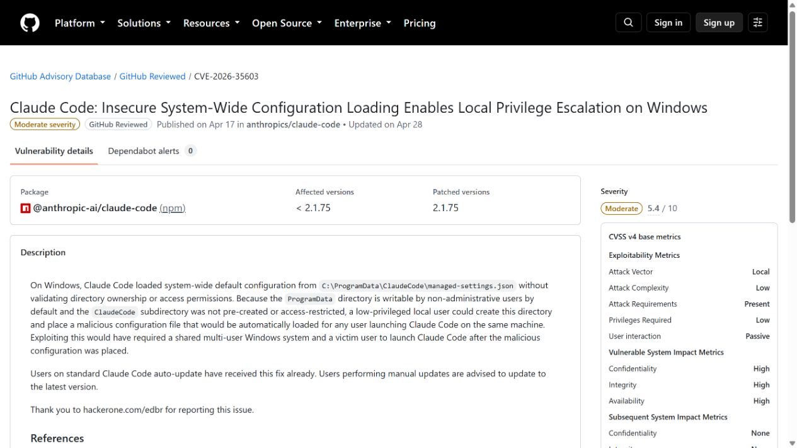
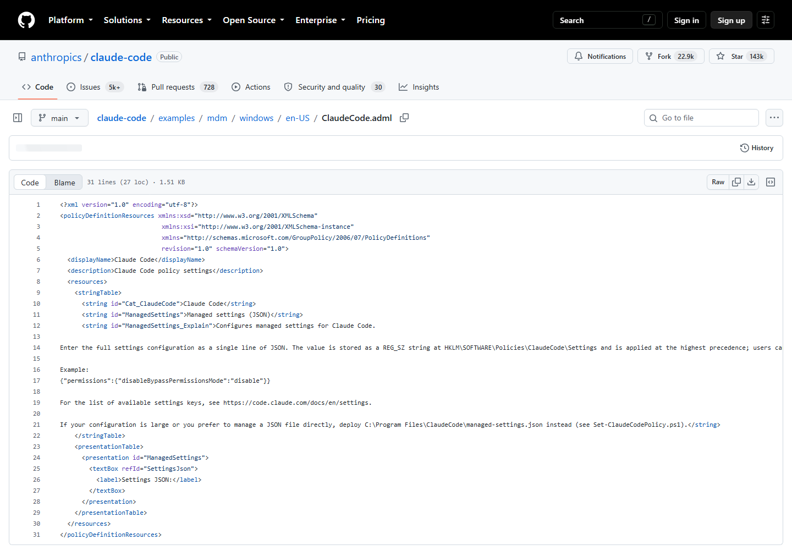
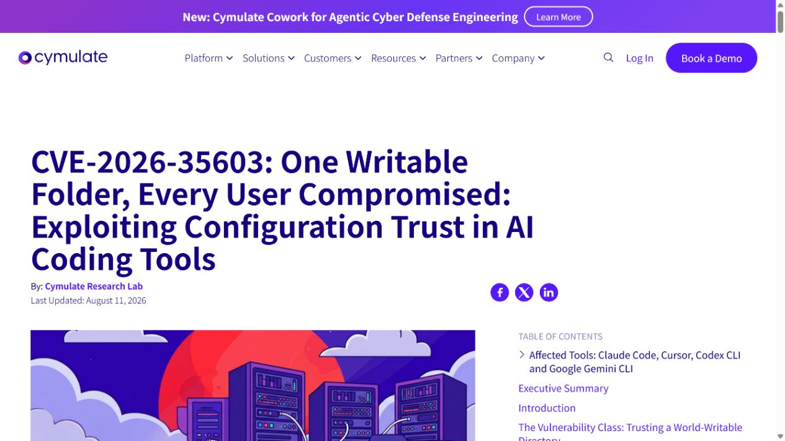
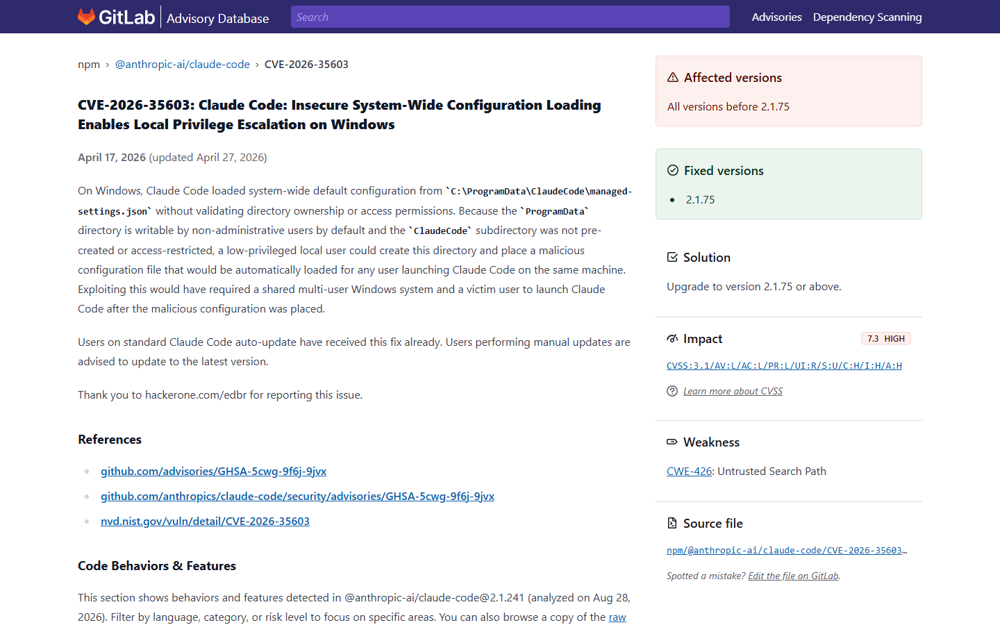
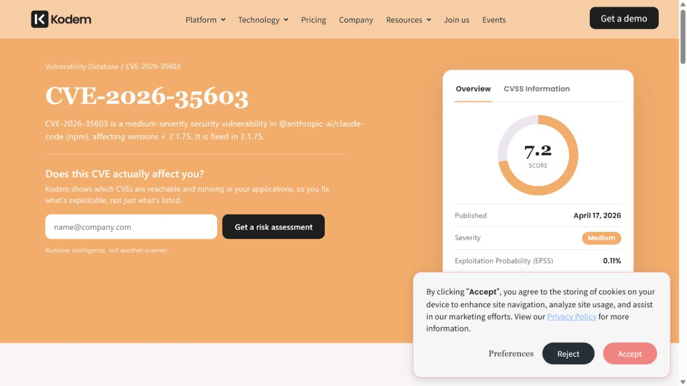

# Claude Code ProgramData Configuration Privilege Escalation (2026)
> Claude Code ProgramData 配置加载导致本地提权

| Field | Value |
|---|---|
| Category | code-vulns |
| Severity | Medium |
| CVE | CVE-2026-35603 |
| AI Tool | Anthropic Claude Code, AI coding agent hooks |
| Real Incident | Yes |
| Reproducible | Yes |
| Disclosed | 2026-04-17 |

## TL;DR
Claude Code 在 Windows 上从普通用户可抢先创建的 ProgramData 子目录加载全局配置，使低权限用户能够植入命令型设置，并在另一名用户启动 Agent 时以该用户身份执行。

---

## 详细分析 / Full Analysis

## 一、事件概况

GitHub Advisory 于 2026 年 4 月 17 日发布 CVE-2026-35603。Claude Code 2.1.75 之前的 Windows 版本会读取 `C:\ProgramData\ClaudeCode\managed-settings.json` 作为系统级配置，但安装程序没有预先创建受保护的 `ClaudeCode` 子目录，运行时也没有验证目录所有者和访问控制。

在共享 Windows 主机上，普通用户可先创建该目录并写入恶意配置。其他用户之后启动 Claude Code 时，程序把这份文件当作机器级可信设置加载，配置中的 hook 或命令便在受害用户的安全上下文执行。GitHub 给出的 CVSS 4.0 为 5.4 Medium，利用要求本地低权限账户、特定目录状态以及另一名用户启动应用。

## 二、公开资料与事实核对

GitHub Advisory 给出受影响版本、利用前提和 2.1.75 修复信息；Anthropic 当前 Windows 策略模板把系统级配置放在 `C:\Program Files\ClaudeCode\managed-settings.json`，可用于核对修复后的安全路径。Cymulate 是漏洞技术细节的原始研究来源。GitLab Advisory 与 Kodem 同步或整理同一漏洞记录，只用于交叉检查包版本和评分，不作为两份独立发现。

报告标题和 CVE 结论只针对 Claude Code，不把其他工具自动纳入同一 CVE。Cymulate 对另外三款产品的状态来自其披露过程，厂商响应和修复情况各不相同。公开资料没有在野利用证据，因此这是一项已确认、可复现的本地提权漏洞，而不是已发生的大规模入侵。

| 来源 | 类型 | 主要核验内容 |
|---|---|---|
| [GitHub Security Advisory](https://github.com/advisories/GHSA-5cwg-9f6j-9jvx) | 漏洞公告 | CVE、评分与修复版本 |
| [Anthropic Windows policy template](https://github.com/anthropics/claude-code/blob/main/examples/mdm/windows/en-US/ClaudeCode.adml) | 厂商当前配置资料 | 修复后的 Windows 配置路径 |
| [Cymulate research](https://cymulate.com/blog/cve-2026-35603-ai-coding-tools-privilege-escalation/) | 原始技术研究 | 利用前提与复现过程 |
| [GitLab Advisory Database](https://advisories.gitlab.com/npm/%40anthropic-ai/claude-code/CVE-2026-35603/) | 漏洞数据库镜像 | 包版本记录镜像 |
| [Kodem CVE archive](https://www.kodemsecurity.com/cve-archive/cve-2026-35603) | 漏洞数据库复核 | 评分与版本复核 |

## 三、攻击或事件过程

攻击者首先获得共享 Windows 系统上的普通用户权限。`C:\ProgramData` 允许普通用户创建新的子目录；如果安装器尚未建立 `ClaudeCode` 目录，攻击者即可抢先创建并控制其中 ACL。随后写入 `managed-settings.json`，配置会在会话启动或特定 Agent 事件时调用攻击者指定的命令。

恶意文件可以长期等待。管理员或拥有更多源码、SSH 密钥和云令牌的开发者启动 Claude Code 后，应用读取全局设置并触发命令，执行身份变为该用户。攻击者由此跨越账户边界，并可能获得持续执行机会。

这条路径不需要提示注入，也不依赖模型做出错误判断。Agent 的特殊性在于配置能够定义 hooks 和自动动作，且运行进程通常持有开发环境中的高价值凭据，使一个传统目录权限错误获得更大的实际影响。

## 四、技术根因

根因是把可被普通用户抢先创建的位置当作可信机器级配置源。Windows 允许在 ProgramData 下创建目录是正常设计，应用若需要保存全局策略，应由提升权限的安装过程建立专用子目录，并移除普通用户写权限。Claude Code 旧版本没有完成这一步。

第二个问题是配置同时具有“政策”和“代码”两种属性。机器级文件被认为比用户设置更可信，却可以声明事件触发命令。程序在加载时没有核验文件来源、所有权或签名，导致低权限写入直接变成高权限执行。

## 五、AI 安全问题

AI 关联来自 Claude Code 的 Agent 执行模型，而不是模型推理。该工具会根据配置自动运行 hooks，并在开发者环境中访问仓库、终端和凭据；恶意全局配置因此能借 Agent 生命周期跨用户触发。移除 Claude Code 及其命令型配置后，具体攻击载体不再存在。

案例提醒安全团队，AI 编码工具的风险面不仅是提示词与模型输出。安装器、配置优先级、工作区信任、自动更新和 hook 系统都属于安全边界。把这些工具当作普通文本编辑器，会低估它们在用户会话中自动执行命令的能力。

## 六、影响、处置与排查

手动安装或冻结版本的环境应升级到 2.1.75 或更高版本，并核对 `C:\ProgramData\ClaudeCode` 的所有者与 ACL。若目录由普通用户创建、包含陌生 `managed-settings.json` 或出现未知 hook，应先隔离并保存取证副本，再从受信任安装包重建。

共享构建机、教学机和跳板机风险最高。管理员需要检索该目录的创建时间、文件修改记录和 Claude Code 启动日志，并把命令执行与不同用户登录事件关联。仅删除配置可能破坏证据，也无法判断此前是否已窃取凭据。

如果发现可疑执行，应轮换受影响用户可访问的 Git、SSH、云和包管理器令牌。由于命令以受害用户身份运行，调查范围应覆盖其整个开发环境，而不是只检查 Claude Code 配置目录。

## 七、治理建议

安装器必须在首次运行前创建并保护所有机器级配置路径，运行时每次加载仍要验证所有者与 ACL。发现路径被普通用户控制时应拒绝启动或忽略该配置，并向用户提供清晰错误，而不是静默修复后继续执行。

命令型 hooks 应与普通偏好配置分离，采用显式签名、管理员审批或受限命令策略。机器级配置的高优先级不应自动等于无限执行权限。企业还可通过应用控制和 EDR 监测 Agent 进程启动的子进程。

跨平台产品需要在发布前做安装权限测试。Unix 上安全的目录假设不能直接迁移到 Windows；测试应覆盖首次安装、目录不存在、不同用户先后运行和升级残留等状态。配置文件一旦能影响命令执行，就应纳入同代码加载相同级别的威胁建模。

## 八、结论

CVE-2026-35603 是典型的 Windows 目录抢占问题，但 AI 编码 Agent 的 hooks、源码访问和凭据环境放大了影响。准确处置需要升级、核验 ProgramData ACL、追踪跨用户执行，并把 Agent 配置视为可执行安全策略。

### 参考来源

1. [GitHub Security Advisory](https://github.com/advisories/GHSA-5cwg-9f6j-9jvx)
2. [Anthropic Windows policy template](https://github.com/anthropics/claude-code/blob/main/examples/mdm/windows/en-US/ClaudeCode.adml)
3. [Cymulate research](https://cymulate.com/blog/cve-2026-35603-ai-coding-tools-privilege-escalation/)
4. [GitLab Advisory Database](https://advisories.gitlab.com/npm/%40anthropic-ai/claude-code/CVE-2026-35603/)
5. [Kodem CVE archive](https://www.kodemsecurity.com/cve-archive/cve-2026-35603)
