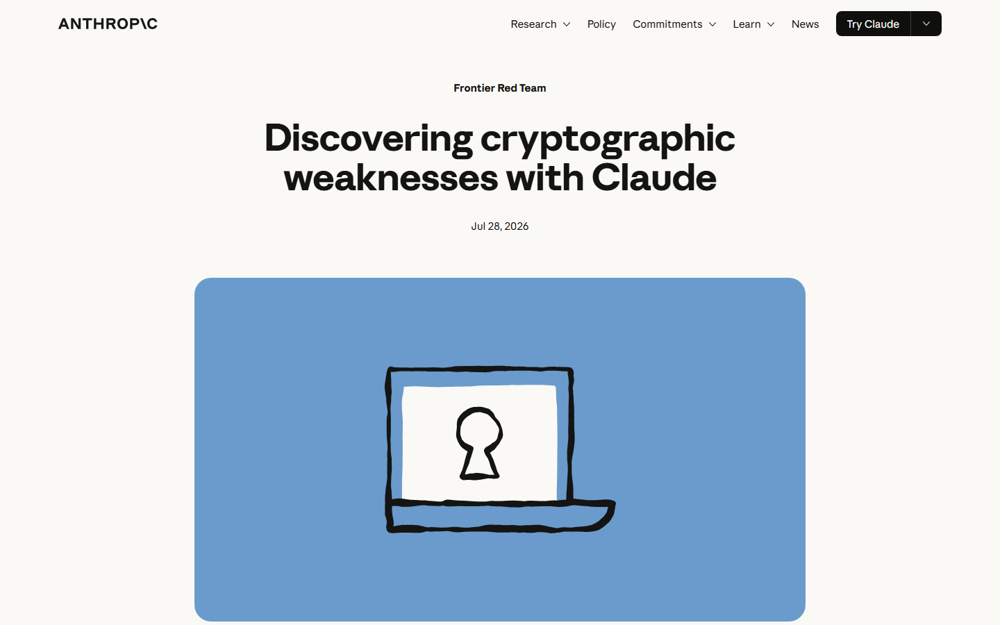
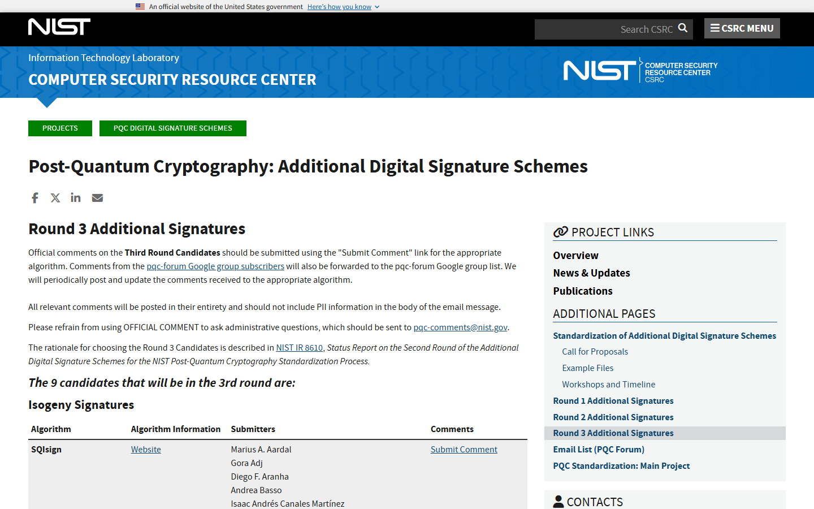
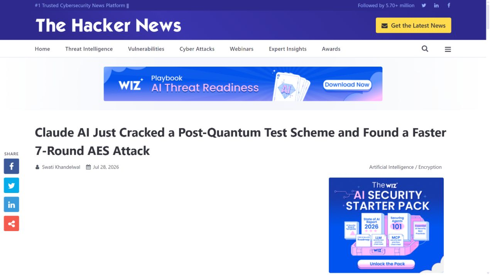
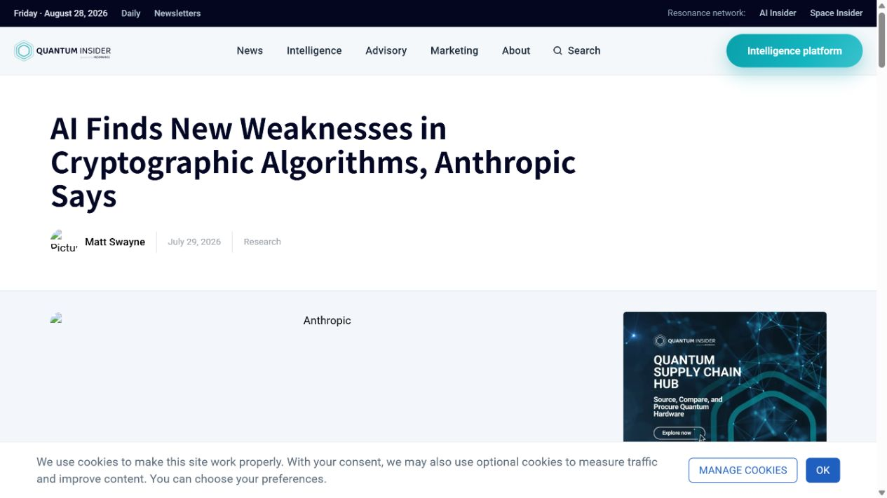
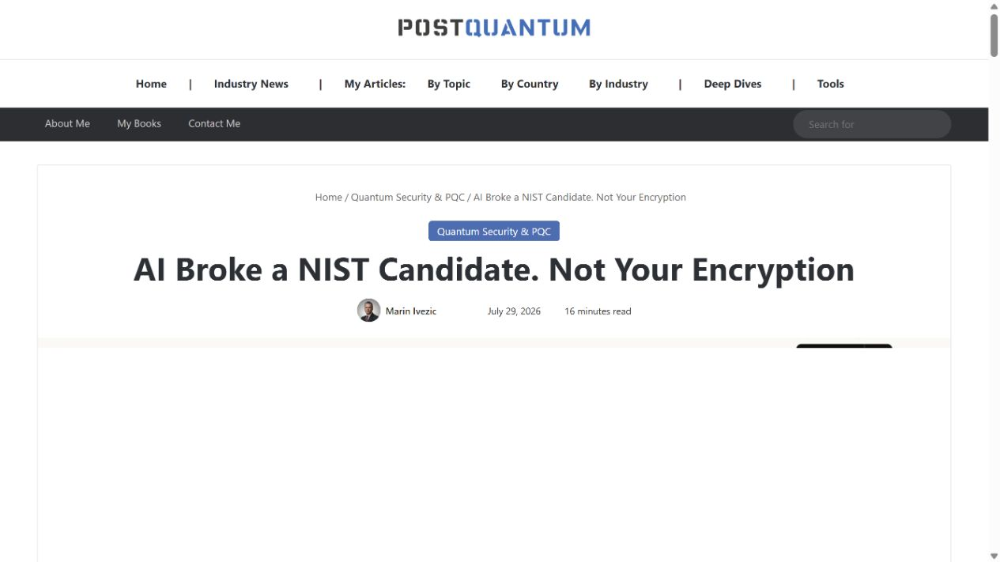

# Claude Mythos HAWK Post-Quantum Cryptanalysis (2026)
> Claude Mythos 发现 HAWK 后量子签名弱点

| Field | Value |
|---|---|
| Category | model-capability |
| Severity | Medium |
| AI Tool | Claude Mythos Preview, agentic cryptanalysis harness |
| Real Incident | Yes |
| Reproducible | Yes |
| Disclosed | 2026-07-28 |

## TL;DR
Claude Mythos Preview 在约 60 小时的人机协作研究中找到 HAWK 格结构的非平凡自同构，把 HAWK-256 的预期密钥恢复成本从约 2^64 降至 2^38，随后方案退出 NIST 候选流程。

---

## 详细分析 / Full Analysis

## 一、事件概况

Anthropic 于 2026 年 7 月 28 日公布 Claude Mythos Preview 参与发现的两项密码分析结果，其中第一项针对 NIST 额外数字签名流程中的 HAWK。HAWK 依赖格同构问题，已经经历约两年和两轮专家评审。模型在文献检索、数学推导和计算实验中找到此前没有被用于实际攻击的非平凡自同构。

Anthropic 给出的结果是，HAWK-256 密钥恢复的预期工作量由约 `2^64` 降至 `2^38`，等效安全强度明显下降。发现、发展和验证约用 60 小时，API 成本约 10 万美元，过程中有一名研究人员提供偶尔的方向性指导。团队向 HAWK 作者协调披露，方案随后退出 NIST 流程。HAWK 尚未部署于生产系统，因此没有现实用户需要紧急更换密钥。

## 二、公开资料与事实核对

Anthropic 原始研究提供攻击原理、耗时、成本、人工参与和影响范围；NIST 项目页用于核对候选状态；The Hacker News、The Quantum Insider 与 PostQuantum.com 复核公开时间、退出结果和实际影响。报道中“破解后量子密码”的标题容易夸大，实际结论仅针对 HAWK 的参数与安全估计。

研究没有证明其他格签名方案失效，也没有影响完整轮数 AES；Anthropic 同期披露的 AES 结果只针对七轮简化版本。报告将 HAWK 结果记录为真实密码分析突破和 AI 能力案例，严重性采用 Medium，是因为学术影响显著但没有部署中的系统暴露。

| 来源 | 类型 | 主要核验内容 |
|---|---|---|
| [Anthropic research](https://www.anthropic.com/research/discovering-cryptographic-weaknesses) | 厂商原始研究 | 攻击结果、成本与影响 |
| [NIST additional digital signatures project](https://csrc.nist.gov/projects/pqc-dig-sig/round-3-additional-signatures) | 标准机构候选状态 | HAWK 候选状态 |
| [The Hacker News report](https://thehackernews.com/2026/07/claude-ai-just-cracked-post-quantum.html) | 新闻复核 | 公开结果复核 |
| [The Quantum Insider report](https://thequantuminsider.com/2026/07/29/ai-finds-new-weaknesses-in-cryptographic-algorithms-anthropic-says/) | 行业新闻复核 | 研究过程复核 |
| [PostQuantum.com technical analysis](https://www.postquantum.com/post-quantum/ai-cryptanalysis-hawk-aes/) | 独立技术分析 | 技术影响分析 |

## 三、攻击或事件过程

研究人员为模型提供文献、计算环境和可迭代的实验工具。Claude 阅读现有关于格自同构与枚举攻击的工作，提出候选结构，再通过代码实验验证。关键发现是 HAWK 使用的格存在可利用的非平凡对称性，能够缩小密钥搜索。

结果来自多轮文献回顾、推导、失败尝试和实验确认，人类研究者负责方向、验证和对外披露。整体流程属于由 Agent 驱动、由专家复核的研究流水线。

攻击仍是指数复杂度，并没有把 HAWK 变成可在普通笔记本上立即破解的方案。问题在于原先的安全参数高估了攻击成本；若要恢复预期强度，需要扩大参数，而这会削弱 HAWK 的性能竞争力。

## 四、技术根因

技术根因是 HAWK 选定格结构中的对称性没有被原安全估计充分利用。已有理论曾指出若能找到合适自同构就可加速攻击，但在该具体结构中能否找到、如何用于枚举并未形成有效方法。Claude 把分散的理论线索和计算试验连接起来。

流程层面的根因则是密码方案审查能力稀缺。传统评审依赖少量专家长期投入，而 Agent 可以并行阅读大量材料、生成假设并持续运行实验。安全标准流程若仍假设发现速度远慢于人工验证，面对这类工具会出现积压。

## 五、AI 安全问题

公开成果明确由 Claude Mythos 在 Agent harness 中完成核心结构发现和大量实验，人类验证时间接近或超过发现时间。模型能力直接影响了 2026 年这次突破的时间、成本和研究方式。

案例的 AI 安全意义在于能力边界变化。强模型开始进入密码分析、漏洞发现和形式化推理，这能提高防御审查质量，也可能让未部署修复的弱点更快被发现。治理重点应放在负责任披露、计算访问、结果验证和高影响目标的分级控制。

## 六、影响、处置与排查

HAWK 没有生产部署，组织无需因本研究轮换现有 RSA、ECDSA 或已标准化后量子算法。标准制定者和 HAWK 研究者需要重新评估参数、保存复现实验，并在候选状态中清晰标注退出原因。

采用候选密码方案进行试验的团队应确认没有把 HAWK 当作正式安全依赖。若存在原型系统，应记录其用途和数据寿命，避免研究代码意外进入长期产品。

对 AI 密码分析结果，验证应包括独立数学审阅、复现实验、复杂度分析和适用范围检查。模型输出本身不是证明；本案可信度来自公开技术材料、演示代码、专家复核和标准流程状态变化共同支持。

## 七、治理建议

密码标准项目可以建立受控的 AI 审查通道，让模型在候选公开阶段系统搜索结构弱点，并把结果交给独立专家复核。模型运行环境应记录版本、提示、工具、代码和实验输出，便于重现，而不是只保存最后结论。

高影响研究需要分阶段披露。对尚未部署的候选，可通过协调公开促进修正；若模型发现已广泛部署算法的实用攻击，则应先联系维护者、标准机构和关键基础设施方，预留迁移时间。

组织还要为验证能力投入资源。发现成本下降而验证仍依赖专家，会造成大量真假混合的报告。优先级可以根据可复现代码、理论完整性、现实参数和部署规模排序，避免既忽视真实突破，也被夸张标题牵着走。

## 八、结论

Claude Mythos 对 HAWK 的结果是一次经过公开技术材料和标准流程变化支持的真实研究突破，但它没有影响生产系统，也没有普遍破解后量子密码。其长期意义在于密码审查的发现速度正在改变，验证与披露机制需要同步扩容。

### 参考来源

1. [Anthropic research](https://www.anthropic.com/research/discovering-cryptographic-weaknesses)
2. [NIST additional digital signatures project](https://csrc.nist.gov/projects/pqc-dig-sig/round-3-additional-signatures)
3. [The Hacker News report](https://thehackernews.com/2026/07/claude-ai-just-cracked-post-quantum.html)
4. [The Quantum Insider report](https://thequantuminsider.com/2026/07/29/ai-finds-new-weaknesses-in-cryptographic-algorithms-anthropic-says/)
5. [PostQuantum.com technical analysis](https://www.postquantum.com/post-quantum/ai-cryptanalysis-hawk-aes/)
