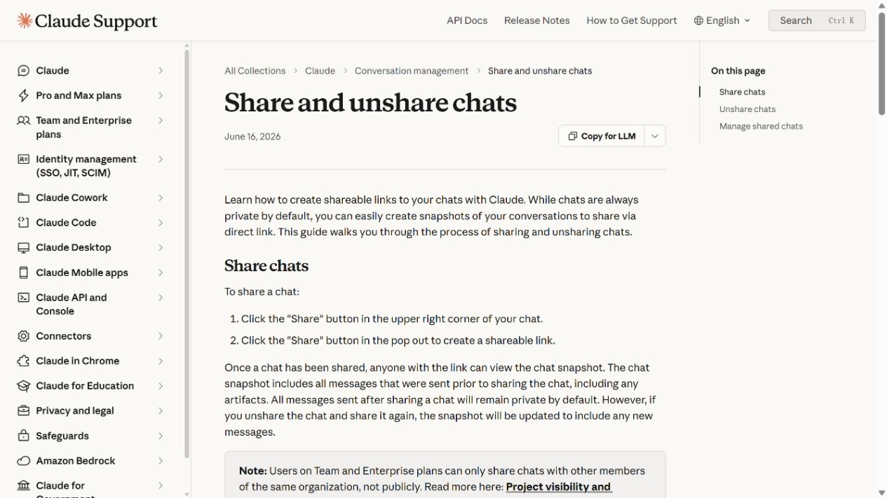
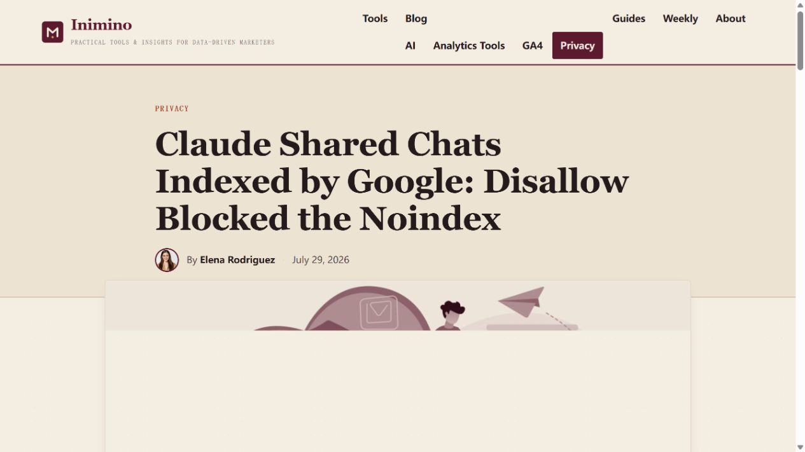
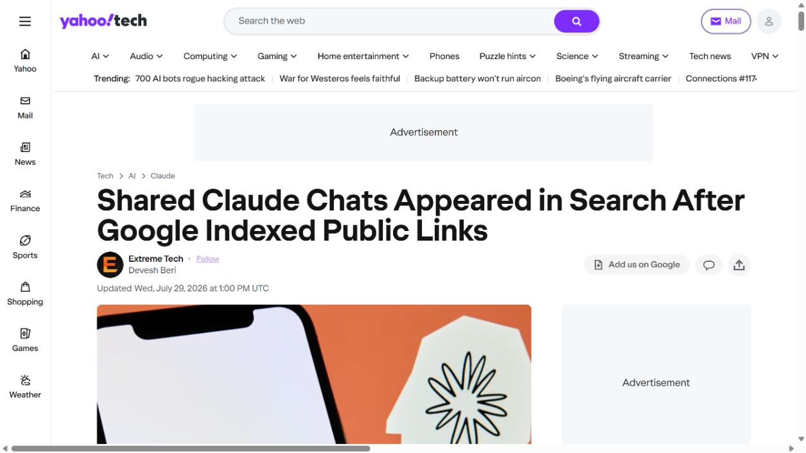
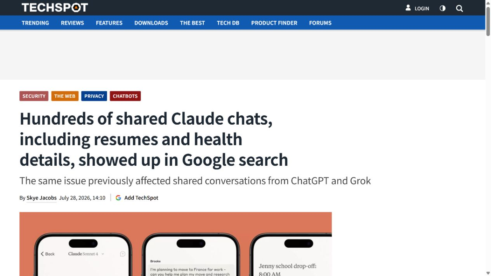
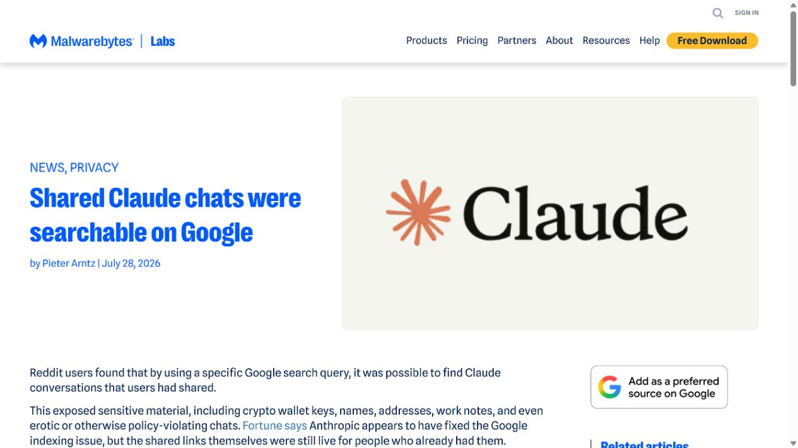

# Claude Shared Chats and Artifacts Indexed by Google (2026)
> Claude 共享会话与 Artifacts 被搜索引擎收录

| Field | Value |
|---|---|
| Category | privacy |
| Severity | Medium |
| AI Tool | Anthropic Claude, Claude Artifacts, Google Search |
| Real Incident | Yes |
| Reproducible | No |
| Disclosed | 2026-07-27 |

## TL;DR
Claude 用户主动生成的公开共享链接被 Google 搜索结果收录，使原本按链接传递的会话和 Artifacts 更容易被陌生人发现，其中部分页面包含医疗、教育和企业内部信息。

---

## 详细分析 / Full Analysis

## 一、事件概况

2026 年 7 月下旬，用户通过 `site:claude.ai/share` 查询发现，部分 Claude 共享会话和 Artifacts 出现在 Google 结果中。Inimino、Yahoo Tech、TechSpot 和 Malwarebytes 分别从索引机制与公开页面样本核查了这一现象，报道看到的页面包括医疗信息、内部文档、学校相关资料、工作记录和公开制作的应用。

受影响内容有一个重要前提：用户曾点击分享并生成公开链接。Anthropic 的帮助文档说明，链接持有者可查看共享时刻的会话快照；未分享的私人会话不在这次事件范围内。争议在于很多用户把“任何拿到链接的人可见”理解为定向分享，而搜索引擎收录把链接转成可被陌生人主动发现的公开页面。

## 二、公开资料与事实核对

Anthropic 帮助文档确认分享机制和管理入口；四家媒体分别观察了搜索结果，并引用 Anthropic 发言人的回应。厂商称不会向搜索引擎提交聊天目录或站点地图，链接只有在用户把它发布到可抓取位置后才可能被发现。报道显示结果随后从 Google 消失或明显减少。

公开材料没有给出经厂商确认的总页面数，也没有证明所有被搜索到的内容都包含敏感信息。报告因此不使用“全部 Claude 聊天泄露”或“未分享会话暴露”等说法。能够确认的是搜索可发现性扩大，以及部分已观察页面含有不适合公开传播的信息。

| 来源 | 类型 | 主要核验内容 |
|---|---|---|
| [Anthropic sharing documentation](https://support.claude.com/en/articles/10593882-share-and-unshare-chats) | 厂商功能说明 | 共享功能与公开范围 |
| [Inimino technical analysis](https://inimino.org/claude-shared-chats-indexed-disallow-noindex/) | 原始技术分析 | 索引机制与页面指令 |
| [Yahoo Tech report](https://tech.yahoo.com/ai/claude/articles/shared-claude-chats-appeared-search-130000452.html) | 新闻复核 | 搜索结果现象 |
| [TechSpot report](https://www.techspot.com/news/113267-hundreds-shared-claude-conversations-including-resumes-health-details.html) | 新闻复核 | 暴露内容样本 |
| [Malwarebytes report](https://www.malwarebytes.com/blog/privacy/2026/07/shared-claude-chats-were-searchable-on-google) | 安全媒体复核 | 隐私影响复核 |

## 三、攻击或事件过程

用户在 Claude 中选择分享，系统生成 `claude.ai/share` 公共 URL。该页面无需登录即可访问，便于通过邮件或即时通讯发送给同事。若链接随后出现在公开论坛、社交媒体、问题单或其他可抓取页面，搜索引擎就能沿链接访问。

页面如果没有稳定的 `noindex` 控制，或爬虫规则未能覆盖所有共享内容，搜索引擎会把标题和正文加入索引。之后任何人无需知道原链接，只要通过关键词或站点限定搜索就可能找到。Artifacts 还可能包含完整文档、数据表、代码或交互应用，信息密度高于普通聊天片段。

索引移除后，已知 URL 仍可能继续公开访问，第三方缓存和历史分享也不会自动消失。用户需要在 Claude 的 Shared Chats 管理界面主动取消分享，才能关闭原页面。

## 四、技术根因

根因是产品语义和 Web 公开语义之间的落差。技术上，共享链接是公开网页；交互上，用户更容易把它理解为不易猜测的“仅凭链接访问”。当页面进入搜索索引时，依靠 URL 难猜提供的有限隐私立即消失。

生成式 AI 会话更容易混合多种敏感信息。用户常把医疗记录、内部文件、简历和客户资料放进同一次对话，再生成一个方便展示结果的链接。分享动作如果只强调便利，没有明确展示索引、归档和二次传播风险，用户难以判断整段上下文的公开范围。

## 五、AI 安全问题

AI 强相关性来自数据形态和产品工作流。被收录内容是模型会话快照与 Claude 生成的 Artifacts，这些页面往往把原始输入、模型加工结果和附件内容集中呈现。AI 分享功能直接决定了本次事件的数据形态和暴露方式。

风险同时涉及用户操作和产品设计。产品决定分享默认值、页面元数据、爬虫策略、警示文本和撤销入口；AI 产品承载的上下文又比普通文档更广，默认保护应按“可能包含整段工作资料”设置，高于一般公开链接的最低提示。

## 六、影响、处置与排查

使用过分享功能的用户应在设置中查看 Shared Chats 列表，取消不再需要的链接，并检查被分享快照是否包含姓名、联系方式、医疗信息、凭据、内部文档或客户数据。若敏感链接曾进入公开页面，应同时联系搜索引擎申请缓存移除，并按信息类型执行通知或凭据轮换。

组织可以通过代理和 DLP 识别向 `claude.ai/share` 发布的敏感字段，限制受监管数据使用公共分享功能。团队协作更适合使用有登录、成员权限和到期时间的企业共享通道。

调查时要区分三种状态：会话是否生成过公共链接、链接是否被公开引用、页面是否被搜索引擎收录。只有第一项并不证明已被陌生人发现，但仍意味着任何获得 URL 的人都可访问。

## 七、治理建议

共享页面应默认发送可靠的 `noindex` 指令，并在服务端持续验证搜索引擎不可发现性。更强的设计是提供“组织内”“指定账户”“带密码”“到期链接”和“完全公开”几种明确模式，而不是用一个分享按钮覆盖所有场景。

界面在生成链接前应显示即将公开的内容范围，并把“任何人可访问”“可能被转发、归档或索引”放在主要提示中。撤销入口要能批量管理，企业管理员还需要全局发现与关闭能力。

对 Artifacts，应将生成应用和源会话分开授权，避免为了展示一个结果同时公开全部提示和附件。安全测试应定期从外部搜索、缓存服务和匿名浏览器验证分享边界，而不仅检查应用内权限。

## 八、结论

这次事件没有暴露从未分享的 Claude 私人会话，但它证明公开链接的可发现性会改变实际隐私范围。治理重点是明确分享语义、默认阻止索引、提供细粒度权限，并让用户能够审计和撤销所有历史链接。

### 参考来源

1. [Anthropic sharing documentation](https://support.claude.com/en/articles/10593882-share-and-unshare-chats)
2. [Inimino technical analysis](https://inimino.org/claude-shared-chats-indexed-disallow-noindex/)
3. [Yahoo Tech report](https://tech.yahoo.com/ai/claude/articles/shared-claude-chats-appeared-search-130000452.html)
4. [TechSpot report](https://www.techspot.com/news/113267-hundreds-shared-claude-conversations-including-resumes-health-details.html)
5. [Malwarebytes report](https://www.malwarebytes.com/blog/privacy/2026/07/shared-claude-chats-were-searchable-on-google)
