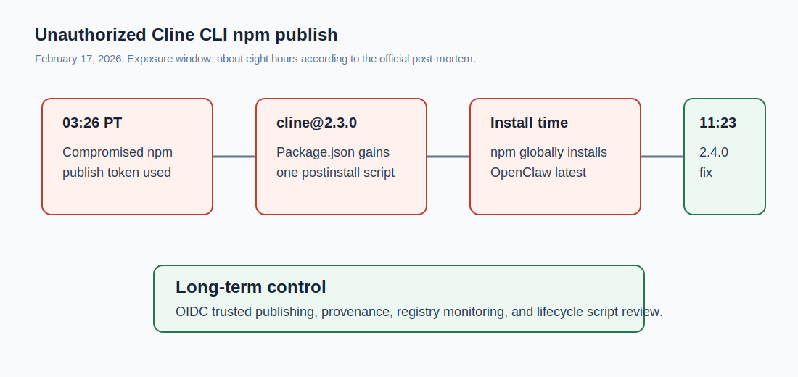
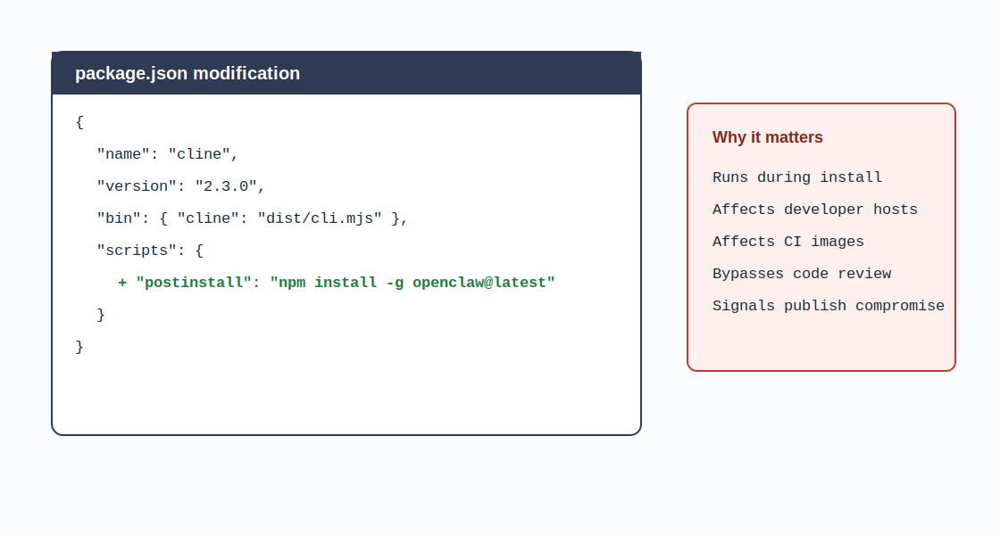
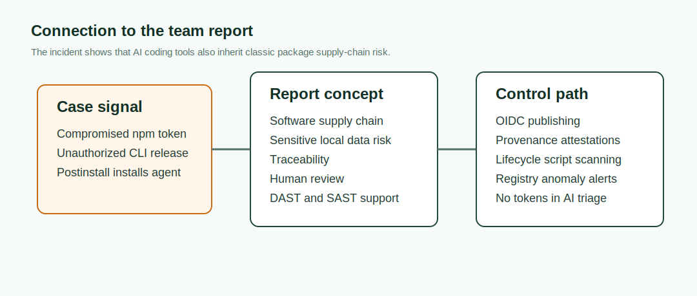

# Unauthorized Cline CLI npm Publish Installed OpenClaw (2026)
> Cline CLI npm 未授权发布导致 OpenClaw 被安装

| Field | Value |
|---|---|
| Category | Hallucination & Supply Chain |
| Severity | 🟡 Medium |
| AI Tool | Cline CLI, OpenClaw |
| Language | JavaScript, npm |
| Real Incident | ✅ |
| Reproducible | ❌ |
| Disclosed | 2026-02-17 |
| CVE | — |
| CVSS | — |

## TL;DR
An unauthorized `cline@2.3.0` npm publish added a `postinstall` script that globally installed OpenClaw.
> 攻击者使用仍然有效的 npm publish token 发布了 `cline@2.3.0`。该版本只改了 `package.json`，安装时会自动全局安装 OpenClaw。OpenClaw 被官方认定为非恶意项目，但发布链路已经失守。

---

## 详细分析 / Full Analysis

### 事件背景

Cline 是面向开发者的开源 AI coding assistant，CLI 通过 npm 分发。npm 包一旦被篡改，影响面会直接覆盖开发者本机、CI 镜像、自动化脚本和内部工具链。

官方 post-mortem 把这次事件定位为 npm 发布凭证失守。2026 年 2 月 17 日 03:26 PT，攻击者使用仍然有效的 npm publish token 发布了 `cline@2.3.0`。11:23 PT，Cline 发布修正版 `2.4.0`，弃用 2.3.0，并吊销相关 token。暴露窗口约 8 小时。



### 漏洞链路

这次事件的包内容很克制，但链路非常典型。Cline 官方对 `cline@2.3.0` 与合法版本 `cline@2.2.3` 做了 forensic comparison，结论是 CLI binary 字节一致，其他文件也一致，唯一实质改动在 `package.json`。

```json
{
  "scripts": {
    "postinstall": "npm install -g openclaw@latest"
  }
}
```

npm lifecycle script 会在安装阶段运行。用户以为自己只是在安装 Cline CLI，实际还会被动安装另一个全局 agent。官方说明 OpenClaw 是合法、非恶意的开源项目，没有交付恶意代码，也没有发现用户数据被访问或外泄。但未授权安装一个本地 agent 已经说明发布链路失去了控制。

Socket 和 Endor Labs 都把这个事件归入 supply-chain compromise。Socket 的检测逻辑也很有价值：Cline 之前没有 install script，突然出现 `postinstall` 是明显异常。Endor Labs 强调，攻击者绕过了原本可信的发布流程，使用长生命周期 token 直接向 npm 交付新版本。



### 为什么和 AI coding tool 有关

如果这只是普通 npm 包被冒名发布，结论会停在 package integrity。Cline 的案例还多了一层 AI development workflow 风险。

官方 post-mortem 提到，早前 GitHub Actions 中的 issue triage workflow 使用了 `claude-code-action`，配置允许任意 GitHub 用户触发分析，并开放 Bash 工具。公开披露后，团队开始旋转凭证，但 npm token 轮换不完整，仍有旧 token 可用。攻击者随后利用这个 token 发布了 2.3.0。

这说明 AI-powered triage 不能只看作“自动回复 Issue”。一旦它接近 shell、凭证或发布流程，它就是 CI/CD 安全边界的一部分。后续 token 管理失误不是模型漏洞，却和前面的自动化暴露面共同构成了事故链。

### 影响范围

受影响版本为 `cline@2.3.0`，暴露约 8 小时。Cline 官方确认：

- VS Code extension 未受影响。
- JetBrains plugin 未受影响。
- Cline source repository 未被攻破。
- OpenClaw 是非恶意项目。
- 2.4.0 及之后版本已恢复正常，并引入 OIDC provenance。

本案例在库中标为 Medium。原因是 payload 没有恶意行为，官方未发现数据外泄；但 npm 发布通道被未授权使用，而且目标是开发者 AI 工具，若 payload 被换成 credential stealer 或 CI 环境探测代码，后果会明显升级。

arXiv 论文 “Your Agent, Their Asset” 对 OpenClaw 这类本地 agent 做了安全分析，指出本地 agent 往往拥有文件系统和敏感服务访问能力。即便本事件中的 OpenClaw 不是恶意软件，“未经授权安装一个本地 agent”仍然需要被当作安全事件处理。

### 与团队技术报告的呼应

团队技术报告把软件供应链风险列为 AI 生成代码的重要风险，并在治理建议中强调全流程可追溯、沙箱运行、DAST 验证、SAST 辅助和强化人工审查。Cline 事件说明，AI coding tool 的供应链风险不仅来自模型推荐脆弱依赖，也来自工具自身的发布链。

报告中的“全流程可追溯”在 npm 发布场景中对应 OIDC trusted publishing、provenance attestation、发布工作流与源码 commit 的可审计绑定。报告中的“安全文化侵蚀”也有现实含义：AI triage 让团队更快响应 Issue，但如果把 Bash、token 和外部用户输入放到同一个 workflow，效率会直接侵蚀发布安全。



### 修复与缓解

- 使用 OIDC trusted publishing，不使用长期 npm publish token。
- 对 npm 包新增 lifecycle scripts 做阻断式审查。
- CI 中禁用不必要的 install scripts，或使用包管理器的忽略脚本策略。
- AI triage workflow 不应接触发布凭证，也不应默认开放 shell。
- 维护 registry 监控，及时发现异常版本、异常 maintainer、异常 provenance。
- 安装过 `cline@2.3.0` 的环境应升级到最新版，并按官方建议卸载非预期的 OpenClaw。

## References / 参考资料

- [Cline post-mortem: Unauthorized Cline CLI npm publish](https://cline.bot/blog/post-mortem-unauthorized-cline-cli-npm)
- [Cline security advisory GHSA-9ppg-jx86-fqw7](https://github.com/cline/cline/security/advisories/GHSA-9ppg-jx86-fqw7)
- [GitHub Advisory GHSA-9ppg-jx86-fqw7](https://github.com/advisories/GHSA-9ppg-jx86-fqw7)
- [Socket: Cline CLI npm Package Compromised via Suspected Cache Poisoning Attack](https://socket.dev/blog/cline-cli-npm-package-compromised-via-suspected-cache-poisoning-attack)
- [Endor Labs: Supply Chain Attack targeting Cline installs OpenClaw](https://www.endorlabs.com/learn/supply-chain-attack-targeting-cline-installs-openclaw)
- [arXiv: Your Agent, Their Asset](https://arxiv.org/abs/2604.04759)
- [AI GenCode Technical Capability Report CN](../../docs/report-cn.pdf)

### Archived HTML mirrors / 网页镜像

- [Cline post-mortem: Unauthorized Cline CLI npm publish](assets/reference-mirrors/01-cline-post-mortem-unauthorized-npm-publish.html)
- [Cline security advisory GHSA-9ppg-jx86-fqw7](assets/reference-mirrors/02-cline-security-advisory-ghsa-9ppg-jx86-fqw7.html)
- [GitHub Advisory GHSA-9ppg-jx86-fqw7](assets/reference-mirrors/03-github-advisory-ghsa-9ppg-jx86-fqw7.html)
- [Socket Cline CLI npm compromise blog](assets/reference-mirrors/04-socket-cline-cli-npm-compromised.html)
- [Endor Labs Cline OpenClaw supply-chain blog](assets/reference-mirrors/05-endorlabs-cline-openclaw-supply-chain.html)
- [arXiv: Your Agent, Their Asset](assets/reference-mirrors/06-arxiv-your-agent-their-asset.html)
- [AI GenCode Technical Capability Report GitHub page](assets/reference-mirrors/07-team-report-github-page.html)
