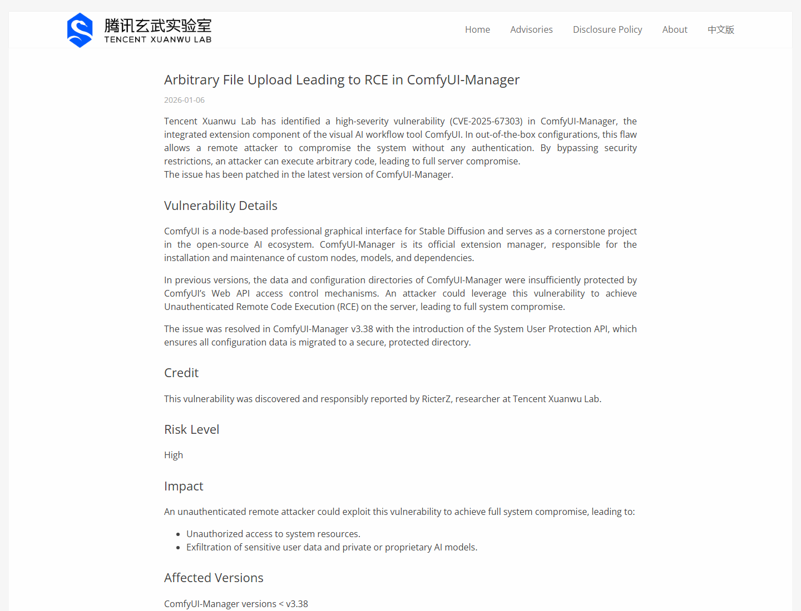
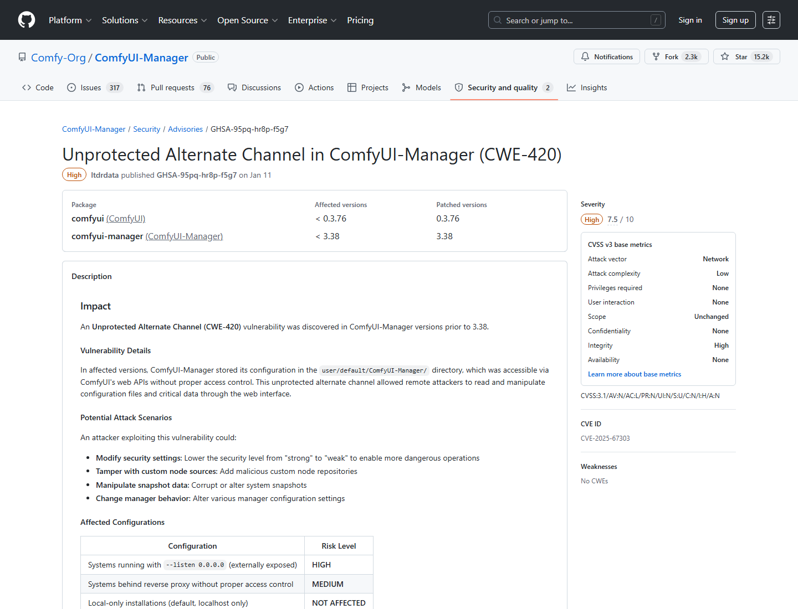
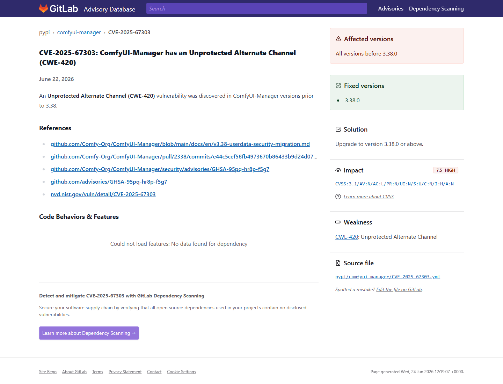
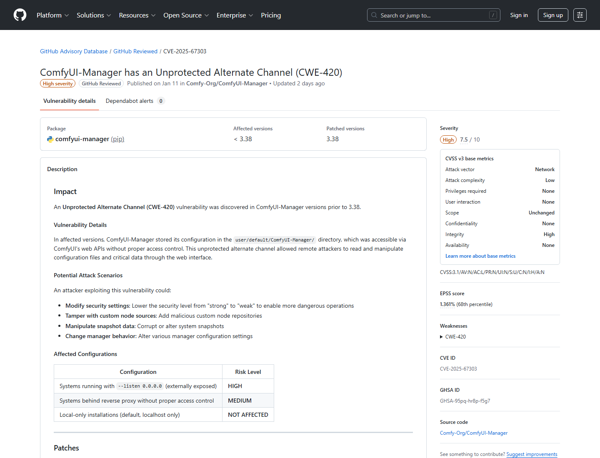
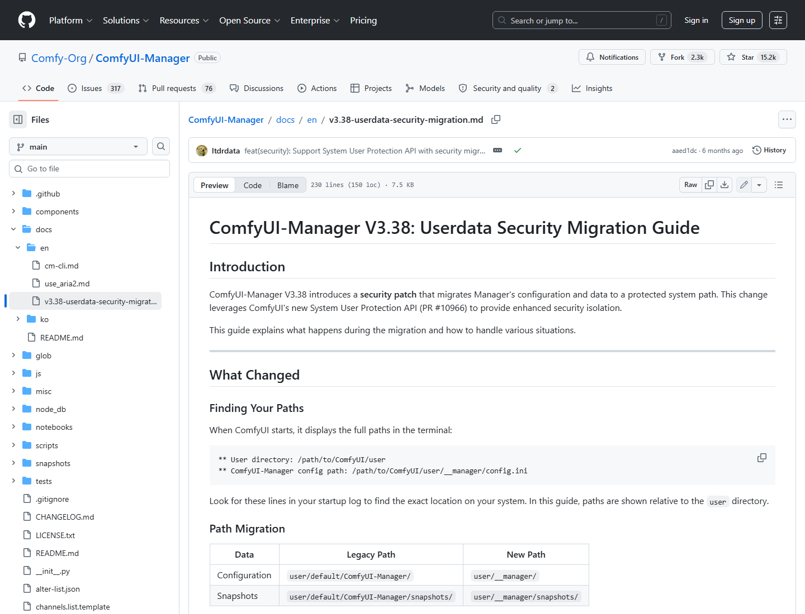
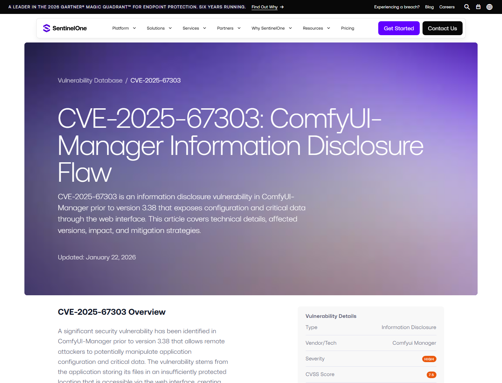

# ComfyUI-Manager Unprotected Configuration Channel to RCE (2026)
> ComfyUI-Manager 未保护配置通道到远程代码执行链

| Field | Value |
|---|---|
| Category | Domain-Specific Risks |
| Severity | High |
| AI Tool | ComfyUI, ComfyUI-Manager, AI image workflow UI |
| Language | Python |
| Real Incident | Yes |
| Reproducible | Yes |
| Disclosed | 2026-01-06 |
| CVE | CVE-2025-67303 |
| CVSS | 7.5 |

## TL;DR
ComfyUI-Manager stored configuration and critical data in a location reachable through ComfyUI web APIs, letting remote attackers alter manager behavior and, in exposed deployments, chain the change toward arbitrary code execution.
> ComfyUI-Manager 的问题不只是配置泄露，而是配置文件本身能改变安全等级、custom node 来源和扩展安装行为。对外暴露的 AI 图像工作流服务器因此可能被推向远程代码执行。

---

## 详细分析 / Full Analysis

# ComfyUI-Manager CVE-2025-67303 案例分析：AI 图像工作流扩展管理面的配置通道风险

## 基本信息

ComfyUI 是流行的节点式 AI 图像生成工作流工具，ComfyUI-Manager 则负责管理 custom nodes、模型、依赖和更新。很多用户会把 ComfyUI 作为本地或服务器上的可视化 AI 工作台运行，也会为了远程使用开启 `--listen` 或放到反向代理后。2026 年 1 月，Tencent Xuanwu Lab 披露了 CVE-2025-67303：ComfyUI-Manager 把配置和关键数据放在可被 ComfyUI Web API 访问的位置，远程攻击者可利用这一 alternate channel 读取或篡改配置。

腾讯玄武实验室把这个问题描述为 ComfyUI-Manager 集成组件中的高危漏洞。在开箱配置和特定暴露条件下，攻击者可以绕过安全限制，修改配置，最终执行任意代码并接管服务器。更标准化的 GHSA/NVD 记录则把 CVE-2025-67303 归类为 CWE-420 Unprotected Alternate Channel，CVSS 7.5，强调配置与关键数据存储位置缺少足够保护。[Tencent Xuanwu Lab](https://xlab.tencent.com/en/2026/01/06/xlab-26-001/)

## 一、事件核验与证据范围

### 证据矩阵

| 来源 | 类型 | 证明内容 | 备注 |
|---|---|---|---|
| Tencent Xuanwu Lab | 原始研究 | ComfyUI-Manager、CVE-2025-67303、未认证 RCE 链、v3.38 修复 | 研究者视角，强调完整攻击链 |
| Comfy-Org GHSA | 厂商/项目 advisory | GHSA-95pq-hr8p-f5g7、影响版本 <3.38、CWE-420、CVSS 7.5、缓解措施 | 处置主证据 |
| GitHub Advisory / NVD | 漏洞数据库 | CVE 描述、版本范围、Web interface 可访问存储位置 | 数据库复核 |
| v3.38 migration 文档 | 修复证据 | 将配置迁移到 `user/__manager/`，引入 System User Protection API | 修复机制 |
| SentinelOne / GitLab Advisory | 复核证据 | 信息披露、配置篡改、受影响版本和升级建议 | 第三方复核 |

Comfy-Org 的 advisory 对场景做了清晰拆分：外部暴露的 `--listen 0.0.0.0` 配置风险最高，未做访问控制的反向代理部署风险中等，本地 localhost-only 默认安装不属于同一暴露面。这个区分有助于避免把所有本地 ComfyUI 用户都写成同等风险。[Comfy-Org Advisory](https://github.com/Comfy-Org/ComfyUI-Manager/security/advisories/GHSA-95pq-hr8p-f5g7)

## 二、系统背景与触发条件

ComfyUI-Manager 的功能天然接近执行边界。它可以安装 custom nodes、修改源、管理模型和依赖、改变安全等级，并影响图像生成工作流如何加载外部代码。AI 图像工作流生态依赖大量第三方节点和模型，用户为了试用插件经常给管理器较高权限；当管理器配置文件可被 Web API 访问时，攻击者就不需要直接打到 Python 执行器，也能先改变系统行为。

触发条件是目标 ComfyUI-Manager 版本低于 3.38，且相关配置目录位于 `user/default/ComfyUI-Manager/` 这类未充分保护的位置。若实例对外开放，攻击者可通过 ComfyUI 的 userdata/Web API 访问这些文件，读取或覆盖配置。后续链条通常会围绕降低安全等级、改变 custom node repositories、插入恶意节点源、操控 snapshot 或修改 manager 行为展开。

## 三、攻击链与处置过程

从攻击者视角看，第一步不是直接上传 shell，而是修改 manager 配置。Comfy-Org advisory 提到的攻击场景包括降低 security level、篡改 custom node sources、操控 snapshot 数据和改变管理器行为。Tencent Xuanwu Lab 的研究进一步说明，在 out-of-the-box 暴露配置下，这些修改可以通向 arbitrary code execution，因为 ComfyUI-Manager 的 custom node 安装和更新流程本来就会接触外部代码。

修复集中在 v3.38 的安全迁移。ComfyUI-Manager 将配置从 `user/default/ComfyUI-Manager/` 迁移到受保护的 `user/__manager/` 目录，并依赖 ComfyUI 的 System User Protection API 阻断外部 Web API 访问。迁移还会把过低 security level 提升到 normal，并保留旧数据备份，降低升级时的兼容风险。[v3.38 migration guide](https://github.com/Comfy-Org/ComfyUI-Manager/blob/main/docs/en/v3.38-userdata-security-migration.md)

## 四、技术根因分析

根因是 primary channel 和 alternate channel 的保护强度不一致。ComfyUI-Manager 的正常管理界面和安全设置看似提供了限制，但同一批关键配置又存放在可由 ComfyUI Web API 操作的位置。攻击者绕过的不是某个显眼按钮，而是从另一个存储访问通道直接改写配置文件。

第二个根因是扩展管理器本身具有代码供应链能力。AI 图像工作流的 custom node 往往来自 GitHub 或第三方源，安装后会在本机 Python 环境中运行。配置篡改一旦能改变 node source、降低安全等级或修改安装行为，攻击链就会从“完整性破坏”转向“执行攻击者提供的扩展代码”。这就是为什么 Tencent Xuanwu Lab 把它写成通往 RCE 的链条，而 GHSA/NVD 仍以高危配置与关键数据操作来表述。

## 五、AI 参与方式与风险归因

这个案例中的 AI 参与点在 ComfyUI 的生成式图像工作流平台，而不是模型推理本身。风险来自围绕模型和节点生态建立起来的扩展管理面：用户为了快速接入新节点、新模型和新工作流，允许管理器下载、配置和执行第三方组件。攻击者操纵配置后，就能影响 AI 工作流加载什么代码、使用什么源、执行什么节点。

风险归因应落在 AI 工具的插件/扩展供应链和 Web API 访问控制上。ComfyUI-Manager 提供便利的同时，也把“安装代码”和“运行工作流”放进同一个应用体验中；当服务器又被远程暴露时，管理器配置就成为高敏感资产。SentinelOne 的复核也将该问题概括为 Web interface 暴露配置和关键数据，导致攻击者可未授权修改敏感设置。[SentinelOne](https://www.sentinelone.com/vulnerability-database/cve-2025-67303/)

## 六、与团队技术报告风险框架的关系

团队技术报告中关于 AI 代码生成和工具执行风险的一个重点，是“用户安装与运行第三方 AI 组件”的边界。ComfyUI-Manager 正是这类边界的代表：用户把 custom node 当作工作流能力扩展，但从安全角度看，它们也是代码供应链入口。配置通道被攻破后，攻击者不需要突破模型，只需要改变管理器对节点源和安全等级的理解。

这类问题提醒我们，AI 视觉工作台的安全评估不能只看模型文件格式和 prompt，还要看扩展管理器、模型下载器、节点仓库、Web API 和远程访问方式。对生产或共享 GPU 服务器而言，ComfyUI 这类工具应该被视为可执行代码平台。

## 七、影响范围与社会后果

ComfyUI 在 AI 图像生成社区中使用广泛，ComfyUI-Manager 又是安装节点和管理工作流的常用组件。若实例运行在个人本机且只监听 localhost，风险较小；但很多团队会把 ComfyUI 放在远程 GPU 机器上，并为了协作或远程访问开放端口。此时攻击者如果能访问 Web API，就可能篡改配置、植入恶意节点、窃取私有模型或控制生成服务器。

社会后果主要体现在开源 AI 创作环境的部署习惯上。为了方便使用，用户常把实验工具直接暴露到公网或共享网络，而这些工具实际拥有 GPU、模型、文件系统和 Python 环境权限。配置通道漏洞会把“方便安装节点”的能力变成攻击者写入执行链的入口。

## 八、治理建议

用户应升级 ComfyUI-Manager 到 3.38 或更高版本，并确保 ComfyUI 满足 System User Protection API 要求。短期内，应关闭 `--listen 0.0.0.0`，或至少通过防火墙、VPN、反向代理认证和 IP allowlist 限制访问。旧的 `user/default/ComfyUI-Manager/` 数据目录应检查并按迁移文档清理，防止遗留配置继续可被访问。

平台治理上，custom node 安装源应受 allowlist 管理，管理器配置不应放在普通用户数据 API 可读写的位置，安全等级不应由可远程写入的配置文件单独决定。对共享 GPU 服务器，ComfyUI 应运行在低权限容器或隔离用户下，模型目录、工作流目录和插件目录应分区授权，避免单个管理器漏洞影响整个主机。

## 九、结论

CVE-2025-67303 展示了 AI 工作流工具中一个容易被低估的风险：扩展管理器不是辅助功能，而是代码供应链和执行策略的控制面。ComfyUI-Manager 将配置放在 Web API 可达位置，使攻击者能够先改写安全设置和节点来源，再沿着插件安装路径触发更严重后果。对 AI 图像生成服务器而言，远程访问、custom node 安装和配置存储必须作为同一条安全边界治理。

## 参考来源

- [Tencent Xuanwu Lab: Arbitrary file upload leading to RCE in ComfyUI-Manager](https://xlab.tencent.com/en/2026/01/06/xlab-26-001/)
- [Comfy-Org Advisory: GHSA-95pq-hr8p-f5g7](https://github.com/Comfy-Org/ComfyUI-Manager/security/advisories/GHSA-95pq-hr8p-f5g7)
- [GitHub Advisory Database: GHSA-95pq-hr8p-f5g7](https://github.com/advisories/GHSA-95pq-hr8p-f5g7)
- [NVD: CVE-2025-67303](https://nvd.nist.gov/vuln/detail/CVE-2025-67303)
- [ComfyUI-Manager v3.38 userdata security migration](https://github.com/Comfy-Org/ComfyUI-Manager/blob/main/docs/en/v3.38-userdata-security-migration.md)
- [SentinelOne: CVE-2025-67303 ComfyUI-Manager information disclosure flaw](https://www.sentinelone.com/vulnerability-database/cve-2025-67303/)
- [GitLab Advisory: CVE-2025-67303](https://advisories.gitlab.com/pypi/comfyui-manager/CVE-2025-67303/)
