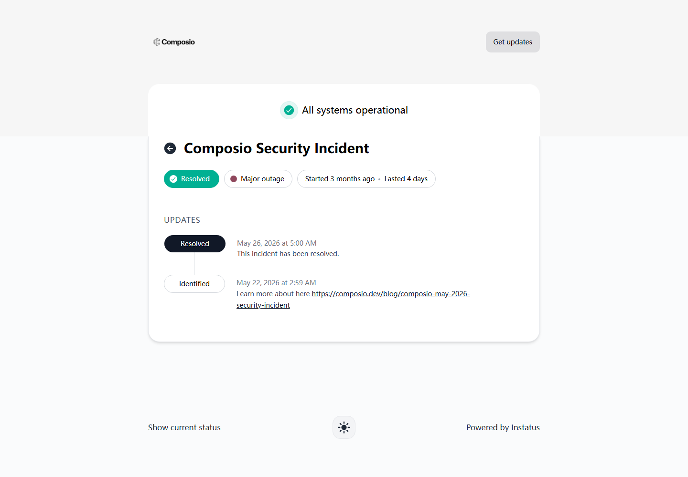
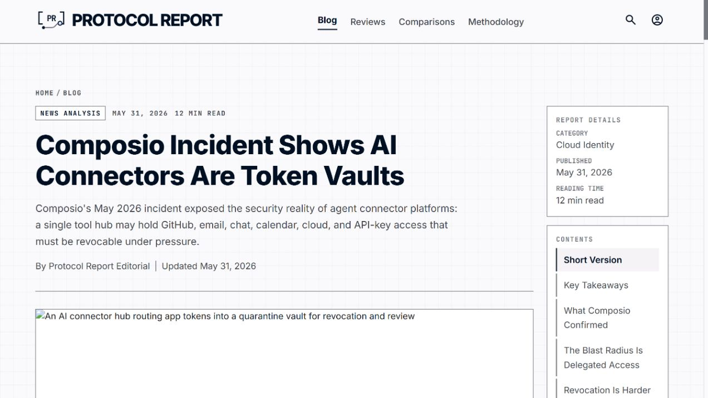
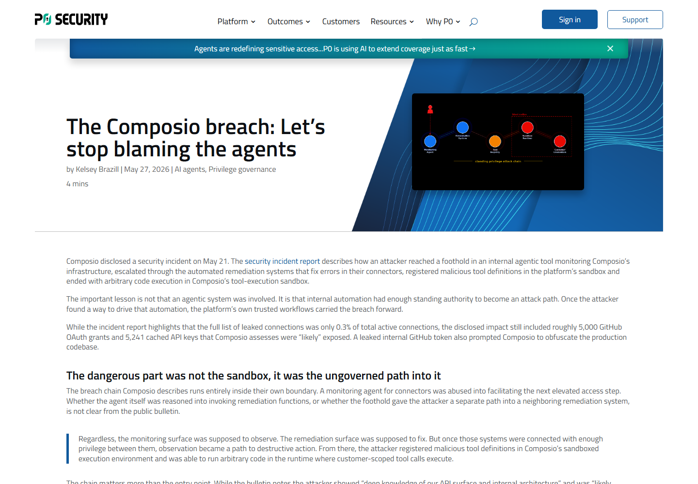
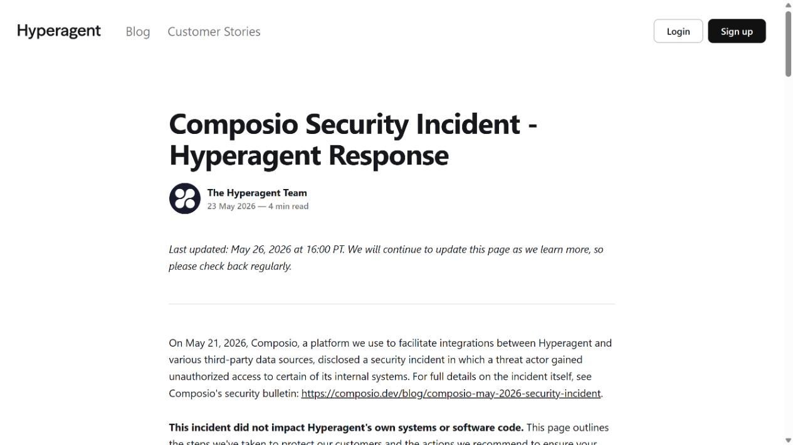
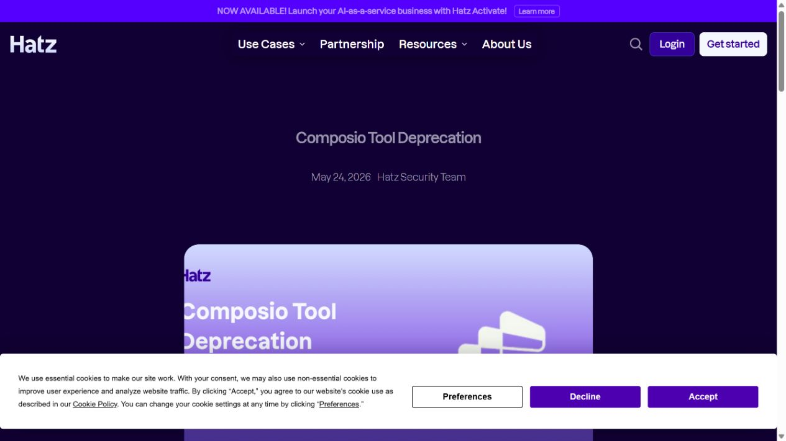

# Composio Agent Integration Credential Breach (2026)
> Composio Agent 集成平台凭据泄露事件

| Field | Value |
|---|---|
| Category | supply-chain |
| Severity | Critical |
| AI Tool | Composio, agent tool integrations, internal agentic remediation |
| Real Incident | Yes |
| Reproducible | No |
| Disclosed | 2026-05-21 |

## TL;DR
攻击者进入 Composio 内部 Agent 监控与自动修复链，注册恶意工具定义并获得沙箱代码执行，随后触及集中保存的 GitHub OAuth 连接和 API key，迫使平台及下游客户大规模撤销凭据。

---

## 详细分析 / Full Analysis

## 一、事件概况

Composio 于 2026 年 5 月 21 日披露内部系统遭未授权访问。该平台为 AI Agent 代理 GitHub、Gmail、Slack、Jira、Notion 等服务连接，并代表客户保管 OAuth token 和 API key。官方更新列出 5,001 个 GitHub 连接及少量其他连接受到影响，约占活跃连接的 0.3%。

官方还称，一个辅助缓存服务在攻击窗口内可能保存 5,241 个 API key，因此删除了指定时间前创建的密钥并要求客户轮换。攻击链从内部基础设施监控 Agent 开始，攻击者反复尝试 LLM 生成的攻击模式取得落点，再滥用自动修复系统、注册恶意工具定义，最终在工具执行沙箱中获得任意代码执行并接近凭据缓存。

## 二、公开资料与事实核对

Composio 状态页确认事件从 5 月 21 日持续到 5 月 25 日并已解决。Protocol Report 与 P0 Security 保存并分析了事件通报中的攻击路径和凭据数量；两者角度不同，但数字都来自 Composio 的披露，不能算两次独立统计。Hyperagent 与 Hatz 作为下游客户，分别记录了受影响通知、集成功能停用和凭据撤销措施。

API key 的口径需要谨慎。公开通报说明缓存中存在 5,241 个潜在受影响密钥，并采取删除与轮换措施；这不等于每一个密钥都被攻击者实际下载或使用。5,001 个 GitHub 连接则在披露表格中列为泄露连接。报告不把两者简单相加后写成全部已被盗用。

| 来源 | 类型 | 主要核验内容 |
|---|---|---|
| [Composio security incident status](https://status.composio.dev/cmpfuudag002cpbm2wv1qhjpf) | 厂商状态页 | 事件持续时间与状态 |
| [Protocol Report analysis](https://protocolreport.com/blog/composio-ai-connector-token-incident/) | 独立行业分析 | 数量、攻击链与凭据影响 |
| [P0 Security analysis](https://p0.dev/blog/the-composio-breach-lets-stop-blaming-the-agents/) | 独立安全分析 | 初始路径与凭据范围 |
| [Hyperagent incident response](https://www.hyperagent.com/blog/composio-incident-response/) | 下游客户处置记录 | 下游停用与轮换 |
| [Hatz AI vendor response](https://hatz.ai/en/articles/composio-tool-deprecation) | 下游客户处置记录 | 下游停用与调查 |

## 三、攻击或事件过程

Composio 的事件报告称，攻击者反复尝试由 LLM 生成的攻击模式，在负责监控基础设施和连接器故障的内部 Agent 工具中取得落点。该工具与自动修复系统相连，原本用于发现失败并触发处理，因而拥有比普通仪表盘更高的操作权限。

攻击者随后滥用自动修复链，注册恶意工具定义，在工具执行沙箱中推进到任意代码执行，并触及辅助凭据缓存和连接数据。官方材料还提到 Gmail OAuth token 被用于后续横向活动，但没有把它写成最初进入 Agent 工具的唯一入口，因此本文也不作这一推断。

平台发现活动后撤销已确认连接、轮换内部密钥、关闭辅助环境与后台服务、暂停发布，并公布 IP IOC。下游厂商禁用 Composio 集成，联系客户重新授权；无法由平台直接撤销的手工 API key 需要用户到原服务重建。

## 四、技术根因

根因是连接器平台集中保存大量委托权限，同时内部自动化能够修改工具定义和处理故障。监控 Agent 的初始落点如果可以触达自动修复，再由修复系统进入执行沙箱，隔离边界就会被管理平面自身绕过。

OAuth 与 API key 的集中化放大了单点失陷。一个 Agent 集成平台并不只保存自己的账户数据，而是持有客户在许多第三方服务上的行动能力。凭据可读、长期有效或缺乏统一撤销接口时，事件响应必须跨多个服务逐一处理，恢复时间显著增加。

## 五、AI 安全问题

本案与 AI 的关系存在两个直接环节。Composio 是专门为 Agent 提供工具连接和凭据代理的平台，暴露资产正是 Agent 调用外部服务所需的授权；官方还说明攻击者使用 LLM 生成的攻击模式，并在内部 agentic monitoring 与 remediation 系统中推进。

因此它不是普通 SaaS 被攻击后只因公司从事 AI 而归类。若移除 Agent 工具代理、自动修复和集中连接凭据，攻击链与影响面都会改变。案例反映了 Agent 基础设施成为“权限中枢”后的供应链风险。

## 六、影响、处置与排查

Composio 客户应确认是否收到受影响通知，重新创建已被平台删除的 API key，并到 GitHub 及其他连接服务检查 OAuth 授权、审计日志和异常操作。对于无法由 Composio 撤销的手工密钥，需要在原服务直接吊销和重建。

调查窗口至少覆盖官方 IOC 和 5 月 21 日前后的异常活动，重点查看未知仓库访问、邮件读取、Slack/Jira 操作、云部署与新建令牌。仅验证 Composio 当前连接正常不足以排除攻击者此前使用已复制凭据。

下游平台应像 Hyperagent 和 Hatz 一样准备独立停用开关，能在连接器供应商失陷时快速切断所有工具调用，同时保留用户与服务的映射，支持定向通知和轮换。

## 七、治理建议

Agent 连接平台应让客户优先使用短期、细粒度、可单独撤销的令牌，并支持客户自管密钥或外部 KMS。凭据不应在普通缓存中以可批量读取形式存在，工具执行层只能按当前用户、当前工具和当前任务获取临时授权。

内部监控、自动修复和工具注册要分离身份与审批。监控 Agent 可以提出修复建议，但不应自行创建可执行工具或访问生产凭据；高风险变更需要不同主体批准，并留下不可篡改审计。

供应链合同和技术集成应包含事件导出、撤销 API、影响用户清单和替代通道。组织在接入 Agent 工具市场或连接器平台前，应评估最坏情况下该供应商能够代表多少用户访问多少系统，而不是只看单次工具调用的权限。

## 八、结论

Composio 事件说明，Agent 连接器已经是集中式身份基础设施。安全治理需要围绕凭据最小化、内部自动化隔离和跨服务撤销设计；数字统计则应区分确认泄露的连接与处于潜在暴露窗口的 API key。

### 参考来源

1. [Composio security incident status](https://status.composio.dev/cmpfuudag002cpbm2wv1qhjpf)
2. [Protocol Report analysis](https://protocolreport.com/blog/composio-ai-connector-token-incident/)
3. [P0 Security analysis](https://p0.dev/blog/the-composio-breach-lets-stop-blaming-the-agents/)
4. [Hyperagent incident response](https://www.hyperagent.com/blog/composio-incident-response/)
5. [Hatz AI vendor response](https://hatz.ai/en/articles/composio-tool-deprecation)
