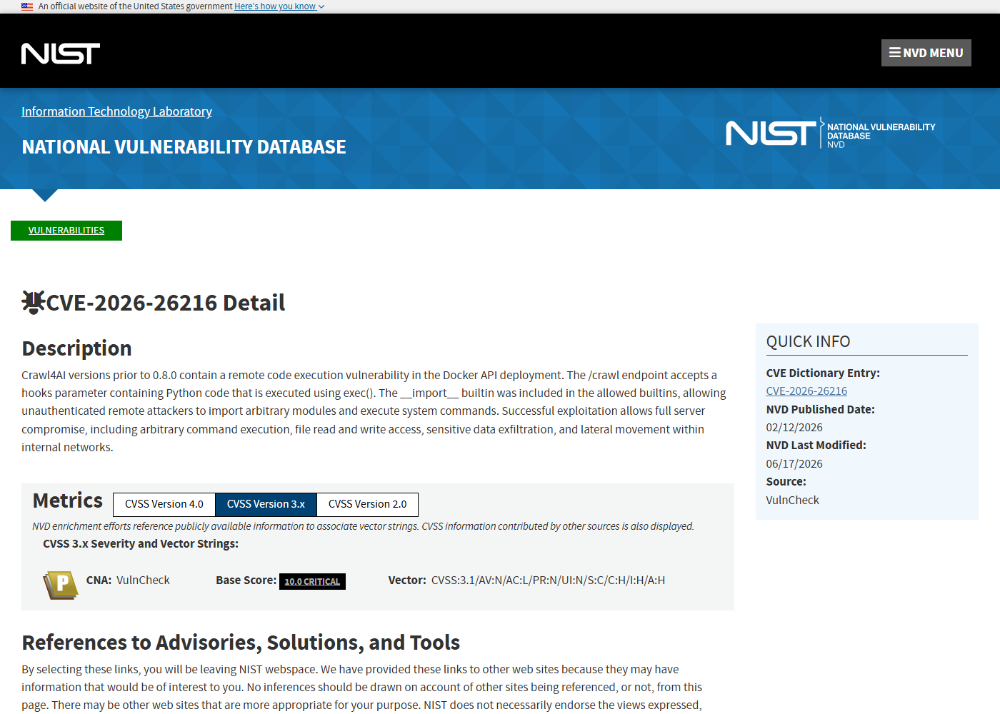
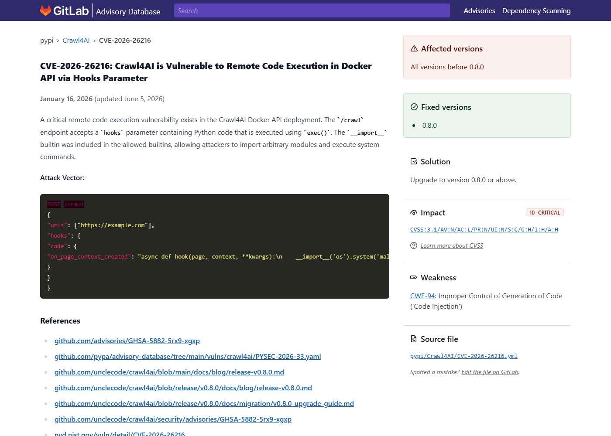
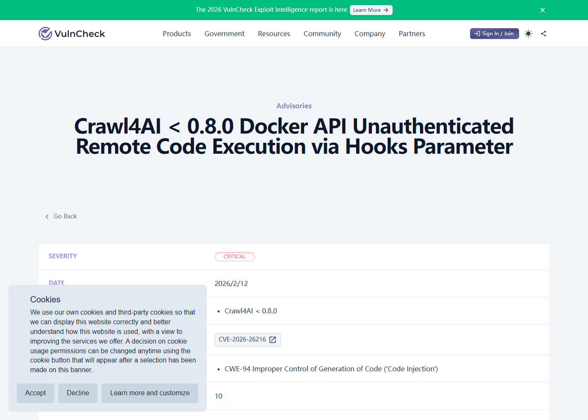
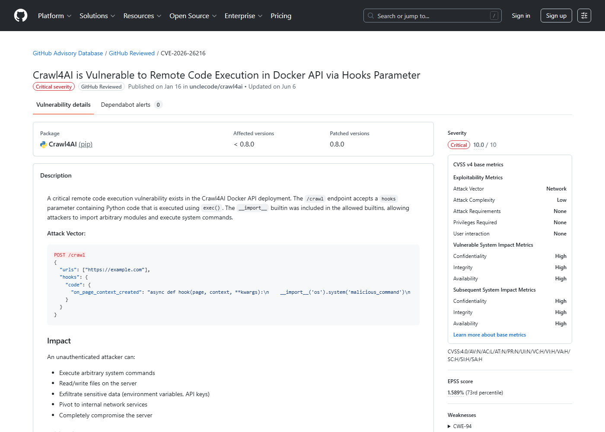

# Crawl4AI Docker API Hooks RCE (2026)
> Crawl4AI Docker API hooks 参数远程代码执行

| Field | Value |
|---|---|
| Category | Domain-Specific Risks |
| Severity | Critical |
| AI Tool | Crawl4AI, Docker API, LLM-friendly crawler |
| Language | Python |
| Real Incident | Yes |
| Reproducible | Yes |
| Disclosed | 2026-01-16 |
| CVE | CVE-2026-26216 |
| CVSS | 10.0 |

## TL;DR
Crawl4AI's Docker API accepted Python hook code on the /crawl endpoint, leaving unauthenticated deployments exposed to direct command execution.
> Crawl4AI Docker API 的 /crawl 端点接收 hooks 参数并用 exec() 执行，未认证暴露时会把 AI 爬虫服务变成远程代码执行入口。

---

## 详细分析 / Full Analysis

## 一、基本信息

Crawl4AI 是面向大模型和 Agent 数据管线的开源网页抓取工具，常被部署成 Docker API 服务，供上游任务提交 URL、提取 Markdown 或把网页内容整理成适合 LLM 消费的格式。CVE-2026-26216 影响的是这种服务化部署中的 /crawl 接口：请求体可以带 hooks 字段，服务端会把其中的 Python 代码交给 exec() 执行。公开公告显示，所谓受限执行环境仍保留了 __import__，攻击者可以导入系统模块并执行命令。问题修复前，未认证暴露的 Docker API 不只是爬虫入口，也具备了主机侧代码执行能力。

## 二、事件核验与公开材料范围

公开资料可以确认这是一个已编号、已修复的真实漏洞披露事件。NVD、GitHub Advisory、GitLab Advisory 和 VulnCheck 对核心事实的描述一致：影响版本为 0.8.0 之前，触发点是 Docker API 的 /crawl endpoint，风险来自 hooks 参数进入 Python exec()。这些来源没有把事件描述为已经大规模入侵的攻击活动，因此本文按“公开漏洞披露与可复现攻击面”处理，而不是按已确认数据泄露事件处理。

### 证据矩阵

| 来源 | 类型 | 证明内容 |
|---|---|---|
| NVD: CVE-2026-26216 | 漏洞数据库 | CVE 编号、影响版本、CVSS 10.0 和 /crawl hooks 描述 |
| GitHub Advisory: GHSA-5882-5rx9-xgxp | 安全公告 | Docker API RCE 的攻击向量、影响和修复版本 |
| GitLab Advisory: CVE-2026-26216 | 依赖库公告 | PyPI 包影响范围和发布时间 |
| VulnCheck: Crawl4AI Docker API RCE | 技术公告 | hooks 参数、exec() 和 __import__ 可用导致命令执行 |
| SentinelOne: CVE-2026-26216 | 复核资料 | 漏洞机制、影响面和缓解建议的二次复核 |

## 三、系统背景与触发条件

Crawl4AI 的使用场景天然贴近 AI 应用供应链。开发者把它接在 RAG、自动化研究、网页总结、数据清洗和 Agent 浏览流程前面，让模型拿到更干净的网页输入。为了让爬取过程更灵活，hooks 这类扩展点允许用户在抓取前后插入自定义逻辑，这在可信本地脚本里并不罕见；问题出在该能力被直接带入网络 API，且默认暴露条件下没有足够认证和沙箱隔离。攻击者只需向 API 发送构造请求，就可能让原本用于网页处理的插件点变成执行系统命令的插件点。

## 四、攻击链路与处置过程

典型链路很短。攻击者发现对外开放的 Crawl4AI Docker API 后，向 /crawl 发送包含 hooks 的请求；服务端解析任务并调用相关 hook；hook 内容进入 exec()；由于可导入模块，payload 可以调用 os、subprocess 或等价能力。此后攻击者获得容器运行用户权限下的命令执行能力，进一步读取环境变量、访问挂载目录、探测内网服务或把容器作为后续攻击跳板。若该爬虫服务持有模型网关、数据库、代理或云元数据访问权限，影响会从单个爬虫容器扩展到 AI 数据处理链路。

## 五、技术根因与 AI 风险归因

根因不是复杂的模型行为，而是把“可编程扩展点”暴露给未认证网络输入。hooks 的设计本意是扩展爬取流程，但服务端没有把可信本地扩展和远程用户输入分开，也没有建立强隔离的执行环境。exec() 与 __import__ 同时出现，使限制策略失去意义。对 AI 工具而言，这类问题尤其危险，因为爬虫、解析器和 RAG 预处理组件常被视为辅助服务，部署时容易被放在后台或容器网络边缘，实际却握有文件、网络和凭据访问能力。

从部署形态看，这类漏洞最容易出现在“临时启用、长期运行”的爬虫服务里。开发团队为了让 RAG、资料抽取或研究 Agent 能够批量抓取网页，往往会把 Crawl4AI 放进 Docker Compose、内部 Kubernetes namespace 或一台 GPU/CPU 混合节点中。服务一开始可能只面向本机脚本，后来为了让其他任务调用，被映射到局域网端口，甚至被反向代理暴露出去。此时 /crawl 接口看似只是数据入口，但 hooks 参数已经具备执行语义，攻击者不需要理解模型推理流程，只要理解 API 参数如何进入 Python 执行路径即可。

另一个容易被低估的点是权限继承。爬虫容器通常需要访问外网、读取代理配置、写缓存目录，并可能持有后续摘要、向量化或入库任务的凭据。RCE 发生后，攻击者拿到的不只是单次网页抓取能力，而是整个“从网页到知识库”的前置处理位置。这个位置能够观察哪些站点被采集、哪些文档会进入模型上下文，也可能篡改抓取结果，把污染后的材料送入后续索引和回答流程。也就是说，漏洞的后果不止于容器命令执行，还会影响 AI 系统输入数据的完整性。

## 六、影响范围与治理建议

该漏洞的直接影响是远程代码执行，间接影响取决于部署方式。个人开发者环境中，它可能暴露本地文件、API key、浏览器自动化凭据和模型服务 token；企业环境中，它可能进入数据采集、情报监测或知识库构建流水线。因为 Crawl4AI 面向 LLM 友好抓取，攻击者还可能篡改进入模型上下文的数据源，让后续自动化分析在受污染材料上工作。修复动作应包括升级到 0.8.0 或更高版本、关闭公网暴露、为 Docker API 增加认证和网络访问控制，并审计曾经暴露实例的日志、环境变量与挂载目录。

复盘时应把 Crawl4AI 放进 AI 数据供应链图里，而不是只按普通 Web 服务资产登记。团队可以从三条线索排查：第一，历史上是否把 Docker API 绑定到 0.0.0.0 或通过隧道/代理暴露；第二，/crawl 请求中是否出现异常 hooks、非常规 Python 字符串或短时间高频任务；第三，容器内是否出现不属于正常抓取流程的文件、网络连接或环境变量读取。即使没有发现入侵迹象，也建议轮换爬虫服务能接触到的代理、对象存储、数据库和模型网关凭据。

后续建设上，应把可编程 hook 与远程 API 分层。可信开发者要扩展爬虫流程，可以通过本地配置、签名插件或受控镜像完成；远程调用者只应提交 URL、抽取策略和有限参数。对确实需要在线扩展的场景，执行环境要隔离到短生命周期沙箱，网络和文件系统只开放任务必需资源。这样既能保留 AI 数据采集的灵活性，也能避免一个方便的扩展点直接变成代码执行入口。

从团队流程看，还需要把“抓取能力”与“执行能力”分开审批。许多 AI 数据工程任务会把爬虫配置交给业务人员或研究人员维护，他们可以决定抓哪些站、如何清洗文本、是否进入知识库；但这不意味着他们应当提交可执行 Python。Crawl4AI 这类工具如果要提供高级扩展能力，应把扩展包构建、代码审查和运行授权放在开发流程里，而不是放在每次 API 请求里。这样做会牺牲一点即时灵活性，但可以把风险从“任意请求即执行”降到“受控插件可执行”。

这个案例也适合纳入 AI 系统上线前的资产清单检查。除了模型服务和向量数据库，清单里应列出网页抓取器、格式转换器、文档解析器、OCR、媒体处理和缓存服务，并标明哪些组件会执行代码、哪些组件会访问外网、哪些组件持有写入权限。只有把这些外围组件纳入同一张图，团队才不会在模型层做了很多访问控制，却让前置数据入口裸露在网络上。

## 七、结论

CVE-2026-26216 说明 AI 数据入口的安全性不能只看模型接口。网页抓取、内容清洗和上下文构建组件虽然常被当作外围工具，但一旦提供可编程 hook 并暴露为 API，就已经进入代码执行风险范围。对这类系统的治理重点是最小暴露、认证、沙箱和扩展点权限拆分。

## 八、参考来源

- [NVD: CVE-2026-26216](https://nvd.nist.gov/vuln/detail/CVE-2026-26216)
- [GitHub Advisory: GHSA-5882-5rx9-xgxp](https://github.com/advisories/GHSA-5882-5rx9-xgxp)
- [GitLab Advisory: CVE-2026-26216](https://advisories.gitlab.com/pypi/crawl4ai/CVE-2026-26216/)
- [VulnCheck: Crawl4AI Docker API RCE](https://www.vulncheck.com/advisories/crawl4ai-docker-api-unauthenticated-remote-code-execution-via-hooks-parameter)
- [SentinelOne: CVE-2026-26216](https://www.sentinelone.com/vulnerability-database/cve-2026-26216/)
