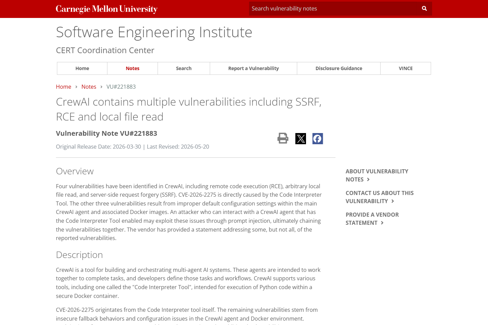
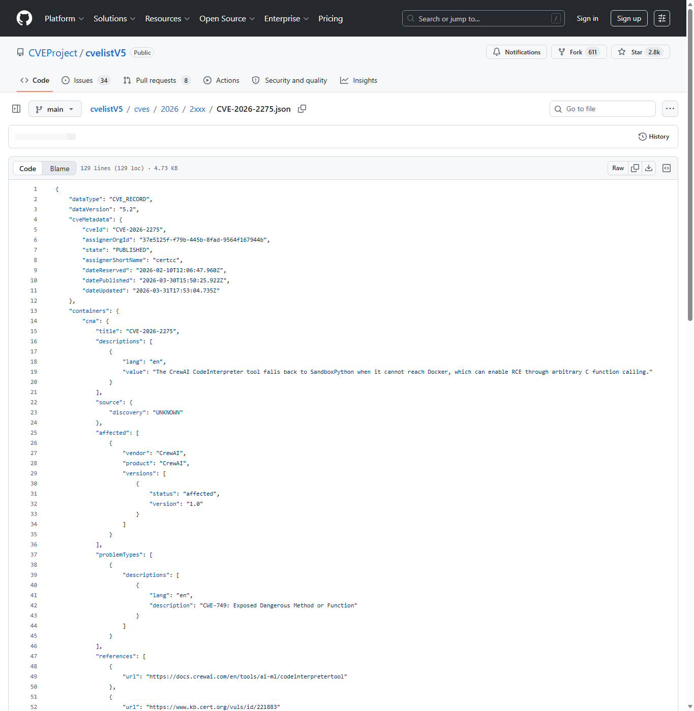
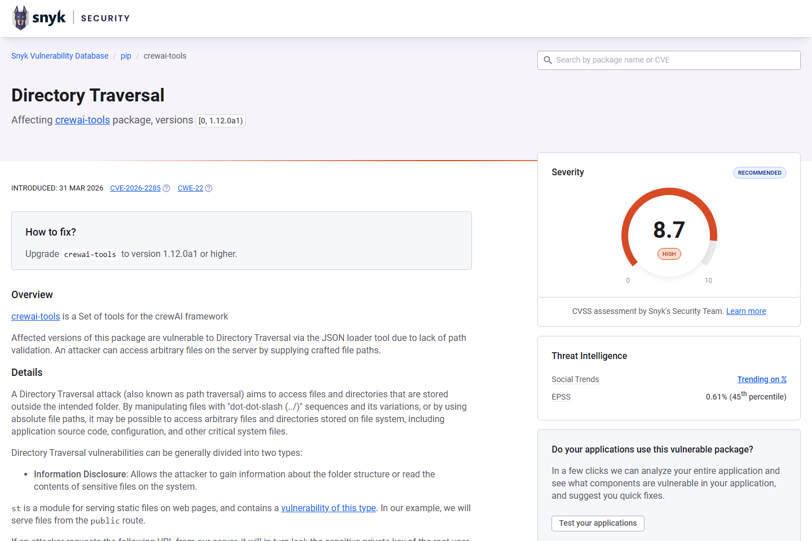
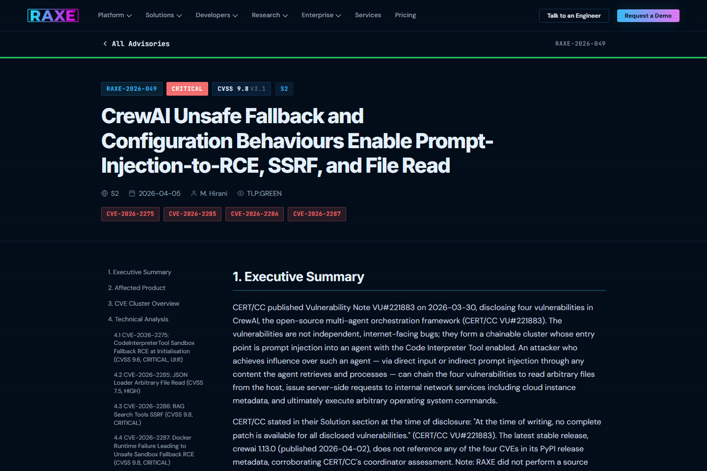
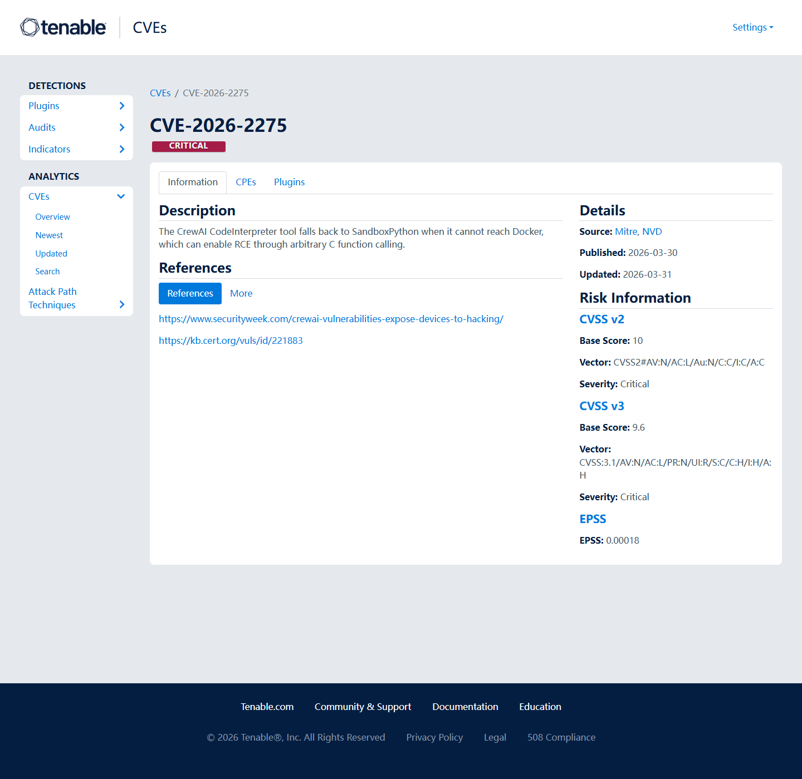
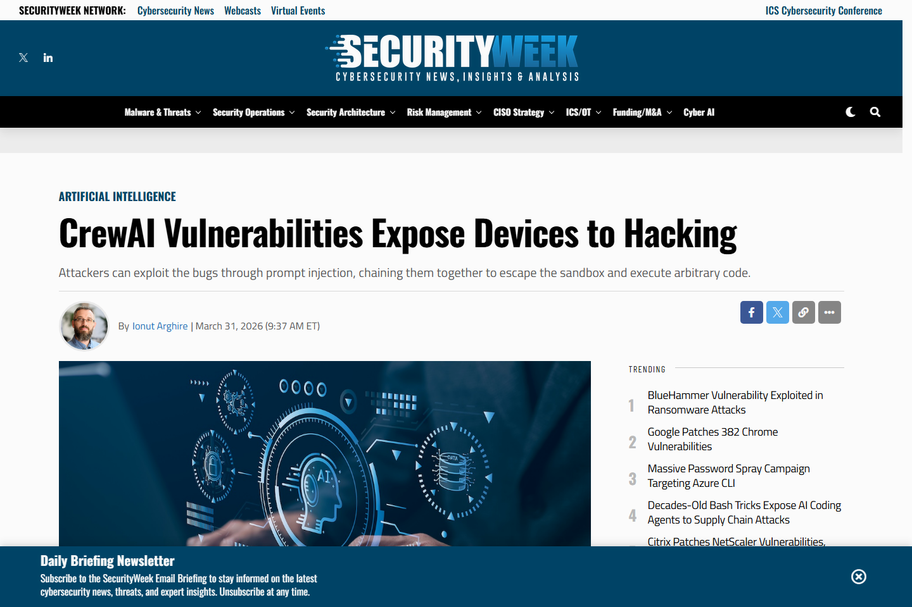

# CrewAI Code Interpreter and RAG Tool Vulnerability Cluster (2026)
> CrewAI Code Interpreter 与 RAG 工具漏洞集群

| Field | Value |
|---|---|
| Category | agent-risk |
| Severity | Critical |
| AI Tool | CrewAI, Code Interpreter Tool, RAG tools, Agent orchestration framework |
| Language | Python |
| Real Incident | Yes |
| Reproducible | Yes |
| Disclosed | 2026-03-30 |
| CVE | CVE-2026-2275, CVE-2026-2285, CVE-2026-2286, CVE-2026-2287 |
| CVSS | 9.8 |

## TL;DR
CrewAI tool defaults let prompt injection chain into sandbox escape, RCE, SSRF, and file read.
> CrewAI Code Interpreter 与 RAG 工具漏洞集群：Agent 主机可被执行任意代码，敏感文件和内网资源也可能通过工具链被读取或访问。

---

## 基本信息

| 项目 | 内容 |
|---|---|
| 案例时间 | 2026-03-30 |
| 事件对象 | CrewAI agent framework and associated Code Interpreter/RAG tooling |
| 事件类型 | 多漏洞集群，可由提示注入推动到 RCE、SSRF 和本地文件读取 |
| 攻击入口 | 攻击者影响 Agent 可读取的任务内容或检索内容，诱导 Agent 调用危险工具路径。 |
| 主要影响 | Agent 主机可被执行任意代码，敏感文件和内网资源也可能通过工具链被读取或访问。 |
| 修复方向 | 升级修复版本，禁用不必要工具，隔离解释器和检索容器，并对 Agent 工具调用做显式授权。 |

## 摘要

CrewAI 案例体现了 Agent 框架的复合风险：漏洞并非只发生在一个函数中，而是 Code Interpreter、RAG 工具、默认配置和提示注入入口共同形成可链式利用的执行面。CERT/CC 的 VU#221883 披露了四个漏洞，覆盖远程代码执行、本地文件读取和 SSRF，其中 CVE-2026-2275 与 Code Interpreter Tool 直接相关。
这种“漏洞集群”比单点 RCE 更贴近 Agent 框架的真实风险。Agent 平台为了完成任务，会把检索、文件系统、代码运行、HTTP 请求和模型推理编排在一起。攻击者只要能影响任务上下文，就可能沿着工具链寻找最弱的一环，而不需要直接控制底层服务器。

## 一、公开材料概况

CERT/CC、CVEProject cvelistV5、RAXE Labs、Tenable 和 SecurityWeek 对 CrewAI 漏洞组合给出了交叉说明，材料覆盖多 Agent 编排框架、代码解释器、RAG 工具、SSRF、文件读取和 RCE 影响。已公开信息更偏向框架级漏洞和可复现利用路径，没有形成具体受害组织数量统计。
这些来源呈现出一个共同特征：问题不只是某个工具实现错误，而是 Agent 框架默认信任了模型决策和工具执行之间的连接。提示注入、RAG 文档污染和不安全回退路径彼此叠加，使得原本应被隔离的能力在同一任务流里相互放大。

| 来源 | 类型 | 证明内容 |
|---|---|---|
| CERT/CC VU#221883: CrewAI contains multiple vulnerabilities | 主证据 | 确认四个 CrewAI 漏洞及 RCE、SSRF、文件读取影响。 |
| CVEProject cvelistV5: CVE-2026-2275 | 主证据 | 确认 Code Interpreter 回退路径导致 RCE 的 CVE 描述。 |
| Snyk: Directory Traversal in crewai-tools (CVE-2026-2285) | 主证据 | 确认相关 RAG/配置类漏洞记录。 |
| RAXE Labs: CrewAI Unsafe Fallback and Configuration Behaviours | 技术证据 | 说明提示注入到工具利用的链式风险。 |
| Tenable: CVE-2026-2275 | 复核证据 | 复核 CodeInterpreter RCE 机制和缓解建议。 |
| SecurityWeek: CrewAI Vulnerabilities Expose Devices to Hacking | 复核证据 | 独立报道漏洞影响和链式利用风险。 |

## 二、系统背景与触发条件

CrewAI 被用于把多个角色化 Agent、工具和任务流程组合起来。开发者通常希望 Agent 能读文件、运行代码、检索知识库和调用外部资源，这些能力提升了自动化效率，也让提示注入从语言层攻击变成工具执行层攻击。
在实际项目中，CrewAI 往往运行在开发机、CI 环境或后端任务服务器上，这些位置可能保存源码、云凭据、内部 API 地址和数据库连接信息。RAG 工具读取的文档也可能来自外部客户材料或互联网页面，一旦检索内容被当作指令参与决策，Agent 就可能把不可信文本转化为本机动作。

## 三、攻击链路与处置过程

攻击入口可以是 Agent 任务描述、外部文档或检索语料。恶意内容诱导 Agent 调用 Code Interpreter 或 RAG 工具后，工具默认配置成为决定影响范围的关键。RAXE 将其描述为从 prompt injection 到 RCE、SSRF 和文件读取的链式集群，说明 Agent 框架中的每个工具都应被当成权限边界来审查。
处置时需要同时看版本、工具配置和运行环境。如果只升级框架而继续让解释器访问宿主机文件系统，或让 RAG 工具访问任意本地路径，风险仍可能以其他形式保留。对已经运行过可疑任务的环境，应检查工具调用日志、容器挂载、外联请求和异常读取路径。

## 四、技术根因分析

根因集中在不安全回退和宽默认权限。Code Interpreter 在无法连接 Docker 时进入 SandboxPython 回退路径，该路径暴露危险能力；RAG 相关组件又可能在默认配置下读取本地文件或访问服务端网络。由于 Agent 会基于模型推理自动选择工具，这些默认值会被放大为真实执行风险。
Agent 框架常把“工具可用性”作为产品体验目标，但安全上更关键的是工具失败时的降级策略。解释器无法进入容器时，正确行为应是停止执行并提示配置错误，而不是退回到更宽松的本地路径。RAG 工具同理，默认根目录、协议白名单和网络出口必须显式收窄。

## 五、AI 参与方式与风险归因

AI 参与方式非常直接：模型负责解释任务和选择工具，工具负责执行。提示注入并不需要突破模型本身，只要改变 Agent 的决策上下文，就可能把框架内置工具转化为系统级能力。风险归因应覆盖 Agent 工具权限、默认隔离和执行审计。
因此，该案例的关键不是“模型是否聪明”，而是产品是否允许模型把外部文本解释为高权限工具调用。Agent 越能自主拆解任务、选择工具和重试失败路径，越需要把每个工具调用当成待授权动作，而不是把整条任务链视为一次普通模型响应。

## 六、与团队技术报告风险框架的关系

团队框架中关于宏观自主构建和工具链风险的判断，在 CrewAI 中表现为 Agent 框架把代码解释、检索和网络访问聚合到同一执行流。安全控制应从提示词扩展到工具注册、容器边界、网络出口和文件系统挂载。

## 七、影响范围与治理建议

RCE、SSRF 与文件读取的组合使影响不局限于单个 Agent 任务。攻击者可能读取密钥文件、探测云元数据服务、访问内部 API，或在解释器所在主机上执行命令。SecurityWeek 的复核报道也强调这些漏洞可被链式利用，风险对象包括运行 CrewAI 工作负载的开发机和服务器。

治理上应默认关闭 Code Interpreter 等高危工具，必须启用时放入无凭据、无内网、短生命周期的容器。RAG 工具要限定根目录、协议和出口域名，Agent 调用危险工具前应有策略引擎和人工确认。日志需记录模型上下文、工具参数和执行结果，方便事后复盘。
组织还应区分“实验 Agent”和“生产 Agent”的安全等级。实验环境可以限制网络和凭据，生产环境则需要工具注册审批、运行时策略、敏感文件阻断和调用速率控制。对共享 Agent 模板和任务库，最好引入签名和审查流程，避免被污染的任务配置在团队中复制。

## 八、结论

CrewAI 漏洞集群说明，Agent 框架安全的核心是工具执行边界。只要模型能把外部内容转译为工具调用，提示注入就会和解释器、RAG、网络访问一起构成系统安全问题。
更稳妥的做法是把 Agent 工具视为一组最小权限服务，而不是模型的内置能力。模型可以建议动作，但执行器必须有独立的权限判断、隔离环境和审计记录。这个案例为后续 Agent 框架评估提供了清晰参照。

## 参考来源

1. [CERT/CC VU#221883: CrewAI contains multiple vulnerabilities](https://www.kb.cert.org/vuls/id/221883)
2. [CVEProject cvelistV5: CVE-2026-2275](https://github.com/CVEProject/cvelistV5/blob/main/cves/2026/2xxx/CVE-2026-2275.json)
3. [Snyk: Directory Traversal in crewai-tools (CVE-2026-2285)](https://security.snyk.io/vuln/SNYK-PYTHON-CREWAITOOLS-15922426)
4. [RAXE Labs: CrewAI Unsafe Fallback and Configuration Behaviours](https://raxe.ai/labs/advisories/RAXE-2026-049)
5. [Tenable: CVE-2026-2275](https://www.tenable.com/cve/CVE-2026-2275)
6. [SecurityWeek: CrewAI Vulnerabilities Expose Devices to Hacking](https://www.securityweek.com/crewai-vulnerabilities-expose-devices-to-hacking/)
