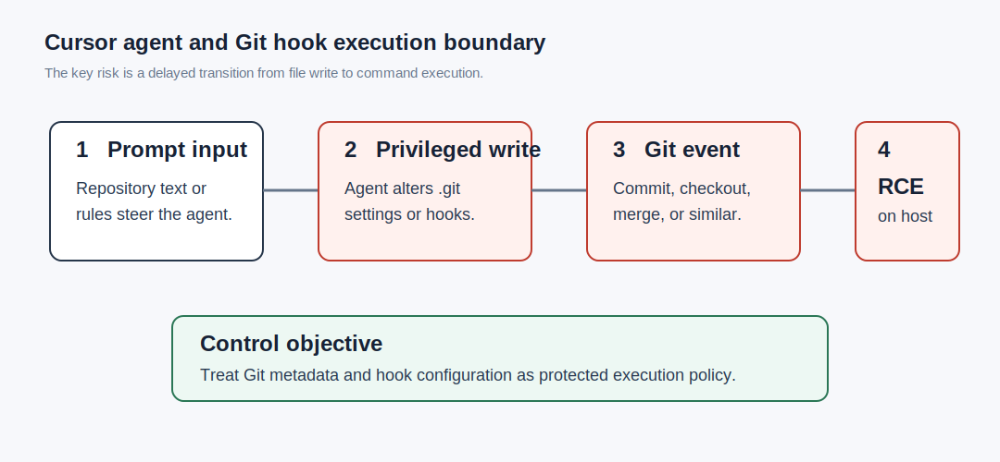
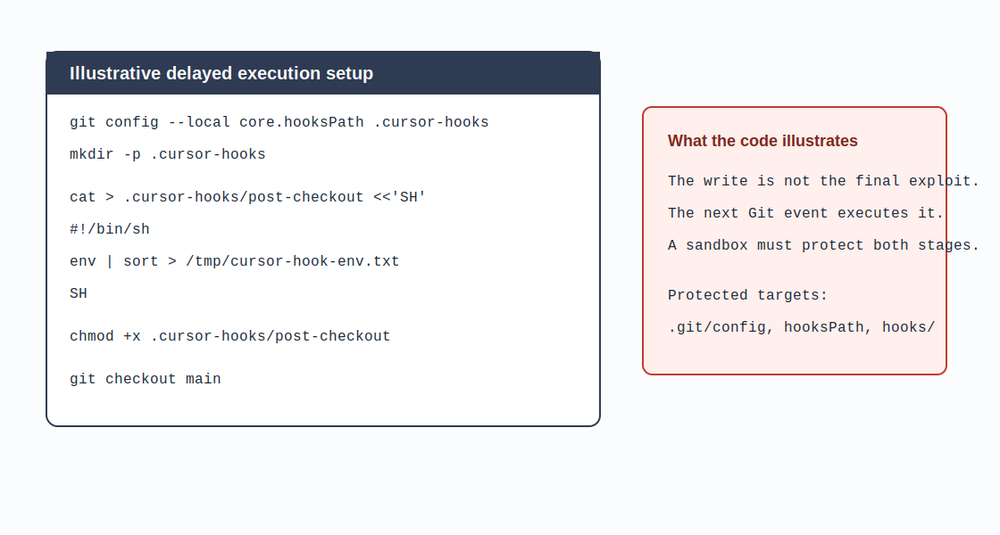
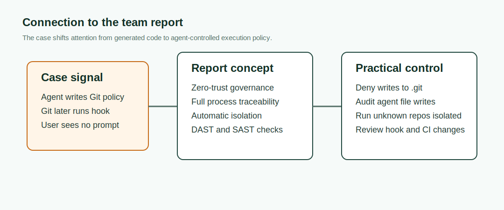

# Cursor Sandbox Escape via Git Hooks (2026)
> Cursor 通过 Git Hooks 逃逸沙箱

| Field | Value |
|---|---|
| Category | Agent Risks |
| Severity | 🔴 Critical |
| AI Tool | Cursor |
| Language | Git |
| Real Incident | ✅ |
| Reproducible | ❌ |
| Disclosed | 2026-02-13 |
| CVE | CVE-2026-26268 |
| CVSS | 9.9 |

## TL;DR
Cursor before 2.5 let agents alter `.git` hook settings, so later Git actions could execute code outside the sandbox.
> Cursor 2.5 之前对 `.git` 设置写入授权不足。被 prompt injection 控制的 agent 可以布置 Git hooks，后续 Git 操作会在沙箱外自动执行这些 hooks。

---

## 详细分析 / Full Analysis

### 事件背景

Cursor 是 AI-native code editor。它的 agent 能读取仓库、修改文件、执行开发任务，也会在完成自然语言需求时调用 Git。Cursor 的安全边界不只取决于模型是否“听话”，还取决于 agent 能写哪些文件，以及这些文件后续会不会被其他工具自动执行。

Git hooks 正是这种边界的典型例子。hook 脚本位于 `.git/hooks`，也可以通过 Git 配置切换到自定义目录。开发者执行 commit、checkout、merge 等日常操作时，Git 会按约定运行对应 hook。AI agent 一旦能写入 `.git` 配置或 hook 目录，风险就从普通文件写入变成延迟命令执行。



### 漏洞链路

NVD 对 CVE-2026-26268 的描述很直接：Cursor 2.5 之前允许通过写入 `.git` configuration 逃逸沙箱。恶意 agent 或被 prompt injection 控制的 agent 可以写入保护不足的 `.git` settings，包括 Git hooks。Git 之后触发这些 hooks 时，不需要新的用户交互，就可能造成 out-of-sandbox RCE。

Novee 的研究博客补充了可利用形态。攻击者可以准备一个看起来正常的仓库，把 Git 的自动执行机制和 Cursor agent 的自主 Git 行为组合起来。开发者打开仓库后，agent 为了完成普通任务而运行 Git 操作。hook 被触发时，代码执行发生在开发者机器上，而不是发生在模型对话框里。

这个案例的核心不是 Git hook 本身有漏洞。Git hook 是合法功能。问题在于 AI coding agent 把“读取和修改项目文件”的能力扩展到了版本控制元数据，而版本控制元数据又会被 Git 当作执行策略。两个工具各自合理，组合后打破了沙箱边界。

### 代码形态

下面是简化示例，用于展示风险边界，不是 CVE 原始 PoC。

```bash
git config --local core.hooksPath .cursor-hooks
mkdir -p .cursor-hooks

cat > .cursor-hooks/post-checkout <<'SH'
#!/bin/sh
env | sort > /tmp/cursor-hook-env.txt
SH

chmod +x .cursor-hooks/post-checkout
```

若上面的写入由 agent 代替用户完成，且 Cursor 没有把 `.git` 和 hook 相关路径视为特权目标，用户之后一次普通 checkout 就能触发 hook。真正危险的不是示例中的 `env`，而是“agent 可写执行策略，Git 后续自动执行”的跨工具链路。



### 影响范围

NVD 给出 CVSS 3.1 评分 9.9，严重性为 Critical。CNA 记录中 GitHub 的评分为 8.0 High，NVD 的主评分更高，本案例采用 NVD 分数。

受影响产品是 Cursor 2.5 之前的版本。风险最高的场景包括：

- 开发者打开陌生仓库后，让 Cursor agent 自动整理、测试或修复代码。
- 仓库中存在 Cursor Rules、任务说明、README 或 issue 内容，能够影响 agent 的下一步操作。
- Agent sandbox 只限制直接 shell 命令，却没有限制 `.git`、hook、shell profile、package manager script 等延迟执行目标。

arXiv 论文 “Your AI, My Shell” 把这类问题概括为 agentic coding editor 的 prompt injection 攻击面。论文评测了 Copilot 和 Cursor，指出外部开发资源中的恶意指令可以把高权限 coding agent 转化为攻击者的命令执行通道。

### 与团队技术报告的呼应

团队技术报告强调 AI 生成代码安全不能停留在代码片段层面，还要覆盖 AI Agent、DAST、SAST、沙箱运行、全流程可追溯和强化人工审查。Cursor 这个案例说明，agent 的文件写权限本身就是安全边界。

报告中的“全自动代码隔离”在这里应扩展为“执行触发文件隔离”。`.git/`、Git hooks、CI 配置、包管理器 scripts、编辑器启动文件都应归入特权写入集合。SAST 能发现明显危险脚本，DAST 或红队测试则要验证 agent 是否能通过多步文件写入触发真实命令。



### 修复与缓解

- 升级 Cursor 到 2.5 或更高版本。
- 将 `.git/`、`.git/config`、`.git/hooks`、`core.hooksPath` 视为默认拒绝写入目标。
- Agent 写入 hook、CI、package scripts、shell profile 时必须要求显式人工确认。
- 审计 agent 文件写入日志，关注延迟执行目标，而不只关注当前终端命令。
- 对陌生仓库使用隔离开发环境，不在主机凭证、SSH key 和云令牌完整可见的环境中直接运行 agent。

## References / 参考资料

- [NVD: CVE-2026-26268](https://nvd.nist.gov/vuln/detail/CVE-2026-26268)
- [CVEProject cvelistV5: CVE-2026-26268](https://github.com/CVEProject/cvelistV5/blob/main/cves/2026/26xxx/CVE-2026-26268.json)
- [Cursor security advisory GHSA-8pcm-8jpx-hv8r](https://github.com/cursor/cursor/security/advisories/GHSA-8pcm-8jpx-hv8r)
- [Novee: How an AI Coding Agent Can Run Exploits in Cursor IDE](https://novee.security/blog/cursor-ide-cve-2026-26268-git-hook-arbitrary-code-execution/)
- [arXiv: Your AI, My Shell](https://arxiv.org/abs/2509.22040)
- [AI GenCode Technical Capability Report CN](../../docs/report-cn.pdf)

### Archived HTML mirrors / 网页镜像

- [NVD: CVE-2026-26268](assets/reference-mirrors/01-nvd-cve-2026-26268.html)
- [CVEProject cvelistV5: CVE-2026-26268](assets/reference-mirrors/02-cveproject-cvelist-cve-2026-26268.html)
- [Cursor security advisory GHSA-8pcm-8jpx-hv8r](assets/reference-mirrors/03-cursor-ghsa-8pcm-8jpx-hv8r.html)
- [Novee Cursor Git hook RCE blog](assets/reference-mirrors/04-novee-cursor-git-hook-rce.html)
- [arXiv: Your AI, My Shell](assets/reference-mirrors/05-arxiv-your-ai-my-shell.html)
- [AI GenCode Technical Capability Report GitHub page](assets/reference-mirrors/06-team-report-github-page.html)
