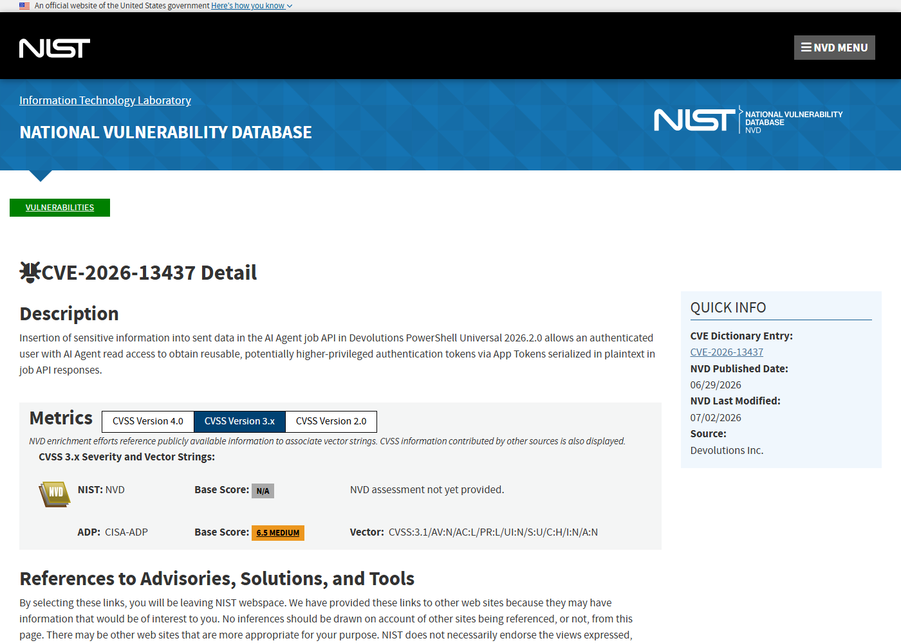
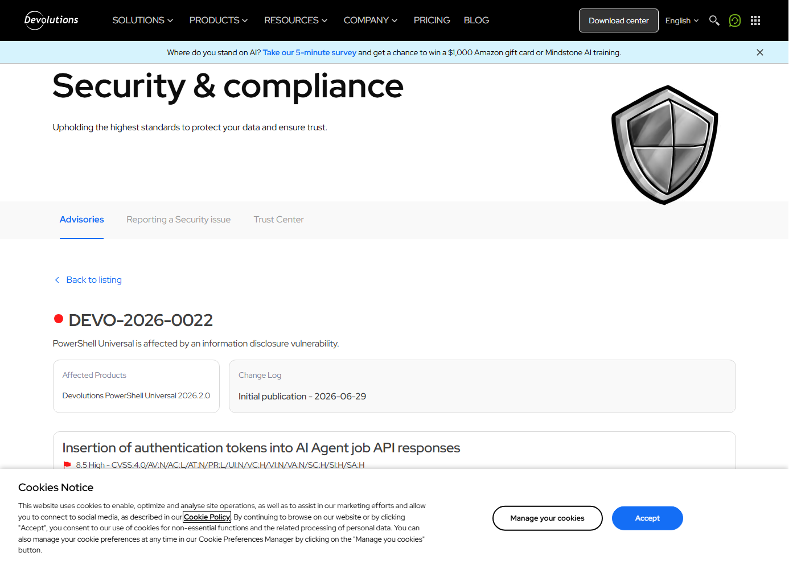
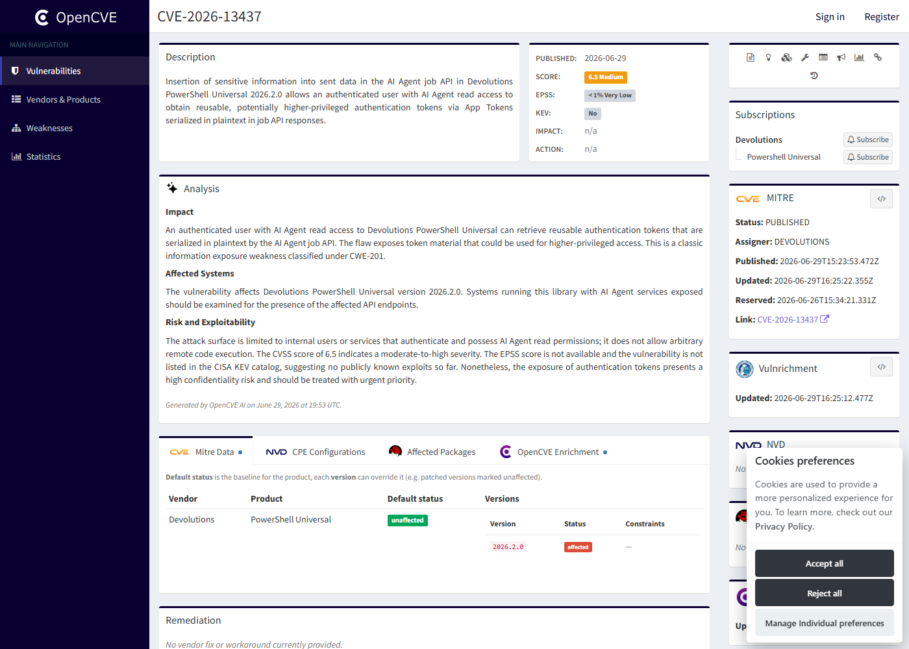
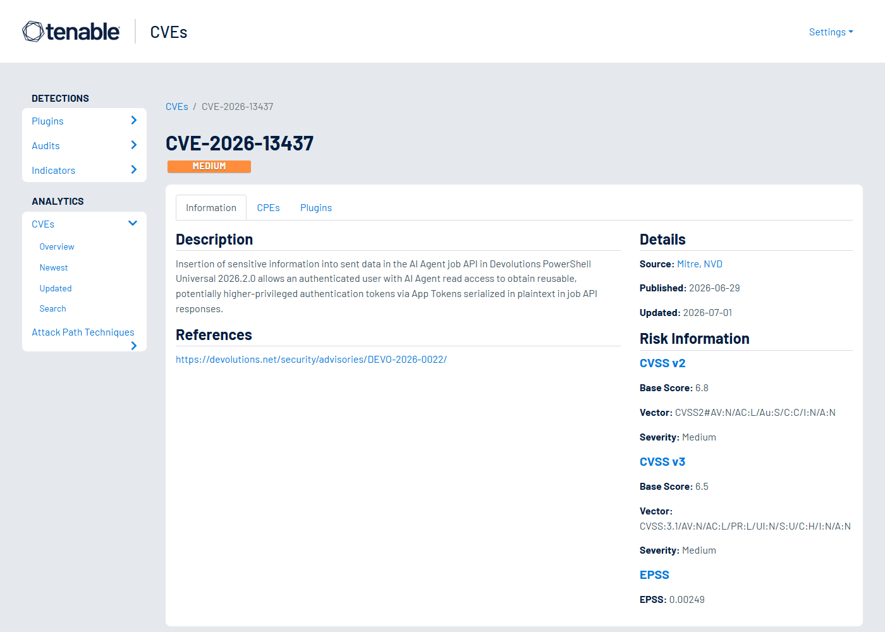

# Devolutions PowerShell Universal AI Agent Token Exposure (2026)
> Devolutions PowerShell Universal AI Agent 作业令牌暴露

| Field | Value |
|---|---|
| Category | Cloud / IaC |
| Severity | High |
| AI Tool | Devolutions PowerShell Universal, AI Agent job API, App Tokens |
| Language | PowerShell / C#/.NET |
| Real Incident | Yes |
| Reproducible | Yes |
| Disclosed | 2026-06-29 |
| CVE | CVE-2026-13437 |
| CVSS | 7.5 |

## TL;DR
PowerShell Universal 2026.2.0 exposed reusable App Tokens in AI Agent job API responses to authenticated users with AI Agent read access.
> PowerShell Universal 2026.2.0 的 AI Agent job API 会把可复用 App Tokens 以明文序列化到响应中，具备 AI Agent 读取权限的用户可获取更高价值凭据。

---

## 详细分析 / Full Analysis

## 一、基本信息

Devolutions PowerShell Universal 是面向脚本、自动化、API 和管理门户的平台，2026 年加入的 AI Agent 能力让用户用更自然的方式驱动 PowerShell Universal 任务。CVE-2026-13437 影响 PowerShell Universal 2026.2.0：AI Agent job API 在响应中把 App Tokens 以明文序列化，拥有 AI Agent 读取权限的认证用户可以获得可复用、可能更高权限的认证 token。官方建议升级到 2026.2.1 或更高版本。

## 二、事件核验与公开材料范围

NVD 和 Devolutions 官方 DEVO-2026-0022 公告对描述高度一致，官方公告索引也列出该 CVE 和修复版本。OpenCVE 和 VulDB 提供第三方记录。公开材料没有给出完整 exploit 细节，但足以确认影响产品、版本、权限前提和修复动作。

### 证据矩阵

| 来源 | 类型 | 证明内容 |
|---|---|---|
| NVD: CVE-2026-13437 | 漏洞数据库 | AI Agent job API 明文 App Tokens 和 CWE-201 |
| Devolutions Advisory: DEVO-2026-0022 | 厂商公告 | 受影响产品、修复版本和缓解建议 |
| Devolutions Advisories | 公告索引 | CVE-2026-13437 在官方公告列表中的位置 |
| OpenCVE: CVE-2026-13437 | 漏洞数据库 | CVE 记录、发布时间和参考链接 |
| Tenable: CVE-2026-13437 | 漏洞数据库 | PowerShell Universal AI Agent job API token 暴露的第三方记录 |

## 三、系统背景与触发条件

PowerShell Universal 常被用于自动化运维、内部工具、API 编排和权限较高的管理任务。AI Agent job API 的引入让这些任务可以通过 Agent 方式创建、读取或追踪，但同时也把作业对象、执行上下文和认证材料放进新的 API 表示里。App Tokens 往往用于自动化调用，具备长期可复用特征；如果它们被序列化进普通读取响应，权限模型就会从“能看任务”扩大到“能拿凭据”。

## 四、攻击链路与处置过程

攻击者首先需要是认证用户，并拥有 AI Agent read access。随后调用 AI Agent job API 读取相关作业响应。受影响版本会在响应对象中包含明文 App Tokens。攻击者拿到 token 后，可在后续请求中以 token 权限调用 PowerShell Universal API 或相关自动化资源。若 App Token 权限高于读取者自身权限，攻击者就获得了权限提升效果；即使权限相当，也会让凭据离开原有保管位置，进入日志、客户端或第三方集成。

## 五、技术根因与 AI 风险归因

根因是敏感字段被纳入 API 响应序列化。AI Agent 作业需要展示状态、输入、输出和上下文，但认证 token 不应作为普通作业数据返回。Agent 系统中这类错误更容易出现，因为为了让 Agent 理解任务，开发者倾向于提供更完整的上下文对象；如果没有字段级敏感性标注，凭据就可能被一起暴露。

PowerShell Universal 的 AI Agent job API 处在一个很敏感的位置：它既服务于自然语言或自动化作业，又连接实际运维脚本、API 和内部资源。App Tokens 在这里不是普通显示字段，而是可复用身份材料。具备 AI Agent read access 的用户能读取作业，本应只获得作业状态、输入输出和执行摘要；一旦响应里包含明文 token，读取权限就被悄悄扩展成了调用权限。这个权限变化不一定立即出现在 RBAC 配置里，却已经在数据返回层发生。

在组织环境中，这种漏洞还会和日志链路叠加。AI Agent job API 的响应可能被浏览器缓存、客户端调试工具、代理日志、SIEM、Agent transcript 或工单附件保存。即使后来升级修复，历史响应中的 token 仍可能留在多个系统里。对运维平台而言，token 往往能触发脚本、访问 API、操作凭据库或读取运行结果，因此一次字段泄露可能变成长期自动化身份泄露。

## 六、影响范围与治理建议

影响面取决于 PowerShell Universal 中 App Tokens 的权限和使用范围。高权限 token 可能允许读取或修改脚本、触发自动化、访问内部 API 或继续创建作业。治理上应升级到 2026.2.1 或更高版本，轮换可能暴露的 App Tokens，检查 AI Agent job API 访问日志，并重新审视 AI Agent read access 的授权对象。对 Agent API，建议默认隐藏 token、secret、connection string 和 key material，只返回不可逆引用或短期句柄。

处置时建议按“凭据已经离开系统边界”处理。除了升级到修复版本，还应识别 2026.2.0 期间创建或读取过的 AI Agent job，检索 API 响应日志和客户端日志里是否出现 App Token 形态的字符串，并轮换相关 token。若 App Token 权限较高，还应检查它们在暴露窗口后的调用记录，确认是否出现异常 IP、异常 API 路径或非常规执行时间。

设计层面，Agent 作业对象应区分“任务上下文”和“秘密引用”。模型或用户界面可以看到 token 的名称、作用域、创建时间和最后使用时间，但不应看到明文值。需要执行任务时，由服务端在受控环境中解析引用并注入短期凭据；任务结束后撤销或过期。这样既能让 AI Agent 理解可用资源，又不会把凭据变成作业查询响应的一部分。

从权限模型看，read access 常被认为风险较低，因为它不直接执行动作。但在 Agent 作业系统里，读取对象可能包含执行上下文、工具引用、连接信息和历史输出。如果对象里混入秘密，读权限就会被动升级。平台设计时应采用字段级授权：同一个 job 对象，普通读取者能看状态和摘要，作业所有者能看输入输出，只有凭据服务能解析 token 明文。

对审计团队来说，这类漏洞适合触发一次“API 响应敏感字段盘点”。可以抽样抓取 AI Agent、自动化任务、连接配置和集成作业的 JSON 响应，搜索 token、secret、password、key、connection string 等字段，确认它们是否只以引用形式出现。这个检查成本不高，却能发现很多因为对象序列化过宽导致的隐性泄露。

## 七、结论

CVE-2026-13437 展示了 AI Agent 平台常见的上下文过度暴露问题。Agent 需要足够信息完成任务，但 API 响应不能为了可解释性牺牲凭据边界。字段级脱敏、最小权限和凭据轮换应成为 Agent 作业系统的默认设计。

## 八、参考来源

- [NVD: CVE-2026-13437](https://nvd.nist.gov/vuln/detail/CVE-2026-13437)
- [Devolutions Advisory: DEVO-2026-0022](https://devolutions.net/security/advisories/DEVO-2026-0022/)
- [Devolutions Advisories](https://devolutions.net/security/advisories/)
- [OpenCVE: CVE-2026-13437](https://app.opencve.io/cve/CVE-2026-13437)
- [Tenable: CVE-2026-13437](https://www.tenable.com/cve/CVE-2026-13437)
