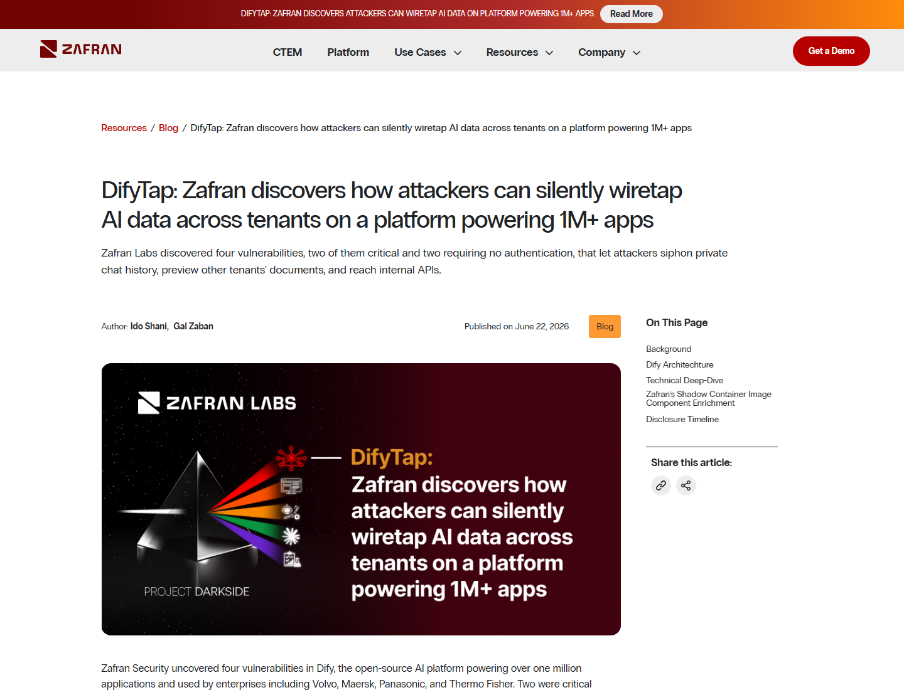
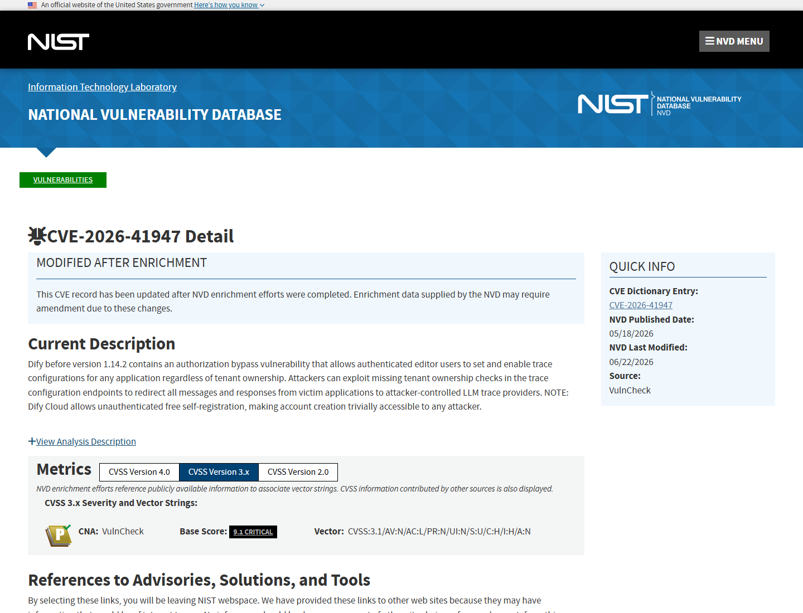
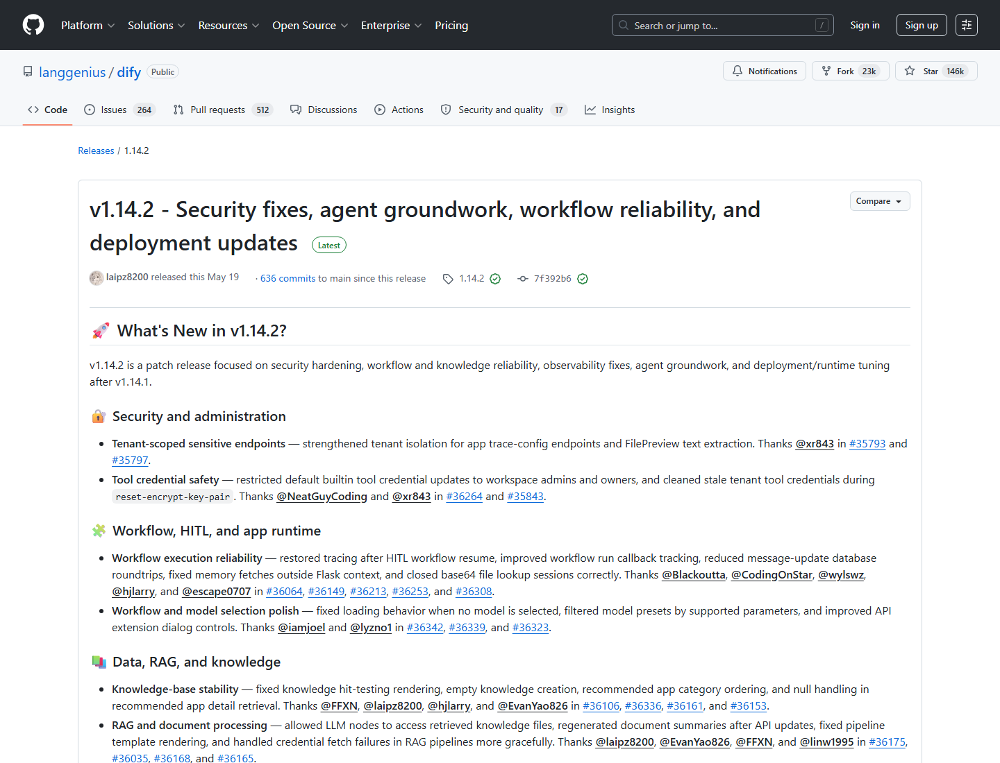
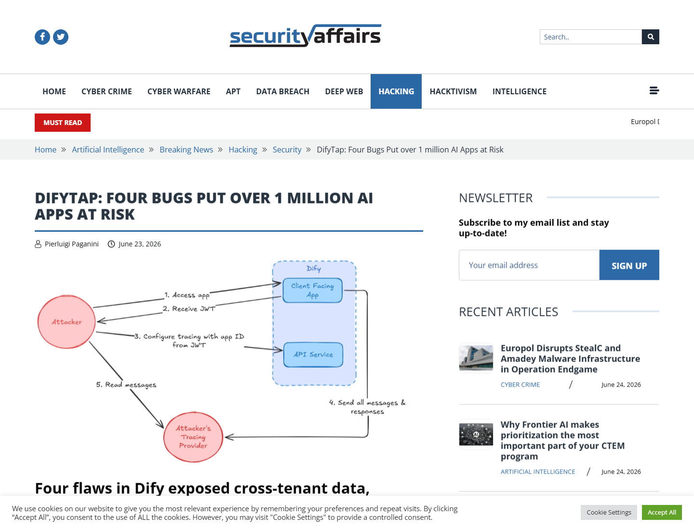

# DifyTap Cross-Tenant AI Data Exposure (2026)
> DifyTap 跨租户 AI 对话与文件暴露漏洞

| Field | Value |
|---|---|
| Category | Domain-Specific Risks |
| Severity | 🔴 Critical |
| AI Tool | Dify, Dify Cloud, LLMOps platform, AI application tracing |
| Language | Python, TypeScript, Multiple |
| Real Incident | ✅ |
| Reproducible | ❌ |
| Disclosed | 2026-06-22 |
| CVE | CVE-2026-41947 / 41948 / 41949 / 41950 |
| CVSS | 9.3 / 9.4 reported for critical flaws |

## TL;DR
DifyTap flaws exposed cross-tenant AI chats, documents, and internal APIs in Dify.
> DifyTap 漏洞组让攻击者可跨租户读取 AI 对话、预览文档并触达内部 API，暴露 LLMOps 多租户平台的数据边界风险。

---

## 详细分析 / Full Analysis

# DifyTap 跨租户 AI 数据暴露漏洞分析：LLMOps 平台中的追踪、插件与文件访问边界失效

## 基本信息

Dify 是开源 AI 应用开发与 LLMOps 平台，用于创建、部署和监控基于大模型的应用。2026 年 6 月，Zafran Labs 披露 DifyTap 漏洞组，涉及四个 Dify 漏洞：CVE-2026-41947、CVE-2026-41948、CVE-2026-41949 和 CVE-2026-41950。公开材料显示，这些问题影响 Dify 的追踪配置、Plugin Daemon 路径处理、文档预览和聊天文件引用等环节，风险集中在多租户云环境中的 AI 对话、模型响应、上传文件和内部 API。

## 摘要

DifyTap 的关键问题不是单个接口返回异常，而是多租户 AI 平台中几条数据路径同时缺少足够的租户所有权校验。攻击者可以通过追踪配置把受害应用的消息和模型响应重定向到自己控制的 LLM trace provider，也可以借 Plugin Daemon 路径处理缺陷访问内部端点，或利用文件预览与聊天消息中的文件引用读取其他租户或同租户其他用户的文档内容。Dify 1.14.2 已修复其中三项，剩余漏洞按公开报道将在后续版本修复。

## 一、事件核验与证据范围

### 证据矩阵

| 来源 | 类型 | 证明内容 | 边界 |
|---|---|---|---|
| Zafran 原始研究 | 主证据 / 技术证据 | 四个漏洞、两项 critical、跨租户聊天与文件暴露、Dify 生态规模 | 安全厂商视角，需要结合 CVE 与媒体复核 |
| NVD CVE-2026-41947 | 主证据 | Dify 追踪配置授权绕过、影响版本、CNA CVSS 9.3、CWE-639 | 只覆盖漏洞组中的一个 CVE |
| The Hacker News | 复核证据 | CVE 列表、跨租户读取 AI conversations、1.14.2 修复状态 | 技术细节主要来自 Zafran |
| SecurityWeek | 复核 / 影响证据 | 1M+ 应用、50+ 行业、私有聊天、文档预览、内部 API | 影响规模是平台覆盖面，不等同于确认泄露量 |
| Dark Reading | 复核证据 | Dify 作为 AI 应用构建与编排平台的背景、DifyTap 对客户数据的 wiretap 风险 | 新闻复核，不提供 PoC |
| GitHub Release 1.14.2 | 修复证据 | Dify 发布修复版本，支撑处置时间线 | 需要结合 CVE 与研究报告判断覆盖漏洞范围 |
| Security Affairs | 复核证据 | 两个 critical、两个无需认证、三项跨租户影响、企业采用背景 | 复述原始研究并补充传播面 |

Zafran 在 2026 年 6 月 22 日披露 DifyTap，称其发现四个 Dify 漏洞，其中两个为 critical，两个无需认证，三个在 Dify 多租户云服务中具有跨租户影响。Zafran 还指出，Dify 被超过一百万个应用使用，API image 有超过一千万次 Docker pulls，平台部署横跨 60 多个行业。([Zafran](https://www.zafran.io/resources/difytap-zafran-discovers-how-attackers-can-silently-wiretap-ai-data-across-tenants-on-a-platform-powering-1m-apps))

NVD 对 CVE-2026-41947 的描述确认，Dify 1.14.1 及以前版本存在授权绕过，允许 authenticated editor 用户为任意应用设置并启用 trace configuration。由于 Dify Cloud 可自由注册账户，攻击者创建账户的门槛很低；CNA 评分显示 CVSS 9.3 Critical。([NVD](https://nvd.nist.gov/vuln/detail/CVE-2026-41947))

The Hacker News 复核称，DifyTap 可让攻击者读取其他客户应用中的私有 AI conversations，形成对每条消息和模型响应的隐蔽外流通道；报道还列出 CVE-2026-41947 至 CVE-2026-41950，并说明 Dify 1.14.2 已修复除 CVE-2026-41948 外的漏洞。([The Hacker News](https://thehackernews.com/2026/06/researchers-detail-difytap-flaws-in.html))

## 二、系统背景与触发条件

Dify 处在 AI 应用的控制平面位置，连接模型调用、插件、应用配置、文档上传、对话记录和监控追踪。这样的系统天然需要多租户隔离，因为一个平台实例可能承载多个客户、多个 workspace、多个应用和多个模型提供商。DifyTap 说明，在 LLMOps 场景中，追踪和调试功能本身也会成为敏感数据通道。

触发条件包括可访问 Dify Cloud 或受影响自托管 Dify 实例、能够注册或获得低权限账号、存在公开可访问的 Dify 应用，或者目标实例暴露了相关 console、trace、file preview 或 Plugin Daemon 路径。攻击者不需要控制模型本身，只要能影响平台对消息、文档和插件 API 的路由，就可以把 AI 应用数据引向自己的观察点。

## 三、攻击链路与处置过程

攻击入口之一是 Dify 的 trace configuration。缺少租户所有权校验时，攻击者可以把受害应用的消息和模型响应转发到攻击者控制的 trace provider。另一个入口是 Plugin Daemon 的路径处理，路径穿越和内部 API 访问可让攻击者触达本应只对平台内部开放的功能。文件相关漏洞则把 uploaded documents 和 chat message 文件引用变成跨租户或跨用户读取路径。

AI 组件是 Dify 承载的应用编排和观测链路。关键权限来自平台对模型输入、模型输出、文件预览和插件 API 的访问能力。失效点在租户所有权校验、内部 API 访问控制、文件 ID 与用户绑定、以及可观测性配置的信任边界。处置上，Dify 1.14.2 修复了其中三项漏洞，公开报道提示用户尽快升级，并为尚未完全修复的路径采取 WAF 或访问限制。

## 四、技术根因分析

根因之一是追踪功能和业务消息之间的权限关系处理不充分。AI 应用的 trace provider 通常能看到完整 prompt、用户输入、模型响应和调试信息，它应被视为高敏感出口。CVE-2026-41947 中缺少租户所有权检查，使低门槛账号可以为其他应用设置追踪端点，从而把 AI 对话变成持续外流通道。

根因之二是 Plugin Daemon 的内部 API 没有被足够强地隔离。Dify 插件系统需要执行和管理扩展能力，但内部 API 一旦可被外部请求路径穿透，就会把平台编排层的权限暴露给攻击者。根因之三是文件预览和聊天文件引用缺少稳固的用户、workspace 和 tenant 绑定，导致文档内容可被非所有者读取。

## 五、AI 参与方式与风险归因

AI 参与方式集中在 Dify 的 LLMOps 平台属性：漏洞影响的是 AI 应用的对话、模型响应、文档上下文、插件执行和追踪配置，而不是传统 Web 应用中的普通静态文件。DifyTap 的高风险来自 AI 应用运行时数据的集中化，平台同时掌握用户输入、模型输出、工具调用和知识库文件。

风险归因应落在多租户平台的数据隔离与控制平面设计上。模型本身不是攻击执行者，Dify 的追踪、插件和文件访问路径才是数据外流通道。对企业而言，AI 平台的可观测性、调试、插件和文件预览都必须按敏感数据面设计，而不能只按辅助功能处理。

## 六、与团队技术报告风险框架的关系

团队技术报告强调 AI 进入软件开发和业务应用后，敏感数据泄露、供应链扩展、权限放大和可追溯性会成为核心风险。DifyTap 对应的是 AI 平台层面的敏感数据泄露与权限边界失效：平台把 prompt、response、文件和插件能力集中管理，一旦租户隔离失效，影响范围会跨越单个应用。

该案例也说明，AI 应用的安全审计不能只检查模型提示词或输出内容。监控追踪、插件管理、文档预览、文件 ID、内部 API 和工作区权限都是 AI 应用控制面的一部分。治理上应把这些路径纳入威胁建模、租户隔离测试、访问控制回归测试和运行时审计。

## 七、影响范围与社会后果

公开来源给出的影响面包括 Dify 平台超过一百万个应用、超过 140,000 GitHub stars、超过一千万次 API image Docker pulls，以及数万互联网可访问实例。该规模说明 DifyTap 不是单点边缘漏洞，而是影响常见 AI 应用构建平台的多租户数据保护问题。

直接风险是私有 AI 对话、模型响应、上传文档和内部 API 可被跨租户读取或转发。社会后果在于企业正在把客户问答、内部知识库、业务文档和自动化插件接入 AI 应用平台；如果平台追踪和文件路径缺少租户隔离，AI 应用的便利性会转化为集中化泄露面。

## 八、治理建议

平台侧应将 trace provider、plugin daemon、file preview 和 chat file references 视为高敏感数据路径，对每个请求执行 tenant、workspace、app、user 四层所有权校验。Dify 用户应尽快升级到修复版本，限制 console 与内部 API 暴露面，并为未完全修复的路径配置 WAF 规则和访问控制。企业还应定期审计 trace destination、插件配置、文件预览日志和异常跨租户访问。

## 九、结论

DifyTap 的意义在于，它把 AI 平台的安全问题从单个 prompt 或单次模型调用提升到 LLMOps 控制面。AI 应用平台越集中管理对话、文件、插件和观测数据，租户隔离越必须成为核心安全属性。对 Dify 这类平台而言，安全边界不只在模型调用前后，也在每一个能观察、转发或预览 AI 应用数据的内部功能上。

## 参考来源

- [Zafran: DifyTap silently wiretaps AI data across tenants](https://www.zafran.io/resources/difytap-zafran-discovers-how-attackers-can-silently-wiretap-ai-data-across-tenants-on-a-platform-powering-1m-apps)
- [NVD: CVE-2026-41947](https://nvd.nist.gov/vuln/detail/CVE-2026-41947)
- [The Hacker News: DifyTap flaws could expose AI chats across tenants](https://thehackernews.com/2026/06/researchers-detail-difytap-flaws-in.html)
- [SecurityWeek: Data exposure flaws threaten Dify AI platform](https://www.securityweek.com/data-exposure-flaws-threaten-dify-ai-platform-powering-over-1-million-apps/)
- [Dark Reading: DifyTap bugs let attackers wiretap AI chat histories](https://www.darkreading.com/application-security/difytap-bugs-wiretap-ai-chat-histories)
- [GitHub: Dify release 1.14.2](https://github.com/langgenius/dify/releases/tag/1.14.2)
- [Security Affairs: DifyTap four bugs put over 1 million AI apps at risk](https://securityaffairs.com/194081/hacking/difytap-four-bugs-put-over-1-million-ai-apps-at-risk.html)
