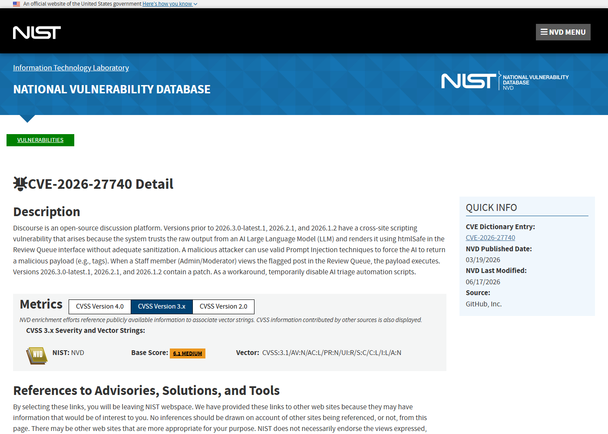
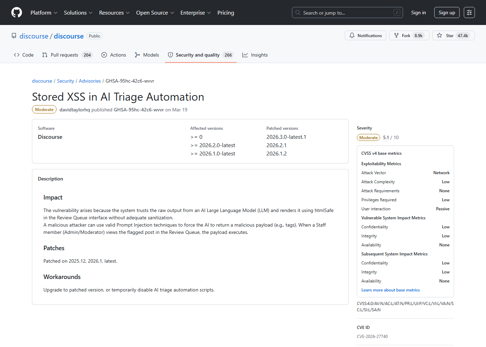
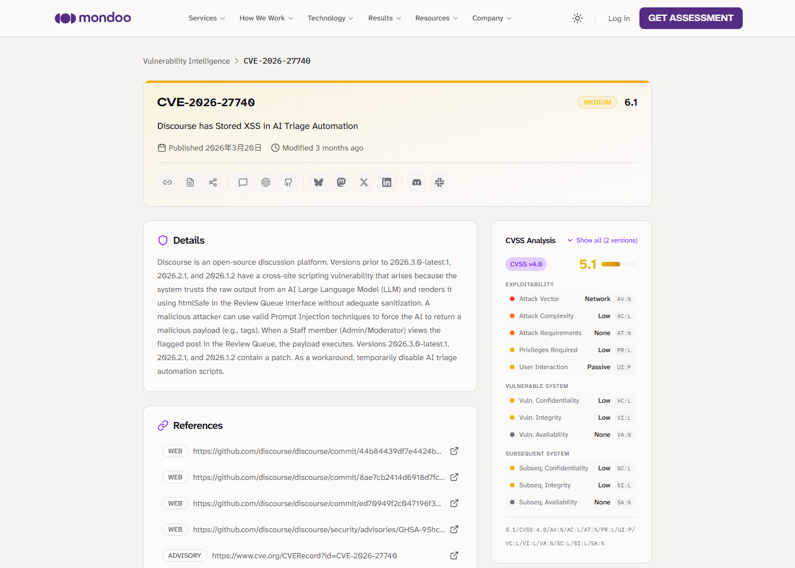
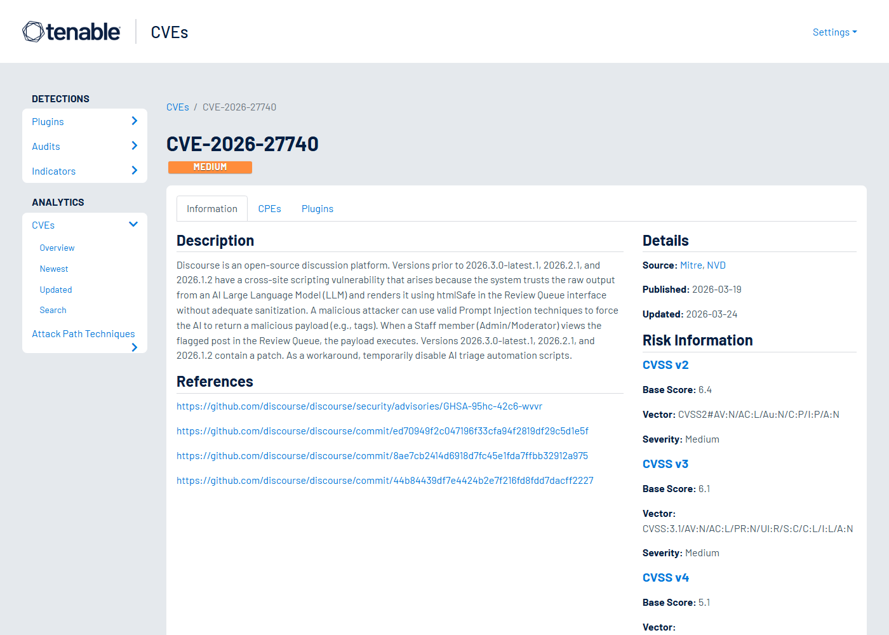

# Discourse AI Triage LLM Output XSS (2026)
> Discourse AI Triage 大模型输出跨站脚本漏洞

| Field | Value |
|---|---|
| Category | Code Vulnerabilities |
| Severity | Medium |
| AI Tool | Discourse, Discourse AI, AI triage automation |
| Language | Ruby / JavaScript |
| Real Incident | Yes |
| Reproducible | Yes |
| Disclosed | 2026-03-19 |
| CVE | CVE-2026-27740 |
| CVSS | 5.1 |

## TL;DR
Discourse AI triage rendered raw LLM output with htmlSafe in the staff review queue, allowing prompt injection to become stored XSS.
> Discourse AI triage 把 LLM 原始输出用 htmlSafe 渲染到审核队列中，攻击者可借提示注入让审核人员打开存储型 XSS payload。

---

## 详细分析 / Full Analysis

## 一、基本信息

Discourse AI triage 用于辅助论坛管理和内容审核，可以让大模型按规则对帖子进行分类、标记或生成审核信息。CVE-2026-27740 的问题在于，AI triage 把来自 LLM 的原始输出用 htmlSafe 渲染到 Review Queue 界面，没有充分清理 HTML。攻击者可以通过有效的提示注入技巧，让模型返回恶意标签或脚本片段；当管理员或版主在审核队列中查看被标记内容时，payload 就会在其浏览器中执行。

## 二、事件核验与公开材料范围

NVD、Discourse 的 GitHub advisory、Mondoo 和 SentinelOne 对关键事实一致：受影响版本早于 2026.3.0-latest.1、2026.2.1 和 2026.1.2，触发点是 AI triage 结果在 Review Queue 中的渲染。Discourse Meta 文档说明了 AI triage 的功能背景。公开资料没有把该问题描述为广泛利用事件，因此本文聚焦于漏洞披露、触发条件和 AI 审核工作流中的信任错误。

### 证据矩阵

| 来源 | 类型 | 证明内容 |
|---|---|---|
| NVD: CVE-2026-27740 | 漏洞数据库 | LLM 输出、htmlSafe、审核队列和修复版本 |
| Discourse Advisory: GHSA-95hc-42c6-wvvr | 厂商公告 | Stored XSS in AI Triage Automation 和补丁 |
| Mondoo: CVE-2026-27740 | 漏洞数据库 | 补丁版本、审核队列触发和 workaround |
| SentinelOne: CVE-2026-27740 | 复核资料 | LLM 输出经 htmlSafe 渲染导致 XSS 的机制 |
| Discourse Meta: AI triage | 产品文档 | AI triage 功能定位和审核自动化背景 |
| Tenable: CVE-2026-27740 | 漏洞数据库 | Discourse AI triage XSS 的第三方记录 |

## 三、系统背景与触发条件

内容审核是 LLM 很容易接入的场景，因为模型擅长对文本分类、总结和给出处理建议。问题是，审核对象本身就是不可信用户内容。攻击者可以写一段帖子，让模型在 triage 时产生特定输出；如果系统随后把模型输出当成安全 HTML 直接渲染，就相当于让用户内容绕过原有清洗流程，经由模型转换后进入 staff 界面。这个路径比普通帖子 XSS 更隐蔽，因为管理员看到的是 AI 生成的审核信息，而不是用户原文。

## 四、攻击链路与处置过程

攻击者发布或提交能够触发审核的内容，并在内容中埋入针对 AI triage 的指令。AI 自动化读取帖子后，按攻击者意图生成包含 HTML/脚本的输出。系统把这段输出作为可信内容放进 Review Queue。工作人员查看审核项时，浏览器执行 payload。根据会话权限，攻击者可能进行 CSRF 式操作、读取页面内可见信息、发起管理动作或进一步诱导管理员操作。修复版本通过调整渲染和清理逻辑阻断该链路。

## 五、技术根因与 AI 风险归因

根因是系统把 LLM 输出当成可信渲染结果。模型输出不是安全边界，它会被原始用户内容、提示注入和上下文操纵影响。htmlSafe 这类接口适合已经经过严格清洗的内容，而不适合直接承接模型输出。AI 审核系统尤其需要把“模型判断”和“浏览器可执行内容”分开：模型可以给出文本建议，但 UI 渲染层仍要按不可信输入处理。

Discourse AI triage 的场景很典型：用户提交内容，模型辅助判断，工作人员查看结果。这条链路里最容易犯的错误，是把模型当成净化器。实际上，模型是转换器，它会把用户输入改写、总结或分类，但不会天然去除恶意意图。攻击者可以把指令埋在帖子里，让模型在审核解释中输出特定 HTML。若系统随后用 htmlSafe 渲染这段输出，原本会被帖子正文清洗挡住的 XSS，就通过“AI 生成的审核信息”进入了 staff 界面。

审核队列的权限环境也让风险更高。普通帖子页面面向所有用户，安全策略通常更成熟；Review Queue 面向管理员和版主，页面上可能有更多操作按钮、用户信息、处理理由和内部上下文。攻击者真正想要的不是在自己帖子里弹窗，而是在高权限工作人员浏览器里执行脚本。AI triage 自动化让普通用户内容有机会被转写成 staff-only UI 的一部分，这就是该案例比普通前端转义缺陷更值得关注的原因。

## 六、影响范围与治理建议

影响范围取决于是否启用 Discourse AI triage，以及工作人员是否会查看相关审核队列。由于触发者可能只是普通用户，而执行位置在管理员或版主浏览器中，权限错位明显。治理上应升级到修复版本，临时禁用 AI triage 自动化脚本作为 workaround，并检查自定义自动化规则是否把模型输出直接渲染为 HTML。对所有 LLM 审核功能，都应统一执行 HTML 清洗、内容安全策略和输出转义。

复盘时应检查所有“模型输出进入后台界面”的路径，而不只看 AI triage。常见位置包括审核理由、风险评分解释、自动摘要、客服建议、告警描述和工单补全。只要输出会被 HTML 渲染，就应按不可信用户输入处理。更稳妥的做法是让模型只返回结构化字段，例如分类、置信度和纯文本说明；UI 层统一转义，再由前端组件决定展示样式，而不是让模型直接返回可解释为 HTML 的内容。

运营上，团队可以把提示注入样本加入审核功能测试：让用户内容诱导模型输出 ``、`<script>`、事件处理属性、外部链接和 Markdown HTML 混合内容，观察后台是否严格转义。对已有站点，升级修复版本后还应回看近期 Review Queue 中的 AI triage 记录，确认是否存在异常 HTML 或外部资源引用。这个检查不需要假设已经发生入侵，它只是把 AI 审核链路重新纳入前端安全测试范围。

这个案例还暴露了一个产品认知问题：AI 审核说明往往被认为是“给工作人员看的辅助文本”，因此开发时容易放松对 HTML 的处理。实际上，任何出现在后台页面上的文本都处在高权限浏览器环境里，安全级别应高于普通用户页面。模型输出如果需要富文本效果，可以用受控组件表达，例如标签、分数、原因段落和引用片段，而不是允许模型直接提供 HTML。

社区平台还应考虑审核人员的操作节奏。版主通常会快速翻看大量队列项，很少逐字检查 AI 解释是否异常。攻击者利用的正是这种信任和速度。把 AI 输出默认转义、禁用外部资源和限制可点击动作，能减少人为判断压力，让工作人员不必在每条审核建议里识别潜在 payload。

## 七、结论

CVE-2026-27740 说明，AI 输出不能因为来自模型就被提高信任级别。模型在这里不是漏洞利用的目标，而是把不可信用户输入改写成可执行 UI 内容的中间层。AI 审核产品需要把模型输出按普通用户输入处理，才能避免审核工具反过来攻击审核人员。

## 八、参考来源

- [NVD: CVE-2026-27740](https://nvd.nist.gov/vuln/detail/CVE-2026-27740)
- [Discourse Advisory: GHSA-95hc-42c6-wvvr](https://github.com/discourse/discourse/security/advisories/GHSA-95hc-42c6-wvvr)
- [Mondoo: CVE-2026-27740](https://mondoo.com/vulnerability-intelligence/vulnerability/CVE-2026-27740)
- [SentinelOne: CVE-2026-27740](https://www.sentinelone.com/vulnerability-database/cve-2026-27740/)
- [Discourse Meta: AI triage](https://meta.discourse.org/t/discourse-ai-ai-triage/281227?tl=en)
- [Tenable: CVE-2026-27740](https://www.tenable.com/cve/CVE-2026-27740)
