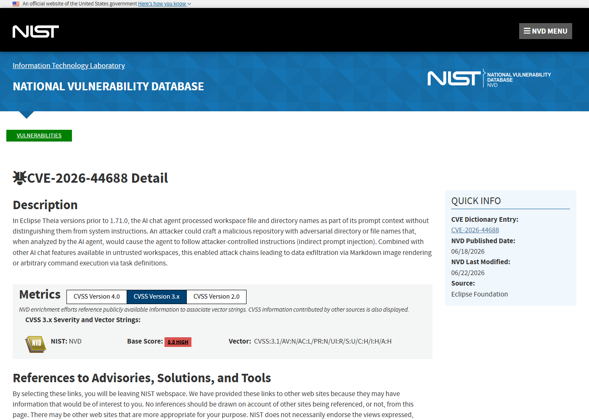
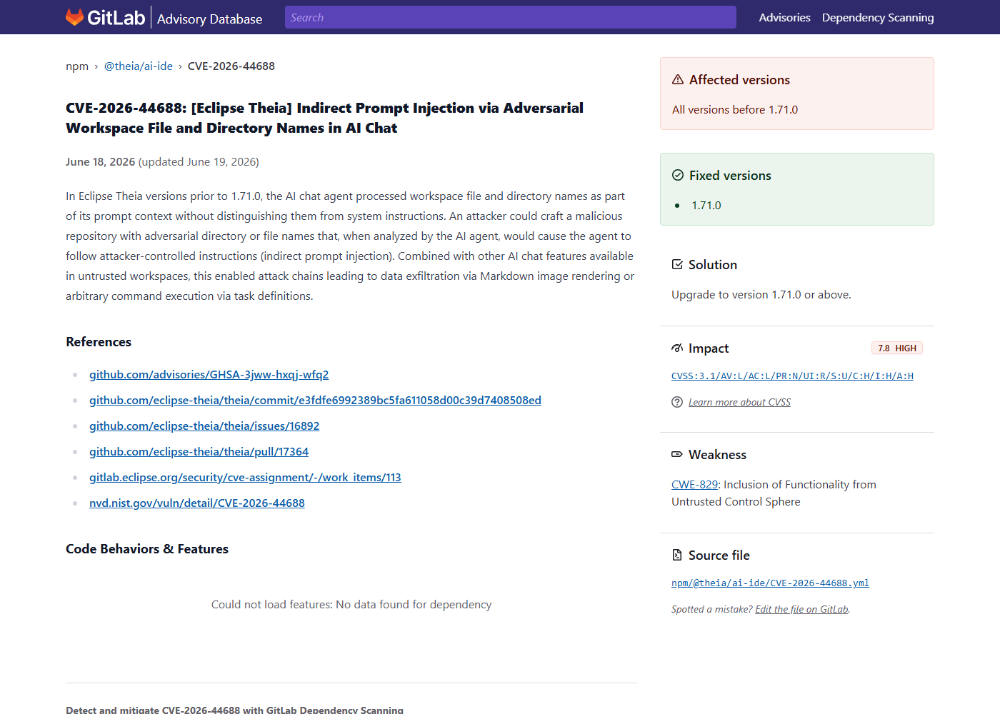
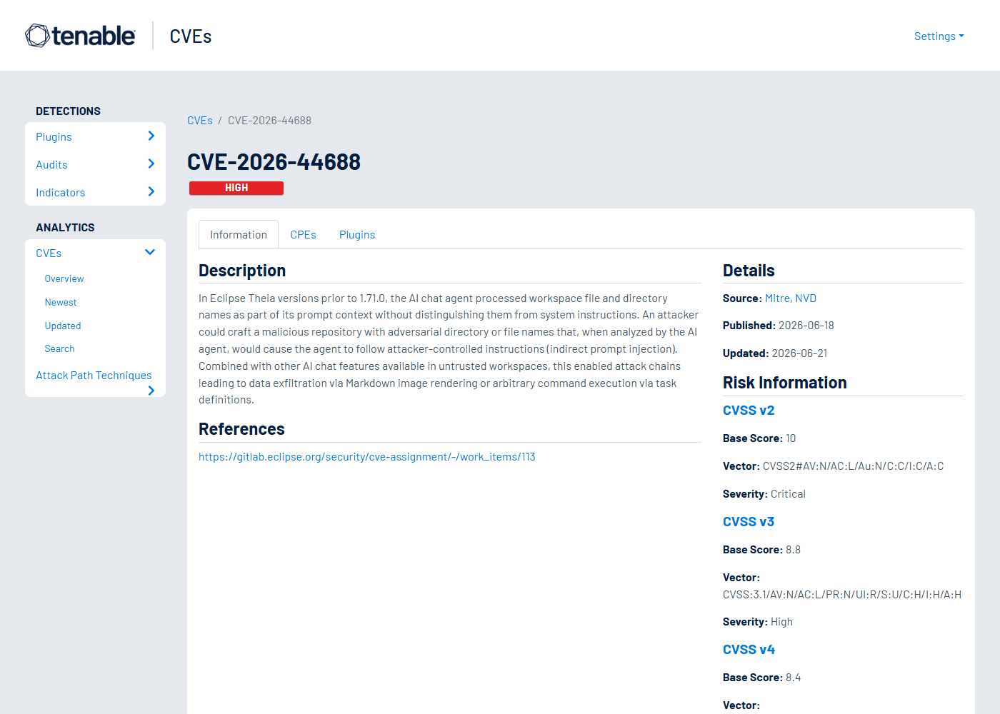
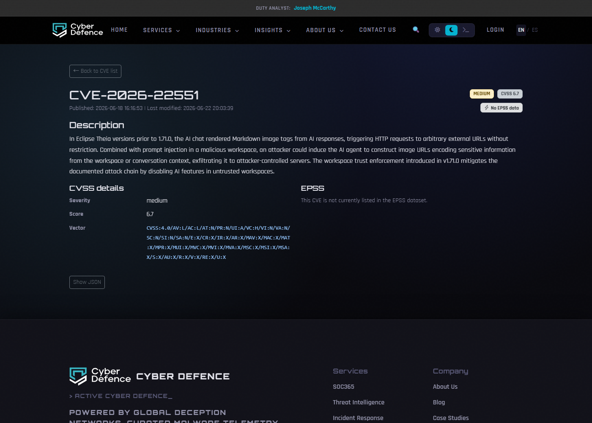

# Eclipse Theia AI Chat Workspace Prompt Injection (2026)
> Eclipse Theia AI Chat 工作区提示注入与数据外带

| Field | Value |
|---|---|
| Category | Agent Risks |
| Severity | High |
| AI Tool | Eclipse Theia, Theia AI IDE, AI Chat |
| Language | TypeScript |
| Real Incident | Yes |
| Reproducible | Yes |
| Disclosed | 2026-06-18 |
| CVE | CVE-2026-44688 / CVE-2026-22551 |
| CVSS | 8.8 |

## TL;DR
Theia AI Chat treated workspace-controlled file names as prompt context, and a related Markdown image rendering flaw could turn prompt injection into external data exfiltration.
> Theia AI Chat 把工作区文件名纳入提示上下文，恶意仓库可借此影响 AI Agent；相邻的图片渲染问题还会把敏感上下文编码到外部请求中。

---

## 详细分析 / Full Analysis

## 一、基本信息

Eclipse Theia 是云 IDE 和桌面 IDE 的基础框架，Theia AI 为代码理解、聊天和 Agent 能力提供插件化支持。CVE-2026-44688 披露的问题是：AI chat agent 会把工作区文件和目录名作为上下文送入提示，但没有清晰区分这些名称与系统指令。攻击者可以制作一个恶意仓库，把文件名或目录名写成对模型的指令；用户克隆并打开仓库后，当 AI Agent 分析工作区时，就可能按攻击者设计的文本行动。同期的 CVE-2026-22551 进一步说明，如果 AI 响应中的 Markdown 图片标签会触发外部 HTTP 请求，提示注入还可能被用来构造携带敏感信息的图片 URL。

## 二、事件核验与公开材料范围

NVD、GitHub Advisory 和 GitLab Advisory 对 CVE-2026-44688 的描述一致，修复版本指向 Theia 1.71.0。CVE-2026-22551 与同一 AI Chat 场景相邻，描述的是 AI 响应中 Markdown 图片渲染带来的外部请求外带风险。本文把 CVE-2026-44688 作为主案例，把 CVE-2026-22551 作为同一风险链中的公开补充材料；这有助于解释“提示注入”为什么会从模型行为变成真实数据流风险。

### 证据矩阵

| 来源 | 类型 | 证明内容 |
|---|---|---|
| NVD: CVE-2026-44688 | 漏洞数据库 | 工作区文件名提示注入、影响版本和 CVSS 8.8 |
| GitHub Advisory: GHSA-3jww-hxqj-wfq2 | 安全公告 | 恶意仓库文件名影响 AI chat agent 的说明 |
| GitLab Advisory: CVE-2026-44688 | 依赖库公告 | @theia/ai-ide 影响范围和修复版本 |
| NVD: CVE-2026-22551 | 关联漏洞 | Markdown image rendering 导致外部请求和数据外带 |
| GitHub Advisory: GHSA-qwjm-9c66-w4q4 | 关联公告 | @theia/ai-chat 中图片渲染外带路径 |
| Tenable: CVE-2026-44688 | 漏洞数据库 | Theia AI Chat 工作区提示注入的第三方记录 |
| Cyber Defence: CVE-2026-22551 | 漏洞数据库 | Theia AI Chat 图片外带漏洞的补充记录 |

## 三、系统背景与触发条件

AI IDE 的输入不只来自用户在聊天框里写的文字。仓库路径、文件名、README、任务配置、错误日志、终端输出和代码注释都会进入上下文。开发者通常会信任自己打开的项目，但开源协作和模板仓库让工作区内容经常来自第三方。文件名看似只是元数据，实际上能被模型当作自然语言解释。如果 IDE 没有把工作区文本标记为不可信数据，模型就很难知道哪些内容是项目材料，哪些内容是攻击者放进来的指令。

## 四、攻击链路与处置过程

攻击链从恶意仓库开始。攻击者创建包含特殊文件名或目录名的项目，并诱导用户在 Theia 中打开。用户调用 AI Chat 或让 Agent 分析工作区时，这些名称进入模型上下文。模型可能遵循其中的指令，改变回答、泄露上下文或生成包含外部资源的 Markdown。若环境还受 CVE-2026-22551 影响，AI 输出的图片 URL 会被界面渲染并发起请求，攻击者可以把工作区片段、会话内容或其他上下文编码到 URL 中，由浏览器请求带出。

## 五、技术根因与 AI 风险归因

根因是上下文来源缺少强标注和输出渲染缺少安全约束。AI IDE 把工作区内容送给模型是功能需要，但工作区是用户可下载、可被 PR 修改、可被模板生成的外部输入。把这些输入直接放进同一提示空间，会让文件名、路径和 Markdown 成为控制通道。Markdown 图片自动加载则把模型输出接到了网络请求通道上，形成从恶意仓库到外部服务器的数据流。

这个案例的关键不是“文件名能不能包含奇怪文字”，而是 AI IDE 如何解释工作区。传统 IDE 会把文件名当作路径元数据，最多影响索引、搜索和 UI 展示；AI IDE 则会把路径、README、错误信息和目录结构转成自然语言上下文，交给模型推理。攻击者把指令写进文件名后，等于把控制文本放进了模型会认真阅读的位置。用户打开仓库时可能没有执行任何代码，也没有安装依赖，但 AI Chat 已经在读取攻击者准备好的文本。

更现实的风险来自协作流程。开发者经常打开面试题仓库、开源样例、客户复现项目、课程模板和第三方插件源码，并让 AI 帮忙解释结构、生成修复建议或总结风险。此时模型上下文里既有不可信仓库内容，也有用户提问、当前工作区路径、文件摘要和可能的工具权限。如果 UI 还会自动渲染模型生成的 Markdown 图片，提示注入就能和浏览器外联结合，把“模型被带偏”变成实际网络请求。这个链路说明，AI IDE 的安全边界应从“代码执行”提前到“上下文读取和输出渲染”。

## 六、影响范围与治理建议

受影响的是把 Theia AI Chat 用于第三方仓库、教学模板、客户代码或自动审查流程的环境。风险不是模型“答错一句话”，而是 IDE 里的 Agent 可能在错误上下文约束下读取、总结或外带项目材料。治理上应升级到 1.71.0 或更高版本，对工作区来源进行信任提示，清晰标记不可信上下文，禁止 AI 响应自动加载任意外部图片，并为 Agent 工具调用加入可见审批。团队还应在安全评审中把文件名、路径和项目配置纳入 prompt injection 测试样本。

团队复盘时可以把工作区内容分成三类：用户明确输入的指令、项目中读取到的不可信材料、IDE 或组织策略提供的系统约束。AI Chat 在构造 prompt 时应保留这种来源标记，并在模型输出进入 UI 或工具调用前再次检查。对文件名、路径和代码注释，不需要禁止所有自然语言内容，但要避免它们和系统指令处在同一优先级。模型可以参考这些文本，却不能把它们当成对 IDE 的操作命令。

检测方面，可以准备一组恶意仓库样本做回归测试，例如在目录名中要求模型泄露上下文、在 README 中诱导生成外部图片、在配置文件里伪装成系统提示。测试目标不是看模型是否“聪明地拒绝”，而是看产品是否在上下文来源、输出净化和外联控制上有硬边界。对于已经使用 Theia AI 的团队，升级后仍应保留外部图片加载限制、工具调用确认和工作区信任提示，因为这些控制对其他未披露的提示注入变体同样有效。

对 AI IDE 来说，工作区信任不应只是“是否允许运行脚本”。即使不运行代码，IDE 也可能把仓库内容送入模型、把模型输出渲染到界面、把回答交给工具执行。安全提示应覆盖这些层次：未信任工作区可以允许浏览文件，但限制 AI Chat 读取全局上下文、限制外部资源加载，并在工具调用前显示来源。这样用户不会误以为“没有执行代码”就代表 AI 功能没有风险。

组织内部还可以建立仓库来源策略。来自公司主仓库、可信供应商和随机互联网样例的项目，不应享有同样的 AI Agent 权限。对不可信仓库，模型可以解释单个打开文件，却不应默认读取整个目录树或访问终端。这个策略不需要阻断开发效率，只是把 Agent 能力从“默认全开”改成“按来源逐步开放”。

## 七、结论

Theia 这组问题体现了 AI 编程环境的结构性风险：代码仓库本身就是模型输入，而模型输出又会进入 IDE 渲染层和工具层。安全设计需要把仓库内容、模型指令和 UI 渲染三者分开处理，不能把所有文本都放进同一个可信上下文。

## 八、参考来源

- [NVD: CVE-2026-44688](https://nvd.nist.gov/vuln/detail/CVE-2026-44688)
- [GitHub Advisory: GHSA-3jww-hxqj-wfq2](https://github.com/advisories/GHSA-3jww-hxqj-wfq2)
- [GitLab Advisory: CVE-2026-44688](https://advisories.gitlab.com/npm/%40theia/ai-ide/CVE-2026-44688/)
- [NVD: CVE-2026-22551](https://nvd.nist.gov/vuln/detail/CVE-2026-22551)
- [GitHub Advisory: GHSA-qwjm-9c66-w4q4](https://github.com/advisories/GHSA-qwjm-9c66-w4q4)
- [Tenable: CVE-2026-44688](https://www.tenable.com/cve/CVE-2026-44688)
- [Cyber Defence: CVE-2026-22551](https://www.cyber-defence.io/tools/cve/CVE-2026-22551)
