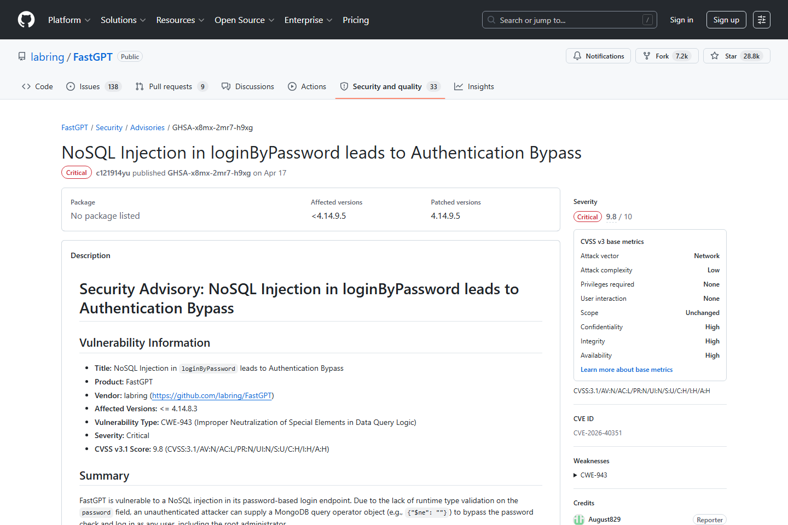
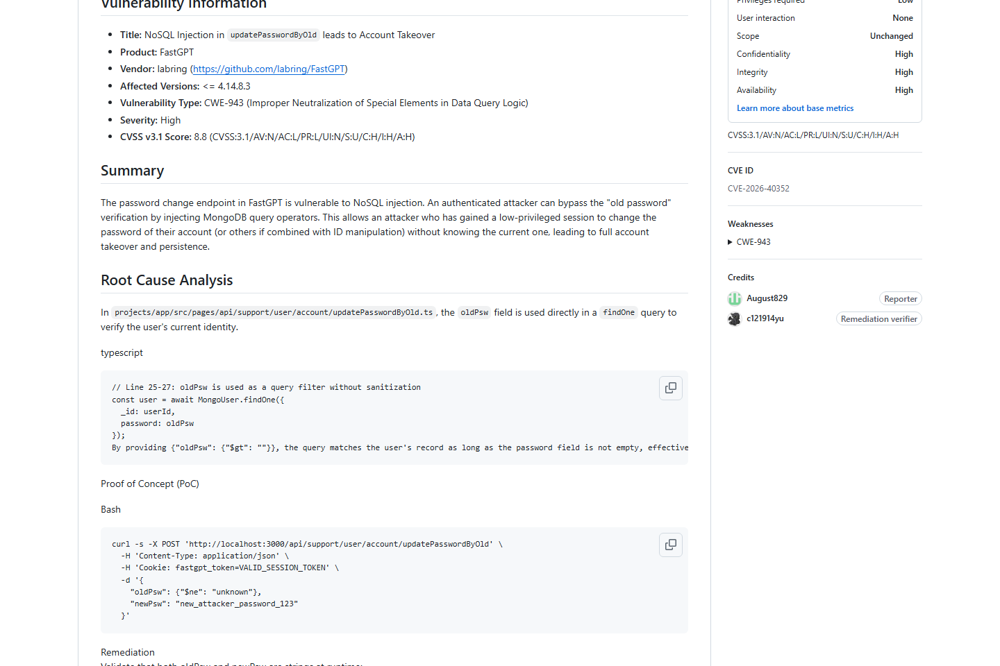
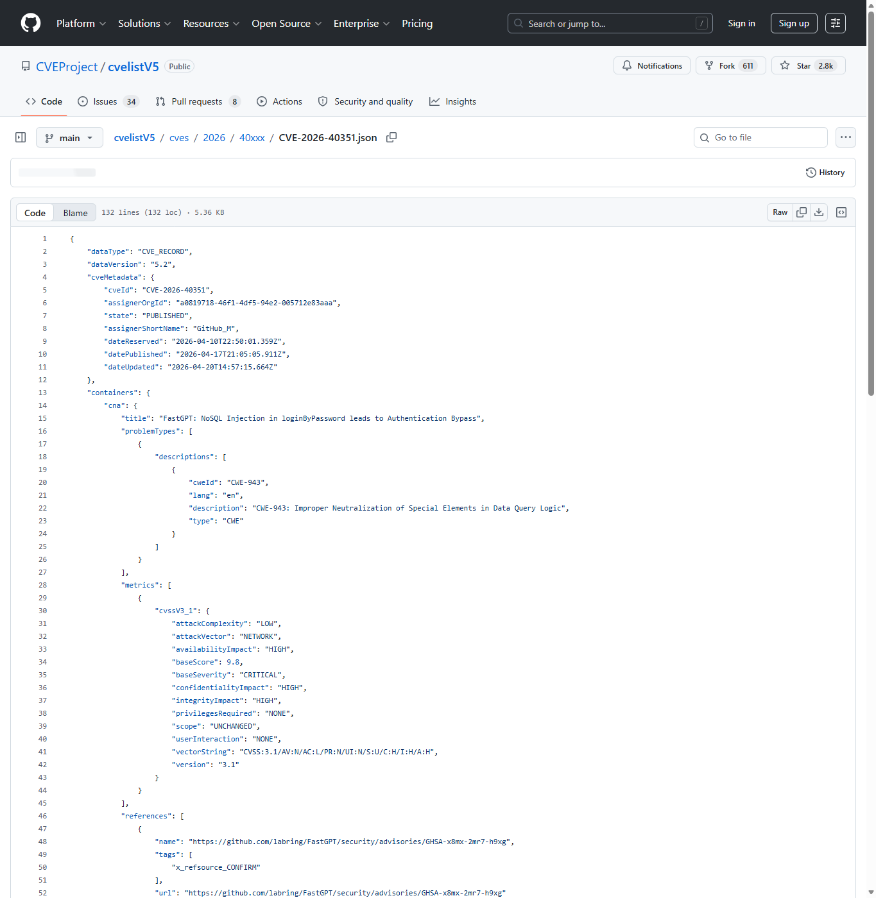
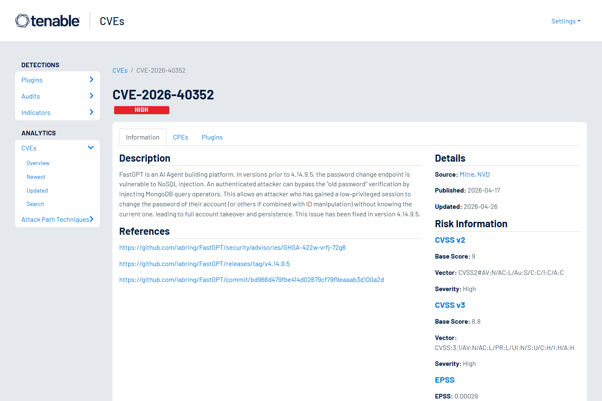
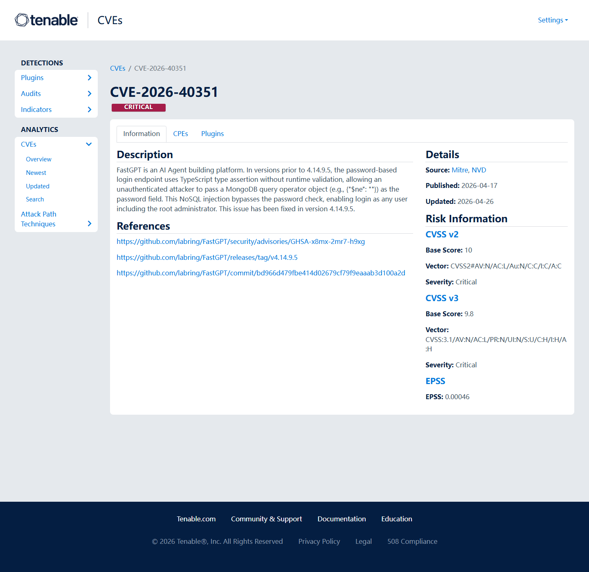
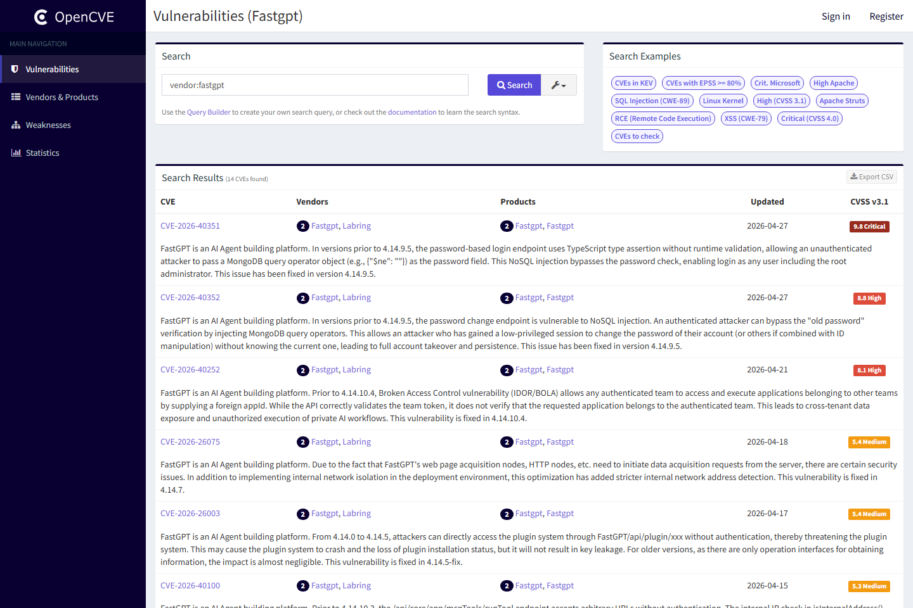

# FastGPT NoSQL Auth Bypass Account Takeover (2026)
> FastGPT NoSQL 注入认证绕过与账号接管

| Field | Value |
|---|---|
| Category | agent-risk |
| Severity | Critical |
| AI Tool | FastGPT, AI Agent building platform, MongoDB-backed account service |
| Language | TypeScript, MongoDB |
| Real Incident | Yes |
| Reproducible | Yes |
| Disclosed | 2026-04-24 |
| CVE | CVE-2026-40351, CVE-2026-40352 |
| CVSS | 9.8 |

## TL;DR
FastGPT accepted MongoDB operators in account flows, enabling auth bypass and takeover.
> FastGPT NoSQL 注入认证绕过与账号接管：未认证攻击者可登录任意用户，低权限用户也可绕过旧密码验证完成持久化接管。

---

## 基本信息

| 项目 | 内容 |
|---|---|
| 案例时间 | 2026-04-24 |
| 事件对象 | FastGPT 4.14.9.5 之前版本 |
| 事件类型 | 登录与改密流程中的 NoSQL 注入，导致认证绕过和账号接管 |
| 攻击入口 | 攻击者在密码字段或旧密码校验字段传入 MongoDB 查询操作符对象。 |
| 主要影响 | 未认证攻击者可登录任意用户，低权限用户也可绕过旧密码验证完成持久化接管。 |
| 修复方向 | 升级到修复版本，实施运行时 schema 校验，并为账号关键路径加入多因素与异常检测。 |

## 摘要

FastGPT 是 AI Agent 构建平台，CVE-2026-40351 和 CVE-2026-40352 均落在账户认证边界。公开 Advisory 描述了两个相互关联的问题：密码登录端点接受 MongoDB 查询操作符对象，可绕过密码校验；旧密码修改端点同样存在 NoSQL 注入，可让已登录攻击者绕过原密码验证并完成账号接管。
这两个漏洞组合起来，覆盖了“进入账号”和“保持账号控制”两个阶段。前者让未认证攻击者有机会直接冒充目标用户，后者让已经进入系统的低权限会话进一步改写凭据。对于 Agent 平台，账号不只是个人资料入口，还承载知识库、工作流、工具配置和模型供应商连接。

## 一、公开材料概况

FastGPT 的 GitHub Security Advisory、CVEProject cvelistV5、Tenable、Tenable 和 OpenCVE 类数据库共同确认了影响版本、修复版本、攻击方式和 CVSS。公开材料主要围绕登录与改密流程中的账户边界缺陷展开，没有展示特定企业被入侵的时间线。
两个 GitHub Advisory 分别对应登录和旧密码校验路径，说明这不是单一输入点的偶发问题，而是账户关键流程对运行时类型缺少统一约束。CVEProject cvelistV5 与复核数据库给出的高评分，也反映了认证绕过在 AI 平台控制面中的放大效应。

| 来源 | 类型 | 证明内容 |
|---|---|---|
| GitHub Advisory: FastGPT loginByPassword NoSQL Injection | 主证据 | 确认登录绕过漏洞和修复版本。 |
| GitHub Advisory: FastGPT updatePasswordByOld NoSQL Injection | 主证据 | 确认旧密码校验绕过。 |
| CVEProject cvelistV5: CVE-2026-40351 | 主证据 | 确认关键 CVE 和 CVSS 9.8。 |
| Tenable: CVE-2026-40352 | 主证据 | 确认改密路径 CVE。 |
| Tenable: CVE-2026-40351 | 复核证据 | 复核认证绕过影响。 |
| OpenCVE: FastGPT CVE listing | 复核证据 | 说明 TypeScript 类型断言与 MongoDB 操作符注入。 |

## 二、系统背景与触发条件

Agent 平台账户通常不只是登录身份，它还绑定知识库、模型供应商密钥、插件、工作流和团队空间。FastGPT 的认证缺陷影响面因此大于普通内容管理系统账号，攻击者接管账号后可能进一步访问 Agent 配置、数据集或外部工具凭据。
在团队部署中，一个管理员账号可能拥有创建 Agent、配置数据源、发布应用和管理 API key 的能力。普通成员账号也可能拥有特定知识库或工作流的编辑权限。攻击者一旦绕过认证，就可以从账号权限出发，寻找更高价值的 Agent、共享空间和外部集成。

## 三、攻击链路与处置过程

CVE-2026-40351 的攻击路径从登录接口开始。攻击者把密码字段从字符串变成 MongoDB 查询操作符对象，例如使用非空匹配语义，使后端查询返回目标用户并绕过密码比较。CVE-2026-40352 则作用于改密流程，低权限会话可以绕过旧密码验证，形成持久化控制。
处置时应同时排查登录成功日志和密码变更日志。若攻击者曾利用第一条路径登录，再利用第二条路径改密，单纯恢复密码可能遗漏 API key、会话 token、共享 Agent 配置和下游工具凭据。对多租户部署，还要确认攻击是否跨越团队空间或项目边界。

## 四、技术根因分析

根因是 TypeScript 静态类型被误当作运行时安全边界。API 接收到 JSON 后，字段实际类型可能是对象而非字符串；如果没有运行时 schema 校验，MongoDB 驱动会按查询操作符解释对象。账号系统中的任何查询构造都需要把用户输入当作数据，而不能让其进入查询语法层。
这类问题在 Node.js 和 MongoDB 组合中尤其常见，因为 JSON 天然允许对象嵌套，攻击者可以把原本应为字符串的字段替换为查询表达式。修复不能只在某个接口手写判断，而应建立统一请求 schema、拒绝未知字段、禁止对象型认证字段，并在数据库访问层使用显式等值比较。

## 五、AI 参与方式与风险归因

AI 参与方式体现在受影响产品是 Agent 构建平台，账号接管会直接影响 AI 工作流、知识库和工具配置。漏洞技术形态是 NoSQL 注入，但风险落点是 Agent 平台控制面和凭据面。归因应覆盖账号 API、数据库查询构造和平台密钥管理。
因此，修复后的验证不应只看登录是否成功拦截，还要检查被接管账号能触达哪些 AI 资产。Agent 发布状态、知识库权限、模型密钥、外部工具授权和团队成员关系都可能成为后续攻击目标。账号安全和 Agent 运行安全在这里是同一个问题的两面。

## 六、与团队技术报告风险框架的关系

团队框架强调 AI 平台供应链不只包含模型和代码，也包含平台账号、插件和工作流配置。FastGPT 案例说明，一条传统认证漏洞可以在 AI Agent 平台中转化为工作流篡改、知识库访问和第三方密钥滥用风险。

## 七、影响范围与治理建议

CVE-2026-40351 的 CVSS 9.8 表示攻击者不需要身份即可绕过登录。若目标平台连接了生产知识库或企业模型网关，账号接管后的损害可能包括数据读取、Agent 行为修改、插件凭据窃取和内部自动化任务滥用。

治理上应为所有 AI 平台账户启用 MFA、IP 访问策略和管理员操作审计。开发层面必须对认证字段做运行时类型校验，禁止对象型输入进入查询构造；数据库查询应使用显式字段比较和安全 ORM 约束。平台还应提供密钥轮换和异常 Agent 配置变更告警。
防守上还应把“账号异常”与“Agent 异常”关联起来。例如登录地变化后立即修改工作流、导出知识库、创建新 API key 或更换模型连接器，都应触发更高等级告警。对于自托管 FastGPT，升级后建议强制全员重新登录，并轮换高权限用户和系统集成使用的密钥。

## 八、结论

FastGPT 案例说明，AI Agent 平台的账号系统就是生产执行系统的入口。传统 NoSQL 注入在这里会放大为平台控制面失守，修复不能止于一处查询语句，还要覆盖账号、密钥和工作流治理。
它也提醒开发团队，TypeScript 类型、前端表单和接口文档都不能替代服务端运行时验证。凡是进入认证、授权、密钥和 Agent 配置路径的字段，都应按安全关键输入处理。对使用方而言，账号接管后的排查范围必须覆盖 AI 资产，而不是停留在用户表本身。

## 参考来源

1. [GitHub Advisory: FastGPT loginByPassword NoSQL Injection](https://github.com/labring/FastGPT/security/advisories/GHSA-x8mx-2mr7-h9xg)
2. [GitHub Advisory: FastGPT updatePasswordByOld NoSQL Injection](https://github.com/labring/FastGPT/security/advisories/GHSA-422w-vrfj-72g6)
3. [CVEProject cvelistV5: CVE-2026-40351](https://github.com/CVEProject/cvelistV5/blob/main/cves/2026/40xxx/CVE-2026-40351.json)
4. [Tenable: CVE-2026-40352](https://www.tenable.com/cve/CVE-2026-40352)
5. [Tenable: CVE-2026-40351](https://www.tenable.com/cve/CVE-2026-40351)
6. [OpenCVE: FastGPT CVE listing](https://app.opencve.io/cve/?vendor=fastgpt)
