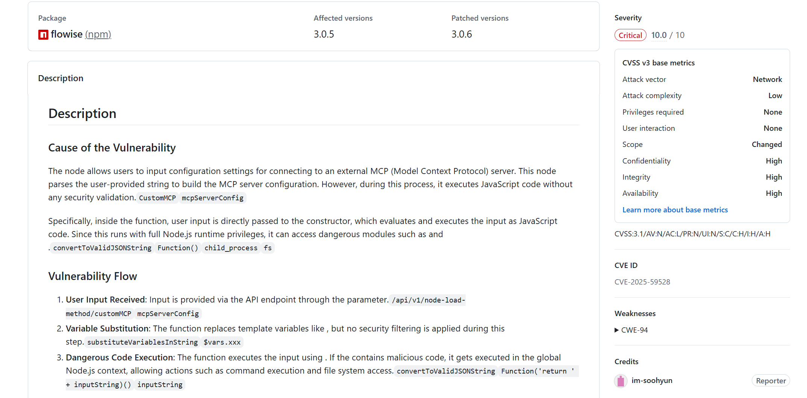
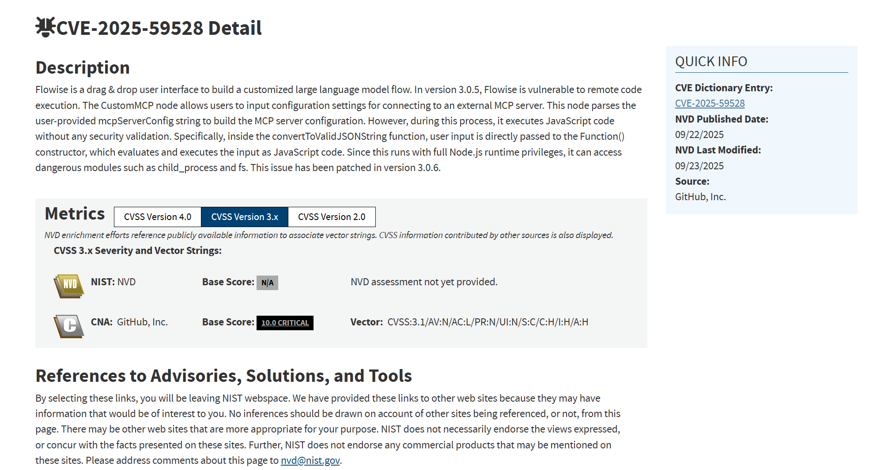
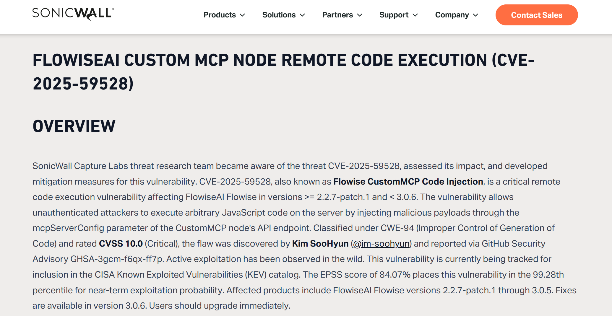
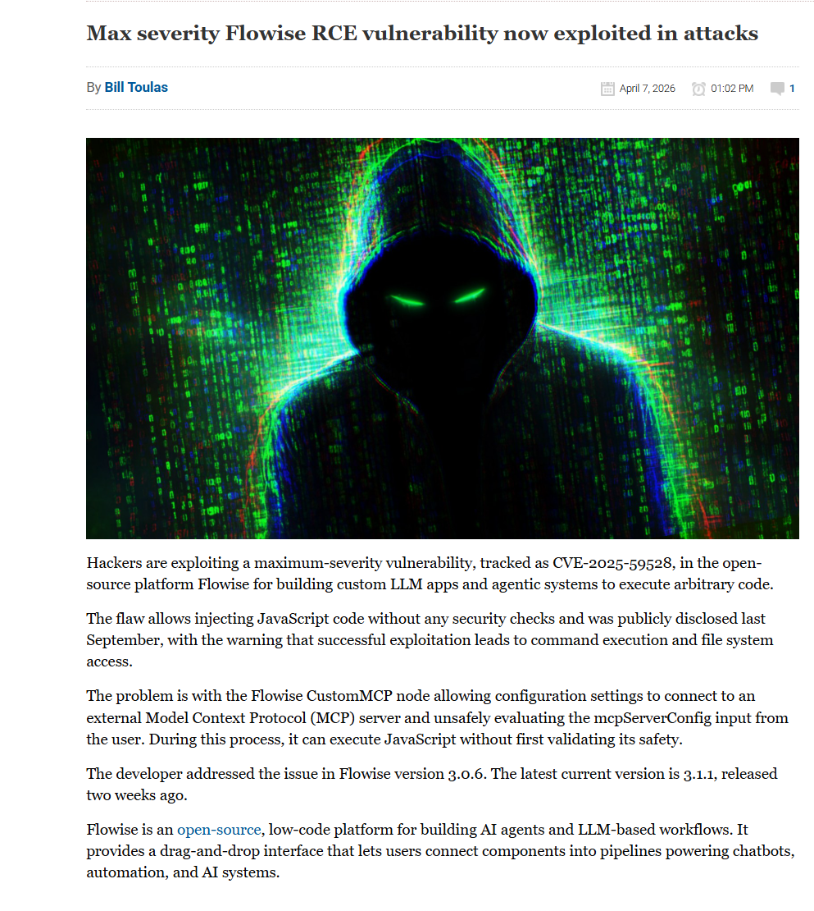
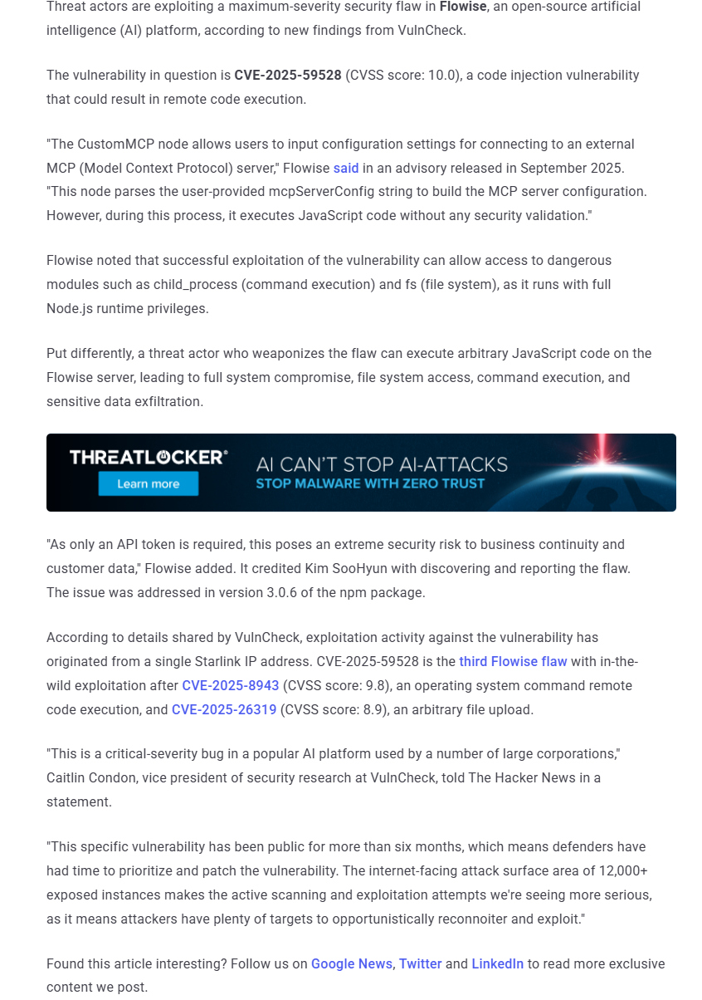
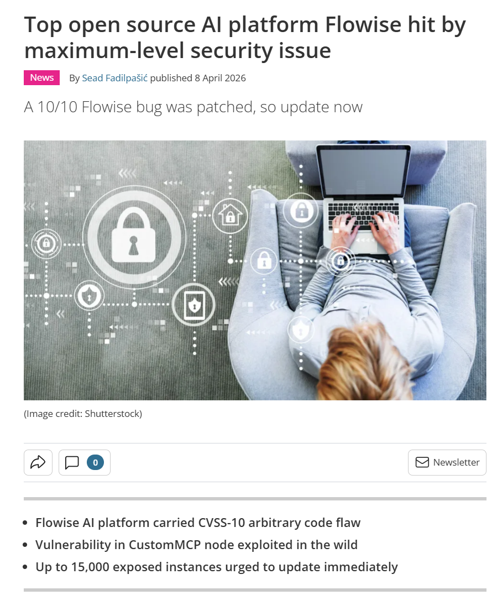

# Flowise CustomMCP RCE Active Exploitation (2026)

> Flowise CustomMCP 节点远程代码执行在野利用事件

| Field         | Value                                      |
| ------------- | ------------------------------------------ |
| Category      | Agent Risks                                |
| Severity      | 🔴 Critical                                 |
| AI Tool       | Flowise, CustomMCP, Model Context Protocol |
| Language      | JavaScript, TypeScript, Node.js            |
| Real Incident | ✅                                          |
| Reproducible  | ✅                                          |
| Disclosed     | 2026-04-07                                 |
| CVE           | CVE-2025-59528                             |
| CVSS          | 10.0                                       |

## TL;DR

Flowise CustomMCP node executed user-supplied MCP configuration as JavaScript, enabling RCE later observed in the wild.

> Flowise 的 CustomMCP 节点将用户提供的 MCP 配置字符串作为 JavaScript 执行，形成满分级远程代码执行风险，并在 2026 年 4 月被观测到在野利用。

------

## 详细分析 / Full Analysis

# Flowise CustomMCP 节点远程代码执行在野利用事件分析：AI Agent 工作流平台中的 MCP 配置执行风险

## 基本信息

案例时间：2026 年 4 月在野利用披露
事件对象：Flowise AI Agent 与 LLM 工作流构建平台
涉及组件：CustomMCP 节点、`mcpServerConfig` 配置解析逻辑
漏洞编号：CVE-2025-59528
漏洞类型：远程代码执行、代码注入、MCP 配置执行风险
影响版本：Flowise 3.0.5；部分安全厂商将影响范围扩展描述为 2.2.7-patch.1 至 3.0.5
修复版本：Flowise 3.0.6 及之后版本
风险归类：AI Agent 工作流平台风险、MCP 工具配置风险、无校验代码执行、凭据外泄与系统接管风险
案例定位：本案例可作为团队报告中 AI 代码安全风险从代码生成扩展到 Agent 工作流平台、MCP 工具连接、低代码编排和运行时权限治理的补充案例。

## 摘要

Flowise 是一个开源低代码平台，用于构建 AI Agent、LLM 工作流、聊天机器人和自动化应用。CVE-2025-59528 位于 Flowise 的 CustomMCP 节点。该节点允许用户输入 MCP server 配置字符串，后端在将 `mcpServerConfig` 转换为配置对象时，把用户输入传入 JavaScript `Function()` 构造器执行。GitHub 官方安全公告将其标记为 Critical，影响版本为 3.0.5，修复版本为 3.0.6。([GitHub](https://github.com/FlowiseAI/Flowise/security/advisories/GHSA-3gcm-f6qx-ff7p))

NVD 对该漏洞的描述与官方公告一致，明确指出 CustomMCP 节点在解析用户提供的 MCP server 配置时执行 JavaScript，且执行环境具有完整 Node.js 运行时权限，可访问 `child_process`、`fs` 等危险模块。NVD 记录的 CVSS 3.1 向量为 `AV:N/AC:L/PR:N/UI:N/S:C/C:H/I:H/A:H`，弱点类型包含 CWE-94。([NVD](https://nvd.nist.gov/vuln/detail/CVE-2025-59528))

2026 年 4 月，VulnCheck 的 Canary network 观测到 CVE-2025-59528 的首次在野利用。BleepingComputer 报道称，攻击活动来自单个 Starlink IP，研究人员同时警告当时互联网上约有 12,000 至 15,000 个 Flowise 实例暴露。The Hacker News 也报道称，该漏洞已被威胁行为者利用，攻击者可执行任意 JavaScript，进而实现系统接管、文件访问、命令执行和敏感数据外泄。([BleepingComputer](https://www.bleepingcomputer.com/news/security/max-severity-flowise-rce-vulnerability-now-exploited-in-attacks/))

该案例与 AI 代码安全高度相关。Flowise 并不是普通 Web 应用，而是面向 AI Agent 与 LLM 工作流的编排平台。CustomMCP 节点用于连接外部 Model Context Protocol server，本应承担工具扩展与集成能力；漏洞使 MCP 配置从数据字段变成代码执行入口。对于 AI Agent 生态而言，这类风险说明工作流节点、MCP 配置、低代码组件和工具连接配置都应被纳入代码执行治理，而不能被当作普通 UI 参数处理。

## 一、事件核验与证据边界

本案例由多类来源交叉验证。GitHub 官方安全公告给出漏洞成因、影响版本、修复版本和触发路径；NVD 记录漏洞描述、CVSS 向量、CWE 分类和参考链接；BleepingComputer、The Hacker News、TechRadar 等媒体复核了 2026 年 4 月的在野利用；SonicWall 给出更完整的技术链路、利用条件、修复方式和防护建议。([GitHub](https://github.com/FlowiseAI/Flowise/security/advisories/GHSA-3gcm-f6qx-ff7p))

官方安全公告指出，CustomMCP 节点会接收用户提供的 `mcpServerConfig` 字符串，用于构建 MCP server 配置。问题出现在配置转换过程中，用户输入被直接传入 `Function()` 构造器并作为 JavaScript 执行。由于该代码运行在完整 Node.js 环境中，攻击者可以访问命令执行和文件系统相关模块。([GitHub](https://github.com/FlowiseAI/Flowise/security/advisories/GHSA-3gcm-f6qx-ff7p))

BleepingComputer 的报道确认了在野利用状态。报道写明，VulnCheck 通过 Canary network 检测到针对 CVE-2025-59528 的首次利用，攻击活动当时看起来来自单个 Starlink IP。报道还指出，Flowise 用于构建自定义 LLM 应用和 agentic systems，公开暴露实例数量估计在 12,000 至 15,000 之间。([BleepingComputer](https://www.bleepingcomputer.com/news/security/max-severity-flowise-rce-vulnerability-now-exploited-in-attacks/))

该漏洞最早披露于 2025 年 9 月，修复版本 3.0.6 已发布。本案例关注的是 2026 年 4 月出现的主动利用和暴露面风险。公开资料没有给出某个具体企业因该漏洞造成固定金额损失，也没有披露某个命名受害组织的完整数据泄露规模。报告中应将社会影响界定为已观测在野利用、可导致服务器接管与敏感数据外泄、公开暴露实例数量较大，而不是写成已确认造成某个固定经济损失。

## 二、系统背景与触发条件

Flowise 面向开发者、原型团队和企业用户，提供拖拽式方式构建 LLM 应用、AI Agent、客服机器人、知识库问答和自动化工作流。BleepingComputer 描述其为开源低代码平台，支持用户把不同组件连接成管线，用于驱动 chatbots、automation 和 AI systems。([BleepingComputer](https://www.bleepingcomputer.com/news/security/max-severity-flowise-rce-vulnerability-now-exploited-in-attacks/))

CustomMCP 节点用于接入外部 MCP server。MCP 的目标是让 AI 系统连接外部工具、数据源和服务。此类节点在 Agent 工作流中具有较高权限价值，因为它们常常连接外部工具、数据库、文件系统、API 和内部服务。Flowise 的漏洞点在于，平台没有把 MCP 配置严格限定为数据结构，而是通过不安全的 JavaScript 解析方式处理用户输入，导致配置内容具备代码执行能力。([GitHub](https://github.com/FlowiseAI/Flowise/security/advisories/GHSA-3gcm-f6qx-ff7p))

SonicWall 的技术分析给出更细的触发条件。其说明漏洞影响 FlowiseAI Flowise 2.2.7-patch.1 至 3.0.5，攻击者可通过 CustomMCP 节点 API 端点中的 `mcpServerConfig` 参数注入恶意 JavaScript。若目标实例未启用认证，攻击无需凭据；若启用认证，有效 API token 即可触发相关路径。([SonicWall](https://www.sonicwall.com/blog/flowiseai-custom-mcp-node-remote-code-execution-))

## 三、漏洞链路与在野利用

技术链路可以概括为配置输入进入 CustomMCP 节点，后端在转换配置字符串时调用不安全执行函数，攻击者提供的内容被作为 JavaScript 运行。GitHub 官方公告提到，`convertToValidJSONString` 函数会将用户输入传入 `Function()` 构造器。NVD 也记录了相同描述，并说明该执行过程可访问危险模块。([GitHub](https://github.com/FlowiseAI/Flowise/security/advisories/GHSA-3gcm-f6qx-ff7p))

The Hacker News 报道指出，漏洞被利用后，攻击者可以在 Flowise 服务器上执行任意 JavaScript，导致完整系统 compromise、文件系统访问、命令执行和敏感数据外泄。报道还引用 Flowise 的说明，称只需要 API token 的条件会对业务连续性和客户数据构成极端安全风险。([The Hacker News](https://thehackernews.com/2026/04/flowise-ai-agent-builder-under-active.html))

SonicWall 的分析将攻击路径扩展到运行时影响。其列出的后利用活动包括主机侦察、读取环境变量中的 API key、数据库密码和云凭据、建立反向 shell、利用被盗凭据横向移动，以及访问 AI model 配置、训练数据和会话日志。([SonicWall](https://www.sonicwall.com/blog/flowiseai-custom-mcp-node-remote-code-execution-))

2026 年 4 月的在野利用使该漏洞从静态漏洞记录变成真实运行风险。BleepingComputer 报道称，VulnCheck Canary network 已经检测到首次利用，暴露在公网的 Flowise 实例规模达到 12,000 至 15,000。The Hacker News 也将其描述为 active exploitation，并强调这是 Flowise 继 CVE-2025-8943 和 CVE-2025-26319 后又一个被在野利用的严重漏洞。([BleepingComputer](https://www.bleepingcomputer.com/news/security/max-severity-flowise-rce-vulnerability-now-exploited-in-attacks/))

## 四、AI 参与证据与责任边界

该案例的 AI 关联不来自 AI 生成代码署名，而来自系统对象本身。Flowise 是面向 LLM 应用和 AI Agent 的工作流平台，漏洞位于用于接入 MCP server 的 CustomMCP 节点。The Hacker News、BleepingComputer 和 SonicWall 均将 Flowise 描述为 AI 平台、LLM workflow / agent builder 或 AI/LLM application orchestration platform。([BleepingComputer](https://www.bleepingcomputer.com/news/security/max-severity-flowise-rce-vulnerability-now-exploited-in-attacks/))

该漏洞不为某个大模型写出了脆弱代码。公开证据显示，它是 Flowise CustomMCP 节点中的配置解析和代码执行缺陷。AI 安全相关性在于：一个服务 AI Agent 和 LLM 工作流的平台，将用户可控的 MCP 配置送入完整 Node.js 执行环境，导致 Agent 工具连接配置成为 RCE 入口。

项目方已经发布 GitHub Security Advisory 并给出 3.0.6 修复版本；NVD 记录了漏洞和 CVSS 信息；多家安全媒体报道了 2026 年在野利用。报告应把根因归结为 CustomMCP 配置解析缺陷、运行时缺少安全校验、公开暴露实例升级滞后和 AI 工作流平台权限治理不足，而不是泛化为 AI 模型失控。

## 五、与团队技术报告风险框架的关系

团队报告关注 AI 代码生成从局部补全扩展到开发全生命周期后的风险外溢。本案例可以补充 Agent 工作流平台这一层。Flowise 不是单纯代码编辑器，也不是普通 Web 应用，而是把模型、工具、MCP server、数据库、API 和业务流程组合成可执行工作流的运行底座。平台中的节点配置一旦变成代码执行入口，风险会直接进入企业 AI 应用的执行环境。

该事件与团队报告中关于软件供应链边界重塑的判断一致。传统供应链风险多集中在依赖包、CI/CD、插件和镜像。Flowise 的风险点落在 AI 工作流节点和 MCP 工具配置上。配置字段不再只是静态数据，而可能成为 Agent 工具链中的执行载荷。对企业而言，Flowise 节点、MCP 配置、API token、模型连接和工作流运行日志都应进入供应链和资产治理范围。

该事件也补充了人机协同治理的现实场景。低代码 AI 平台降低了开发门槛，使业务团队、原型团队和非专业开发者可以快速搭建 AI 应用。可运行的工作流并不等于安全的工作流。Flowise 的案例说明，AI 工作流平台需要在发布前强制验证节点权限、配置解析路径、认证状态和网络暴露面。依赖用户主动理解 CustomMCP、MCP server、Node.js 权限和 `Function()` 语义，并不能形成稳定安全边界。

## 六、影响范围与社会后果

Flowise 的社会影响来自三类因素叠加。平台本身被用于构建 AI Agent、聊天机器人、企业知识库助手和自动化工作流；漏洞可导致远程代码执行和服务器接管；公开暴露实例数量较大，且已有在野利用观测。BleepingComputer 提到，Flowise 被开发者、非技术 no-code 用户以及运营客服聊天机器人和知识助手的企业采用。([BleepingComputer](https://www.bleepingcomputer.com/news/security/max-severity-flowise-rce-vulnerability-now-exploited-in-attacks/))

攻击者取得 Flowise 服务器代码执行后，影响不止单台服务器。SonicWall 指出，后利用阶段可涉及环境变量读取、API key 和数据库密码收集、反向 shell、横向移动、AI 模型配置访问、训练数据访问和会话日志访问。对部署了模型 API、向量数据库、企业知识库和客户支持工作流的组织而言，该漏洞可能造成凭据外泄、客户数据暴露、内部知识库泄露和 AI 服务滥用。([SonicWall](https://www.sonicwall.com/blog/flowiseai-custom-mcp-node-remote-code-execution-))

该漏洞的修复窗口也具有社会风险。它在 2025 年已披露并修复，但 2026 年仍出现主动利用。The Hacker News 引述 VulnCheck 观点指出，该漏洞公开已有超过六个月，防守方有时间优先修补；但 12,000+ 暴露实例使扫描和利用活动更严重，因为攻击者拥有大量可侦察和机会性利用目标。([The Hacker News](https://thehackernews.com/2026/04/flowise-ai-agent-builder-under-active.html))

## 七、治理建议

Flowise 用户应升级到 3.0.6 或更高版本。GitHub 安全公告和 NVD 均确认 3.0.6 为修复版本；SonicWall 也建议升级到 3.0.6 或之后版本。已经公网暴露的实例应按已受攻击风险处理，检查访问日志、异常 POST 请求、外联连接、进程创建和环境变量读取痕迹。([GitHub](https://github.com/FlowiseAI/Flowise/security/advisories/GHSA-3gcm-f6qx-ff7p))

CustomMCP 节点和类似工具连接组件不应直接暴露在未认证 API 面。Flowise 支持可选 API key 认证，但安全治理不应止于开启 token。面向公网的 AI 工作流平台应放在访问网关、VPN、零信任代理或受限 IP 策略之后，管理端点、节点加载端点和工具配置端点应与普通用户交互端点隔离。

MCP server 配置需要按可执行内容治理。`mcpServerConfig` 这类字段看似是连接配置，实际可影响工具初始化、命令执行和外部资源访问。企业应对 MCP 配置来源、配置变更人、配置生效范围和运行时权限建立审计。低代码节点、工具连接器、插件和工作流模板不应默认获得文件系统、命令执行和云凭据访问能力。

AI 工作流平台应隔离敏感凭据。模型 API key、数据库密码、云服务 token 和内部知识库访问凭据不应以可被工作流节点任意读取的形式存在。运行 Flowise 的主机应采用最小权限服务账号、出站网络限制、只读文件系统、密钥托管服务和运行时检测。SonicWall 明确建议检查含有 `process.mainModule`、`child_process`、`require`、`execSync` 或 `Function` 等关键字的异常请求，并对外联和反向 shell 行为建立监控。([SonicWall](https://www.sonicwall.com/blog/flowiseai-custom-mcp-node-remote-code-execution-))

团队报告中的评测思路可扩展到 AI Agent 平台：评测不只看模型是否生成安全代码，还要看工作流平台是否会把配置当代码执行，MCP 工具是否越权访问主机资源，低代码节点是否能读取环境变量，公开 API 是否能触发高危节点加载。对 Flowise 这类平台，安全评测应覆盖节点执行、工具连接、凭据隔离、外联控制和公网暴露面。

## 八、结论

Flowise CustomMCP RCE 在野利用事件是 AI Agent 工作流平台安全风险的代表性案例。漏洞根因位于 CustomMCP 节点对 `mcpServerConfig` 的处理逻辑，用户输入被传入 JavaScript `Function()` 构造器执行，并在完整 Node.js 权限下访问命令执行和文件系统模块。官方公告、NVD 和多家安全厂商均确认该漏洞严重性，修复版本为 3.0.6。([GitHub](https://github.com/FlowiseAI/Flowise/security/advisories/GHSA-3gcm-f6qx-ff7p))

2026 年 4 月的在野利用使该漏洞具备现实案例价值。BleepingComputer、The Hacker News 和 TechRadar 均报道了 VulnCheck 对攻击活动的观测，公开暴露实例约 12,000 至 15,000，攻击活动至少来自单个 Starlink IP，并且 Flowise 还存在其他已被在野利用的高危漏洞。([BleepingComputer](https://www.bleepingcomputer.com/news/security/max-severity-flowise-rce-vulnerability-now-exploited-in-attacks/))

本案例对团队报告的补充价值在于，它把 AI 代码安全问题从代码生成阶段推进到 AI 工作流运行时。Flowise 的节点配置、MCP 工具连接和低代码工作流并不是普通配置，它们直接连接模型、文件系统、数据库、API 和企业知识库。此类平台一旦缺少认证、输入校验和运行时隔离，攻击者获得的不只是 Web 应用权限，而是 AI 应用基础设施中的执行能力和凭据访问能力。

## 参考来源

1. GitHub Security Advisory，RCE in FlowiseAI/Flowise。该来源用于核验漏洞成因、影响版本、修复版本和 CustomMCP 节点对 `mcpServerConfig` 的不安全执行。([GitHub](https://github.com/FlowiseAI/Flowise/security/advisories/GHSA-3gcm-f6qx-ff7p))
2. NVD，CVE-2025-59528。该来源用于核验漏洞描述、CVSS 向量、CWE-94 和修复版本。([NVD](https://nvd.nist.gov/vuln/detail/CVE-2025-59528))
3. BleepingComputer，Max severity Flowise RCE vulnerability now exploited in attacks。该来源用于核验 2026 年在野利用、VulnCheck Canary network 观测、Starlink IP 和 12,000 至 15,000 个暴露实例。([BleepingComputer](https://www.bleepingcomputer.com/news/security/max-severity-flowise-rce-vulnerability-now-exploited-in-attacks/))
4. The Hacker News，Flowise AI Agent Builder Under Active CVSS 10.0 RCE Exploitation。该来源用于核验 CVSS 10.0、系统接管、敏感数据外泄、12,000+ 暴露实例和第三个 Flowise 在野利用漏洞的背景。([The Hacker News](https://thehackernews.com/2026/04/flowise-ai-agent-builder-under-active.html))
5. SonicWall，FlowiseAI Custom MCP Node Remote Code Execution。该来源用于核验技术链路、受影响版本范围、利用条件、后利用活动和缓解建议。([SonicWall](https://www.sonicwall.com/blog/flowiseai-custom-mcp-node-remote-code-execution-))
6. TechRadar，Top open source AI platform Flowise hit by maximum-level security issue。该来源用于补充 Flowise 平台背景、公开暴露实例规模和升级建议。([TechRadar](https://www.techradar.com/pro/security/top-open-source-ai-platform-flowise-hit-by-maximum-level-security-issue?utm_source=chatgpt.com))