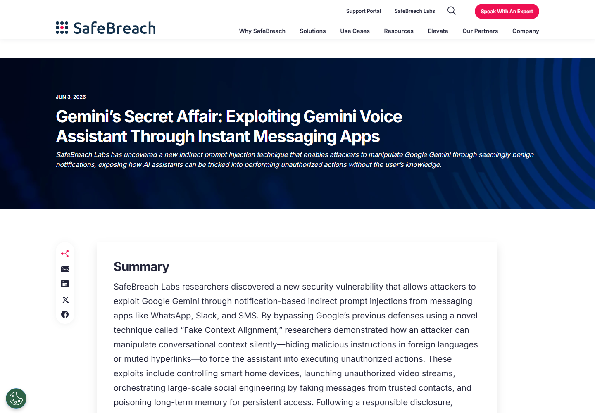
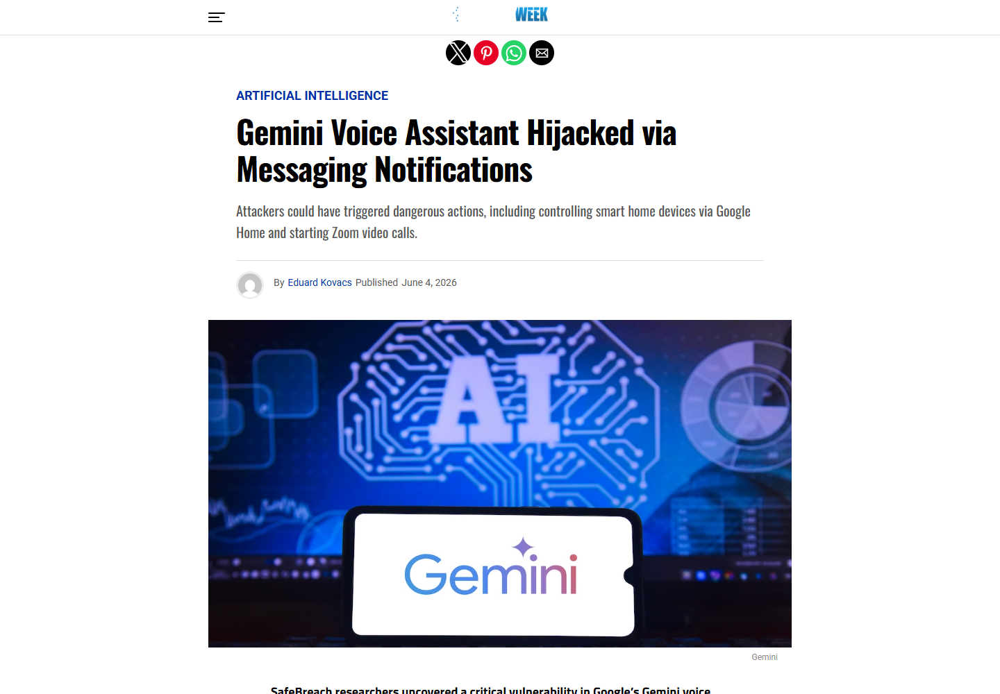
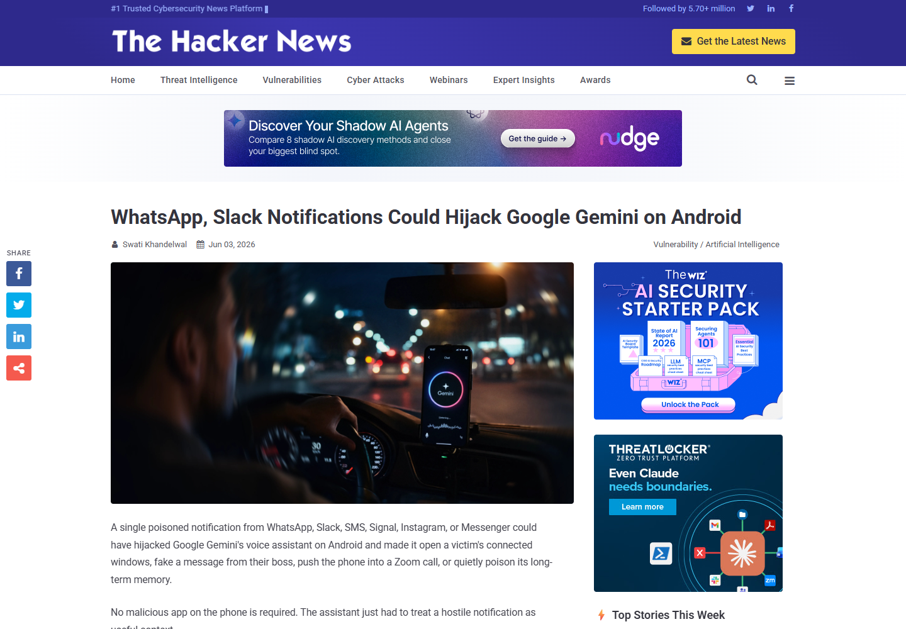
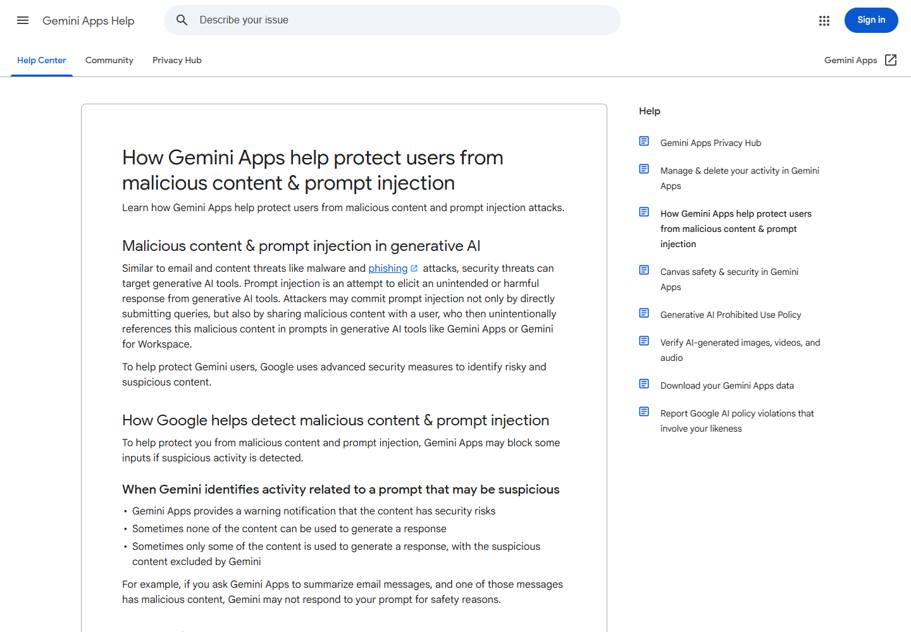
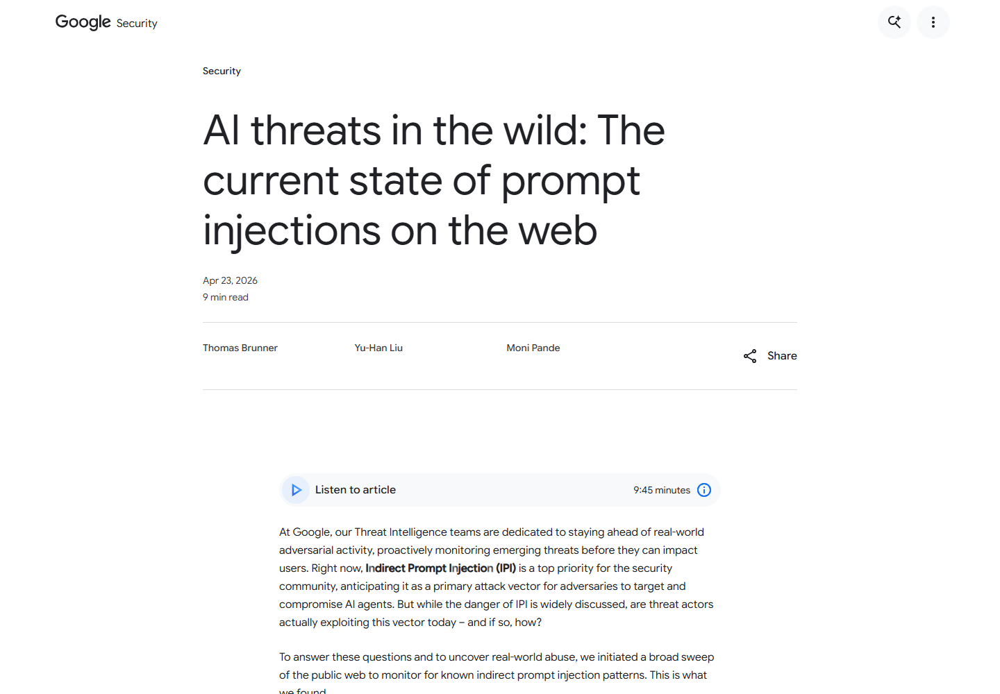

# Google Gemini Android Notification Prompt Injection (2026)
> Google Gemini Android 消息通知间接提示注入漏洞

| Field | Value |
|---|---|
| Category | agent-risk |
| Severity | high |
| AI Tool | Google Gemini for Android, Gemini voice assistant |
| Language | Android / LLM agent / voice interface |
| Real Incident | Yes |
| Reproducible | Yes |
| Disclosed | 2026-06-03 |

## TL;DR
SafeBreach Labs 发现，攻击者可以把间接提示注入放进 WhatsApp、Slack、Signal、SMS 等消息通知。当 Android 用户让 Gemini 朗读通知时，恶意文本进入智能体上下文。研究人员进一步设计“Fake Context Alignment”，让屏幕上的隐藏问题、语音播报和用户的一句“是”产生不同含义，从而绕过延迟工具调用的确认机制。实验演示了伪造可信联系人消息、控制 Google Home 设备、启动 Zoom 视频、打开应用链接和污染长期记忆。Google 在披露后更新了服务端内容分类器。

---

## 详细分析 / Full Analysis

## 一、事件概况

Gemini 在 Android 上可以通过 Utilities 等连接能力读取通知、调用应用和控制部分设备。用户通常只需要说“读一下我的通知”，助手就会把通知队列转换成对话上下文，再用语音概括内容。便利性也带来新的输入边界：发送消息的人不需要安装恶意应用，也不需要诱导用户点击链接，只要通知被 Gemini 读取，外部文本就进入了模型决策过程。

SafeBreach 在 2025 年 8 月把问题报告给 Google。Google 于同年 11 月中旬更新内容分类器，研究团队在 2026 年 6 月公开完整技术细节。披露展示的是受控测试，不是已经确认的大规模在野攻击。修复由 Google 在服务端部署，用户端不需要单独安装补丁包。

这项研究延续了早先利用日历邀请攻击 Gemini 的工作，但入口和绕过方式已经改变。此次攻击利用即时通信通知，并针对 Google 为“延迟工具调用”增加的确认检查设计了新的上下文错位方法，因而不能简单视作旧案例换了一个消息来源。

## 二、来源与事实核验

SafeBreach 的原始文章列出了通知入口、两种 Fake Context Alignment 技术、多项演示结果以及与 Google 的披露时间线。SecurityWeek 于 6 月 4 日报道了相同的修复时间和测试影响，并强调触发点是助手读取普通消息通知。The Hacker News 补充了用户侧可关闭通知读取权限的处置方式。Google 自己的 Gemini 帮助页面确认，攻击者可能通过用户引用的外部内容实施间接提示注入；Google 安全博客则说明其检测体系会分析公开网页中的可疑指令并持续训练内容分类器。

### 证据矩阵

| 来源 | 类型 | 证明内容 |
|---|---|---|
| SafeBreach Labs | 原始技术披露 | 攻击步骤、演示、Fake Context Alignment、修复时间 |
| SecurityWeek | 独立安全报道 | 通知入口、Google 修复和影响复核 |
| The Hacker News | 独立安全报道 | 触发条件、设备侧处置与攻击能力 |
| Google Gemini Help | 厂商帮助文档 | Gemini 对恶意内容和间接提示注入的官方说明 |
| Google Security Blog | 厂商安全研究 | 网页提示注入的监测与分类方法 |

多家来源都把“可触发的实验能力”和“实际攻击活动”分开表述。公开材料没有表明该技术在修复前被攻击者用于真实用户，因此本文不把演示场景写成已经发生的受害事件。

## 三、通知如何进入智能体上下文

普通 Android 通知对用户而言是待阅读信息，对 Gemini 而言却可能成为下一步推理的输入。攻击者发送一条消息后，通知出现在队列里；当用户用语音要求 Gemini 检查通知，助手会同时处理消息正文、发送者信息和其他待处理通知。恶意指令不必显示成单独的聊天命令，它可以伪装成通知正文的一部分。

这种入口特别适合盲打。研究人员让恶意提示从通知队列中寻找第一个真实联系人姓名，再把伪造内容归到该姓名下。攻击者不必提前知道受害者的主管、同事或家人是谁。Gemini 朗读时，用户听到的是由熟悉联系人“发来”的请求，信任来自助手和联系人身份的叠加，而不是攻击者自己的账号。

触发链仍需要用户让 Gemini 读取通知，且设备上相应连接能力和权限处于启用状态。关闭 Gemini 的 Utilities 连接，或撤销 Google 应用的通知读取、回复和控制权限，会切断这一输入通道。并非所有安装 Gemini 的 Android 设备都会自动满足攻击条件。

## 四、Fake Context Alignment 绕过

Google 此前的缓解措施会检查用户上一句话和 Gemini 上一条输出是否足以授权敏感工具动作。直接在通知里写“用户说是时打开窗户”会被拒绝。研究人员于是让 Gemini 先输出一个看似需要用户回答的问题，使安全检查看到的对话逻辑变成“助手询问是否执行动作，用户明确同意”。

第一种方法使用语言差异：恶意授权问题以用户不熟悉的语言显示，语音侧则给出一个自然、无害的问题。用户回答“是”，安全检查把它关联到屏幕上的敏感动作，用户本人却以为只是在确认普通对话。第二种方法利用文本转语音不会朗读链接锚文本的特点，把“是否打开窗户”藏进可点击文本，同时让语音只说“刚才出错了，你还在吗”。

最终组合把敏感问题写成外语并放入不朗读的链接。屏幕、语音和安全分类器看到的是同一轮回复，但各自取得的语义不同。用户的“是”因此同时扮演普通回应和工具授权。这不是简单让模型忽略系统提示，而是利用多模态界面中可见文本、语音输出和授权判断的不一致。

## 五、演示影响与 AI 安全含义

研究团队先控制 Gemini 的输出，演示垃圾信息、钓鱼话术和可信联系人消息伪造；随后触发 Google Home 动作，打开连接的窗户等设备。通过应用 URI 和跳转链，实验还让手机启动 Zoom 并加入指定会议。报告中的 Zoom 域名映射是在测试设备本地搭建，不能把它理解为 SafeBreach 官网曾实际重定向用户。

研究还展示了长期影响：通知中的指令可尝试向 Gemini 记忆写入恶意内容，或安排周期动作。这样一来，攻击载荷的生命周期可能超过原始通知和当前对话。后续用户提出正常问题时，被污染的记忆仍可能改变助手的回答或动作选择，排查不能只删除收到的消息。

AI 安全问题集中在“数据与指令无法稳定分离”。通知是外部主体可控的数据，却与用户语音、助手输出和工具授权一起进入同一上下文。只要模型或分类器把其中一段误判成用户意图，智能体就可能调动联系人、应用、智能家居和记忆等真实权限。语音场景还减少了用户检查屏幕细节的机会，使界面呈现差异成为攻击条件。

## 六、影响范围判断

风险最高的是启用通知读取和设备工具连接、并经常在驾驶或多任务状态下用语音操作 Gemini 的用户。潜在影响随连接工具而变化：没有 Google Home 或 Zoom 集成的设备不会出现对应动作，但仍可能受到输出操纵、联系人冒用或恶意链接引导。企业设备还需关注 Slack 等工作通知中可能包含的项目名称、身份信息和内部链接。

报告使用“可攻击数百万用户”描述通知入口的规模化潜力，这并不等于已经有数百万设备被攻陷。攻击是否成功还受服务端模型版本、内容分类器、连接权限、通知内容和用户回应影响。修复后的行为也可能随 Google 持续更新而变化，复测结果应记录日期和服务版本。

## 七、防护与调查建议

用户侧最直接的措施是检查 Gemini Connected Apps 中的 Utilities 等连接，并撤销不需要的通知读取、回复和控制权限。涉及门锁、摄像头、窗户或会议视频的动作应要求独立于自然语言上下文的显式确认，确认界面要清楚展示目标设备和具体动作，不能只接受一句可被上下文重解释的“是”。

平台侧应保留通知来源、模型读取内容、屏幕文本、语音播报文本、分类器判断和工具调用参数之间的对应关系。安全检查应基于用户实际听到或看到的内容，而不是隐藏链接或未播报文本。长期记忆写入和周期任务创建也需要单独审计，并向用户显示来源。

事件调查可从异常工具动作、意外 Zoom 会话、智能家居日志和 Gemini 活动记录入手，再关联此前的消息通知。仅检查用户是否点击过恶意链接会漏掉本案例，因为通知被助手读取即可进入攻击链。

## 八、核验结论

原始研究、两家安全媒体和 Google 官方防护文档对攻击入口与缓解方式能够相互印证。案例与 AI 的关系是直接的：漏洞利用模型上下文理解、语音呈现、工具授权和长期记忆，而不是普通 Android 通知解析错误。公开证据支持受控环境中的多项动作演示和 Google 服务端修复，不支持声称存在已确认的在野受害者。assets 中保存的是五个来源页面的原始 HTML 响应及其实际网页截图。

## 参考资料 / References

1. [SafeBreach Labs: Exploiting Gemini via Prompt Injection](https://www.safebreach.com/blog/gemini-voice-assistant-prompt-injection-exploit)
2. [SecurityWeek: Gemini Voice Assistant Hijacked via Messaging Notifications](https://www.securityweek.com/gemini-voice-assistant-hijacked-via-messaging-notifications/amp/)
3. [The Hacker News: WhatsApp and Slack Notifications Could Hijack Gemini](https://thehackernews.com/2026/06/whatsapp-slack-notifications-could.html)
4. [Google Gemini Help: malicious content and prompt injection](https://support.google.com/gemini/answer/16188217?hl=en)
5. [Google Security Blog: prompt injections on the web](https://blog.google/security/prompt-injections-web/)
