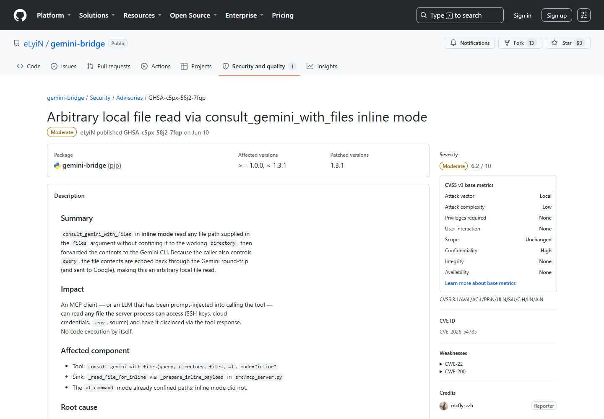
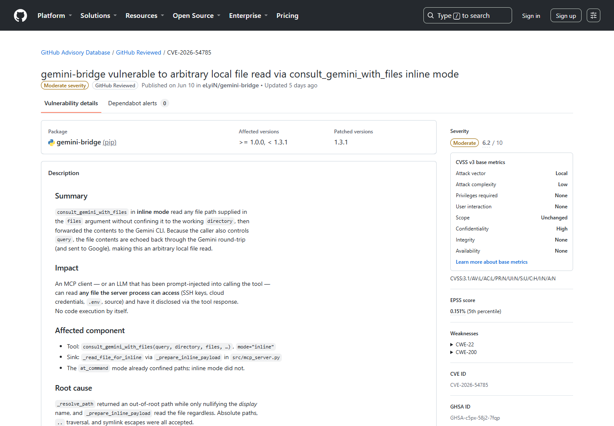
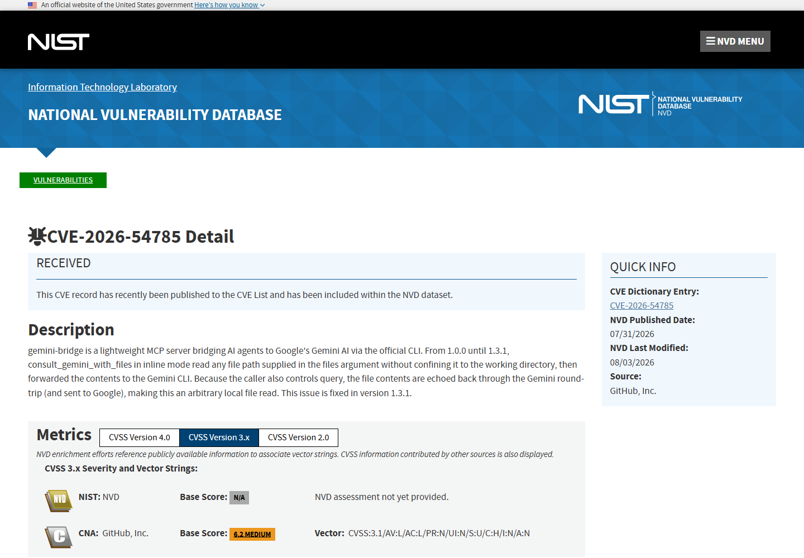
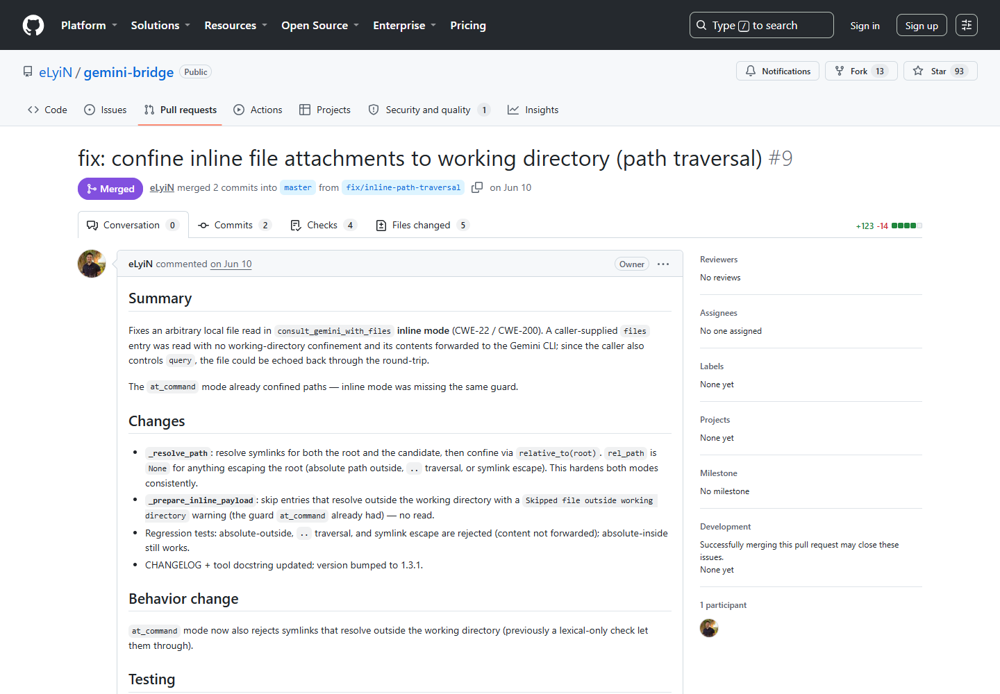
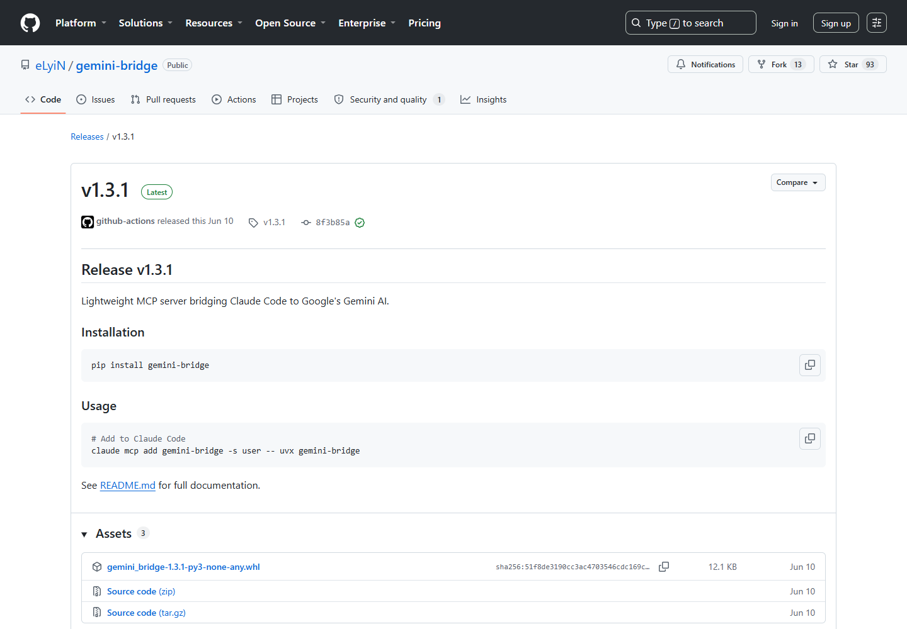

# Gemini Bridge Inline Mode Arbitrary Local File Read (2026)
> Gemini Bridge Inline 模式任意本地文件读取

| Field | Value |
|---|---|
| Category | agent-risk |
| Severity | medium |
| AI Tool | gemini-bridge, Gemini CLI, MCP |
| Language | Python / MCP |
| Real Incident | Yes |
| Reproducible | Yes |
| Disclosed | 2026-07-31 |
| CVE | CVE-2026-54785 |

## TL;DR
gemini-bridge 的 consult_gemini_with_files 在 inline 模式下未把文件限制在工作目录，绝对路径、上级目录和符号链接可使本地文件被读取并发送给 Gemini CLI。

---

## 详细分析 / Full Analysis

## 一、基本信息与事件概况

gemini-bridge 提供 MCP 工具，让其他客户端把问题和本地文件交给 Gemini CLI。inline 模式会先由 Bridge 读取文件，再把内容拼入发送载荷。漏洞版本虽然计算了工作目录，却在路径越界后仍继续读取，因此工具调用者能够访问进程权限范围内的任意文件。

受影响范围为 gemini-bridge 1.0.0 至 1.3.1 之前版本，修复版本为 1.3.1。问题位于 `inline` 文件处理分支，未使用该模式的实例不经过同一段越界读取逻辑。

## 二、公开披露与材料核验

维护者在 2026 年 6 月 9 日收到私下报告，并在 1.3.1 中修复；GitHub Advisory Database 于 7 月 31 日公开并分配 CVE-2026-54785。修复使用路径解析和 Path.relative_to(root) 检查，同时处理符号链接，inline 模式遇到目录外文件时会跳过。

### 证据矩阵

| 来源 | 类型 | 证明内容 |
|---|---|---|
| gemini-bridge repository advisory | 公开记录 | 版本、技术机制、修复或产品背景 |
| GitHub Advisory Database | 公开记录 | 版本、技术机制、修复或产品背景 |
| NVD CVE record | 公开记录 | 版本、技术机制、修复或产品背景 |
| gemini-bridge pull request 9 | 公开记录 | 版本、技术机制、修复或产品背景 |
| gemini-bridge 1.3.1 release | 公开记录 | 版本、技术机制、修复或产品背景 |

## 三、系统背景与触发条件

`at_command` 模式原本已有目录约束，缺陷仅位于 `inline` 分支。只要 MCP 调用者能控制 `files`，而 Bridge 进程又能读取目标文件，绝对路径、上级目录或符号链接就可能把工作目录外的内容送进 Gemini 上下文。

两种模式的数据流并不相同：`at_command` 把文件引用交给后续命令处理，`inline` 则由 Bridge 进程先打开文件、读取全文，再拼入发往模型的请求。后者因此必须在读取之前完成路径检查；仅保存一个“当前工作目录”变量，而没有对规范化后的真实路径做包含关系判断，并不能形成隔离。

可读范围由运行 Bridge 的账户决定。开发者若从主目录启动服务，进程可能同时接触多个项目、SSH 配置、云凭据和 `.env` 文件。即使 MCP 客户端本身运行在受限编辑器中，也不能自动缩小服务端进程的文件权限。

## 四、攻击链与失效过程

攻击输入可以直接来自 MCP 客户端，也可能来自诱导模型调用工具的提示注入。攻击者在 files 参数中加入绝对路径、.. 路径或指向目录外的符号链接，Bridge 随后读取内容并发给 Gemini CLI。调用者还能控制 query，使模型在响应中复述文件内容，因此形成从本地主机到外部模型服务和工具响应的双重泄露路径。

路径越界有三种公开描述的形式。绝对路径直接绕过工作目录的语义；`..` 在拼接后回到父目录；符号链接看起来仍位于项目内，但解析后的目标位于目录外。若检查发生在解析链接之前，前两类被拦截也仍可能留下第三类入口。

文件被读取后会同时进入 Gemini 的请求上下文和 Bridge 的工具结果处理流程。攻击者不一定需要看到原始网络载荷，只要让查询要求模型引用、摘要或转换其中的内容，就可能从回答中逐步取回秘密。模型的改写还会让简单的固定字符串泄露检测更难命中。

## 五、技术根因与 AI 安全分析

AI 相关性来自工具的默认数据流：读取文件不是终点，文件会自动成为模型上下文。传统本地文件读取通常需要攻击者再建立外传通道，而这里的 Agent 工具已经提供了外部模型 API 和返回结果。工作目录限制必须在打开文件之前基于规范化后的真实路径执行，并应使用低权限账户运行 Bridge，避免 SSH 密钥、云凭据和其他项目的 .env 同时可读。

这类工具的授权对象不应只是“允许读取文件”，还应包含允许读取哪个项目、由谁发起、是否可以送往外部模型。目录沙箱解决的是路径范围，模型供应商和会话记录则属于另一层数据去向控制。敏感项目即使允许本地分析，也未必允许上传到托管模型服务。

修复采用真实路径解析和 `relative_to(root)` 一类包含关系检查，方向是正确的。运行层还可以关闭不需要的 inline 模式、为每个项目启动独立低权限进程，并在工具调用界面显示解析后的完整文件列表，而不是只展示用户输入的相对路径。

## 六、影响范围与处置建议

漏洞本身不提供代码执行，但可泄露源代码、密钥和配置。受影响用户应升级到 1.3.1，检查 Gemini CLI 与 MCP 会话中是否出现目录外文件名或异常长的 inline 载荷，并轮换可能被读取的凭据。模型供应商侧日志和数据保留策略也应纳入事件处置。

日志排查应同时看原始 `files` 参数和解析后的路径。仅搜索 `../` 会漏掉绝对路径、编码变体和符号链接；如果保留了工具调用结果，还要关注回答中出现的私有文件片段、密钥格式或其他项目名称。供应商侧请求记录能够帮助确定文件是否已经离开本机。

升级后可用三组负面测试复核：目录外绝对路径、父目录路径以及指向目录外的符号链接都应被拒绝，并且拒绝发生在文件打开之前。凭据轮换范围应按 Bridge 账户当时能够读取的文件确定，而不是只处理攻击者明确点名的路径。

## 七、结论

Gemini Bridge 的问题把路径穿越直接连接到了模型上下文：越界文件一经打开，系统已经具备现成的外传和复述渠道。修复目录判断之外，还要限制进程文件权限，并明确哪些本地资料允许发送给外部模型。

## 八、参考来源

- [gemini-bridge repository advisory](https://github.com/eLyiN/gemini-bridge/security/advisories/GHSA-c5px-58j2-7fqp)
- [GitHub Advisory Database](https://github.com/advisories/GHSA-c5px-58j2-7fqp)
- [NVD CVE record](https://nvd.nist.gov/vuln/detail/CVE-2026-54785)
- [gemini-bridge pull request 9](https://github.com/eLyiN/gemini-bridge/pull/9)
- [gemini-bridge 1.3.1 release](https://github.com/eLyiN/gemini-bridge/releases/tag/v1.3.1)

