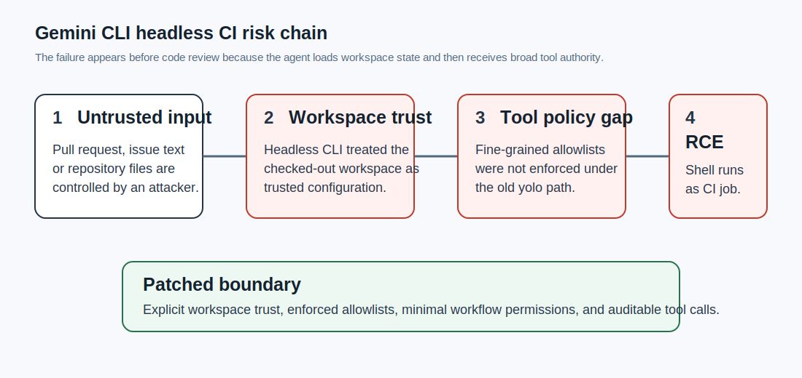
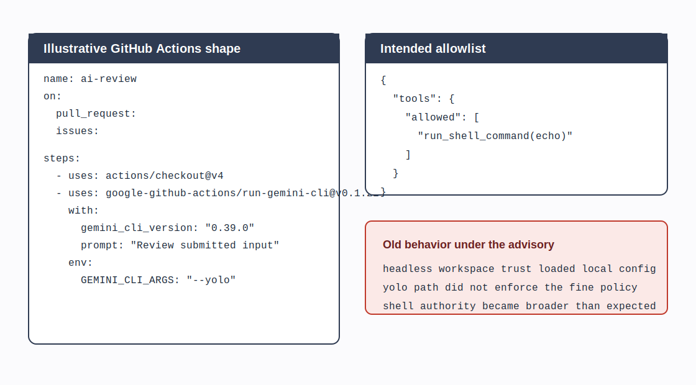
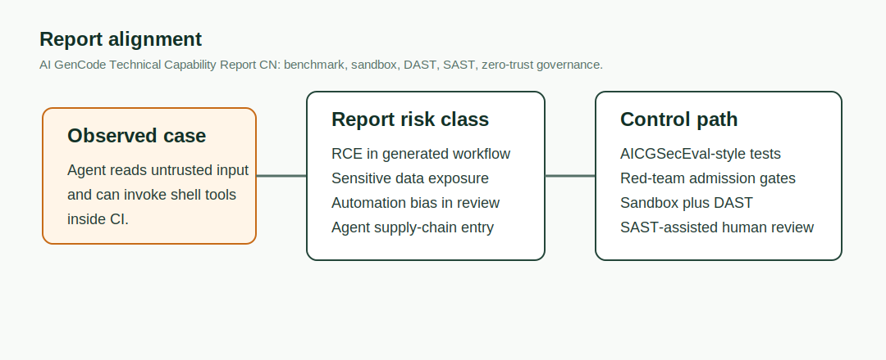

# Gemini CLI Workspace-Trust and Tool-Allowlist RCE (2026)
> Gemini CLI 工作区信任与工具白名单绕过 RCE

| Field | Value |
|---|---|
| Category | Agent Risks |
| Severity | 🔴 Critical |
| AI Tool | Gemini CLI, run-gemini-cli |
| Language | TypeScript, GitHub Actions |
| Real Incident | ✅ |
| Reproducible | ❌ |
| Disclosed | 2026-04-24 |
| CVE | — |
| CVSS | 10.0 |

## TL;DR
Headless Gemini CLI trusted untrusted workspaces and let `--yolo` bypass tool allowlists, exposing CI runners to RCE.
> Gemini CLI 在无头 CI 场景中过早信任工作区，`--yolo` 又绕过细粒度工具白名单，使恶意 PR 或 Issue 文本有机会触达 CI Runner 的命令执行面。

---

## 详细分析 / Full Analysis

### 事件背景

Gemini CLI 是面向开发者的命令行 AI coding agent。`google-github-actions/run-gemini-cli` 把它封装进 GitHub Actions，常见用法是自动审查 PR、回复 Issue、整理变更说明，或者在 CI 中执行代码理解任务。

这类工作流有一个高风险前提：Agent 会读取攻击者可控的输入，同时运行在带有仓库令牌、源码和构建上下文的 Runner 中。传统 linter 只解析代码，AI coding agent 还会调用工具、加载配置、生成命令。信任边界因此从“代码是否安全”扩展为“哪些文本、文件和工具能影响 Agent 的执行”。



### 漏洞链路

公开 advisory 描述了两个互相叠加的问题。

第一，Gemini CLI 的 headless mode 曾自动信任当前 workspace。CI Runner 在 checkout 外部贡献者的 PR 后，CLI 会把该目录视为可信目录，并在人工确认、沙箱初始化和权限审查之前加载本地 `.gemini/` 配置及环境文件。攻击者一旦能影响仓库内容，就能把 Agent 的运行策略前置到可信边界内。

第二，`--yolo` 模式曾忽略细粒度 tool allowlist。维护者可能只想开放一个看似安全的命令入口，例如允许 `run_shell_command(echo)` 用于输出诊断信息。旧版本在 `--yolo` 下没有严格执行这种细粒度限制。Prompt injection 可以把“允许 echo”扩大为“Agent 能让 shell 执行任意命令”的结果。

这不是单点 bug，而是两个设计假设同时失效。CI 把 workspace 当作输入，Gemini CLI 把 workspace 当作可信配置来源，`--yolo` 又把人工批准环节拿掉。三者组合后，攻击者提交的 PR、Issue 正文或仓库文件就可能变成命令执行前置条件。

### 代码形态

下面是风险配置的简化形态，用于说明漏洞边界，不是可直接利用的 PoC。

```yaml
name: ai-review
on:
  pull_request:
  issues:

jobs:
  review:
    runs-on: ubuntu-latest
    permissions:
      contents: read
      pull-requests: write
    steps:
      - uses: actions/checkout@v4
      - uses: google-github-actions/run-gemini-cli@v0.1.21
        with:
          gemini_cli_version: "0.39.0"
          prompt: "Review the submitted change and summarize risks."
        env:
          GEMINI_CLI_ARGS: "--yolo"
```

旧版本的危险点不在 YAML 本身，而在运行时的信任传递。

```json
{
  "tools": {
    "allowed": [
      "run_shell_command(echo)"
    ]
  }
}
```

维护者以为上面的配置只允许受限命令。漏洞条件满足时，Agent 仍可能越过这条边界。下面的图把危险代码形态拆成三个阶段。



### 影响范围

GitHub Advisory 给出 CVSS 3.1 评分 10.0，严重性为 Critical。受影响范围包括：

- `@google/gemini-cli` 0.39.1 之前的版本
- `@google/gemini-cli` 0.40.0-preview.2
- `google-github-actions/run-gemini-cli` 0.1.22 之前的版本

高风险场景主要是非交互 CI。攻击者不需要维护者本地运行 Gemini CLI，只需要目标仓库把 Agent 接入 PR 或 Issue 自动处理流程。若 Runner 同时持有发布令牌、云凭证或写权限，RCE 的后果会从单次构建扩大到供应链事件。

### 与团队技术报告的呼应

团队技术报告把 AI 生成代码风险拆成漏洞注入、敏感数据泄露、软件供应链风险和安全文化侵蚀，并在治理部分提出多维度评测基准、红队准入、沙箱运行、DAST 验证、SAST 辅助和重构零信任。

这个案例正好落在报告中“AI Agent 进入开发流程后的新执行面”。问题不只是模型生成了不安全代码，而是 Agent 具备工具调用能力后，外部文本可以影响 CI Runner 的真实执行。AICGSecEval 这类评测不应只测 SQLi、XSS、RCE 代码片段，也应加入 headless agent、workspace trust、tool allowlist、CI token 暴露这些组合场景。



### 修复与缓解

Google 的修复改变了两个关键默认行为：headless mode 不再静默信任工作区，`--yolo` 下也会执行工具白名单策略。实际落地时还应做以下控制：

- 升级到 `@google/gemini-cli >= 0.39.1` 或 `0.40.0-preview.3`，并使用 `run-gemini-cli >= 0.1.22`。
- 把 AI triage 和能运行 shell 的 workflow 分开，不让 Issue 或 PR 自动处理流程继承发布权限。
- GitHub Actions 使用最小化 `permissions`，外部 PR 默认不授予 secrets。
- 禁止 Agent 读取未审查的 workspace 级配置，CI 中只加载仓库维护者固定的配置。
- 对 Agent 工具调用记录审计日志，把 shell 调用作为高危事件处理。

## References / 参考资料

- [GitHub Advisory GHSA-wpqr-6v78-jr5g](https://github.com/advisories/GHSA-wpqr-6v78-jr5g)
- [google-github-actions/run-gemini-cli security advisory](https://github.com/google-github-actions/run-gemini-cli/security/advisories/GHSA-wpqr-6v78-jr5g)
- [Cloud Security Alliance: Gemini CLI CVSS 10.0: Pre-Sandbox RCE in CI/CD Agents](https://labs.cloudsecurityalliance.org/research/csa-research-note-gemini-cli-cvss10-rce-sandbox-bypass-20260/)
- [run-gemini-cli repository](https://github.com/google-github-actions/run-gemini-cli)
- [AI GenCode Technical Capability Report CN](../../docs/report-cn.pdf)

### Archived HTML mirrors / 网页镜像

- [GitHub Advisory GHSA-wpqr-6v78-jr5g](assets/reference-mirrors/01-github-advisory-ghsa-wpqr-6v78-jr5g.html)
- [google-github-actions/run-gemini-cli security advisory](assets/reference-mirrors/02-run-gemini-cli-security-advisory.html)
- [Cloud Security Alliance research note](assets/reference-mirrors/03-cloud-security-alliance-gemini-cli-cvss10-rce.html)
- [run-gemini-cli repository](assets/reference-mirrors/04-run-gemini-cli-repository.html)
- [AI GenCode Technical Capability Report GitHub page](assets/reference-mirrors/05-team-report-github-page.html)
