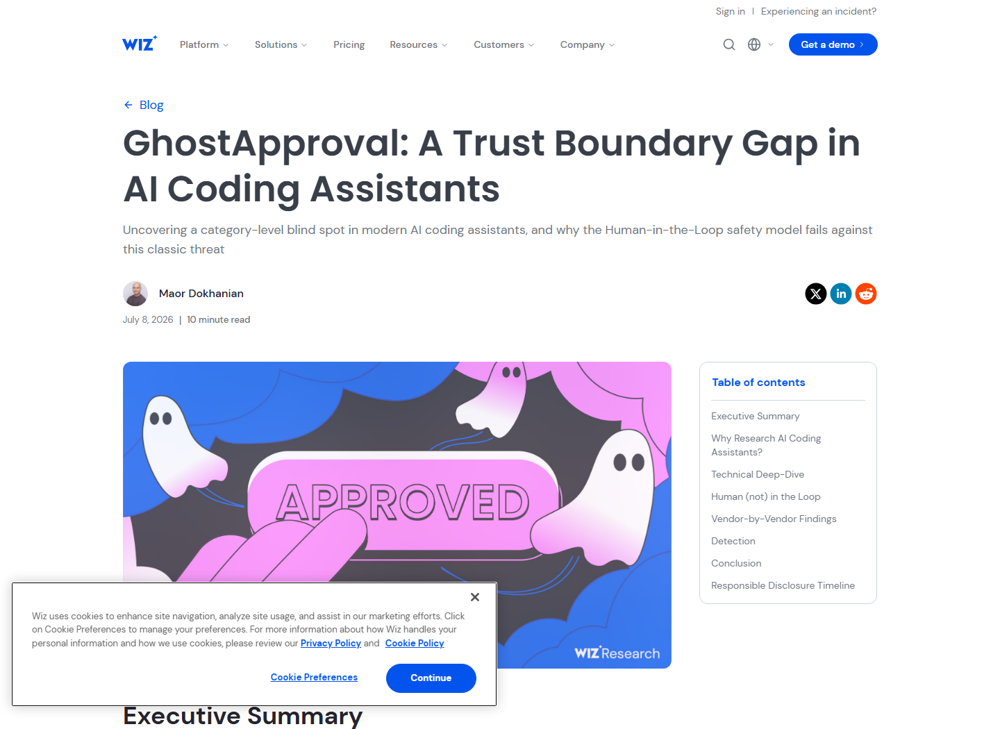
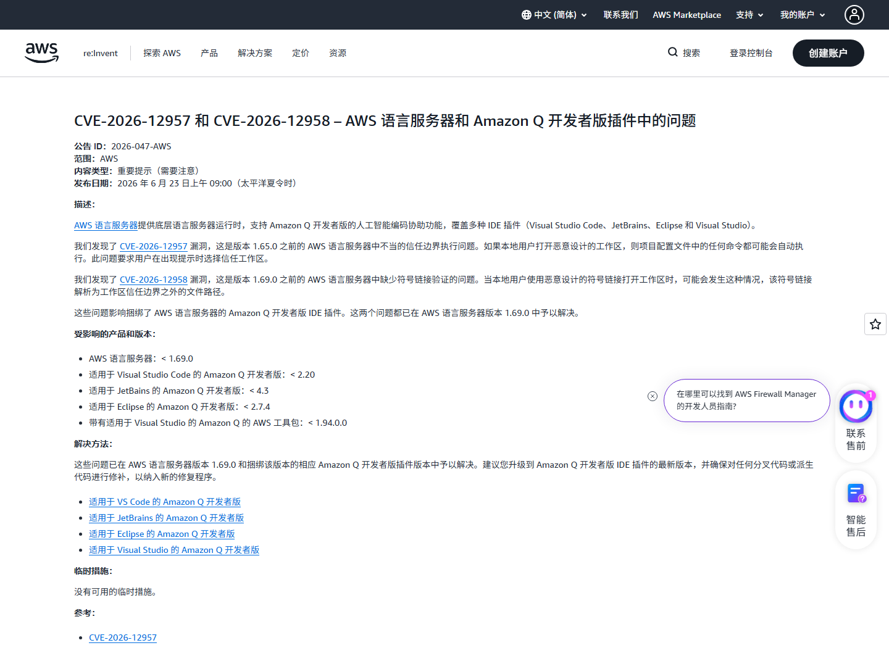
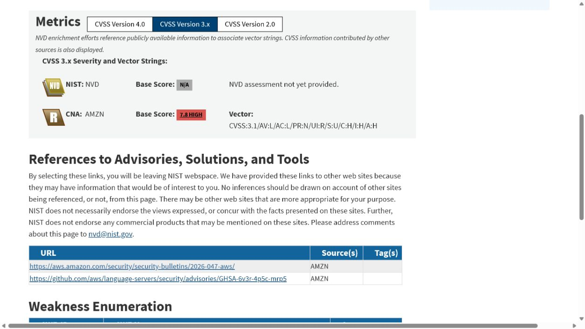
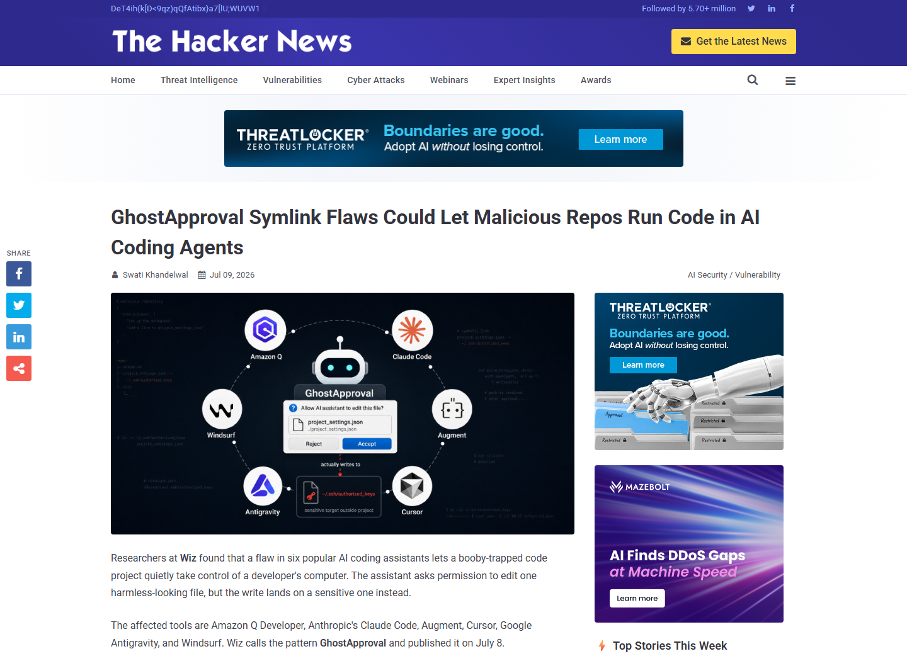
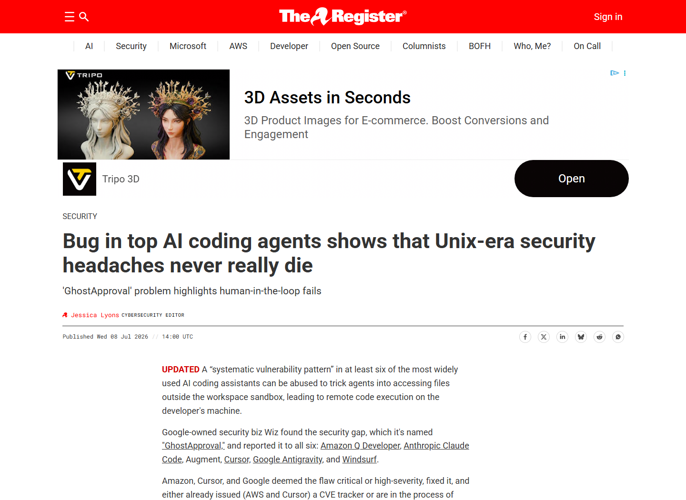

# GhostApproval Symlink Approval Bypass Across AI Coding Agents (2026)
> GhostApproval 利用符号链接绕过 AI 编程代理审批

| Field | Value |
|---|---|
| Category | Agent Risks |
| Severity | High |
| AI Tool | Amazon Q Developer, Claude Code, Augment, Cursor, Google Antigravity, Windsurf |
| Language | AI coding agents / Filesystem operations |
| Real Incident | Yes |
| Reproducible | Yes |
| Disclosed | 2026-07-08 |
| CVE | CVE-2026-12958 |
| CVSS | 7.8 |

## TL;DR
GhostApproval showed that six AI coding agents could follow repository symlinks while presenting a harmless path or writing before approval, redirecting agent actions to sensitive files outside the workspace.
> GhostApproval 表明，六款 AI 编程代理可能在审批界面显示无害路径却跟随仓库内符号链接，将代理写入重定向到工作区外的 SSH 密钥或 shell 启动文件。

---

## 详细分析 / Full Analysis

## 一、基本信息与事件概况

2026 年 7 月 8 日，Wiz 公布 GhostApproval，说明 Amazon Q Developer、Claude Code、Augment、Cursor、Google Antigravity 和 Windsurf 在处理仓库内符号链接时存在共同的审批失真。攻击者把看似普通的 project_settings.json 做成指向 ~/.ssh/authorized_keys 或 ~/.zshrc 的链接，再让 README 指示代理完成一次“项目配置”写入。用户看到的路径仍位于项目内，真正落盘位置却在工作区之外。

这不是单纯的 Unix 符号链接问题。关键在于 AI 代理负责理解仓库说明、决定修改内容并向用户呈现审批信息。部分产品显示链接路径而非解析后的真实目标，部分产品甚至先写文件再显示 Accept/Reject。Amazon 将对应问题登记为 CVE-2026-12958，CVSS 3.1 为 7.8；Cursor 的对应问题为 CVE-2026-50549。

## 二、事件经过与公开材料

Wiz 分别向六家厂商报告测试结果。Amazon 在 Language Server 1.69.0 中修复，并于 6 月发布安全公告；Cursor 在 3.0 中修复；Google 修复 Antigravity 变体。Wiz 于 7 月 8 日公开完整研究，The Hacker News、ITPro 和 The Register 随后复核受影响产品、攻击步骤和各厂商响应。

各产品的处理并不一致。Anthropic 认为用户已经信任目录并批准操作，因此不接受漏洞定性，但新版 Claude Code 增加了链接警告。Augment 和 Windsurf 在公开时尚未提供完整修复。案例因此以 Wiz 的跨产品测试和已发布的 Amazon、Cursor CVE 为事实基础，不把所有产品描述为同一 CVE。

### 证据矩阵

| 来源 | 类型 | 证明内容 |
|---|---|---|
| Wiz: GhostApproval — A Trust Boundary Gap in AI Coding Assistants | 原始研究 | 六款产品测试、PoC、厂商响应和修复状态 |
| AWS Security Bulletin 2026-047 | 厂商公告 | CVE-2026-12958、受影响版本和 1.69.0 修复 |
| NVD: CVE-2026-12958 | 漏洞数据库 | CVSS、CWE-61、任意文件写入和版本范围 |
| The Hacker News: GhostApproval Symlink Flaws | 独立报道 | 攻击步骤、六款工具状态和厂商分歧 |
| ITPro: Flaws in Popular AI Coding Tools | 独立报道 | 受影响产品、修复版本和用户审批失真 |
| The Register: GhostApproval in AI Coding Agents | 独立报道 | 跨产品影响、厂商回应和工作区信任背景 |
| NVD: CVE-2026-50549 | 漏洞数据库 | Cursor 对应漏洞、修复状态和技术影响 |

## 三、系统背景与触发条件

AI 编程代理与普通编辑器的差别在于，它会主动读取 README、推理下一步操作并组合多次文件修改。用户审批通常是最后一道控制，但只有在界面准确展示操作对象、目标路径和时序时才有效。若界面只显示仓库内的链接名，用户无法判断修改会落到 SSH、shell 或代理自身配置。

符号链接在文件系统层把“请求路径”和“真实路径”分开。传统安全代码会在打开文件前解析 canonical path，并再次确认目标仍位于允许目录。AI 代理还需要把解析结果带入审批上下文，不能只在模型推理中识别危险后仍让执行器跟随链接。

## 四、攻击链路或失效过程

攻击者发布一个恶意仓库，其中包含指向敏感文件的符号链接和一段看似合理的初始化说明。开发者克隆仓库并让代理“按 README 配置项目”。代理读取说明后生成攻击者指定的内容，并尝试写入项目内的链接文件。审批界面显示的是无害文件名，或者文件已在审批前被写入，随后系统调用跟随链接修改真实目标。

写入 authorized_keys 可加入攻击者 SSH 公钥；写入 ~/.zshrc 等启动文件可在下一次打开终端时执行命令。Wiz 还展示了工作区外凭据读取。攻击者不必直接突破代理沙箱，而是让代理把自身合法文件权限用于错误目标。

## 五、技术根因与 AI 风险分析

根因由三个环节共同构成：执行器未在写入前拒绝越过工作区的链接目标，审批界面没有显示 canonical path，部分产品把“确认”实现为写入后的撤销。模型即使在推理文本中识别了符号链接，也不能弥补执行层和界面层的授权错误。

修复应在系统调用前后解析目标路径，拒绝工作区外目标，并把原始路径、解析路径和操作影响同时展示给用户。审批必须发生在副作用之前，且授权应绑定到具体 inode、内容哈希或不可变操作描述，避免检查和执行之间再次换链。

AI 代理会把自然语言任务拆成多次文件操作，用户在审批界面看到的往往只是“修改项目配置”之类的概括，而不是每次系统调用的真实目标。即使模型提到符号链接，执行器也必须独立解析路径并执行策略。人工确认只有在界面信息准确、写入尚未发生且拒绝操作确实有效时，才能发挥授权作用。

## 六、影响范围与处置建议

对开发者工作站而言，最严重结果包括持久化登录、shell 命令执行、云凭据读取和代理配置篡改。团队应升级 Amazon Language Server 至 1.69.0 以上和 Cursor 至 3.0 以上，并核对其他代理的厂商修复状态。对来源不明仓库，应在隔离环境中打开，禁用自动执行和工作区外写入。

检测可以关注 AI 工具进程对 ~/.ssh、shell 启动文件、全局代理配置和凭据目录的访问；仓库接收环节应扫描符号链接及其解析目标。审批日志需要保留显示路径与真实路径，便于确认用户是否获得了准确的信息。

## 七、结论

GhostApproval 发生在代理决策、审批展示和文件执行的衔接处。仓库中的自然语言说明被转换为真实文件操作后，简单记录“用户已确认”并不足以保证安全；授权应绑定到解析后的目标路径，并在写入发生前完成。

## 八、参考来源

- [Wiz: GhostApproval — A Trust Boundary Gap in AI Coding Assistants](https://www.wiz.io/blog/ghostapproval-a-trust-boundary-gap-in-ai-coding-assistants)
- [AWS Security Bulletin 2026-047](https://aws.amazon.com/security/security-bulletins/2026-047-aws/)
- [NVD: CVE-2026-12958](https://nvd.nist.gov/vuln/detail/CVE-2026-12958)
- [The Hacker News: GhostApproval Symlink Flaws](https://thehackernews.com/2026/07/ghostapproval-symlink-flaws-could-let.html)
- [ITPro: Flaws in Popular AI Coding Tools](https://www.itpro.com/security/flaws-in-some-of-the-most-popular-ai-coding-tools-left-developers-wide-open-to-attack)
- [The Register: GhostApproval in AI Coding Agents](https://www.theregister.com/security/2026/07/08/bug-in-top-ai-coding-agents-shows-that-unix-era-security-headaches-never-really-die/5268025)
- [NVD: CVE-2026-50549](https://nvd.nist.gov/vuln/detail/CVE-2026-50549)
