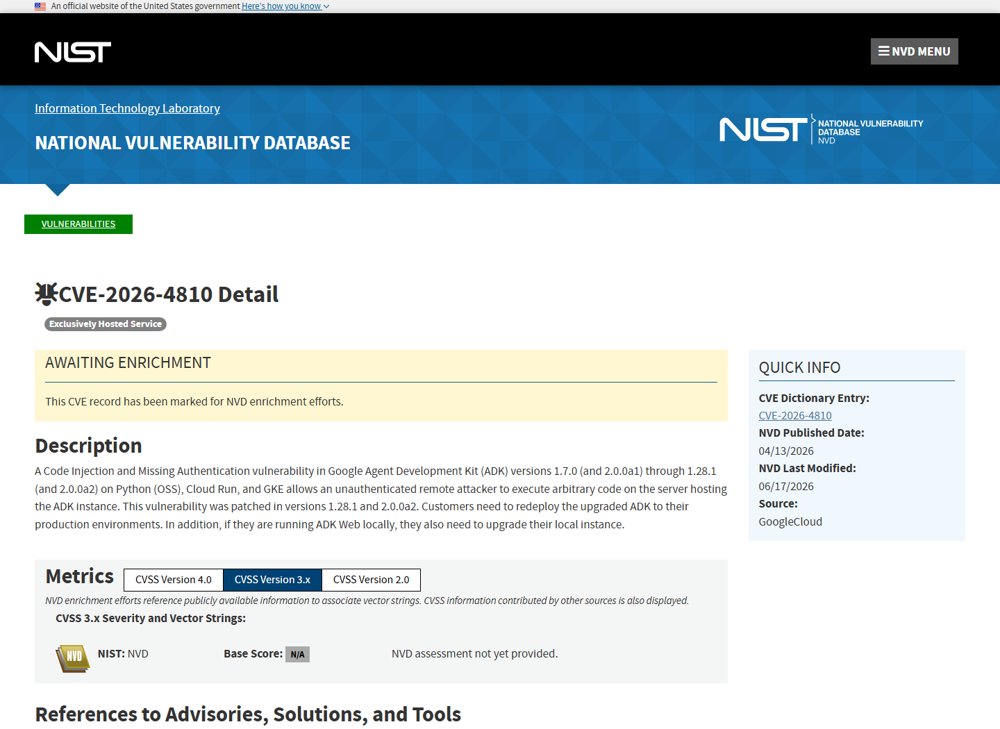
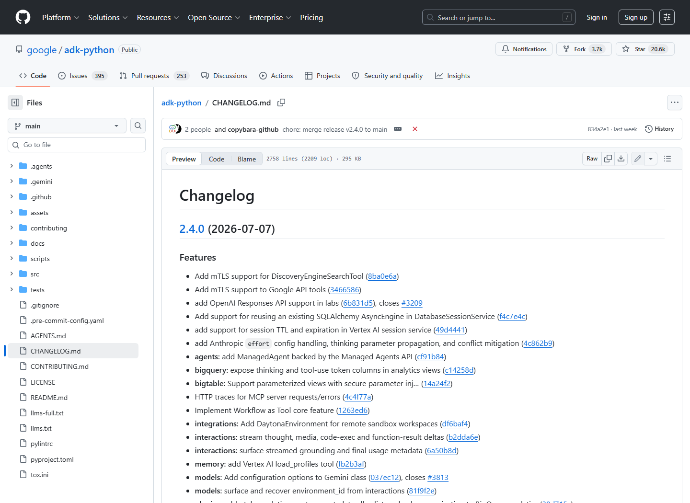
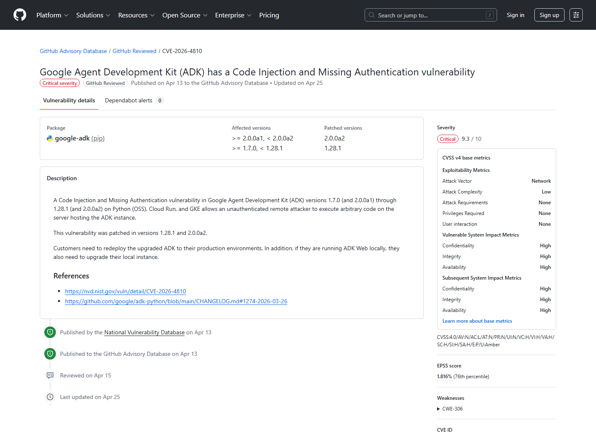
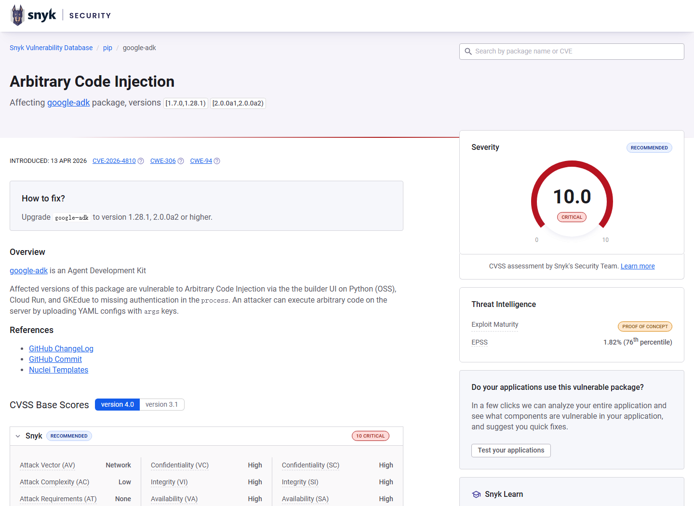
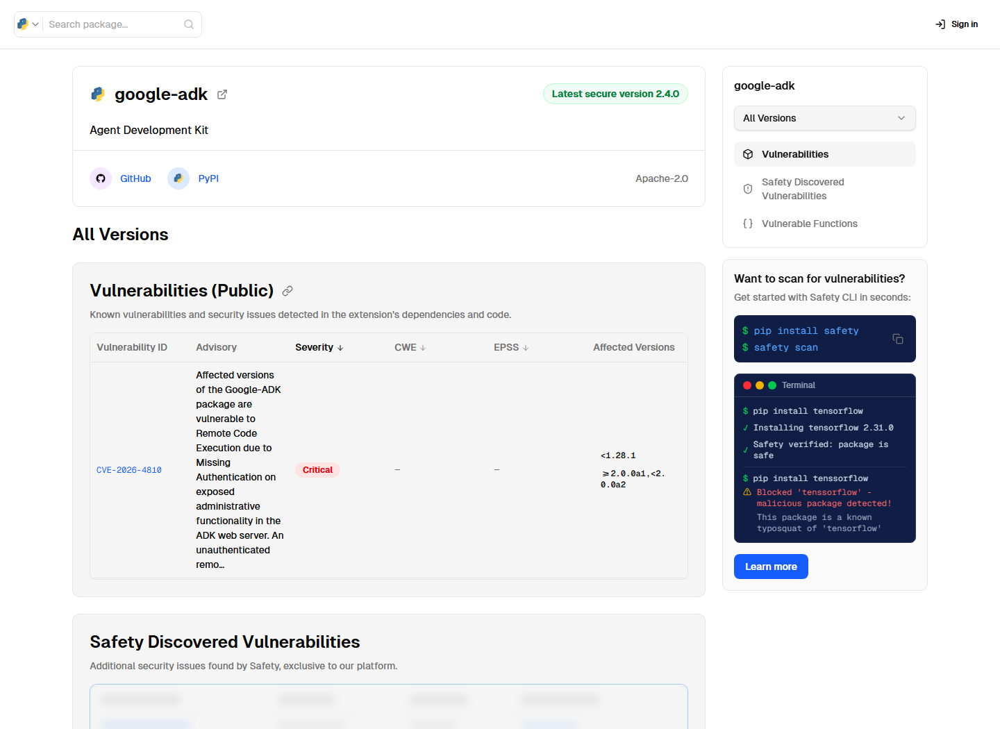

# Google ADK Builder Unauthenticated Code Injection RCE (2026)
> Google ADK Builder 未认证代码注入远程执行

| Field | Value |
|---|---|
| Category | Agent Risks |
| Severity | Critical |
| AI Tool | Google Agent Development Kit, ADK Web, ADK Builder |
| Language | Python / YAML |
| Real Incident | Yes |
| Reproducible | Yes |
| Disclosed | 2026-04-13 |
| CVE | CVE-2026-4810 |
| CVSS | 9.3 |

## TL;DR
Exposed Google ADK Web instances allowed unauthenticated users to submit agent configurations whose args reached executable paths, resulting in arbitrary code execution on the ADK host.
> 对外暴露的 Google ADK Web 缺少关键认证，攻击者可提交带 args 的 Agent 配置并进入代码执行路径，最终控制 ADK 所在服务器进程。

---

## 详细分析 / Full Analysis

## 一、基本信息与事件概况

CVE-2026-4810 是 Google Agent Development Kit Python 实现中的代码注入与关键功能缺少认证问题。ADK 提供用于构建、测试和部署 AI Agent 的 Web 界面；在受影响版本中，远程用户无需登录即可到达 Builder 相关功能，并提交能够进入执行路径的 Agent 配置。Google Cloud 的 CVE 记录将影响范围列为 Python 开源部署、Cloud Run 和 GKE，攻击成功后可在承载 ADK 实例的服务器上执行任意代码。

漏洞影响 1.7.0 至 1.28.1 之前的版本，以及 2.0.0a1 至 2.0.0a2 之前的预览版本。修复版本为 1.28.1 和 2.0.0a2。Google 同时要求用户在升级后重新部署生产实例，本地运行 ADK Web 的开发者也需要更新；仅更新依赖而不重启或重新发布旧容器，不能消除已经运行的易受攻击服务。

## 二、事件经过与公开材料

Google 项目变更日志在 1.27.4 条目中记录了“禁止 /builder 中的 args，并在 CLI 帮助中增加 Web UI 使用警告”的安全改动。2026 年 4 月 13 日，Google Cloud 作为 CNA 发布 CVE-2026-4810，给出 CVSS v4.0 9.3 分和完整影响版本。NVD 随后收录记录，GitHub Advisory、Snyk 和 Positive Technologies 等数据库补充了 Builder UI、YAML 配置及修复提交的细节。

多个来源对核心事实没有冲突：需要网络访问，不要求攻击者已有权限，也不要求受害者交互；目标必须运行受影响的 ADK Web 或相应部署；修复后需要重新部署。公开材料没有证明该漏洞已经被用于大规模入侵，因此案例按可复现的公开漏洞披露处理。

### 证据矩阵

| 来源 | 类型 | 证明内容 |
|---|---|---|
| NVD: CVE-2026-4810 | 漏洞数据库 | Google Cloud 描述、影响版本、修复版本和 CVSS v4.0 9.3 |
| GitHub Advisory: GHSA-rg7c-g689-fr3x | 安全公告 | google-adk 包影响范围、CVE 映射和补丁版本 |
| Google ADK Changelog 1.27.4 | 项目记录 | 禁止 Builder args 和增加 Web UI 安全警告的修复记录 |
| Snyk: Arbitrary Code Injection in google-adk | 技术复核 | Builder UI、YAML args、缺少认证与代码执行路径 |
| Positive Technologies: CVE-2026-4810 | 漏洞分析 | /builder/save 相关技术说明、版本和重新部署建议 |
| Safety Package Database: google-adk | 依赖漏洞数据库 | google-adk 受影响版本、远程代码执行风险和修复版本 |

## 三、系统背景与触发条件

ADK 是代码优先的 Agent 开发框架，同时提供可视化 Builder 以便创建和调试 Agent。Agent 配置可以描述模型、子 Agent、工具和参数，因而比普通应用表单更接近可执行程序。开发环境中，团队常把 ADK Web 暂时暴露给同事、测试平台或云端预览环境，这会把本应只供本地使用的管理能力变成网络入口。

YAML 只是数据格式，危险来自配置字段与 Python 对象、工具初始化和加载逻辑之间的映射。一旦 args 能够进入可执行路径，保存或加载配置就可能触发代码执行。即便页面主要用于开发和调试，也应按照管理接口配置认证和访问限制。

## 四、攻击链路或失效过程

攻击者首先发现可访问的 ADK Web 实例，然后直接调用 Builder 相关接口，提交经过构造的 YAML Agent 配置。配置中的 args 被后端解析并进入能够执行代码的路径。由于关键流程没有要求身份认证，攻击者不需要账号即可触发。成功后，代码以 ADK 服务进程的权限运行，可读取环境变量、修改 Agent 文件、访问挂载目录或向内部服务发起请求。

在 Cloud Run 或 GKE 中，后续影响取决于服务账号、网络策略和挂载卷。如果实例持有模型 API 凭据、Secret Manager 访问权或内部数据库连接，RCE 会把 Agent 开发服务变成云环境横向移动的起点。开发者本地实例则可能暴露源代码、云凭据和浏览器可访问的其他本地服务。

## 五、技术根因与 AI 风险分析

根因由两个问题叠加构成。第一，Builder 暴露了能够改变 Agent 配置并触发代码执行的能力，却没有为该能力建立强制认证。第二，后端允许配置中的 args 进入危险执行路径，数据和代码边界不清。任一问题单独存在都危险，组合后形成了无需登录的远程代码执行。

在 Agent 框架中，配置 Agent 往往同时涉及工具和运行逻辑。界面看起来只是表单或 YAML 编辑器，后台实际承担了部分代码部署功能。因此，修复不能只过滤当前发现的字段；后续新增的工具、加载器和配置类型也应统一经过认证和模式校验。

ADK 配置会动态组合模型、工具、凭据和运行环境。危险参数进入执行路径后，恶意代码可能继承 Agent 已绑定的模型密钥、数据连接和云服务账号。对 Builder 的权限评估不应停留在“修改设置”，而应按创建可执行工作负载处理，并同时落实认证、配置校验、工具能力限制和运行时沙箱。

## 六、影响范围与处置建议

直接影响是 ADK 服务器进程被远程控制，机密性、完整性和可用性均为高。组织应升级到 1.28.1、2.0.0a2 或更高版本，并重新构建、发布和重启运行实例。无法立即升级时，应关闭 ADK Web 的外部访问，只允许受控管理网络连接，并在反向代理层增加可靠认证。

对曾经公开暴露的实例，还应检查 Builder 请求、异常 YAML、容器启动记录、环境变量访问和对外网络连接；轮换实例能够读取的 API key 与服务账号凭据；核对 Agent 项目目录是否被写入陌生文件。长期治理上，应把开发 UI 与生产执行面分开，并为配置导入、工具注册和代码执行功能实施独立授权。

## 七、结论

CVE-2026-4810 表明，AI Agent Builder 不是普通的低风险开发页面。它能够定义工具和运行逻辑，就等同于一个受限的部署控制面。认证缺失与配置注入一旦同时出现，攻击者可以绕过模型层直接取得服务器执行权限；生产部署必须把 Builder 隔离、认证并保持及时更新。

## 八、参考来源

- [NVD: CVE-2026-4810](https://nvd.nist.gov/vuln/detail/CVE-2026-4810)
- [GitHub Advisory: GHSA-rg7c-g689-fr3x](https://github.com/advisories/GHSA-rg7c-g689-fr3x)
- [Google ADK Changelog 1.27.4](https://github.com/google/adk-python/blob/main/CHANGELOG.md#1274-2026-03-26)
- [Snyk: Arbitrary Code Injection in google-adk](https://security.snyk.io/vuln/SNYK-PYTHON-GOOGLEADK-16540571)
- [Positive Technologies: CVE-2026-4810](https://dbugs.ptsecurity.com/vulnerability/PT-2026-32287)
- [Safety Package Database: google-adk](https://getsafety.com/packages/pypi/google-adk)
