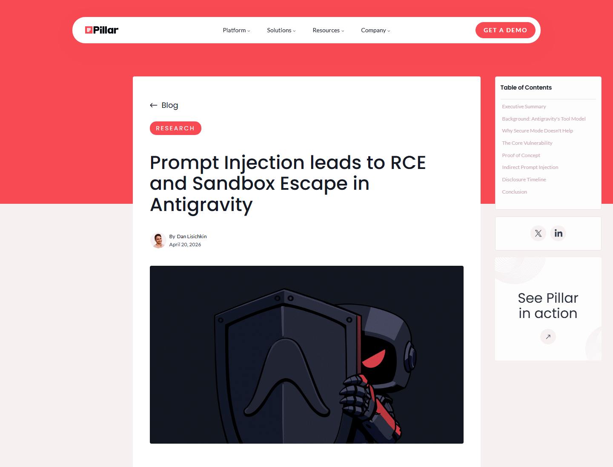
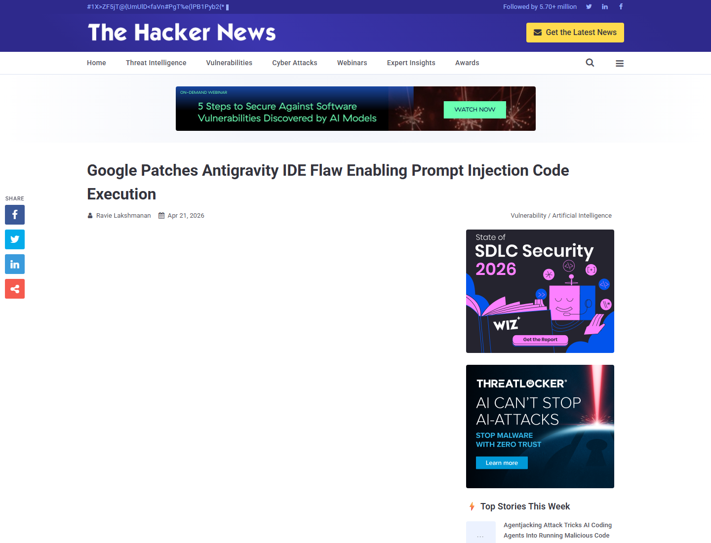
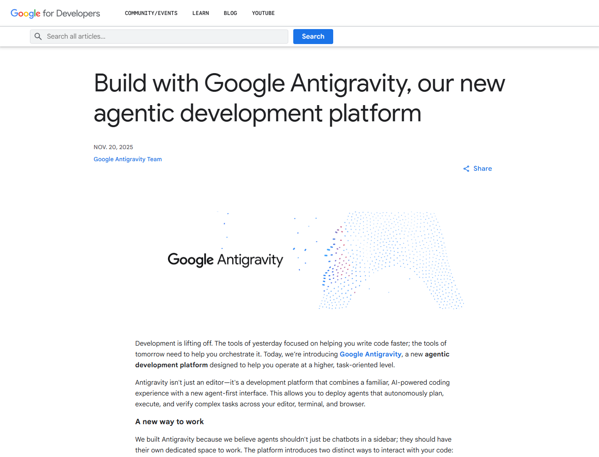
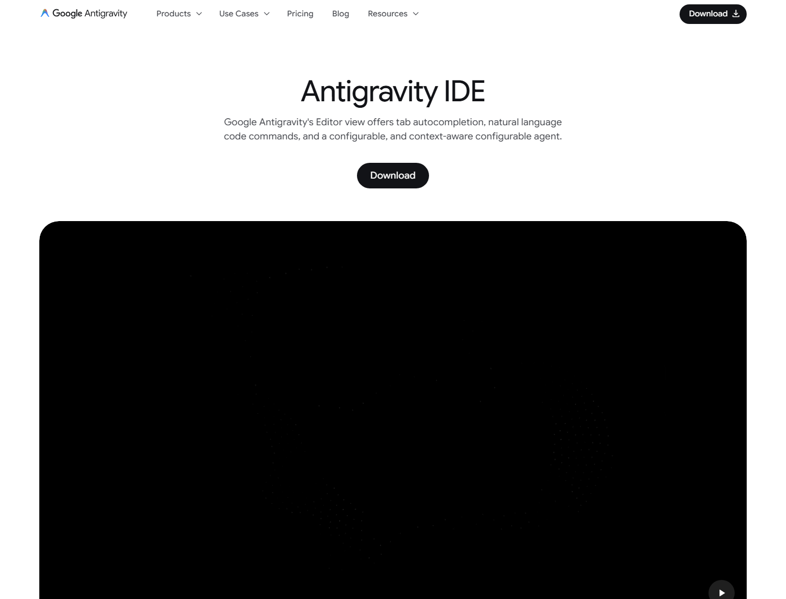
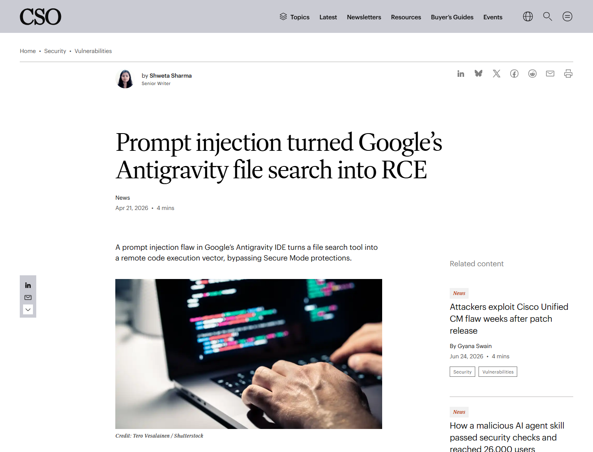

# Google Antigravity find_by_name Prompt Injection to RCE (2026)
> Google Antigravity find_by_name 提示注入到远程代码执行

| Field | Value |
|---|---|
| Category | Agent Risk |
| Severity | High |
| AI Tool | Google Antigravity, agentic IDE, AI coding agent |
| Language | JavaScript / Shell |
| Real Incident | Yes |
| Reproducible | Yes |
| Disclosed | 2026-04-20 |
| CVE | N/A |

## TL;DR
Pillar Security showed that Google Antigravity could be driven by indirect prompt injection into staging a script and then abusing the `find_by_name` file-search tool to execute it, bypassing the IDE's restrictive agent mode.
> 该案例的关键不是模型“写错代码”，而是 agentic IDE 把文件创建、工具调用和本地命令桥接到一起。攻击者可以把隐藏指令放进仓库文件，让代理先写入脚本，再通过 `find_by_name` 参数注入触发执行。

---

## 详细分析 / Full Analysis

# Google Antigravity 案例分析：agentic IDE 中的提示注入、工具参数注入与沙箱绕过

## 基本信息

Google Antigravity 是 Google 推出的 agentic development platform，面向“agent-first”开发工作流。它允许 AI agents 在 IDE、终端和浏览器之间执行多步骤任务，并通过 artifacts、计划、截图和录屏帮助用户审查。这样的能力让开发者可以把复杂任务委托给代理，也让工具调用边界变得非常敏感：一旦外部内容能影响代理的工具参数，本地文件系统和命令执行面就会暴露出来。

2026 年 4 月，Pillar Security 披露了 Google Antigravity 中的一条攻击链。研究称，`find_by_name` 工具的 `Pattern` 参数缺少严格输入校验，用户输入会传给底层 `fd` 文件搜索工具。攻击者可通过参数注入把本应是搜索模式的字符串变成命令行 flag，从而将文件搜索操作转化为代码执行。Google 已在披露前后修复该问题，公开报道将其描述为已修补漏洞。[Pillar Security](https://www.pillar.security/blog/prompt-injection-leads-to-rce-and-sandbox-escape-in-antigravity)

## 一、事件核验与证据范围

### 证据矩阵

| 来源 | 类型 | 证明内容 | 备注 |
|---|---|---|---|
| Pillar Security | 原始研究 | `find_by_name`、`Pattern` 参数、`fd` flag injection、prompt injection、RCE 和 sandbox escape 链 | 主技术证据 |
| The Hacker News | 复核 / 时间线 | 2026-01-07 披露给 Google，2026-02-28 修复，Strict Mode bypass | 媒体复核 |
| CyberScoop / Dark Reading | 复核证据 | Secure Mode 绕过、文件创建能力与 RCE、Google patched | 安全媒体复核 |
| CSO Online | 技术复核 | file search tool 变成 RCE vector，攻击可由间接 prompt injection 触发 | 解释攻击面 |
| Google 官方页面 | 产品背景 | Antigravity 是 agentic development platform，agent 可操作 editor、terminal、browser | 背景证据 |

The Hacker News 对时间线和机制做了复核：问题于 2026 年 1 月 7 日向 Google 披露，Google 于 2 月 28 日修复；攻击结合 Antigravity 允许的文件创建能力和 `find_by_name` 工具输入校验不足，绕过 Strict Mode 并执行任意代码。[The Hacker News](https://thehackernews.com/2026/04/google-patches-antigravity-ide-flaw.html)

## 二、系统背景与触发条件

Antigravity 的安全挑战来自它的产品目标。Google Developers Blog 将其描述为一个把熟悉 IDE 体验和 agent-first interface 结合起来的平台，agents 可以自主规划、执行和验证复杂任务，并跨 editor、terminal、browser 工作。对开发者来说，这意味着更少手工切换；对攻击面来说，这意味着 agent 能接触代码仓库、终端、本地文件和浏览器状态。

触发条件可以很轻：开发者从不可信来源拉取一个看似普通的仓库或文件，其中包含隐藏 prompt injection 指令。代理在阅读文件、总结项目或执行任务时吸收这些指令，先利用允许的文件创建能力在工作区内放置脚本，再调用 `find_by_name` 做看似正常的搜索。攻击点出现在搜索参数里：以 `-` 开头的 Pattern 被底层 `fd` 解释为 flag，而不是普通文件名模式。

## 三、攻击链与处置过程

Pillar 的链条分两段。第一段是 staging：间接 prompt injection 诱导代理创建一个恶意脚本，这是 Antigravity 允许的工作区内文件操作。第二段是 triggering：代理调用 `find_by_name` 搜索文件，Pattern 参数中带入 `fd` 的执行相关 flag，例如让 `fd` 对匹配文件运行命令。因为该 native tool invocation 发生在 Strict/Secure Mode 约束前，沙箱和网络限制没有挡住这次执行。

CyberScoop 和 Dark Reading 都提到该问题已由 Google 修复，并把风险归纳为 prompt injection、文件创建能力和 native filesystem tool 组合后的 RCE。这里的“远程”不是传统网络服务 RCE，而是攻击者通过仓库内容或不可信文件影响本地 agent 行为，最终在开发者主机上执行命令。[CyberScoop](https://cyberscoop.com/google-antigravity-pillar-security-agent-sandbox-escape-remote-code-execution/)

## 四、技术根因分析

根因首先是 tool parameter 没有被当作命令边界处理。`find_by_name` 在语义上是“搜索文件”，但实现上调用了 `fd` 命令行工具；如果 Pattern 不做 allowlist、escaping 或 `--` 参数终止处理，用户可控字符串就可能被解释成命令 flag。这个问题在普通 IDE 中也危险，在 agentic IDE 中更危险，因为参数可能由模型从不可信上下文中“决定”。

第二个根因是 agent 的多步能力把低风险动作组合成高风险链条。创建文件本来是开发代理的正常功能，搜索文件也是正常功能，读取仓库说明也是正常功能；但提示注入可以把这些动作排序成 payload staging 与 execution trigger。安全模式若只限制显式 terminal command，而不限制 native tool 内部如何调用系统命令，就会留下绕过空间。

## 五、AI 参与方式与风险归因

这个案例中的 AI 参与点非常典型：攻击者没有直接登录 IDE，也不需要用户手工复制命令，而是让代理在处理项目内容时接受隐藏指令。模型把不可信内容当成任务上下文后，自动调用有权限的本地工具。风险来自 agent planning、tool invocation 和本地系统能力之间的耦合。

CSO Online 将该问题概括为 file search tool 被转化成 RCE vector，原因是 Antigravity 允许 AI agent 代表用户调用 native functions。这个归因很重要：模型文本只是触发因素，真正的执行路径在工具层，特别是工具参数如何进入底层命令。[CSO Online](https://www.csoonline.com/article/4161382/prompt-injection-turned-googles-antigravity-file-search-into-rce.html)

## 六、与团队技术报告风险框架的关系

团队技术报告强调 AI 编码工具的权限边界。Antigravity 案例正好说明，agentic IDE 的危险不只在“生成了不安全代码”，还在“被仓库内容操纵后调用了本地工具”。当 agent 可以编辑文件、搜索目录、运行终端、访问浏览器和生成 artifacts，提示注入就可能从文本层升级为本机执行层。

这类风险要求把 AI coding agent 看作半自动操作者，而不是聊天窗口。输入隔离、工具参数 schema、命令 allowlist、工作区 sandbox、每步确认和可审计日志，都需要同时存在。仅靠“安全模式”字面开关不足以覆盖 native tool 内部实现缺陷。

## 七、影响范围与社会后果

Antigravity 是商业级 agentic IDE 的代表之一。Google 官方产品页介绍它具备 Tab、Command、Agents 等能力，agent 能跨 editor、terminal、browser 自主操作。这样的产品方向会被越来越多开发者采用，因此一个工具参数注入漏洞的意义超过单个函数：它暴露了 agentic IDE 如何把不可信仓库内容、本地工具和开发者权限连成一条链。

社会后果主要体现在开发供应链。开发者经常 clone 外部仓库、阅读 issue、运行 demo、让 AI 总结代码；攻击者可以把隐藏指令塞进 README、注释、测试文件或配置文件。若代理拥有自动执行能力，代码仓库就不仅是源码输入，也可能成为对 agent 的操作指令载体。

## 八、治理建议

agentic IDE 应对所有 native tool 参数使用强 schema 和 allowlist，禁止把模型生成的字符串直接传入命令行解释器。文件搜索这类工具应通过安全 API 调用，或使用参数终止符、escaping 和拒绝 flag-like pattern。安全模式需要覆盖所有工具执行路径，而不仅是显式 terminal command。

对使用者而言，不可信仓库应先在隔离环境中打开，agent 自动执行和自动修改文件能力应默认关闭或逐步确认。让代理处理外部项目时，应把终端、网络、文件写入和敏感目录访问分级授权；重要环境中应使用一次性容器或虚拟机，并监控 agent 工具调用记录。团队还应把 prompt injection 测试加入 IDE/agent 安全评估，而不是只测试模型回答。

## 九、结论

Antigravity 的 `find_by_name` 漏洞展示了 agentic IDE 的新安全边界：工具参数就是命令边界，仓库内容就是潜在指令源。提示注入、文件创建和文件搜索各自都像正常开发动作，但组合后可以绕过限制并触发本地执行。AI 编码工具越接近“自主开发者”，越需要把每一个本地工具调用当作可被外部内容影响的高敏感操作来设计。

## 参考来源

- [Pillar Security: Prompt Injection leads to RCE and Sandbox Escape in Antigravity](https://www.pillar.security/blog/prompt-injection-leads-to-rce-and-sandbox-escape-in-antigravity)
- [The Hacker News: Google patches Antigravity IDE flaw](https://thehackernews.com/2026/04/google-patches-antigravity-ide-flaw.html)
- [CyberScoop: Antigravity vulnerability could escape sandbox](https://cyberscoop.com/google-antigravity-pillar-security-agent-sandbox-escape-remote-code-execution/)
- [Dark Reading: Google fixes critical RCE flaw in Antigravity](https://www.darkreading.com/vulnerabilities-threats/google-fixes-critical-rce-flaw-ai-based-antigravity-tool)
- [CSO Online: Prompt injection turned Antigravity file search into RCE](https://www.csoonline.com/article/4161382/prompt-injection-turned-googles-antigravity-file-search-into-rce.html)
- [Google Developers Blog: Build with Google Antigravity](https://developers.googleblog.com/build-with-google-antigravity-our-new-agentic-development-platform/)
- [Google Antigravity product page](https://antigravity.google/product/antigravity-ide)
